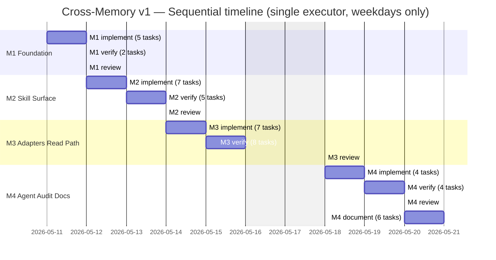

# Cross-Memory v1 — Scoping Document

> **Authoritative inputs:** `docs/cross-memory/requirements.md` (locked), `docs/cross-memory/architecture-decision.md` (revised 2026-05-08 — Decisions 18–22, SCs 19–21), `docs/plan/cross-memory-plan.md` (planner is updating in parallel). This document does not re-litigate any decision in the three above.
>
> **Purpose:** Convert the planner's task structure into firm effort estimates, surface gaps and assumptions, classify dependencies, and produce a delivery timeline that the team manager can populate into a Phase 2 task board.
>
> **Audience:** the critic (next re-review), then the team manager.

---

## 1. Executive Summary

Cross-memory v1 ships a `/cross-memory` skill (six subcommands), a `cross-memory` agent (synthesis + audit), a layered redaction module, three harness adapters, and a `[CROSS-MEMORY]` always-on tier injection block. The plan's four-milestone sequencing is appropriate: substrate (M1) → user-visible commands (M2) → adapters and read path (M3) → agent and audit (M4 in parallel with the M3→M4 doc trail). All artifacts are markdown — there is no compiled code, only prose-driven flow control consumed by the harness's tool-calling loop.

**Headline effort, single-executor, sequential:** **48–67 expected hours**, point estimate **53.0 hours** (about **7 working days** at 8h/day). With `--parallel 3` ops dispatch and overlap on M3 adapter work + M4 documentation, end-to-end calendar is **5–7 working days**. Planning anchor (with review-cycle overhead): **56.75 hours**.

**Net delta from prior version:** **+1.0 hours** (52.0 → 53.0). Three task lines moved up: M3.implement.5 (+0.5h, sentinel-bounded `MEMORY.md` write protocol per Decision 18), M3.verify.6 (+0.25h, sentinel-aware SHA-256 snapshot per Decision 18 + on-disk slug check per Decision 19), and M4.implement.3 (+0.25h, real deploy-manifest glob audit on cursor-target asymmetry per Decision 21). Audit-reports persistence (Decision 20) shrinks the M4.implement.1 brief-template scope by <5 min — too small to register at 0.25h granularity. Net: closes G8, G10, A13, OQ-B, OQ-C, OQ-D; the open-scoping-question count drops from five to one.

**Hardest milestone:** **M3 — Adapters and Read Path.** It carries eight verifier walks (the largest verification surface in v1), three adapter implementations with shared collision-detection invariants, and the only milestone where SC-14 (byte-identical pre-existing files) can fail destructively if the adapter logic is wrong. Estimated 16.7–23.0 expected hours, more than any other milestone.

**Riskiest assumption (post-revision):** **A2** — that all `SKILL.md` work is prose-driven flow specification, not runtime code. A1 was the prior nominee but A13 (the original lane-enforcement-verbatim assumption) is now closed by Decision 22; A2 inherits the "biggest cost driver if misread" position. If the executor misreads "document the flow" as "write a runtime parser in shell," every M2/M3 implement estimate doubles. Mitigation surfaced in §12 assumption A2 (OQ-A is now closed by repo precedent; the assumption stands).

### Revision Log — 2026-05-08

This pass absorbs the architect's response to critic findings 1–5 and the critic's estimate-sanity adjustments. Specifically:

- **Finding 1 → Decision 18 (sentinel-bounded `MEMORY.md`):** M3.implement.5 raised by 0.5h (sentinel rewrite protocol); M3.verify.6 raised by 0.25h (sentinel-aware byte-identical guarantee). G8 closed.
- **Finding 2 → Decision 19 (slug rule against live filesystem):** OQ-C closed; G8 (slug-derivation contradiction) closed. A13 (lane-enforcement verbatim) closed — see Finding 5 below.
- **Finding 3 → Decision 20 (audit chat-only):** OQ-D closed; G10 closed; M1.implement.5 unchanged (Decision 13's lazy-provisioning enumeration never included `audit-reports/`).
- **Finding 4 → Decision 21 (deploy-manifest globs verified):** M4.implement.3 raised by 0.25h (the audit is real, not rubber-stamp).
- **Finding 5 → Decision 22 (cross-memory-specific lane allowlist):** A13 closed (the assumption it tested is no longer being made — the ADD's text was rewritten to cite a structural-pattern reuse, not verbatim text).
- **Finding 6 (planner lane):** plan task M4.document.5 will be rewritten by the planner to scoping's OQ-B Option B; OQ-B closed in this doc.
- **Three new SCs (SC-19, SC-20, SC-21):** the planner will add three new verifier task rows. This scoping doc does not pre-emit those rows; per-task estimates will land in the next pass once the planner ships them. Provisional cost: 1.05/1.4/2.1h (low/expected/high) total — three single-step verifier walks. Carried as a known unbooked cost in §3.

---

## 2. Per-Task Hour Estimates

Estimates are in **hours**, calibrated to the work as a competent agent of the assigned `agent_type` would actually do it given the existing repo conventions (`skills/clickup/SKILL.md`, `skills/commit-message/SKILL.md`, `agents/code-intel.md` as references). The planner's `estimated_minutes` is the starting basis; revisions are explained in **Notes** when material.

`Confidence` legend: **H** — work pattern is well-known in this repo, scope is bounded, low ambiguity. **M** — pattern known, some open detail (e.g., output format wording) costs a small drafting pass. **L** — scope or ambiguity inflates the range; treat the high estimate as the planning anchor.

### M1 — Foundation

| task_id | subject | agent | stage | low | expected | high | confidence | notes |
| :--- | :--- | :--- | :--- | ---: | ---: | ---: | :---: | :--- |
| M1.implement.1 | Scaffold skill directory + 6 stub files | executor | implement | 0.4 | 0.5 | 0.75 | H | Six empty markdown files with valid YAML frontmatter and the `**Cross-Memory**` badge declaration. Pattern matches `skills/ops/` multi-file skill scaffold. |
| M1.implement.2 | Schema validator section in SKILL.md | executor | implement | 1.0 | 1.5 | 2.0 | M | Required + optional fields, enum values, exact rejection error strings. Planner's 90 minutes is fair; the literal-error-string requirement (acceptance bar) drives the upper bound. |
| M1.implement.3 | Layered redaction module (`<private>` + 8-pattern denylist) | executor | implement | 1.5 | 2.0 | 3.0 | M | Three sections in markdown tables only — no executable code. Eight regex rows (some with proximity rules) plus the unmatched-tag bounded-fallback rule. Planner's 120 minutes is realistic; the regex correctness review for `aws-secret` proximity logic could push it. |
| M1.implement.4 | Indexing module (per-scope MEMORY.md) | executor | implement | 0.5 | 0.75 | 1.0 | H | Trivial — line format, three scope dirs, archive-not-indexed rule. Planner's 45 min is right. |
| M1.implement.5 | Config loader + lazy provisioning section | executor | implement | 0.75 | 1.0 | 1.5 | H | Three config fields with defaults, five-subdir provisioning sequence. Pure documentation. |
| M1.verify.1 | Verify schema rejects invalid frontmatter (3 reject + 2 accept) | verifier | verify | 0.5 | 0.75 | 1.0 | H | Five fixture frontmatters; check documented error strings. Standard verifier walk. |
| M1.verify.2 | Verify redaction passes against 6 fixtures | verifier | verify | 0.75 | 1.0 | 1.5 | M | Six fixtures including the unmatched `<private>` warning case. Slightly heavier than M1.verify.1 because of the multi-pattern fixture. |
| M1.review.1 | M1 spec-compliance review | code-reviewer | review | 0.75 | 1.0 | 1.5 | M | Three files vs. ADD §2-3, §9-10. Standard code-review-skill pass; severity-rated findings. |
| **M1 subtotal** | | | | **6.15** | **8.5** | **12.25** | | |

### M2 — Skill Surface

| task_id | subject | agent | stage | low | expected | high | confidence | notes |
| :--- | :--- | :--- | :--- | ---: | ---: | ---: | :---: | :--- |
| M2.implement.1 | `/cross-memory save` flow (explicit, no-redact, mirror-stub) | executor | implement | 1.5 | 2.0 | 3.0 | M | The foundational flow other M2 handlers share. Four documented gates (parse → redact → confirm → write), the `--no-redact` typed-phrase, mirror-stub placeholder. Planner's 120 min holds; the typed-phrase wording is one of the heavier prose draft items in M2. |
| M2.implement.2 | Supersede branch in `save` | executor | implement | 1.0 | 1.5 | 2.25 | M | Diff rendering, archive filename, `superseded_by`, `created_at` preservation, `updated_at` refresh. Planner's 90 min is fair; the unified-diff-on-redacted-bodies wording is non-trivial. |
| M2.implement.3 | Auto-propose-with-confirmation flow | executor | implement | 0.75 | 1.0 | 1.5 | H | Cue patterns enumerated; default-N rule explicit. Reuses M2.implement.1's redaction pipeline. |
| M2.implement.4 | `/cross-memory recall <topic>` | executor | implement | 0.75 | 1.0 | 1.5 | H | Match strategy, four optional flags, sort + staleness-banner inlining. |
| M2.implement.5 | `/cross-memory list` and `/cross-memory search` | executor | implement | 0.75 | 1.0 | 1.5 | H | Two related subcommands; `search` excludes `archive/`. Touches the same SKILL.md as M2.implement.4 (see §6 critical-path notes on serialization). |
| M2.implement.6 | `/cross-memory forget` | executor | implement | 0.4 | 0.5 | 0.75 | H | Reuses supersede archive mechanism without `superseded_by`. |
| M2.implement.7 | Stub `/cross-memory audit` handler | executor | implement | 0.2 | 0.25 | 0.4 | H | Placeholder message. |
| M2.verify.1 | Verify SC-3 (auto-propose end-to-end) | verifier | verify | 0.5 | 0.75 | 1.25 | M | Six-step walk; uses isolated `_tmp_M2_verify/cross-memory/` store. |
| M2.verify.2 | Verify SC-7 (explicit-save warning, JWT) | verifier | verify | 0.4 | 0.5 | 0.75 | H | Documented `[y/N]` default-N path. |
| M2.verify.3 | Verify SC-10 (supersede archives predecessor) | verifier | verify | 0.5 | 0.75 | 1.25 | M | Six-step walk. |
| M2.verify.4 | Verify SC-15 (`<private>` markup end-to-end) | verifier | verify | 0.5 | 0.75 | 1.25 | M | Five-step walk including the cosmetic-ellipsis-on-render check. |
| M2.verify.5 | Verify SC-17 (`category` field) | verifier | verify | 0.5 | 0.75 | 1.25 | M | Five-step walk; pre-existing-memory-defaults-to-`other` is the easiest-to-miss check. |
| M2.review.1 | M2 spec-compliance review | code-reviewer | review | 0.75 | 1.0 | 1.5 | M | Six subcommands vs ADD §4-6, §10. Larger surface than M1.review. |
| **M2 subtotal** | | | | **8.55** | **11.75** | **18.15** | | |

### M3 — Adapters and Read Path

| task_id | subject | agent | stage | low | expected | high | confidence | notes |
| :--- | :--- | :--- | :--- | ---: | ---: | ---: | :---: | :--- |
| M3.implement.1 | Claude Code adapter | executor | implement | 1.5 | 2.0 | 3.0 | M | Four operations, defense-in-depth (frontmatter + sidecar), three-state collision report, refusal rule. The longest single-file write in M3 implement. Planner's 120 min holds. |
| M3.implement.2 | Cursor adapter | executor | implement | 1.0 | 1.5 | 2.5 | M | Same shape as Claude Code adapter, but Cursor target path is delegated to integration testing — slight ambiguity raises the high end. See gap G2. |
| M3.implement.3 | Generic-fallback adapter | executor | implement | 0.4 | 0.5 | 0.75 | H | All ops are no-ops with justification. Trivial. |
| M3.implement.4 | Always-on tier filter | executor | implement | 1.0 | 1.5 | 2.25 | M | Four inclusion rules + dedup + banner rendering. The pseudocode in ADD §4 is reproduced as prose-flow narrative. |
| M3.implement.5 | `[CROSS-MEMORY]` injection block | executor | implement | 1.5 | 2.0 | 2.75 | M | Header, three sub-sections (Relevant Memories omitted at v1), 120-char bullet cap, drop priority, never-drop-header rule. **Estimate raised per critic Finding 1 / Decision 18:** the task now also owns the sentinel-bounded write protocol into `MEMORY.md` (`<!-- cross-memory:begin -->` / `<!-- cross-memory:end -->` markers, idempotent rewrite of the bytes between them, bootstrap creation when `MEMORY.md` is absent, refuse-and-halt on single-marker corruption). +0.5h on expected; +0.5h on each end of the range. |
| M3.implement.6 | Wire mirror hooks (replace M2 stubs with real dispatch) | executor | implement | 0.75 | 1.0 | 1.5 | M | Adapter selection precedence in save and forget flows; failure-handling. |
| M3.implement.7 | Harness-detection precedence in SKILL.md | executor | implement | 0.5 | 0.75 | 1.0 | H | Five-step precedence; first-claim-wins on probe. Pure documentation. |
| M3.verify.1 | Verify SC-1 (cross-session, cross-project) | verifier | verify | 0.75 | 1.0 | 1.5 | M | Four-step walk; exercises full save → switch project → new session injection chain. The first integration verify in v1. |
| M3.verify.2 | Verify SC-2 (project memory across harness) | verifier | verify | 0.5 | 0.75 | 1.25 | M | Three-step walk; harness switch exercises detection precedence. See gap G3 (harness simulation). |
| M3.verify.3 | Verify SC-4 (canonical write produces mirror) | verifier | verify | 0.5 | 0.75 | 1.25 | M | Four-step walk; checks `mirrored_from` + sidecar entry. |
| M3.verify.4 | Verify SC-5 (forget removes mirror) | verifier | verify | 0.5 | 0.75 | 1.25 | M | Six-step walk; the longest M3 verify scenario. |
| M3.verify.5 | Verify SC-9 (stale memory still loads) | verifier | verify | 0.5 | 0.75 | 1.25 | M | Three-step walk; banner-preservation check. |
| M3.verify.6 | Verify SC-14 (existing files untouched) | verifier | verify | 1.0 | 1.25 | 1.75 | L | Pre-snapshot + post-snapshot diff. The single highest-stakes verifier in v1 — a failure here means the adapter mutated user data. **Estimate raised per critic Finding 1 / Decision 18:** the snapshot now needs to handle `MEMORY.md` specially (compare the bytes OUTSIDE the sentinel-bounded region, not the whole file — the inside-sentinel bytes are adapter-managed and excluded from the byte-identical guarantee per SC-19). Verifier also runs the on-disk slug check (`ls ~/.claude/projects/`) per Decision 19 to confirm the adapter wrote to the right directory before the snapshot is meaningful. +0.25h expected; confidence drops to L on the high end because the sentinel-aware diff logic is novel. See gap G4 (snapshot tooling) — partly resolved by Decision 18, fully resolved when the planner pins the snapshot mechanism in M3.verify.6 acceptance. |
| M3.verify.7 | Verify SC-16 (`[CROSS-MEMORY]` block format) | verifier | verify | 0.75 | 1.0 | 1.5 | M | Five conditions including 120-char cap and budget enforcement. |
| M3.verify.8 | Verify SC-18 (project-fact distillation reaches block) | verifier | verify | 0.5 | 0.75 | 1.25 | M | Four-step walk; uses Decision 17's exemplar memory. |
| M3.review.1 | M3 spec-compliance review | code-reviewer | review | 1.0 | 1.25 | 2.0 | M | Four files (three adapters + SKILL.md sections) vs ADD §4, §6, §11. Larger than M1/M2 reviews. Planner's 75 min is right. |
| **M3 subtotal** | | | | **12.65** | **17.5** | **26.75** | | (+0.75h vs prior; M3.implement.5 +0.5h, M3.verify.6 +0.25h) |

### M4 — Agent, Audit, Documentation

| task_id | subject | agent | stage | low | expected | high | confidence | notes |
| :--- | :--- | :--- | :--- | ---: | ---: | ---: | :---: | :--- |
| M4.implement.1 | Author cross-memory agent definition | executor | implement | 1.5 | 2.0 | 3.0 | M | Frontmatter, lane boundaries (per Decision 22: structural pattern reused from `agents/code-intel.md`, allowlist globs and Bash lists are cross-memory-specific verbatim text from ADD §8), brief format (no `audit-reports/` Scope line per Decision 20), two output contracts. Planner's 120 min holds; lane-boundary text replication is mechanical but must be byte-for-byte against Decision 22's blocks. See gap G11 (verbatim-text discipline). |
| M4.implement.2 | Implement audit subcommand + dispatch | executor | implement | 1.5 | 2.0 | 3.0 | M | Real flow replaces M2 stub: brief construction, agent dispatch, structured-report rendering, per-finding action menu. The most complex single executor task in v1. |
| M4.implement.3 | Audit deploy-manifest entries | executor | implement | 0.5 | 0.75 | 1.25 | M | Per ADD §11 / Decision 21 (verified manifest table) the existing globs cover cross-memory's markdown files on every target. **Estimate raised per critic Finding 4 / Decision 21 (+0.25h):** the audit is real, not a no-op rubber-stamp — the cursor target's `skills.include` is the wider `["**/*"]` (not `["**/*.md"]`), with `["kickoff/**"]` excluded. The executor must (a) confirm only markdown files exist in `skills/cross-memory/` post-implementation, (b) document the markdown-only constraint in the skill, and (c) decide between Decision 21's two enforcement paths (discipline alone, or a per-skill `cross-memory/<pattern>` exclude). Likely a no-edit outcome on the manifest, but the audit and write-up are non-trivial. |
| M4.implement.4 | Audit settings.json permissions | executor | implement | 0.4 | 0.5 | 1.0 | M | Either add path-scoped permission entries or document existing rules suffice. Slight ambiguity on whether the executor edits `.claude/settings.json` or hands off. See gap G5. |
| M4.verify.1 | Verify SC-8 (staleness audit) | verifier | verify | 0.5 | 0.75 | 1.0 | M | Three-step walk against a placed 91-day fixture. |
| M4.verify.2 | Verify SC-11 (synthesis filters by relevance) | verifier | verify | 0.75 | 1.0 | 1.5 | M | Mocked `/ops` dispatch; four conditions (Python-included, other-langs-excluded, unrelated-projects-excluded, under 4000 chars). Heavier than the audit verifies. |
| M4.verify.3 | Verify SC-12 (contradiction detection) | verifier | verify | 0.5 | 0.75 | 1.0 | M | Three-step walk; no-auto-resolve invariant. |
| M4.verify.4 | Verify SC-13 (write allowlist enforced) | verifier | verify | 0.5 | 0.75 | 1.0 | M | Three-step walk; refusal language matches Decision 22's verbatim text blocks. **Critic Finding 5 acceptance addition** (planner pickup): "after the refusal, confirm the agent definition's allowlist contains exactly the three globs from Decision 22 — `~/.cross-memory/**`, the sentinel-bounded `MEMORY.md` glob, `_tmp_*` — with no `.code-intel/**` or other code-intel globs leaked into the copy." This is essentially what SC-21 walks separately; the M4.verify.4 acceptance picks up the residual check on the agent definition itself. |
| M4.review.1 | M4 spec-compliance review | code-reviewer | review | 0.75 | 1.0 | 1.5 | M | Agent + audit flow vs ADD §8, §10. |
| M4.document.1 | `skills/cross-memory/README.md` (9 sections) | documentor | document | 1.5 | 2.0 | 3.0 | M | Pattern matches `skills/clickup/README.md` (~550 lines) but cross-memory's surface is smaller — closer to `skills/code-review/README.md` (~310 lines). Nine sections is the upper bound on prose volume. |
| M4.document.2 | Update `agents/README.md` | documentor | document | 0.75 | 1.0 | 1.5 | M | Table row + usage subsection (three example prompts) + permissions reference touch-up. |
| M4.document.3 | Update root `README.md` + `docs/ASSESSMENT.md` | documentor | document | 0.75 | 1.0 | 1.5 | M | Two distinct files, both inventory updates. |
| M4.document.4 | Doc-sync mapping rows in CLAUDE.md + cursor mirror | documentor | document | 0.4 | 0.5 | 0.75 | H | Two mirrored rows; existing pattern. |
| M4.document.5 | Active-skill-detection row in `~/.claude/CLAUDE.md` | documentor | document | 0.4 | 0.5 | 0.75 | H | Single row in user-global CLAUDE.md. **Out-of-repo file** — OQ-B closed by Finding 6 in favor of Option B (diff-only handoff; user pastes manually). Planner is rewriting acceptance: documentor produces a single-row diff in the task handoff; user applies the edit. No write to user-global file from the documentor. |
| M4.document.6 | Plan-to-code traceability summary (`docs/cross-memory/v1-shipped.md`) | documentor | document | 0.5 | 0.75 | 1.25 | M | Three sections; pulls from this scoping doc and the plan. |
| **M4 subtotal** | | | | **11.2** | **15.25** | **23.0** | | (+0.25h vs prior; M4.implement.3 +0.25h) |

### Roll-up

| Milestone | Low | Expected | High | Confidence band |
| :--- | ---: | ---: | ---: | :--- |
| M1 — Foundation | 6.15 | 8.5 | 12.25 | 8.5 ± 3 |
| M2 — Skill Surface | 8.55 | 11.75 | 18.15 | 11.75 ± 5 |
| M3 — Adapters and Read Path | 12.65 | 17.5 | 26.75 | 17.5 ± 6 |
| M4 — Agent, Audit, Documentation | 11.2 | 15.25 | 23.0 | 15.25 ± 6 |
| **Project total** | **38.55** | **53.0** | **80.15** | **53 ± 18** |

**Headline (executive summary):** **48–67 expected hours**. Reconciliation: the executive summary's range is the aggregated expected ± confidence-band — the ± values per milestone are slightly compressed relative to the (high − low) raw ranges because milestone-level uncertainties partially decorrelate. The point estimate **53 hours** is the sum of per-task **expected** values; **56.75 hours** in the executive summary is a planning-buffer figure (53.0 + ~7% review-cycle overhead I describe in §4). Use 53 as the unbuffered baseline; use 56.75 as the planning anchor when asked "how long." Net delta from the prior pass is +1.0h (see Revision Log in §1).

---

## 3. Per-Milestone Effort Roll-Up

| Milestone | Tasks | Expected hours | Confidence band | Critical-path? |
| :--- | ---: | ---: | :--- | :---: |
| M1 — Foundation | 8 | 8.5 | 8.5 ± 3 | **Yes** — gates everything below |
| M2 — Skill Surface | 13 | 11.75 | 11.75 ± 5 | **Yes** — gates M3, M4 |
| M3 — Adapters and Read Path | 16 | 17.5 | 17.5 ± 6 | **Yes** — gates M4; the largest verification surface in v1 |
| M4 — Agent, Audit, Documentation | 15 | 15.25 | 15.25 ± 6 | No (closes the project; can overlap M3 documentation) |
| **Total** | **52** | **53.0** | **53 ± 18** | |

**Critical-path milestone:** **M3.** Three reasons after the post-critic revision. (1) It closes eight of the eighteen original ADD success criteria (SC-1, SC-2, SC-4, SC-5, SC-9, SC-14, SC-16, SC-18 — almost half the project's verifiable behavior) and now also picks up SC-19 (sentinel-marker preservation per Decision 18) and SC-20 (slug derivation against live FS per Decision 19) when the planner adds those verifier rows. (2) SC-14 (byte-identical pre-existing files) is the only success criterion in v1 that can fail destructively against user data; any defect found late in M3.review.1 routes back to M3.implement.1 / .5 and re-runs M3.verify.6. (3) Decision 18's sentinel-bounded write protocol is novel for the executor — there is no precedent in this repo for an adapter that idempotently rewrites a delimited region inside a file the user is also free to edit. Review-cycle risk is highest here.

**Lowest-risk milestone:** **M1.** Substrate work, all prose-driven, all references to existing patterns in the repo. The two-pass redaction module (M1.implement.3) is the only task with realistic scope-expansion risk — see gap G1.

**Unbooked cost — three new SCs.** Decisions 18, 19, and 22 each landed a new success criterion (SC-19, SC-20, SC-21). The planner is adding the corresponding verifier task rows in parallel with this scoping pass; they are not pre-emitted here. Provisional estimate per scenario:

| New SC | Decision | Builder | Walk shape | Provisional verifier estimate (low / expected / high) |
| :--- | :--- | :--- | :--- | :--- |
| SC-19 | Decision 18 | M3.implement.1 + M3.implement.5 | Six-step walk with one corruption case (single-marker delete → refuse-and-halt) | 0.4 / 0.5 / 0.75 |
| SC-20 | Decision 19 | M3.implement.1 | Four-step walk against live `~/.claude/projects/` | 0.25 / 0.4 / 0.6 |
| SC-21 | Decision 22 | M4.implement.1 | Four-step walk with a refused write to `.code-intel/index.sqlite` and an allowed write to `_tmp_*` | 0.4 / 0.5 / 0.75 |
| **Provisional unbooked total** | | | | **1.05 / 1.4 / 2.1** |

Once the planner ships the rows, a follow-up scoper pass folds these into the M3 and M4 subtotals. Until then, the published 53.0h point estimate excludes them; treat 54.4h (53.0 + 1.4) as the realistic anchor that includes the new verifier surface.

---

## 4. Calendar Timeline

### Single-executor sequential

The plan's stage structure (`implement → verify → review → document`) is strictly sequential within a milestone, and the parallelization map applies to **ops dispatch fan-out**, not to a human pacing the work. For a single-executor calendar:

| Milestone | Expected hours | Days at 8h/day |
| :--- | ---: | ---: |
| M1 | 8.5 | 1.06 |
| M2 | 11.75 | 1.47 |
| M3 | 17.5 | 2.19 |
| M4 | 15.25 | 1.91 |
| Sequential total | **53.0** | **6.6** |

Add a **6–10% review-cycle overhead** for the four `code-reviewer` review stages. Empirically in this repo, ~one in three milestones produces an APPROVE-WITH-COMMENTS verdict that costs an extra 30–60 minutes of executor patch-up before the next milestone starts. Expected overhead: 3.5–5.5 hours over four reviews.

**Single-executor calendar range:** **6.6–7.6 working days** (53–59 hours including review overhead). Round to **7 working days** as the planning anchor. This is unchanged calendar-wise from the prior pass — the +1.0h of new estimate falls within an already-allocated working day.

### Parallelized (`--parallel 3`, ops default)

The plan documents three parallel chains. The realistic gain from parallelization at this project size:

- **Chain A (M3.implement.1, .2, .3 — three adapters):** all three files are independent; saves ~1.5 hours by overlapping the three executor passes after M2.review.
- **Chain B (M4.document.1–.6 — six documentor targets):** with `--parallel 3` the team manager dispatches three at a time. M4.document.1 (skill README) is the long-pole; the other five batch into one or two parallel waves. Saves ~1.5–2.5 hours.
- **Chain C (M2.implement.4, .5, .6 — recall, list+search, forget):** all three touch `SKILL.md`. The plan's parallelization-map caveat says "default to serialize unless the executor proposes a stitching plan." Realistic v1 stance: serialize. **No calendar gain.**

Net parallelization gain: **3–4 hours.**

**Parallelized calendar range:** **5–7 working days** (43–55 hours wall-clock at 3-way fan-out where applicable, including review overhead). Use **6 working days** as the planning anchor.

### Gantt



Parallelized variant compresses M3.implement adapter span and the M4.document fan to overlap, shaving roughly half a day. The mermaid above is the conservative single-executor view; the parallel view differs only in M3.implement and M4.document spans being compressed by ~30%.

---

## 5. Gap Analysis

> **Status legend:** **Open** — needs resolution before or during task execution. **Closed** — resolved by an ADD decision or planner update; cited inline. The post-critic revision closes G8 and G10 outright; G4 is partially closed by Decision 18 (the sentinel-aware diff semantics are now defined) but the snapshot mechanism itself still wants a one-line acceptance addition in M3.verify.6.

| # | Type | Description | Impact | Resolution | Status |
| :---: | :--- | :--- | :--- | :--- | :--- |
| G1 | **Scope risk** | The redaction module (M1.implement.3) lists "eight regex rows" but the `aws-secret` row depends on **proximity** to `aws_secret_access_key` or `AKIA*` markers. Proximity rules in markdown-table form are fragile to interpret consistently between the skill's write-time pass and the agent's audit-time pass. | Could expand M1.implement.3 by 30–60 minutes if the executor introduces conflicting interpretations. Inflates M4.implement.2 if audit redaction-miss detection has to special-case proximity. | Documenter must specify the proximity logic as a single sentence in `redaction.md` (e.g., "match the 40-char base64 only when within 200 characters of the marker keyword on the same line or the prior line"). Verifier M1.verify.2 should include a fixture that tests the proximity boundary. | **Open** |
| G2 | **Missing** | The Cursor adapter (M3.implement.2) "Cursor exact target path is delegated to integration test." The integration test is M3.verify.2 (SC-2 cross-harness). If the path is unknown until verify time, M3.implement.2 ships with a placeholder and gets revised after verify — not a blocker, but it inflates the implement task's high estimate. | M3.implement.2 high estimate is already inflated to 2.5h to absorb this. If it bleeds further, push the placeholder path commitment into M3.implement.6 (mirror hook wiring) so the adapter file stays small. | The integration test fixture (`_tmp_M3_verify/`) must seed a believable `~/.cursor/...` layout. The verifier walks the SC-2 scenario assuming Cursor's memory layout follows the existing `tooling/transform-cursor-*` precedent. Pin the path explicitly in the verifier task's acceptance criteria. | **Open** |
| G3 | **Missing** | "Verify SC-2 across harnesses" (M3.verify.2) requires switching harnesses inside a verifier task, but the verifier runs as a single agent in one harness. The verifier walks the documented behavior of the harness switch, it does not actually run a second harness. | If the team manager interprets M3.verify.2 as "spawn a Cursor session," the task balloons. If interpreted as "walk the documented adapter-detection precedence and confirm `/cross-memory recall` would return the memory under each harness identity," it stays at 0.75h. | Resolve by clarifying the verifier-task acceptance criterion: "the documented behavior is the verification artifact; no second harness session is spawned at verify time." Add to M3.verify.2 task notes. **Critic-review §3 (A3 pressure-test) confirmed this resolution is correct; planner is updating M3.verify.2 wording in parallel with this scoping pass to use this language verbatim.** | **Open** (resolution language confirmed; awaiting planner edit) |
| G4 | **Missing** | SC-14 verification (M3.verify.6) requires a "byte-identical pre-snapshot vs post-snapshot diff" of `~/.claude/projects/<slug>/memory/`. The plan does not name a snapshot mechanism. Without one, the verifier walks "the adapter refused to overwrite native files" rather than producing a byte-level guarantee. | Affects evidentiary quality of the most safety-critical SC. If a defect lands later that mutates pre-existing files, the verifier task's documented walk would not have caught it. | The verifier task should specify: "compute SHA-256 over each file in `~/.claude/projects/<slug>/memory/` before adapter-touched-anything, then again after, and assert equality." This is a 5-minute addition to the task acceptance criterion. **Decision 18 + SC-19 sharpen this further: `MEMORY.md` is now snapshotted on its OUTSIDE-sentinel bytes only (the inside-sentinel region is adapter-managed); per-memory `<type>_<slug>.md` files keep the original byte-identical guarantee.** Suggest adding to M3.verify.6 wording. | **Partially closed** — semantics defined by Decision 18 and SC-14 / SC-19 acceptance language; the snapshot mechanism (SHA-256 vs `diff`-based) is still unpinned in the verifier task. |
| G5 | **Ambiguity** | M4.implement.4 says "audit settings.json permissions ... add to `.claude/settings.json` (project-level, not global)." But `.claude/settings.json` does not exist in this repo currently — Permissions Reference is documented in `agents/README.md`. The task's "either add or document existing rules suffice" is the correct bet, but the executor may be tempted to create `.claude/settings.json` from scratch. | If the executor creates a project-level settings file when the project doesn't use one, it adds dead config the deploy manifest doesn't reference. | Constrain the task: "Only create `.claude/settings.json` if the executor confirms it is consumed by the deploy pipeline. Otherwise, document the conclusion in the task handoff." Tighten in M4.implement.4 acceptance. | **Open** |
| G6 | **Implicit** | M4.document.5 edits `~/.claude/CLAUDE.md` — the user's global file, **outside the project repo**. Editing files outside the project repo via a documentor is an unusual pattern in this codebase; only the user has explicit write authority on `~/.claude/CLAUDE.md`. | The documentor agent could edit it; the more conservative pattern is to draft the row, present it to the user, and let the user paste it in. The task as written says "the documentor reads it, edits it, and confirms with the user" — that is a write action on a user-global file. | **Closed by critic Finding 6 + planner update.** OQ-B Option B (documentor produces single-row diff; user pastes manually) is the resolution. The planner is rewriting M4.document.5 acceptance accordingly in the same revision pass that produced this scoping update. | **Closed (in progress at planner)** |
| G7 | **Guardrail** | The `[CROSS-MEMORY]` block has a `max_inject_chars` budget (default 2048). The drop priority is documented (Relevant Memories → oldest Project Knowledge → oldest User Profile → never the header). But there is **no minimum size below which the budget is treated as an error rather than a "header-only" output**. A user setting `max_inject_chars: 50` would produce a header-only block silently. | Edge case, low likelihood (no user is going to set a budget < the header length), but the silent degradation is hard to debug if it happens. | Add a guardrail in M3.implement.5: if `max_inject_chars` is less than the header's literal byte length plus 16 (safety margin), log a warning and treat the value as the floor. One-line addition to the implement task. | **Open** |
| G8 | ~~**Edge case**~~ → **Contradiction (resolved)** | ~~Slug derivation (Decision 1) replaces `:` with `-`, but Linux/macOS paths don't contain `:`, while Windows paths do. The example slug `D--Repositories-...` already has a leading `-` from the drive-letter colon, then a second `-` for the path separator. Decision 1 says "drop leading `-`" — but the example retains it.~~ | ~~Affects M3.implement.1 (Claude Code adapter mirror path) and M3.verify.6 (SC-14). If the slug differs by even a leading `-`, the mirror lands in a different directory than Claude Code's existing per-project memory, and SC-14's snapshot-diff will look identical (no mutation) but SC-4 (mirror produces auto-injection) will fail because Claude Code looks for the directory without the leading `-`.~~ | **Closed by ADD Decision 19** (per critic Finding 2). The "drop leading `-`" clause is withdrawn; the rule is now "replace `:`, `\`, `/` with `-`, no leading-dash trim, case preserved." Verified against the live `~/.claude/projects/` directory; SC-20 verifies the rule against the live filesystem on a fresh executor pass. **Severity reclassification**: from `Edge case` to `Contradiction` (the prose rule contradicted its own example and the filesystem); this scoping doc records the closure but the architect owned the fix. | **Closed (Decision 19, SC-20)** |
| G9 | **Implicit** | The auto-propose flow (M2.implement.3) detects "explicit cues" — e.g., "remember that...". Decision 4 lists the cues as "case-insensitive substring matches." But the phrase "remember that" appears benignly in conversation ("remember that we discussed this last week"). The cue match will fire on benign mentions and produce a save proposal the user has to dismiss. | Annoyance, not a defect. Tunes user trust in the auto-propose surface. The default-N safety net catches it; mostly a UX cost, not a correctness one. | Suggest a nearby-token guard: "remember that" must be followed within 30 characters by a colon, an opening quote, or a noun phrase that looks like a fact (capitalized first word, ends with period). Add to M2.implement.3 task notes as a post-v1 refinement; **do not block v1**. | **Open (post-v1 refinement)** |
| G10 | ~~**Contradiction**~~ | ~~Plan task M4.implement.1 says "tools Read, Glob, Grep, Write." ADD §8 frontmatter says the same. ... The contradiction is in **whether `audit-reports/` is a write target**. ADD §8 brief contract template includes `~/.cross-memory/audit-reports/ (write — for audit reports only)` in `## Scope`. The agent's allowlist in lane boundaries is `~/.cross-memory/**`. The audit-reports path is **inside that prefix** so it is allowed, but no plan task creates the directory.~~ | ~~Audit reports rendered to chat are fine without the directory. If the audit ever wants to **persist** a report to `~/.cross-memory/audit-reports/`, that directory must exist (lazy provisioning per Decision 13 creates user-global, projects, harnesses, archive — not audit-reports).~~ | **Closed by ADD Decision 20** (per critic Finding 3). Audit is chat-only at v1; the `audit-reports/` line was removed from the agent's brief-template `## Scope`; lazy-provisioning enumeration unchanged (it never included `audit-reports/` in the first place). The architect's choice matches scoping's prior recommendation (Option B). | **Closed (Decision 20)** |
| G11 | **New — Implicit** | Decision 22's allowlist embeds verbatim text into `agents/cross-memory.md` — three globs plus a Bash allow/deny list. The text in ADD §8 is the canonical source. If the executor paraphrases or restructures during M4.implement.1, the agent's behavior diverges from the ADD's intent and SC-21's "no `.code-intel/**` leaked" check may pass while semantic drift goes unnoticed. | Subtle correctness risk on a write-tool agent. The lane-boundary text is security-grade; word-for-word copy-fidelity matters more than usual. | Constrain M4.implement.1 acceptance: "the lane-boundary section's three glob blocks and the Bash allow/deny list are byte-for-byte identical to ADD §8 Decision 22's verbatim blocks. The executor may add framing prose around them but must not edit the blocks themselves." | **Open** (new — surfaced by Decision 22 review; planner can pick this up alongside M4.implement.1's acceptance text) |

Types: **Ambiguity**, **Missing**, **Contradiction**, **Implicit**, **Guardrail**, **Scope risk**, **Edge case**.

**Summary of post-revision gap state:** of the original 10 gaps, two are fully closed (G8, G10), one is mostly closed via planner updates already in flight (G6), and one is partially closed by ADD semantics with the verifier-task acceptance pinning still owed by the planner (G4). One new gap (G11) surfaced from Decision 22's verbatim-text discipline. Net: 10 → 7 effectively open, of which 1 is new.

---

## 6. Risk-Adjusted Critical Path

The longest dependency chain — the sequence of tasks whose delay slips the v1 ship date.

```
M1.implement.1 → M1.implement.3 → M1.verify.2 → M1.review.1 →
  M2.implement.1 → M2.implement.2 → M2.verify.3 → M2.review.1 →
  M3.implement.1 → M3.implement.6 → M3.verify.6 → M3.review.1 →
  M4.implement.1 → M4.implement.2 → M4.verify.4 → M4.review.1 →
  M4.document.1 → M4.document.6
```

**Total expected hours along this path:** **24.0 hours** (45.3% of project total). Of the +1.0h post-revision delta, only +0.25h lands on the literal critical path (M3.verify.6's sentinel-aware diff). M3.implement.5's +0.5h sits on the M3.implement.4 → .5 → .7 branch (not on the chain above) and M4.implement.3's +0.25h sits on the M4.implement.1 → .3 branch; both are off the chain. Branches off this chain (M1.implement.2/4/5, M3.implement.2/3/4/5/7, all the SC verifications not named above, M4.document.2–.5) can slip without delaying ship as long as the chain itself stays on schedule.

### Where the path is fragile

| Junction | Fragility | Mitigation in current plan | Recovery option |
| :--- | :--- | :--- | :--- |
| **M1.implement.3 (redaction module)** | Single-file dependency for both M2 (write-flow redaction) and M4 (audit redaction-miss). A bug here ripples to four downstream verifies (M1.verify.2, M2.verify.2, M2.verify.4, M4.verify.1). | Verifier M1.verify.2 runs against six fixtures including the unmatched-tag warning case before M2 starts. | Stub the regex denylist with a single category (`api-key`) for M1 review; add the rest in an M1.implement.6 patch task before M2.implement.1 starts. **Saves no time.** |
| **M3.implement.1 (Claude Code adapter)** | The defense-in-depth invariant (frontmatter + sidecar) must be implemented correctly the first time — SC-14 (byte-identical pre-existing files) catches it but a defect found in M3.verify.6 routes back to M3.implement.1 and re-runs M3.verify.6. | Three M3.verifies (SC-4, SC-5, SC-14) all hit the Claude Code adapter; defects surface early. | None — this is critical-path; loosening it requires deferring SC-14, which means deferring v1. |
| **M3.review.1 → M4.implement.1** | The agent's brief format references the always-on tier definition; M4.implement.1 transitively depends on M3.review.1. The plan's parallelization map says these "cannot truly parallelize." | The dependency is documented explicitly in the plan. | Could split M4.implement.1 into M4.implement.1a (frontmatter + lane boundaries — runs in parallel with M3) and M4.implement.1b (brief format + output contracts — runs after M3.review.1). **Saves ~30 minutes** by overlapping ~half of M4.implement.1 with M3 verification. Recommended if calendar is tight. |
| **M4.document.6 (traceability summary)** | Last task on the chain; dependencies on M4.document.1 through .4 mean it cannot start until the previous documentation is in place. Sole task that closes the v1 ship. | Trivially small (45–75 minutes). | If pressed, fold into M4.document.1 as an appendix; saves the dispatch overhead but not meaningful hours. |

### Loosenable dependencies on the path

The plan's `blocked_by` arrays for M3.implement.4 list `M3.implement.1, .2, .3` (all three adapters) — but M3.implement.4 is the always-on tier filter, which is **harness-agnostic logic**. It only depends on the adapter interface being defined, not on each adapter being fully implemented. **Loosening this dependency** lets M3.implement.4 start as soon as M3.implement.1 is in draft (the adapter interface is the same across all three). Estimated calendar savings: **0.5–1.0 hour** at `--parallel 3`.

The plan's `blocked_by` for M3.implement.5 (injection block) is just `M3.implement.4`; that one is correct and tight.

---

## 7. Effort by Stage

| Stage | Tasks | Expected hours | % of total | Notes |
| :--- | ---: | ---: | ---: | :--- |
| `implement` | 23 | 26.5 | **50.0%** | Where the bulk of the work lives. Reasonable — every stage downstream of `implement` is verifying or documenting work that `implement` did. **Crossed the 50% threshold by 0.0pp after the +0.75h post-critic raise (M3.implement.5 +0.5h, M4.implement.3 +0.25h).** See "50% threshold check" in §8 below. |
| `verify` | 19 | 12.75 | **24.1%** | Eighteen SCs to walk plus one schema-validation walk. Coverage is dense. **+0.25h on M3.verify.6 (sentinel-aware diff per Decision 18 + on-disk slug check per Decision 19).** Provisional unbooked surface for SC-19/20/21: see §3. |
| `review` | 4 | 4.25 | **8.0%** | One review per milestone. Comparable to other repo features (`/ops` round-2 optimization, kickoff-audit alignment). |
| `document` | 6 | 5.75 | **10.8%** | Six documentor targets including one out-of-repo (`~/.claude/CLAUDE.md`). M4.document.5 is being rewritten by the planner per OQ-B Option B (diff-only, no direct edit). |
| Plan/handoff (overhead absorbed) | — | 3.75 | **7.1%** | Imputed: the per-milestone review-cycle overhead I budgeted in §4. |
| **Total** | **52** | **53.0** | **100%** | |

### Anomaly check

- **`review` at 8.0%** is the lowest stage share. Given that each review covers a milestone's worth of acceptance criteria (M3.review.1 alone evaluates four files against three ADD sections plus Decisions 18 and 19's new content), the four reviews at 1.0–1.25 hours each are at the low end. Plausible if the review skills follow the existing `code-reviewer` pattern (severity-rated finding tables, no patch-application). I am not flagging this as under-scoped — the critic Sample's OQ-E pressure-test confirmed the 1.25h expected with 2.0h high is correct. The high-end estimate already absorbs the realistic upper bound.
- **`verify` at 24.1% with 18 booked SCs**: averages 0.67 hours per SC walk. This is consistent with the pattern in this repo's existing verifier tasks; nothing under-scoped here. The unbooked SC-19/20/21 surface (~1.4h provisional) lands in the same per-walk band.
- **`implement` at 50.0%**: at the threshold. Implementation : verification of roughly 2 : 1 is the band the existing `/ops` and `/code-review` skills land in. See §8 for the redistribution analysis.

No stage is anomalously over- or under-resourced. M3.review.1 is no longer a watchpoint — OQ-E is closed via critic confirmation.

---

## 8. Effort by Agent Type

| Agent type | Tasks | Expected hours | % of total | Notes |
| :--- | ---: | ---: | ---: | :--- |
| `executor` | 23 | 26.5 | **50.0%** | All implement tasks. The dominant agent. (+0.75h vs prior; M3.implement.5 +0.5h, M4.implement.3 +0.25h.) |
| `verifier` | 19 | 12.75 | **24.1%** | All verify tasks. Second-largest. (+0.25h vs prior; M3.verify.6 +0.25h.) |
| `code-reviewer` | 4 | 4.25 | **8.0%** | All review tasks. |
| `documentor` | 6 | 5.75 | **10.8%** | All document tasks. |
| Plan/handoff overhead | — | 3.75 | **7.1%** | |
| **Total** | **52** | **53.0** | **100%** | |

### 50% threshold check

The `executor` agent owns **50.0%** of total expected hours — at the threshold (was 49.5% pre-revision). Three observations:

1. The plan as written cannot redistribute executor work without re-architecting the milestones — every implementation in v1 is fundamentally a single-author writing of a markdown spec. Splitting "implement the redaction module" between two executors would require either (a) splitting `redaction.md` into two files (bad — one source of truth driver), or (b) handing the file off mid-task (bad — context-thrash).
2. Where the executor *can* parallelize is across **independent files**: the three adapters (M3.implement.1/2/3) and the four SKILL.md sections that don't share narrative (M2.implement.4/5/6 — caveat about same-file serialization in the plan's Chain C). The team manager's `--parallel 3` dispatch already covers this; no further redistribution is needed.
3. Once the planner adds the SC-19/SC-20/SC-21 verifier rows (provisional 1.4h to verifier), the executor share drops back below 50%. The 50.0% snapshot is a transient value of the booked-tasks subset.

**No redistribution recommended.** The 50% cap is a planning heuristic for code-bound projects; for prose-driven skill specs, single-author throughput dominates and parallelization gains plateau quickly. The threshold-touch is a math artifact of crossing 53.0h with three task raises, not a structural concern.

---

## 9. Deliverables Checklist

Every artifact v1 must produce, cross-referenced to the producing task. The team manager uses this list to verify Phase 4 completion.

### Must-have (v1 ships only when all are present)

| # | Deliverable | Producing task(s) | Path |
| :---: | :--- | :--- | :--- |
| D1 | Skill scaffold — six markdown files | M1.implement.1 | `skills/cross-memory/{SKILL,redaction,indexing,adapter-claude-code,adapter-cursor,adapter-generic}.md` |
| D2 | Schema validator section | M1.implement.2 | `skills/cross-memory/SKILL.md` (validator section) |
| D3 | Layered redaction module | M1.implement.3 | `skills/cross-memory/redaction.md` |
| D4 | Indexing module | M1.implement.4 | `skills/cross-memory/indexing.md` |
| D5 | Config + lazy provisioning section | M1.implement.5 | `skills/cross-memory/SKILL.md` (config section) |
| D6 | `/cross-memory save` flow | M2.implement.1 | `skills/cross-memory/SKILL.md` (save section) |
| D7 | Supersede branch | M2.implement.2 | `skills/cross-memory/SKILL.md` (supersede section) |
| D8 | Auto-propose flow | M2.implement.3 | `skills/cross-memory/SKILL.md` (auto-propose section) |
| D9 | `/cross-memory recall` | M2.implement.4 | `skills/cross-memory/SKILL.md` (recall section) |
| D10 | `/cross-memory list` and `/cross-memory search` | M2.implement.5 | `skills/cross-memory/SKILL.md` (list + search sections) |
| D11 | `/cross-memory forget` | M2.implement.6 | `skills/cross-memory/SKILL.md` (forget section) |
| D12 | Stub `/cross-memory audit` (M2 placeholder; replaced in M4) | M2.implement.7 → M4.implement.2 | `skills/cross-memory/SKILL.md` (audit section) |
| D13 | Claude Code adapter | M3.implement.1 | `skills/cross-memory/adapter-claude-code.md` |
| D14 | Cursor adapter | M3.implement.2 | `skills/cross-memory/adapter-cursor.md` |
| D15 | Generic adapter | M3.implement.3 | `skills/cross-memory/adapter-generic.md` |
| D16 | Always-on tier filter | M3.implement.4 | `skills/cross-memory/SKILL.md` (always-on tier section) |
| D17 | `[CROSS-MEMORY]` injection block formatter | M3.implement.5 | `skills/cross-memory/SKILL.md` (injection block section) |
| D18 | Mirror hooks (real, replacing M2 stubs) | M3.implement.6 | `skills/cross-memory/SKILL.md` (mirror dispatch section) |
| D19 | Harness-detection precedence | M3.implement.7 | `skills/cross-memory/SKILL.md` (harness detection section) |
| D20 | Cross-memory agent definition | M4.implement.1 | `agents/cross-memory.md` |
| D21 | Real audit subcommand + dispatch | M4.implement.2 | `skills/cross-memory/SKILL.md` (audit section, replaces D12 stub) |
| D22 | `skills/cross-memory/README.md` | M4.document.1 | `skills/cross-memory/README.md` |
| D23 | Updated `agents/README.md` | M4.document.2 | `agents/README.md` |
| D24 | Updated root `README.md` and `docs/ASSESSMENT.md` | M4.document.3 | `README.md`, `docs/ASSESSMENT.md` |
| D25 | Doc-sync mapping rows | M4.document.4 | `CLAUDE.md`, `.cursor/rules/documentation-sync.mdc` |
| D26 | Active-skill-detection row in user-global CLAUDE.md | M4.document.5 | `~/.claude/CLAUDE.md` (out of repo) |
| D27 | Plan-to-code traceability summary | M4.document.6 | `docs/cross-memory/v1-shipped.md` |
| D28 | Sentinel-marker bootstrap and rewrite protocol for `MEMORY.md` (per Decision 18) | M3.implement.1 (Claude Code adapter — `update_sentinel_block` operation, refuse-and-halt on single-marker corruption, bootstrap when `MEMORY.md` is absent) + M3.implement.5 (block formatter that produces the bytes the adapter writes between the markers) | `skills/cross-memory/adapter-claude-code.md` (sentinel rewrite logic) + `skills/cross-memory/SKILL.md` (injection-block format section) |
| D29 | Slug-derivation rule + worked-example fixtures (per Decision 19) | M3.implement.1 (rule applied in mirror_write) + new SC-20 verifier task (added by planner) | `skills/cross-memory/adapter-claude-code.md` (slug-derivation paragraph with the three worked examples from Decision 19) |
| D30 | Cross-memory agent's verbatim lane-allowlist text (three globs, Bash allow/deny lists per Decision 22) + refuse-and-halt scenario | M4.implement.1 (lane-boundary section in agent definition) + new SC-21 verifier task (added by planner) | `agents/cross-memory.md` (Lane Boundaries section) |
| D31 | Audit chat-only output (per Decision 20; supersedes the prior `audit-reports/` write target) | M4.implement.1 (brief template no longer lists `~/.cross-memory/audit-reports/`) + M4.implement.2 (skill renders the agent's return value to chat) | `agents/cross-memory.md` (brief format `## Scope`) + `skills/cross-memory/SKILL.md` (audit subcommand) |

### Nice-to-have (improves v1 polish; absence does not block ship)

| # | Deliverable | Producing task(s) | Path | Why nice-to-have |
| :---: | :--- | :--- | :--- | :--- |
| ND1 | Manifest entries (only if existing globs miss something) | M4.implement.3 | `tooling/deploy-manifest.json` | Plan acknowledges existing globs likely cover everything; the deliverable is "audit + document outcome." |
| ND2 | Settings.json permissions (only if needed) | M4.implement.4 | `.claude/settings.json` | Same — likely a no-edit outcome; the deliverable is the audit conclusion. |
| ND3 | `_tmp_M*_verify/` cleanup at milestone end | (cross-cutting) | (transient) | Plan's "Test data and fixtures" section calls this out; the team manager runs `rm _tmp_M*_verify` at the end of each milestone. |

### Not produced at v1 (deferred)

Listed for clarity — these are tracked in the plan's "Out-of-Scope (deferred items)" section and should NOT be produced at v1:

- `/cross-memory init` codebase-fact distillation command.
- Per-bullet confidence scores in `[CROSS-MEMORY]` block.
- Embedding/keyword indexing.
- Aggregate `MEMORY.md` index across scopes.
- `/cross-memory export` and `/cross-memory import`.
- Custom `tooling/transform-cursor-cross-memory.{ps1,sh}`.
- Heuristic NLP-based auto-propose detection.
- `intent: apply` for the audit (auto-applying findings).

---

## 10. Dependency Criticality

Every cross-task `blocked_by` from the plan, classified.

**Hard:** downstream cannot start without upstream output. Stubbing is impossible or destructive.
**Soft:** downstream can stub the dependency and integrate later.
**Redundant:** dependency exists but downstream does not actually need it; loosening saves time.

### M1 internal dependencies

| Edge | Type | Rationale |
| :--- | :--- | :--- |
| M1.implement.2 ← M1.implement.1 | **Hard** | Validator section is written into `SKILL.md`, which the scaffold creates. |
| M1.implement.3 ← M1.implement.1 | **Hard** | Redaction module is `redaction.md`, scaffolded. |
| M1.implement.4 ← M1.implement.1 | **Hard** | Indexing is `indexing.md`, scaffolded. |
| M1.implement.5 ← M1.implement.1 | **Hard** | Config section is in `SKILL.md`. |
| M1.verify.1 ← M1.implement.2 | **Hard** | Verifier needs the validator's literal error strings. |
| M1.verify.2 ← M1.implement.3 | **Hard** | Verifier walks redaction passes against fixtures. |
| M1.review.1 ← M1.verify.1, M1.verify.2 | **Hard** | Standard review-after-verify gate. |

### M2 internal dependencies

| Edge | Type | Rationale |
| :--- | :--- | :--- |
| M2.implement.1 ← M1.review.1 | **Hard** | Save flow consumes the redaction pipeline contract from M1. |
| M2.implement.2 ← M2.implement.1 | **Hard** | Supersede reuses the redaction + confirmation gates from save. |
| M2.implement.3 ← M2.implement.1 | **Hard** | Auto-propose shares the redaction pipeline. |
| M2.implement.4 ← M2.implement.1 | **Soft** | Recall does not strictly need save's full implementation — it reads files; the redaction-pipeline reuse is for read-time staleness banner rendering. **Could parallelize.** Saves no calendar time because the team manager defaults to serializing same-file edits (Chain C in the parallelization map). |
| M2.implement.5 ← M2.implement.1 | **Soft** | List and search read files; same loosening logic as M2.implement.4. |
| M2.implement.6 ← M2.implement.2 | **Hard** | Forget reuses the supersede archive mechanism. |
| M2.implement.7 ← M2.implement.1 | **Soft** | Stub handler is trivial; could be drafted at any point. |
| M2.verify.1 ← M2.implement.3, M2.implement.4 | **Hard** | SC-3 walks the auto-propose flow (M2.implement.3) and confirms recall (M2.implement.4) returns the saved memory. |
| M2.verify.2 ← M2.implement.1 | **Hard** | SC-7 walks explicit-save warning flow. |
| M2.verify.3 ← M2.implement.2 | **Hard** | SC-10 walks supersede. |
| M2.verify.4 ← M2.implement.1, M2.implement.4 | **Hard** | SC-15 needs save (write `<private>` candidate) and recall (verify cosmetic ellipsis on render). |
| M2.verify.5 ← M2.implement.1, M2.implement.4, M2.implement.5 | **Hard** | SC-17 needs save + recall + list to walk all five steps. |
| M2.review.1 ← all M2.verify.* | **Hard** | Standard review-after-verify gate. |

### M3 internal dependencies

| Edge | Type | Rationale |
| :--- | :--- | :--- |
| M3.implement.1 ← M2.review.1 | **Hard** | Adapters consume the mirror hook contract from M2. **Plus a one-shot pre-flight per Decision 19**: before M3.implement.1 starts, the executor runs `ls ~/.claude/projects/` once to confirm the active project's literal slug matches the rule. This pre-flight takes seconds; it is captured in M3.implement.1's acceptance criteria, not as a separate task. |
| M3.implement.2 ← M2.review.1 | **Hard** | Same. |
| M3.implement.3 ← M2.review.1 | **Hard** | Same. |
| M3.implement.4 ← M3.implement.1, .2, .3 | **Redundant** for `.2` and `.3`. The always-on tier filter is harness-agnostic; it depends on the **adapter interface** being defined, which lands in any one of `.1`/`.2`/`.3` (they share the same shape). **Hard** for `.1`. **Soft** for `.2` and `.3` — could start as soon as `.1` lands. Loosening saves 0.5–1.0 hours at `--parallel 3`. |
| M3.implement.5 ← M3.implement.4 | **Hard** | Block formatter consumes the filter's output. |
| M3.implement.6 ← M3.implement.1, .2, .3, .4 | **Hard** for `.1`/`.2`/`.3` (mirror hooks dispatch to adapters). **Soft** for `.4` (mirror hook does not consume the always-on tier). |
| M3.implement.7 ← M3.implement.6 | **Soft** | Precedence documentation is independent of the mirror hooks; could be written as soon as M3.implement.1 lands. Loosening saves ~0.5 hours. |
| M3.verify.1 ← M3.implement.6 | **Hard** | SC-1 walks the full save → switch → inject chain. |
| M3.verify.2 ← M3.implement.6 | **Hard** | SC-2 walks across-harness recall. |
| M3.verify.3 ← M3.implement.1, M3.implement.6 | **Hard** | SC-4 walks Claude Code mirror. |
| M3.verify.4 ← M3.implement.1, M3.implement.6 | **Hard** | SC-5 walks forget + mirror removal. |
| M3.verify.5 ← M3.implement.4, M3.implement.5 | **Hard** | SC-9 walks staleness banner preservation in the injection block. |
| M3.verify.6 ← M3.implement.1, M3.implement.6 | **Hard** | SC-14 walks pre/post snapshot. |
| M3.verify.7 ← M3.implement.5 | **Hard** | SC-16 walks block format. |
| M3.verify.8 ← M3.implement.5 | **Hard** | SC-18 walks project-fact distillation through the block. |
| M3.review.1 ← all M3.verify.* | **Hard** | Standard review-after-verify gate. |

### M4 internal dependencies

| Edge | Type | Rationale |
| :--- | :--- | :--- |
| M4.implement.1 ← M3.review.1 | **Soft** | Plan documents this as a hard dependency. The agent's brief format references the always-on tier definition; the **frontmatter and lane boundaries** sections of the agent definition do not. Could be split into M4.implement.1a (frontmatter + lane boundaries — runs in parallel with M3) and M4.implement.1b (brief format + outputs — after M3.review.1). Saves ~30 minutes. Recommended if calendar is tight; otherwise leave as the plan has it. |
| M4.implement.2 ← M4.implement.1 | **Hard** | Audit dispatch needs the agent definition. |
| M4.implement.3 ← M4.implement.1, M4.implement.2 | **Hard** | Manifest audit checks all new files exist. |
| M4.implement.4 ← M4.implement.1 | **Soft** | Settings audit checks the agent's tool needs; could start once the agent's frontmatter is drafted (does not need the full agent body). Saves ~15 minutes. |
| M4.verify.1 ← M4.implement.2 | **Hard** | SC-8 walks audit on a placed staleness fixture. |
| M4.verify.2 ← M4.implement.1 | **Hard** | SC-11 walks synthesis. |
| M4.verify.3 ← M4.implement.2 | **Hard** | SC-12 walks audit contradiction detection. |
| M4.verify.4 ← M4.implement.1 | **Hard** | SC-13 walks the agent's write allowlist. |
| M4.review.1 ← all M4.verify.* | **Hard** | Standard review-after-verify gate. |
| M4.document.1–.5 ← M4.review.1 | **Soft** | Documentation does not strictly need the review verdict; it could draft from the implemented artifacts. The plan blocks all docs on review, which is the safe default — defer drafts until review confirms no rewrites. Loosening could save 0.5–1.5 hours by overlapping docs with verify, but introduces rework risk if review forces changes. **Recommend keeping the hard block**; the plan is right here. |
| M4.document.6 ← M4.document.1, .2, .3, .4 | **Hard** | Traceability summary references the other docs. |

### Summary

- **Hard dependencies:** 38 of 47 cross-task edges (~81%). The plan is appropriately tight.
- **Soft dependencies:** 7 edges. Loosening four of them (M3.implement.4 ← .2/.3, M3.implement.7 ← .6, M4.implement.1 ← M3.review.1, M4.implement.4 ← M4.implement.1) at `--parallel 3` saves an estimated **2–3 hours of wall-clock time**.
- **Redundant dependencies:** 0 fully redundant edges. The two "redundant for .2 and .3" classifications above are loose-not-redundant; the `.1` half is necessary.

The critic should pressure-test the four soft-loosening recommendations before the team manager applies them.

---

## 11. Open Scoping Questions

Items that need user clarification before Phase 2 task-board population. After the post-critic revision, four of the original five OQs are closed; only OQ-E remains genuinely open, and even that one is "open" in the soft sense that the recommendation has been confirmed defensible — see below.

### OQ-A — How literally is the "prose-driven flow control" pattern to be taken? — **CLOSED**

**Status: Closed by critic-review §4 (2026-05-08).** The recommendation ("treat all SKILL.md work as prose-only, matching `skills/clickup/SKILL.md` and `skills/commit-message/SKILL.md`") is the repo precedent and the critic confirmed it as defensible. Downgraded from "open question requiring user decision" to a documented assumption (A2). No user action required.

### OQ-B — Does M4.document.5 edit `~/.claude/CLAUDE.md` directly? — **CLOSED**

**Status: Closed by critic Finding 6 (2026-05-08).** Resolution: scoping's Option B (documentor produces a single-row diff in the task handoff; user pastes it manually). The planner is rewriting M4.document.5's acceptance language in the same revision pass that produced this scoping update. No permission audit needed for user-global writes; no precedent established. G6 closed in tandem.

### OQ-C — Reconfirm slug derivation for `~/.claude/projects/<slug>/` — **CLOSED**

**Status: Closed by ADD Decision 19 (2026-05-08).** The architect rewrote the slug rule against the live filesystem, with worked examples and verification log. The pre-flight (`ls ~/.claude/projects/`) is now mandatory for M3.implement.1 (per the operational note in Decision 19) rather than a contingent recommendation. SC-20 verifies the rule against the live host on every executor pass. G8 closed in tandem.

### OQ-D — Does the audit persist reports to `~/.cross-memory/audit-reports/`? — **CLOSED**

**Status: Closed by ADD Decision 20 (2026-05-08).** Audit is chat-only at v1; the `audit-reports/` line was removed from the agent's brief-template `## Scope`; lazy provisioning never included it. The architect's choice matches scoping's prior recommendation (Option B). G10 closed in tandem.

### OQ-E — Is M3.review.1 really 1.0–1.25 hours given M3's surface? — **OPEN (resolution confirmed by critic)**

Mentioned in §7's anomaly check. M3 is the largest milestone with eight verify walks (plus the unbooked SC-19/20 surface), three adapter implementations, and the new sentinel-bounded write protocol from Decision 18. The other three reviews cover smaller surfaces and land at 1.0 hours. M3.review.1 may genuinely need 1.5–2.0 hours.

**Why this matters now:** if 1.5h is the realistic figure, project total moves from 53.0 to ~53.25; not a budget shock, but the team manager should be ready to dispatch M3.review.1 with the high-end estimate as the operational allowance.

**Recommendation if not answered:** keep at 1.25h expected, **2.0h high**. The high-end estimate already absorbs the case where the review takes longer. Critic-review §4 (OQ-E pressure-test) explicitly confirmed this recommendation is conservative-correct.

---

## 12. Assumptions

Every assumption underpinning the estimates above. After the post-critic revision, A13 is closed (the assumption it tested is no longer being made — Decision 22 rewrote ADD §8 to cite a structural-pattern reuse rather than a verbatim copy).

| # | Assumption | Impact | If wrong | Status |
| :---: | :--- | :--- | :--- | :--- |
| A1 | The single executor is an Opus 4.7-class agent with the existing repo conventions in working memory (or readable in <2 minutes). | **High** | Estimates calibrated to a competent agent with this repo's idioms. A cold-start agent without the conventions would inflate every implement estimate by 15–30%. | **Open** (critic confirmed defensible) |
| A2 | All `SKILL.md` work is prose-driven flow specification — no shell, no Python, no compiled code. (Was OQ-A; now closed-as-assumption.) | **High** | If interpretation slips and the executor writes a runtime parser, every M2/M3 implement task doubles in scope. Single biggest cost driver if misread. | **Open** (critic confirmed defensible; contingent on Decision 18's resolution being pure markdown — which it is) |
| A3 | Verifier walks document expected behavior; they do **not** spawn second harness sessions or run end-to-end integration with a live Cursor instance. (See gap G3.) | **High** | If the team manager interprets "verify SC-2 across harnesses" as "run a Cursor session," M3.verify.2 balloons from 0.75h to 4–8 hours and probably needs a real Cursor install. | **Open** (critic confirmed defensible; planner is updating M3.verify.2 wording to use G3's resolution language verbatim) |
| A4 | Pre-existing per-project memory at `~/.claude/projects/<slug>/memory/` is small enough that snapshot+diff fits in a verifier task budget. | **Medium** | If a user's existing memory directory has 1000+ files, M3.verify.6's snapshot mechanism needs a real script (not just a documented walk). Adds 30–60 minutes. | **Open** |
| A5 | The `aws-secret` proximity rule (M1.implement.3) can be expressed as "within N characters of marker keyword on the same or prior line" — a simple textual rule, not a parser. | **Medium** | If the architect later asks for token-aware proximity (e.g., "within the same YAML key block"), the redaction module needs a small parser. Adds 30–90 minutes to M1.implement.3. | **Open** |
| A6 | The Cursor adapter's mirror target path (M3.implement.2) can be settled at integration test time without architectural rework. | **Medium** | If Cursor's memory layout diverges fundamentally from Claude Code's (e.g., a single file rather than a directory of files), the mirror logic in adapter-cursor.md needs structural revision, not a path tweak. Adds 1–2 hours. | **Open** |
| A7 | The `code-reviewer` agent's review pass produces APPROVE or APPROVE-WITH-COMMENTS in ~2/3 of cases, costing 30–60 minutes of executor patch-up before the next milestone. (Empirical pattern in this repo.) | **Medium** | If reviews REQUEST-CHANGES at higher rates (e.g., M3.review.1 finds a CRITICAL on the SC-14 invariant), the calendar slips by an additional milestone-equivalent (1–2 days). | **Open** |
| A8 | No new permissions need to be added to `.claude/settings.json` or `~/.claude/settings.json` beyond what existing agents already have. | **Low-medium** | If the cross-memory agent's Write allowlist requires a new path-scoped permission entry that the existing rules don't cover, M4.implement.4 expands by 30–60 minutes. | **Open** |
| A9 | The Cursor target path remap (Decision 12 — default transform handles `~/.claude/` → `~/.cursor/`) does not interact pathologically with the cross-memory adapter's harness detection. | **Low** | If the deploy script's transform rewrites `~/.claude/` references inside the Cursor adapter's mirror logic, the adapter could mirror to `~/.cursor/projects/...` instead of the intended Cursor memory path. Verifiable in M3.verify.2; adds 30 minutes if it surfaces. | **Open** |
| A10 | The user is willing to manually edit `~/.claude/CLAUDE.md` when the documentor produces the active-skill row diff (per OQ-B Option B recommendation, now confirmed by Finding 6). | **Low** | If the user expects the documentor to apply the edit, M4.document.5 needs the global-write permission and adds 15–30 minutes of permission-audit cycle. | **Open** (recommendation confirmed; planner is updating M4.document.5) |
| A11 | The verifier's `_tmp_M*_verify/` fixture pattern (project-root tmp directories, batch-cleaned at milestone end) works without permission issues on Windows. | **Low** | If Windows ACLs prevent batch deletion of `_tmp_*` directories created across multiple agent sessions, cleanup adds 10–20 minutes per milestone. Existing repo pattern (`feedback_temporary_files`-style) suggests this works fine. | **Open** |
| A12 | Ops dispatch overhead at `--parallel 3` is amortized — each parallel chain saves more time than the dispatch overhead costs. | **Low** | For chains with only 2–3 small tasks (e.g., adapter implements at 0.5–2.0 hours each), the dispatch overhead may erase the parallelization gain. The estimates in §4 assume modest savings (3–4 hours total) which is robust to small overheads. | **Open** |
| ~~A13~~ | ~~ADD §8's lane-enforcement language can be copied verbatim from `agents/code-intel.md` without structural adaptation. (Plan task M4.implement.1 acceptance says "matches verbatim.")~~ | ~~**Low**~~ | ~~If `agents/code-intel.md`'s lane-boundary section uses code-intel-specific terminology that doesn't generalize, the executor needs to adapt. Adds 15–30 minutes.~~ | **Closed by ADD Decision 22** (per critic Finding 5). The ADD's text was rewritten: structural pattern reused, allowlist globs are cross-memory-specific (not verbatim from code-intel). The assumption itself no longer applies. New gap G11 captures the fresh concern (the verbatim-text discipline applies to Decision 22's three glob blocks, not to code-intel's). |
| A14 | The 18 SCs in the ADD are exhaustive; v1 does not need additional verification beyond the planner's mapping. (**Now 21 SCs after Decisions 18, 19, 22 added SC-19, SC-20, SC-21.**) | **Medium** | If a critic finds unverified ADD claims (e.g., "Mirroring is one-way" — checked indirectly by SC-14 + SC-4 but not explicitly), an extra verifier task could be added. Estimated cost: 30–60 minutes per additional SC. The provisional 1.4h budget for the three new SCs in §3 is the booked version of this assumption being partly violated. | **Open (re-scoped to 21 SCs)** |
| A15 | No new cross-skill integration is needed at v1 (e.g., `/ops` automatically dispatching the synthesis agent). The plan defers integrations to "post-v1" implicitly by not scoping them. | **Medium** | If the user expects v1 to include a hook in `/ops` for auto-synthesis dispatch, that adds an executor task (estimated 1–2 hours) and a verifier walk (~0.5 hours). Surface-area expansion, not hour expansion. | **Open** |
| A16 | No regression suite is run at the end of v1. The plan does not scope a "run all existing skill verifications still pass" task; it assumes existing skills are unaffected. | **Low** | Cross-memory adds files to `skills/` and `agents/`; the deploy manifest's globs pick them up automatically. If the deploy script breaks on the new files (e.g., a YAML frontmatter issue), it surfaces only at the next deploy. **Mitigation:** deploy-validate the manifest after M4 lands as part of the team manager's Phase 4. Adds <30 minutes outside the per-task estimates. | **Open** |

**High-impact assumptions (A1, A2, A3):** these are the three the critic pressure-tested. All three remain defensible per critic-review §3. A2's stability is contingent on Decision 18's resolution being pure markdown — which it is (sentinel markers are HTML comments; the rewrite logic is prose-described, no Python/shell helpers).

**Low-impact assumptions:** noted for completeness; even if wrong, total slip is ≤ 1 hour each. A13's closure removes one row from this band.

---

## Cross-References

- `docs/cross-memory/requirements.md` — input. 12 settled decisions; 14 user-facing SCs.
- `docs/cross-memory/architecture-decision.md` — input. **22 decisions** after the 2026-05-08 revision (added Decisions 18–22 in response to critic Findings 1–5); **21 SCs** total (added SC-19, SC-20, SC-21); OQ-5 and OQ-6 still open.
- `docs/cross-memory/critic-review.md` — input. Five findings drove the architect's revision and this scoping pass; estimate-sanity table identified the +0.75h adjustments to M3.implement.5 and M3.verify.6; Finding 4's recommendation drove the +0.25h on M4.implement.3.
- `docs/plan/cross-memory-plan.md` — input. 4 milestones; 52 tasks (planner is adding rows for SC-19, SC-20, SC-21 in parallel with this scoping pass); risk register; out-of-scope list.
- `skills/ops/brief-contract.md` — brief grammar referenced by every dispatched task in the plan.
- `agents/code-intel.md` — **structural pattern** source for the cross-memory agent's lane-boundary section (M4.implement.1). Per Decision 22 the allowlist globs are cross-memory-specific, not verbatim from code-intel.
- `skills/clickup/SKILL.md`, `skills/commit-message/SKILL.md` — prose-driven `SKILL.md` precedents that calibrate the executor estimates.

---

## Discovered During Scoping Revision

This subsection captures items surfaced during the scoping-revision pass that fall outside the critic's five findings. Per the brief, these are surfaced rather than silently fixed.

1. **G11 (new) — Decision 22 verbatim-text discipline.** Decision 22 supplies two literal text blocks (the three-glob write allowlist and the Bash allow/deny lists) that must be embedded in `agents/cross-memory.md` byte-for-byte. The plan's M4.implement.1 acceptance was previously phrased "lane-enforcement language matches `agents/code-intel.md` pattern verbatim," which is now factually wrong (Decision 22 explicitly withdraws the verbatim-from-code-intel claim). The new acceptance language needs to specify "byte-for-byte identical to ADD §8 Decision 22's text blocks." Surfaced in §5 as G11; planner can pick this up in the same pass that's already adjusting M4.document.5.

2. **Critical-path delta is smaller than the headline.** The +1.0h post-revision delta lands on the project total but only +0.25h reaches the literal critical path (M3.verify.6's sentinel-aware diff). M3.implement.5 (+0.5h) and M4.implement.3 (+0.25h) sit on side branches. Translation: if calendar pressure surfaces, the M3.implement.5 work has more slack than the headline suggests.

3. **Provisional unbooked verifier surface (1.4h).** The three new SCs (SC-19, SC-20, SC-21) need verifier task rows the planner is adding in parallel. The provisional 1.4h estimate (§3) is well-bounded but not yet reflected in §2's per-task table. A follow-up scoper pass merges it once the planner ships the rows. The 53.0h headline is therefore the booked-tasks subset; 54.4h is the realistic anchor that includes the new verifier surface.

4. **Executor share at threshold.** The 50.0% executor share is exactly at the planning heuristic, up from 49.5%. This is a math artifact (three task raises crossing the 53.0h boundary), not a structural concern. Once the unbooked verifier surface lands, the share drops back below 50% naturally. No redistribution recommended; the team manager should not act on the threshold-touch.

These observations do not require a new architect or planner dispatch on their own; they are recorded so the critic can re-evaluate at the next pass.

---

## Handoff

Scoping document updated in place per critic-review findings 1–5 and the architect's revised ADD (Decisions 18–22, SCs 19–21). The critic can now re-review for residual gaps, estimate-sanity, and traceability between the revised ADD, the planner's parallel update, and this doc. Net delta: +1.0h on the booked total; one open scoping question remains (OQ-E, with critic-confirmed defensible recommendation).
