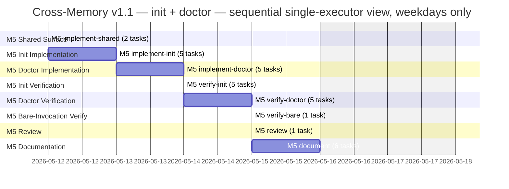

# Cross-Memory v1.1 — Scoping Document

> **Revision history.**
>
> - **2026-05-09 r2** — Applied critic findings (1 Critical + 4 Major + 5 Minor + 5 Nit) from `docs/cross-memory/v1.1-critic-review.md`. Reframed the v1.1 acceptance gate to per-harness applicability (Cursor injection-block SCs return `not-applicable` because `update_sentinel_block` is a documented v1 no-op). Defined the `not-applicable` verdict in §4.5. Added a Cursor-side carve-out to the bare-invocation hint predicate. Added a Step-0 preconditions block to §5.3. Flagged Cursor slash-command parity as an unverified assumption (new OQ-E). Renumbered §4.5 "Bare Invocation Behavior" to §4.10. Closed OQ-A and OQ-D with default decisions; re-scoped OQ-B and OQ-C per the Critical-1 / Major-2 resolutions.
> - **2026-05-09 r1** — Initial scoping pass (project-scoper deliverable, 872 lines).
>
> **Authoritative inputs:** `docs/cross-memory/v1-shipped.md` (v1 traceability), `docs/cross-memory/architecture-decision.md` (22 decisions through revision 2026-05-08), `docs/cross-memory/scoping.md` (v1 scoping; this doc continues the v1 scoping conversation in feature-spec form), `docs/cross-memory/requirements.md` (locked decisions and remaining open questions), `docs/cross-memory/v1.1-critic-review.md` (the review that drove r2). Code refs: `skills/cross-memory/SKILL.md`, `skills/cross-memory/adapter-{claude-code,cursor,generic}.md`, `agents/cross-memory.md`, `tooling/deploy-manifest.json`, `tooling/deploy.{ps1,sh}`.
>
> **Purpose:** Define the v1.1 surface — `/cross-memory init` (bootstrap), `/cross-memory doctor` (diagnostic), and the bare-invocation usage-plus-hint behavior — so the planner can pick up the implementation cold. v1.1 ships on `feature/cross-memory-v1` together with v1; there is no separate v1 release. This document supersedes the earlier "Diagnostic Subcommand Scoping Document" (which scoped doctor as a v2 feature) per user decisions on 2026-05-09.
>
> **Audience:** the planner first (cold pickup), then the critic.

---

## Locked Decisions (User, 2026-05-09)

The following five anchors are inputs, not open questions. They override the earlier diagnostic-subcommand scoping doc (now superseded) wherever the two disagree.

1. **Versioning — this is v1.1, not v2.** Cross-memory v1 is currently four commits ahead of `main` on `feature/cross-memory-v1` and has not been merged or deployed. Init and doctor are folded into the same release. The seven contract-only-verified SCs (SC-1, SC-2, SC-3, SC-4, SC-5, SC-15, SC-16) shift from "post-v1 regression" to v1.1 acceptance criteria — `doctor --post-deploy` is the gate that walks them behaviorally before v1.1 merges.
2. **Branch strategy — single PR.** Continue on `feature/cross-memory-v1`. Do not merge v1 to main first. One PR delivers v1 + v1.1 together. Users never encounter v1 without the always-on bootstrap gap fixed by `init`.
3. **Init scope — bootstrap-only.** `/cross-memory init` provisions `~/.cross-memory/`, detects the adapter, runs the always-on tier filter, populates the harness's `[CROSS-MEMORY]` sentinel block, and prints a one-line summary. Idempotent. **Codebase-fact distillation is deferred** to a later `/cross-memory init --discover` (the existing v1-shipped OQ-3 deferred item, narrowed). v1.1 init is fast, deterministic, and makes no LLM calls.
4. **Bare invocation — usage + conditional first-run hint.** `/cross-memory` with no subcommand prints the standard subcommand list. If `~/.cross-memory/` is unprovisioned **or** the active harness's sentinel block is empty/absent, the skill additionally prints `Tip: run /cross-memory init to bootstrap this project.` The skill never auto-runs `init` — explicit subcommand is always required for any state change.
5. **Carried over from the original doc.** Naming `doctor` is confirmed (the earlier OQ-A is closed). Debug-logging position (a) is confirmed — diagnostic alone is sufficient at v1.1; `--trace` remains a clean post-v1.1 add-on. The single-subcommand structure for doctor (`--check <name>`, `--pre-deploy`, `--post-deploy`, `--harness`, `--scope`, `--json`, `--verbose`) is unchanged.

---

## 0. Recommendation Summary

Cross-memory v1.1 ships **two new subcommands** plus a small bare-invocation behavior change, all on the same `feature/cross-memory-v1` branch as v1, in a single PR.

**`/cross-memory init` — bootstrap.** Provisions `~/.cross-memory/` if absent, detects the adapter, runs the always-on tier filter once, populates `[CROSS-MEMORY]` in the harness-native `MEMORY.md` sentinel region, and prints a one-line summary. Idempotent: re-runs are safe and produce the same end state. **No codebase-fact distillation at v1.1** — that path is deferred behind a future `--discover` flag. Init exists to close the always-on bootstrap gap that v1 has today: a fresh project never sees `[CROSS-MEMORY]` until the user runs `save` once, even though the always-on tier already has user-global content to surface.

**`/cross-memory doctor` — diagnostic.** Single subcommand with `--check <name>`, `--pre-deploy`, `--post-deploy`, `--harness`, `--scope`, `--json`, `--verbose` flags. Read-only. Five check groups: canonical-store integrity, mirror consistency, sentinel-marker integrity, redaction surface, deploy-target prep / cross-harness validation. The `--post-deploy` walk is the v1.1 acceptance gate for the seven contract-only-verified SCs from v1, with **per-harness applicability**:

- **Under Claude Code:** all seven SCs (SC-1, SC-2, SC-3, SC-4, SC-5, SC-15, SC-16) are walked behaviorally.
- **Under Cursor:** SC-2, SC-3, SC-4, SC-5 are walked behaviorally. SC-1, SC-15, and SC-16 stay **contract-verified** (the walk returns `not-applicable`) because Cursor's injection surface — `update_sentinel_block` — is a documented v1 no-op (`adapter-cursor.md` § 6). Full Cursor behavioral parity for those three SCs is deferred to post-v1.1, contingent on Cursor's session-start always-on injection mechanism becoming specified and the adapter operation being implemented.

The gate covers what it can cover at v1.1: full behavioral coverage where the surface is real, contract-only verification where it is not.

**Bare invocation `/cross-memory`.** Prints the subcommand list (standard CLI usage). When unprovisioned or the sentinel block is empty/absent, appends a one-line tip pointing at `/cross-memory init`. Never auto-runs init.

**Init / doctor relationship.** Init's success-confirm step uses doctor's structural primitives (sentinel-marker presence, adapter reachability) at the end of its bootstrap. Doctor is the verification surface; init is the bootstrap surface. They're complementary, not redundant. The check primitives doctor exposes also serve init's idempotency contract: re-running init while doctor reports `pass` for those primitives is a no-op.

**Branch strategy.** All work lands on `feature/cross-memory-v1`. v1.1 is what makes v1 actually shippable — without `init`, every fresh project hits the bootstrap gap; without `doctor --post-deploy`, the seven SCs are still only contract-verified. One PR delivers v1 + v1.1; main never sees an interim v1.

**v1-shipped traceability impact.** The deferred-table entry "`/cross-memory init` codebase-fact distillation" splits: bootstrap-only init becomes v1.1 in-flight; codebase-fact distillation stays deferred (renamed `init --discover`). A new row "`/cross-memory doctor`" is added to v1.1 in-flight. The seven contract-only-verified SCs move from the static-walk footnote into a "Closed by v1.1 doctor" section once `--post-deploy` walks pass.

**Headline effort.** **30–40 expected hours**, point estimate **~34 hours** (about **4–5 working days** at 8h/day, single executor). Single milestone (M5 — Cross-Memory v1.1 — init + doctor). The original v2-only doctor estimate was 18.75 hours for doctor alone; init adds approximately 9 hours all-in, the bare-invocation handler adds 1 hour, and shared parser/flag work adds a small overhead. (The 9-hour figure includes init's implementation tasks at 7.25h plus the init-attributable share of the shared parser stage and verifier walks — roughly 1.75h apportioned across `M5.implement-shared.*` and `M5.verify-init.*`. The §9 task table books `M5.implement-init.*` at 7.25h alone; the apportionment lives in the shared and verifier stages.) The init and doctor implementations can run in parallel after a small shared parser stage; that's the only useful parallelization window.

---

## 1. Problem Statement

v1 ships a complete `/cross-memory` skill, a cross-memory agent, and three harness adapters. All 21 success criteria are verified at the contract level. But three gaps surface as soon as v1 lands in real use — and v1.1 closes them.

### Gap 1 — The always-on bootstrap gap

The always-on tier filter and the `[CROSS-MEMORY]` injection block are designed to surface user-global preferences and project context at session start. The mechanism in v1: every save, forget, and audit-refresh calls `active_adapter.update_sentinel_block(content)` (`SKILL.md` lines 503–508), which rewrites the sentinel-bounded region of the harness-native `MEMORY.md`. **Until the user runs at least one save in this harness for this project, the sentinel block is empty or absent.** A fresh clone of this repo, opened in a fresh harness, does not show `[CROSS-MEMORY]` content even when the user has plenty of user-global memories that should surface.

`/cross-memory init` closes this. It runs the always-on tier filter once, calls the adapter's `update_sentinel_block`, and the harness immediately surfaces the user's existing memories. No save is required first.

### Gap 2 — The structural-health surface gap

There is no surface for an operator to ask "is the canonical store healthy right now?" before pressing the deploy button. Today the operator manually inspects frontmatter in scattered `MEMORY.md` files across `~/.cross-memory/`, the harness-native mirror at `~/.claude/projects/<slug>/memory/`, and the sidecar manifest at `~/.claude/cross-memory-mirrors.json` to be confident the deploy will land cleanly. The v1 `audit` subcommand surfaces *content-level* concerns (staleness, duplicates, contradictions, redaction misses, missing categories) but not *structural* invariants — it does not verify that the sentinel markers parse, that derived slugs match the live filesystem, that the deploy manifest globs the files about to be deployed, or that the Cursor adapter's mirror state is self-consistent.

`/cross-memory doctor` closes this. The pre-deploy mode runs the source-side structural checks; the post-deploy mode runs the cross-harness behavioral walks.

### Gap 3 — The SC behavioral verification gap (the v1.1 acceptance gate)

Seven of v1's 21 SCs — SC-1, SC-2, SC-3, SC-4, SC-5, SC-15, SC-16 — describe integration behaviors that span harness boundaries: cross-harness round-trip, auto-injection pickup at session start, end-to-end auto-propose flow. v1 verifies them by static walk against the adapter contracts. **Behavioral end-to-end coverage requires deploying via `tooling/deploy.{ps1,sh}` and running fresh-session regression in at least two harness configurations.**

In v1, that coverage gap was filed as "post-v1 regression." Under user decision 1 (this is v1.1, not v2), the seven SCs become v1.1 acceptance criteria, walked by `doctor --post-deploy --harness <claude-code|cursor>` run in each harness configuration. **The gate has per-harness applicability** because Cursor's injection surface is a documented v1 no-op:

- **Under Claude Code** the gate is full behavioral: all seven SCs are walked.
- **Under Cursor** the gate is partial behavioral. SC-2, SC-3, SC-4, SC-5 are walked behaviorally because they exercise canonical-store and mirror surfaces that Cursor implements. SC-1, SC-15, and SC-16 stay **contract-verified** at v1.1 — the behavioral walk returns `not-applicable` (see §4.5 for the verdict definition) because the `[CROSS-MEMORY]` injection block they verify does not exist on the Cursor side. `adapter-cursor.md` § 6 documents `update_sentinel_block` as a v1 no-op pending integration testing of Cursor's session-start always-on injection mechanism. Risk-5 captures the underlying defect; the gate framing here propagates the consequence.

The PR doesn't merge until both walks return overall `pass` (treating `not-applicable` as `pass` per §4.5 aggregation). Full Cursor behavioral parity for SC-1/SC-15/SC-16 is a post-v1.1 work item, contingent on Cursor's `update_sentinel_block` becoming real. The gate covers what it can cover at v1.1.

### Why v1.1 (not v1, not v2)

v1 alone has the bootstrap gap and the verification gap. Shipping v1 to users without `init` means every user hits gap 1 and gets a confusing "where's my injection block?" experience. Shipping v1 without `doctor --post-deploy` means we'd merge with the seven SCs still only contract-verified — which was the explicit "behavioral coverage requires deploy" caveat in `v1-shipped.md`. Folding init and doctor into v1.1 on the same branch means the user-visible release narrative is clean: cross-memory shipped, with bootstrap and structural diagnostics, and the seven cross-harness SCs were verified behaviorally before merge.

The framing is deliberate: v1.1 is **not a new feature line**. It is the work that takes v1 from "complete on paper" to "shippable in practice."

---

## 2. Naming Decision (closed)

**`/cross-memory init` and `/cross-memory doctor`.** Both names are confirmed by user decisions 3 and 5 above. The earlier scoping doc's OQ-A on doctor naming is closed.

`init` follows the broad CLI convention for bootstrap subcommands (`git init`, `npm init`, `terraform init`) — the verb implies "set up the working directory for this tool." `doctor` follows the developer-tooling convention for read-only health checks (`brew doctor`, `flutter doctor`, `npm doctor`, `gh extension doctor`, `op doctor`) — read-only, categorical findings, optional `--check <name>` scoping.

Neither name collides with the existing six subcommands (`save`, `recall`, `list`, `forget`, `search`, `audit`). Both are safe additions to the parser allowlist. The full v1.1 subcommand list becomes:

```
save | recall | list | forget | search | audit | init | doctor
```

The order in the help output and README table matters less than that init and doctor are visually grouped together (they are the bootstrap + diagnostic pair) and visually separated from the content-management subcommands. Recommended order in surfaces: bootstrap (`init`), content (`save`, `recall`, `list`, `forget`, `search`), governance (`audit`), diagnostic (`doctor`). The planner pins the exact ordering during M5.implement-shared.

---

## 3. Init Subcommand

### 3.1 Command syntax

```
/cross-memory init \
  [--harness <claude-code|cursor|generic>] \
  [--scope <user-global|project:<slug>|harness:<name>>] \
  [--json] \
  [--verbose]
```

**No positional arguments.** Init operates on the current host and active project; it does not take a path or scope as a positional.

**Flag semantics:**

| Flag | Effect | Mutual exclusion |
| :--- | :--- | :--- |
| `--harness` | Asserts the active harness for this invocation. Reuses the existing `## Adapter selection` precedence chain — this flag is the Step-1 CLI flag and overrides config and env-var, identical to the doctor surface (§4.1) and the existing save/recall/etc. flags. | None. |
| `--scope` | Restricts which scope's `MEMORY.md` index gets bootstrapped beyond the lazy-provisioning baseline. Default is "all four bootstrappable scopes" (user-global, harness:claude-code, harness:cursor, harness:generic). The active project scope is provisioned lazily on first save — same as today — because the slug isn't known until a save targets it. | Optional. |
| `--json` | Renders the summary as a JSON object instead of the human-readable line. Suitable for scripting. | Compatible with all other flags. |
| `--verbose` | Includes the per-step trace in the output (which directory was created, which sentinel block was written, the byte count, the SHA-256 of the new region). | Compatible with all other flags. |

**No `--repair`, no `--force`, no `--reset`.** Init never overwrites existing canonical-store state. It is additive only.

### 3.2 Behavior steps

The five steps from user decision 3, ordered:

1. **Provision `~/.cross-memory/` if missing.** Calls the lazy-provisioning sequence already documented at `SKILL.md` lines 137–153 — the same sequence that fires today on first save. Init makes the call eagerly instead of waiting for a save. If `~/.cross-memory/` already exists, this step is a no-op.

2. **Detect the active adapter.** Runs the existing five-step precedence chain in `## Adapter selection` (CLI flag → config field → env var → manifest probe → generic fallback). Records which step won, for the summary.

3. **Confirm the harness target is reachable.** Runs the structural sub-checks doctor exposes (see §4.7): for `claude-code`, that `~/.claude/projects/<slug>/memory/` is reachable and the slug derives correctly per Decision 19; for `cursor`, the equivalent path under `~/.cursor/projects/`; for `generic`, no-op. Failures here produce a structured warning and continue (the canonical store is still provisioned), but the summary line reports `harness target: unreachable` so the user knows the sentinel block won't populate.

4. **Run the always-on tier filter and populate the sentinel block.** Calls the filter documented at `SKILL.md` lines 1023–1107, then the injection-block formatter at `SKILL.md` lines 1120+, then `active_adapter.update_sentinel_block(content)` (the same call documented at `adapter-claude-code.md` § 6 and `SKILL.md` lines 503–508). The result: a populated `[CROSS-MEMORY]` block in the harness-native `MEMORY.md` sentinel region, ready for the next session start. **Under `--harness cursor` at v1**, the adapter's `update_sentinel_block` is a documented no-op (`adapter-cursor.md` § 6) — the always-on filter still runs and the summary still prints, but no sentinel-block bytes are written. The summary line reports `sentinel=skipped (cursor adapter no-op at v1)` and the post-step-4 self-check (which under Claude Code calls doctor's `sentinel-region-content-parses`) returns `not-applicable` under Cursor rather than `pass` or `fail` — see §4.5 for the verdict definition and §4.7 Group C for the per-harness check definition.

5. **Print a one-line summary.** Single line for the human-readable mode; JSON object for `--json`. Examples in §3.3.

The five steps are sequential. A failure at step 3 (unreachable harness target) does not abort steps 4–5; the always-on tier is still computed and the summary still prints, but the sentinel-block update is skipped because the adapter has nothing to write to. The summary line reports the skip explicitly.

### 3.3 Output contract

**Human-readable summary (default):**

```
cross-memory initialized: harness=claude-code, store=~/.cross-memory/ (provisioned), sentinel=updated (487 bytes), 7 always-on entries
```

The line reports five facts: (a) which harness was selected, (b) whether the canonical store was newly provisioned or already present, (c) whether the sentinel block was updated or skipped (with byte count if updated), (d) how many always-on entries are now in the block. Any skipped step is named explicitly:

```
cross-memory initialized: harness=cursor, store=already-present, sentinel=skipped (cursor adapter no-op at v1), 0 entries
```

```
cross-memory initialized: harness=claude-code, store=already-present, sentinel=already-current (no change), 7 always-on entries
```

**JSON summary (with `--json`):**

```json
{
  "schema_version": 1,
  "timestamp_utc": "2026-05-12T10:14:32Z",
  "harness": "claude-code",
  "harness_selection_step": "adapter probe",
  "active_project_slug": "D--Repositories-Personal-Git-AI-Skills-Agents",
  "store": {"provisioned": false, "path": "~/.cross-memory/"},
  "sentinel": {"updated": true, "bytes": 487, "path": "~/.claude/projects/.../memory/MEMORY.md"},
  "always_on_entries": 7,
  "warnings": []
}
```

The `harness_selection_step` field reports which step in the precedence chain selected the harness, so a user surprised by `harness=generic` can debug the detection without re-running with `--verbose`. The `warnings` array captures non-fatal issues from steps 3–4.

**Verbose mode (with `--verbose`):** the human-readable mode prints each step on its own line plus the summary line. Useful for debugging unexpected outcomes:

```
[init] step 1: ~/.cross-memory/ already exists; provisioning skipped
[init] step 2: harness detected as claude-code (selected via: adapter probe)
[init] step 3: harness target ~/.claude/projects/D--Repositories-Personal-Git-AI-Skills-Agents/memory/ reachable
[init] step 4: always-on filter produced 7 entries; sentinel block updated (487 bytes, sha256: a3f2...)
cross-memory initialized: harness=claude-code, store=already-present, sentinel=updated (487 bytes), 7 always-on entries
```

### 3.4 Idempotency contract

Init is fully idempotent. Re-running it on a fully-provisioned store produces the same end state. The contract:

- **Step 1** is no-op if `~/.cross-memory/` exists. The lazy-provisioning sequence is already idempotent (it checks before creating each subdirectory).
- **Step 2** is read-only.
- **Step 3** is read-only.
- **Step 4** rewrites the sentinel block; the result is a function of the canonical-store state and the always-on filter logic. Running init twice in a row with no canonical-store changes between runs produces byte-identical sentinel-block content. The adapter's `update_sentinel_block` is itself idempotent (same input → same bytes between markers).
- **Step 5** prints to chat; no on-disk effect.

The summary line distinguishes "newly provisioned" from "already present" so a user running init defensively can confirm at a glance that nothing changed unexpectedly. The verifier walk in M5 explicitly checks the byte-for-byte stability of the sentinel block across two consecutive init runs.

### 3.5 What init does NOT do

Hard non-goals for v1.1, listed so the planner cannot accidentally widen scope:

- **No codebase-fact distillation.** The deferred OQ-3 capability (read project files, distill facts into project-scope memories) does not ship at v1.1. It is deferred behind a future `--discover` flag. v1.1 init makes zero LLM calls.
- **No agent dispatch.** Init runs entirely in the skill body. The cross-memory agent's lane allowlist is unchanged.
- **No save.** Init does not create or modify any canonical memory file under `~/.cross-memory/`. It only provisions directories and writes per-scope `MEMORY.md` index headers (which the lazy-provisioning sequence already does on first save). The always-on tier reads existing memories; it does not synthesize new ones.
- **No `--repair` or `--force`.** If the canonical store is in a bad state (corrupted sentinel markers, malformed `MEMORY.md` indexes), init reports the problem in the summary and aborts the affected step. It does not rewrite. The user runs `doctor` to inspect, then resolves manually or via `audit`.
- **No telemetry.** Same posture as v1: cross-memory has no collected-data surface.
- **No deploy.** Init is not invoked by `tooling/deploy.{ps1,sh}` and does not invoke them.
- **No project-scope provisioning.** The lazy-provisioning sequence in v1 explicitly defers project-scope `MEMORY.md` creation until the first save targets that project (because the slug isn't known until then). Init preserves this — it does not write `~/.cross-memory/projects/<slug>/MEMORY.md` for the active project. The first save will, exactly as today.

### 3.6 Skill-only vs. agent-dispatched

Init runs entirely inside the skill body. No agent dispatch. The rationale is the same as doctor's — see §4.4 for the canonical statement. The short version: every init step is mechanical (directory existence, file existence, regex/parser invocation, byte rewrite via the adapter), no reasoning is required, the cross-memory agent's lane-allowlist stays unchanged, and init invocation stays cheap so the user may run it on every fresh-clone bootstrap and every harness switch. If a future init mode requires reasoning (`--discover` will, when it ships), that mode dispatches the agent then. v1.1 init is skill-only.

---

## 4. Doctor Subcommand

### 4.1 Command syntax

```
/cross-memory doctor \
  [--pre-deploy | --post-deploy] \
  [--check <name>] \
  [--harness <claude-code|cursor|generic>] \
  [--scope <user-global|project:<slug>|harness:<name>>] \
  [--json] \
  [--verbose]
```

**Flag semantics:**

| Flag | Effect | Mutual exclusion |
| :--- | :--- | :--- |
| `--pre-deploy` | Runs the pre-deploy check set (see §4.2). Equivalent to `--check canonical-integrity --check sentinel-markers --check redaction-surface --check deploy-manifest-coverage --check stale-shipped-artifacts`. | Mutually exclusive with `--post-deploy`. |
| `--post-deploy` | Runs the post-deploy check set (see §4.3). Equivalent to `--check mirror-consistency --check sentinel-injection --check cross-harness-roundtrip --check adapter-detection --check sc-behavioral-walk`. | Mutually exclusive with `--pre-deploy`. |
| `--check <name>` | Runs a single named check. Repeatable. | Mutually exclusive with `--pre-deploy` / `--post-deploy`. |
| `--harness` | Asserts the active harness for this invocation. Same precedence as init's `--harness`. | None. |
| `--scope` | Restricts checks that are scope-aware (e.g., canonical-integrity) to a single scope. | Optional. |
| `--json` | Renders the report as a single JSON object instead of human-readable markdown. Exit code conveys overall status (see §4.5). | Compatible with all other flags. |
| `--verbose` | Includes per-file paths, byte counts, and SHA-256 fingerprints in the output (human or JSON). | Compatible with all other flags. |

**Default check set (no flags):** see §4.6.

### 4.2 Pre-deploy check set

Runs five checks scoped to source-side structural invariants:

1. `canonical-frontmatter-parse` — every memory file's frontmatter parses against the schema validator.
2. `canonical-memory-md-consistency` — `MEMORY.md` indexes match the on-disk file set per scope; no orphans, no duplicates.
3. `sentinel-marker-count` — the active project's harness-native `MEMORY.md` has exactly one begin and one end marker.
4. `redaction-denylist-parses` — `redaction.md` is parseable on the source side.
5. `deploy-manifest-coverage` — `tooling/deploy-manifest.json` globs cover all eight cross-memory files (six skill files + agent + redaction).
6. `stale-shipped-artifacts` — `~/.claude/skills/cross-memory/` does not contain leftovers from a prior incomplete deploy.

(Six in total; `sentinel-marker-count` shows up in both pre- and post-deploy because it's the cheapest sanity check on the harness-native file.)

### 4.3 Post-deploy check set

Runs the cross-harness behavioral walks plus the residual structural checks:

1. `mirror-canonical-source-exists` — every sidecar entry in `~/.claude/cross-memory-mirrors.json` points at a live canonical source.
2. `mirror-detect-collisions` — the three-state classification (native / stale-mirror / user-edited) over the harness-native mirror directory.
3. `sentinel-region-content-parses` — the bytes between the sentinel markers parse as a valid `[CROSS-MEMORY]` injection block.
4. `adapter-detection` — re-runs the adapter selection chain and reports which step won.
5. `sc-behavioral-walk` — six in-harness sub-walks (SC-1, SC-3, SC-4, SC-5, SC-15, SC-16) plus, when invoked from the second harness, `cross-harness-roundtrip` for SC-2. Per-harness applicability: under `--harness cursor` at v1, SC-1, SC-15, and SC-16 return `not-applicable` (see §4.7 Group E for the matrix and §4.5 for the verdict definition).

This is the v1.1 acceptance gate. The PR doesn't merge until the post-deploy walk returns overall `pass` from at least two harness configurations, where overall `pass` admits `not-applicable` on the per-harness inapplicable SCs (per §4.5 aggregation).

### 4.4 Skill-only vs. agent-dispatched

Doctor runs entirely inside the skill body. No agent dispatch. Same rationale as init (§3.6): every check is mechanical, the agent's lane allowlist stays clean, and operators may run doctor before every deploy without paying Opus dispatch overhead. The cross-memory agent is reserved for synthesize and audit; the skill body owns init and doctor.

### 4.5 Output formats and exit codes

**Human-readable report (default).** Renders to chat as a structured markdown report, one section per check group, with per-section `PASS`/`WARN`/`FAIL` and overall verdict equal to the worst per-section verdict. Format identical to the original scoping doc's §3.2 example (preserved verbatim by reference).

**JSON report (with `--json`).** Single JSON object with the shape:

```json
{
  "schema_version": 1,
  "timestamp_utc": "2026-05-12T10:14:32Z",
  "harness": "claude-code",
  "harness_selection_step": "adapter probe",
  "active_project_slug": "...",
  "overall": "warn",
  "sections": [
    {"name": "canonical-integrity", "verdict": "pass", "findings": []},
    {"name": "mirror-consistency", "verdict": "warn", "findings": [...]},
    {"name": "sentinel-markers", "verdict": "not-applicable", "findings": [], "reason": "cursor adapter update_sentinel_block is a v1 no-op"},
    ...
  ]
}
```

The `verdict` field is a string enum with five values: `pass`, `warn`, `fail`, `error`, `not-applicable`. The optional `reason` field is required when `verdict == "not-applicable"` so the operator understands why the check was skipped on this harness.

**Exit codes** (when `--json` is set):

| Verdict | Exit code | Meaning |
| :--- | ---: | :--- |
| `pass` | 0 | All checks passed. Safe to proceed. |
| `not-applicable` | 0 | The check legitimately does not apply on the active harness (e.g., `sentinel-region-content-parses` under `--harness cursor` while `update_sentinel_block` is a v1 no-op). Treated as success — "this is the correct behavior on this surface." |
| `warn` | 1 | Findings present but not blocking. Operator decision. |
| `fail` | 2 | Findings present that should block the operation. |
| `error` | 3 | The doctor itself errored (e.g., could not read `~/.cross-memory/`). |

**Per-section verdict aggregation rule.** Per-section verdict is the worst of the per-check verdicts within that section, where `pass` and `not-applicable` are tied for "best": the ordering is `not-applicable = pass < warn < fail < error`. Concretely: `pass + not-applicable + pass = pass`; `not-applicable + warn = warn`; `not-applicable + fail = fail`; `not-applicable alone = not-applicable` (a section composed entirely of inapplicable checks reports `not-applicable`, but for overall-aggregation purposes that section is also treated as `pass`). Overall verdict is the worst per-section verdict under the same ordering.

In chat mode the exit code is documented but not literally returned (chat output has no exit-code semantics); a future scripted wrapper around `tooling/deploy.{ps1,sh}` could consume the convention.

**Read-only by default.** No `--repair` flag, no `--fix` flag, no auto-correction at v1.1. Lane-boundary alignment with audit (Decision 20) and the agent's allowlist (Decision 22). The diagnostic-then-fix workflow stays explicit: doctor reports; user dispatches `audit` / `forget` / `save` to fix specific findings.

### 4.6 Default check set (when `/cross-memory doctor` is invoked with no flags)

Default = pre-deploy set ∪ the safest subset of post-deploy checks that don't depend on harness-switching:

1. `canonical-integrity`
2. `sentinel-markers`
3. `redaction-surface`
4. `mirror-consistency` (read-only)
5. `adapter-detection`

Excluded from default: `deploy-manifest-coverage` (only meaningful pre-deploy), `cross-harness-roundtrip` and `sc-behavioral-walk` (only meaningful post-deploy and require harness switching). Wall-clock budget: under 5 seconds on a healthy 100-memory store.

### 4.7 Specific checks (full enumeration)

Five check groups, each containing one or more named checks. Names are stable identifiers used by `--check <name>`. Checks within a group run in declared order; each emits zero or more findings.

#### Group A: `canonical-integrity`

| Check name | What it does | Findings shape |
| :--- | :--- | :--- |
| `canonical-frontmatter-parse` | For every file under `~/.cross-memory/<scope>/<type>_<slug>.md`, verify the frontmatter parses against the schema validator (`SKILL.md` `## Schema validator`). | Per-file: which required field failed; the literal validation error string. |
| `canonical-slug-derivation` | For every project-scope file, verify the slug derivation rule produces the same slug as the file's directory name. | Per-file: derived slug vs directory-name slug. |
| `canonical-memory-md-consistency` | For each scope's `MEMORY.md`, verify every line points at an existing file and every existing file is indexed. | Per-orphan / per-missing entry. |
| `canonical-no-duplicate-slugs` | Within each scope directory, assert no two files share the same `<slug>` portion. | Per-collision: two file paths. |
| `canonical-archive-not-indexed` | Assert `~/.cross-memory/archive/MEMORY.md` does not exist (per `indexing.md` § 3 invariant). | Single boolean finding. |

#### Group B: `mirror-consistency`

| Check name | What it does | Findings shape |
| :--- | :--- | :--- |
| `mirror-sidecar-frontmatter-agreement` | For each entry in `~/.claude/cross-memory-mirrors.json` (and the Cursor sidecar), verify the mirror file has a `mirrored_from` frontmatter field pointing at the recorded canonical source. | Per-disagreement: which signal differs. |
| `mirror-canonical-source-exists` | For each sidecar entry, verify the `canonical_source` path exists. Identifies stale-mirror state per `adapter-claude-code.md § 5`. | Per-stale: mirror path and recorded canonical path. |
| `mirror-detect-collisions` | Reuses the read-only contract of `detect_collisions` from each adapter; reports the three-state classification (native / stale-mirror / user-edited) without taking action. | Per-finding: classification and path. |

#### Group C: `sentinel-markers`

| Check name | What it does | Findings shape | Per-harness applicability |
| :--- | :--- | :--- | :--- |
| `sentinel-marker-count` | For the active project's harness-native `MEMORY.md`, verify exactly one begin and one end marker are present. Under `--harness claude-code` the path is `~/.claude/projects/<slug>/memory/MEMORY.md`. | Single finding per file: counts. | Under `--harness cursor` at v1, returns `not-applicable` (with `reason: "cursor adapter update_sentinel_block is a v1 no-op; sentinel markers are not written"`). Under `--harness generic` the same applies — `update_sentinel_block` is a no-op (`adapter-generic.md` § 6). |
| `sentinel-region-bytes-fingerprint` | At v1.1: compute the SHA-256 of the bytes outside the sentinel region at the start of the doctor run, then compare against the same bytes after the run. Detects unintended mutation of native MEMORY.md content during the run itself. | Single finding: start-of-run fingerprint and end-of-run fingerprint. | Under `--harness cursor` / `--harness generic` at v1, returns `not-applicable` (no sentinel region exists to fingerprint around). A persisted-sidecar version of this check (with cross-run fingerprint history) is post-v1.1 — at v1.1 the check is intra-run only. |
| `sentinel-region-content-parses` | Assert the content between the markers parses as a valid `[CROSS-MEMORY]` injection block. | Single finding: which line broke parsing. | Under `--harness cursor` / `--harness generic` at v1, returns `not-applicable` (with `reason: "cursor adapter update_sentinel_block is a v1 no-op; no sentinel region to parse"`). |

The `sentinel-marker-count` and `sentinel-region-content-parses` checks are also init's success conditions — init's step 4 fails fast under Claude Code if either of these would report `fail` immediately after the sentinel write. Under Cursor at v1, init's step 4 reports `sentinel=skipped` and these self-checks return `not-applicable` rather than running, so init always succeeds (with the skip noted in the summary line).

#### Group D: `redaction-surface`

| Check name | What it does | Findings shape |
| :--- | :--- | :--- |
| `redaction-denylist-parses` | Verify `redaction.md` is present at the deployed path and the denylist table parses as expected. | Single boolean finding. |
| `redaction-sampling-scan` | Sample N memories per scope (default 10, capped at 30), scan their bodies with the Pass-B regex set. | Per-match finding. |
| `redaction-overridden-flag-audit` | For every memory with `redaction_overridden_at` set, surface it. | Per-overridden memory. |

#### Group E: `deploy-target-prep` (pre-deploy) and `cross-harness-validation` (post-deploy)

| Check name | When | What it does | Findings shape |
| :--- | :--- | :--- | :--- |
| `deploy-manifest-coverage` | pre-deploy | For each entry in `tooling/deploy-manifest.json`, glob the source pattern and assert all cross-memory files are covered. Confirm exclusions don't unintentionally drop cross-memory files (Decision 21). | Per-uncovered file. |
| `stale-shipped-artifacts` | pre-deploy | Glob `~/.claude/skills/cross-memory/`, `~/.cursor/skills/cross-memory/`, `~/.claude/agents/cross-memory.md`. If any artifacts have no source counterpart in the repo, emit a finding. The check assumes cross-harness directory reads are read-only and accessible from either harness session. | Per-orphan file. |
| `cross-harness-roundtrip` | post-deploy | Run from harness B after a save in harness A. Walks SC-2 behaviorally. | Single PASS/FAIL plus the path probed. |
| `adapter-detection` | post-deploy | Re-runs the adapter selection chain and reports which step won. | Single finding: harness + step. |
| `sc-behavioral-walk` | post-deploy | Walks the seven contract-only-verified SCs as small in-place behavioral checks. Per-harness applicability matrix below. | One sub-finding per SC. |

**`sc-behavioral-walk` per-harness applicability matrix:**

| SC | What it verifies | Under `--harness claude-code` | Under `--harness cursor` |
| :--- | :--- | :--- | :--- |
| SC-1 | User-global preference surfaces in a different project | Walked behaviorally — confirms `[CROSS-MEMORY]` block in the harness-native file contains the user-global entry. | **`not-applicable`** — Cursor's injection surface (`update_sentinel_block`) is a documented v1 no-op (`adapter-cursor.md` § 6), so the `[CROSS-MEMORY]` block this check inspects does not exist on the Cursor side. |
| SC-2 | Cross-harness round-trip (memory written under A, recall-able from B) | Delegates to `cross-harness-roundtrip` (post-deploy). Walked behaviorally. | Delegates to `cross-harness-roundtrip` (post-deploy). Walked behaviorally — exercises canonical-store + mirror surfaces that Cursor implements. |
| SC-3 | Auto-propose flow surfaces a memory candidate | Walked behaviorally. | Walked behaviorally — exercises auto-propose detection on canonical-store reads. |
| SC-4 | Save / recall round-trip on the canonical store | Walked behaviorally. | Walked behaviorally. |
| SC-5 | List / forget / search round-trip on the canonical store | Walked behaviorally. | Walked behaviorally. |
| SC-15 | `<private>` redaction markup suppresses content from the always-on tier output | Walked behaviorally — confirms redacted content does not appear in the populated `[CROSS-MEMORY]` block. | **`not-applicable`** — Cursor's always-on tier output (the `[CROSS-MEMORY]` block) is itself absent at v1, so there is no surface on which to verify the suppression behaviorally. The redaction behavior itself remains contract-verified via Group D `redaction-sampling-scan`. |
| SC-16 | `[CROSS-MEMORY]` injection block format is correct (sentinel-bounded, well-formed) | Walked behaviorally — `sentinel-region-content-parses` is the same primitive. | **`not-applicable`** — same reason as SC-1; the injection block this check inspects does not exist on the Cursor side. |

**Summary:** under Claude Code the walk emits seven sub-findings (one `pass`/`fail`/`warn` per SC). Under Cursor it emits four behavioral sub-findings (SC-2, SC-3, SC-4, SC-5) plus three `not-applicable` sub-findings (SC-1, SC-15, SC-16) each with `reason: "cursor injection surface (update_sentinel_block) is a documented v1 no-op"`. Treating `not-applicable` as `pass` per §4.5 aggregation, an otherwise-healthy Cursor walk still returns overall `pass`.

### 4.8 Relationship with init

Init's structural-success step (step 3) and final-success-confirm (after step 4) call doctor's check primitives directly:

- After step 1, init optionally runs `canonical-archive-not-indexed` and `canonical-memory-md-consistency` (read-only) to confirm the freshly-provisioned store is in the expected state.
- Step 3 runs `adapter-detection` (read-only) plus a `sentinel-marker-count` probe of the harness-native file (which init may need to bootstrap in step 4 if absent).
- After step 4, init runs `sentinel-region-content-parses` against the file it just wrote, as a self-check before printing the success summary.

These reuses do not change doctor's surface — init calls the same prose-level check definitions. The shared check vocabulary keeps the two subcommands consistent: a sentinel-marker corruption that init reports during step 3 is the same finding doctor would report under `--check sentinel-markers`.

### 4.9 What doctor does NOT do

Hard non-goals at v1.1:

- **Auto-repair findings.** No `--fix` flag.
- **Schema-migrate memories.** Doctor reports schema violations; it does not rewrite frontmatter.
- **Persist its report to disk.** Same rationale as audit (Decision 20). Output renders to chat.
- **Emit telemetry.** No phone-home, no per-invocation metric collection.
- **Modify the deploy manifest.** Doctor reports manifest coverage gaps; the operator hand-edits.
- **Run the deploy itself.** Doctor is invoked separately. The operator chains: doctor → deploy → doctor.
- **Spawn agents.** Skill-only at v1.1.
- **Read or modify Cursor or Claude Code internals beyond the documented mirror paths.**

---

## 4.10 Bare Invocation Behavior

User decision 4 specifies the behavior of `/cross-memory` invoked with no subcommand.

### 4.10.1 Behavior

The skill prints the standard subcommand list — the same content as `/cross-memory help`, but framed as a usage line:

```
usage: /cross-memory <subcommand> [flags]

Subcommands:
  init     Bootstrap ~/.cross-memory/ and the harness sentinel block
  save     Persist a memory (parse → redact → confirm → write)
  recall   Retrieve memories by topic
  list     Enumerate memories with one-line summaries
  forget   Archive a memory (no hard delete)
  search   Grep-style full-text search over memory bodies
  audit    Scan for staleness, duplicates, contradictions, redaction misses
  doctor   Read-only structural and integration health check

Run /cross-memory <subcommand> --help for per-subcommand details.
```

### 4.10.2 Conditional first-run hint

After the usage block, the skill checks the active-harness state and decides whether to append a hint. The predicate is **harness-aware** because the underlying surface (`update_sentinel_block`) is real on some harnesses and a documented no-op on others.

**Under harnesses where `update_sentinel_block` is real (claude-code at v1):**

The skill checks two conditions:

1. Is `~/.cross-memory/` absent? **Or**
2. Is the active harness's `MEMORY.md` sentinel block missing or empty?

If either condition is true, the skill appends:

```
Tip: run /cross-memory init to bootstrap this project.
```

If both conditions are false (the canonical store exists and the sentinel block is populated), the tip is suppressed.

**Under harnesses where `update_sentinel_block` is a documented no-op (cursor at v1, generic at v1):**

The sentinel-block predicate would be permanently true (the block is never populated by design), which would make the hint permanently spammy — every bare invocation would print the same tip even immediately after a successful init. The harness-aware predicate avoids that. The skill checks **only the first condition**:

1. Is `~/.cross-memory/` absent?

If the canonical store is provisioned, the tip is suppressed regardless of sentinel-block state. The hint text under these harnesses is also adjusted so the user understands the situation:

```
Tip: run /cross-memory init to bootstrap (Cursor injection surface deferred to post-v1).
```

The wording changes only the second clause; the action ("run /cross-memory init") is unchanged.

The probe is read-only and cheap: a directory-existence check on `~/.cross-memory/` plus, on Claude-Code-class harnesses, a single read of the harness-native `MEMORY.md` to count sentinel markers and inspect the bytes between them. On Cursor-class harnesses the second probe is skipped. The probe runs synchronously before printing the usage block; both pieces of output appear in the same response.

### 4.10.3 Non-goal — no auto-run

The skill explicitly does NOT auto-run init from bare invocation. Three reasons:

1. **CLI convention.** Bare invocation prints usage; it does not perform actions. `git`, `npm`, `gh`, and every comparable developer tool follow this pattern. Auto-running init from a bare invocation would surprise users who type `/cross-memory` to see what subcommands are available.
2. **Surprise risk.** Init writes to disk (provisioning, sentinel block update). Disk writes triggered by exploratory invocation violate the principle of least surprise. Even though init is idempotent, an unexpected `[CROSS-MEMORY]` block appearing in a new harness's `MEMORY.md` would be confusing for a user who hasn't yet read the README.
3. **State change requires explicit subcommand.** Cross-memory's safety model — confirmation gates, typed-phrase opt-outs, no auto-execution beyond auto-propose — extends to bootstrap. Init's idempotency makes auto-run defensible, but the consistency cost of relaxing the rule outweighs the convenience.

The hint exists as the lightest possible nudge: read-only, one line, easy to ignore, and easy to act on.

---

## 5. Pre-Deploy and Post-Deploy Walkthroughs

The two subcommands fit different operator mental models. Init handles the *bootstrap* surface (fresh clone, fresh harness, fresh project). Doctor handles the *verification* surface (pre-deploy gate, post-deploy regression). They're complementary.

### 5.1 Fresh-clone bootstrap

**Operator's mental model:** "I just cloned a project. I want cross-memory's always-on tier to surface my user-global memories in this harness immediately."

```
$ /cross-memory init
cross-memory initialized: harness=claude-code, store=~/.cross-memory/ (already-present), sentinel=updated (487 bytes), 7 always-on entries
```

What happened:
- Step 1 — `~/.cross-memory/` already existed from a prior project; provisioning was a no-op.
- Step 2 — Adapter probe selected claude-code.
- Step 3 — `~/.claude/projects/<slug>/memory/` reachable (Claude Code created it on first session start).
- Step 4 — Always-on filter ran; 7 entries selected; sentinel block populated.
- Step 5 — Summary printed.

The user's next session in this project starts with `[CROSS-MEMORY]` already populated. The bootstrap gap is closed.

### 5.2 Pre-deploy walkthrough

**Operator's mental model:** "I'm about to run `tooling/deploy.ps1`. Will the deploy land cleanly?"

```
$ /cross-memory doctor --pre-deploy
```

Runs (set abbreviation defined in §4.2):

1. `canonical-frontmatter-parse`
2. `canonical-memory-md-consistency`
3. `sentinel-marker-count`
4. `redaction-denylist-parses`
5. `deploy-manifest-coverage`
6. `stale-shipped-artifacts`

Pass criteria (overall verdict `pass`): every check returns `pass`, no findings.

| Verdict | What it means | Recommended operator action |
| :--- | :--- | :--- |
| `warn` | Findings present (e.g., one stale-mirror, one orphan deploy artifact). Deploy will likely succeed but a follow-up `audit` is recommended. | Read the finding; decide if it's worth fixing first. |
| `fail` | Structural defects (e.g., sentinel markers corrupted, frontmatter unparseable). Deploy may copy files but the resulting state is broken. | Resolve the finding first. Re-run doctor. |
| `error` | The doctor itself could not complete. | Inspect manually. |

**Should pre-deploy doctor failure block deploy?** Not at v1.1. Doctor is informational. The deploy script does not invoke doctor and does not consume its exit code. The operator decides whether to proceed. Tying the deploy script to doctor's exit code is a future hardening (post-v1.1).

Wall-clock budget: under 8 seconds on a healthy 100-memory store.

### 5.3 Post-deploy walkthrough — the v1.1 acceptance gate

**Operator's mental model:** "I just ran `tooling/deploy.ps1`. The seven cross-harness SCs from v1 were verified statically against contracts. v1.1 closes that gap behaviorally where it can, and contract-verifies where the underlying surface is a documented v1 no-op."

The gate has four steps: a precondition pass that primes the canonical store, then two doctor invocations (one per harness), then a verdict aggregation. The two doctor reports together form behavioral coverage of SC-2/SC-3/SC-4/SC-5 on both harnesses; full behavioral coverage of SC-1, SC-15, SC-16 lands under Claude Code; under Cursor those three return `not-applicable` per §4.7 Group E.

> **Note on Cursor's slash-command surface.** Steps 2 and 3 below assume `/cross-memory <subcommand>` parses identically in Cursor's composer chat as it does in Claude Code's chat surface. This assumption is **not yet verified at the time of writing (2026-05-09 r2)** — the cross-memory skill ships under the `~/.cursor/skills/` deploy target with `transform: true` (per `tooling/deploy-manifest.json`) but has no `SKILL.cursor.md` or custom transform (per `v1-shipped.md` deferred-table item 11, which deferred the custom transform "if integration testing surfaces a Cursor-specific syntax requirement"). If integration testing during `M5.verify-doctor.3` reveals that Cursor's slash-command parsing diverges, the gate's Cursor walk needs an alternate invocation path and the cursor-side transform becomes in-scope. See OQ-E in §8.

**Step 0 — Preconditions (the canonical store must contain something to round-trip).**

Before either doctor invocation, the operator primes the canonical store. The deploy pipeline does not provision `~/.cross-memory/` (per `SKILL.md` line 153 — provisioning is runtime, triggered by the first skill invocation), so `cross-harness-roundtrip` would have nothing to find on a clean machine. The precondition pass:

1. **Deploy v1+v1.1 to the test target.** Run `tooling/deploy.{ps1,sh} <profile>` where `<profile>` is `claude-code`, `claude-code-wsl`, or `cursor` per the manifest. The target may be the operator's dev machine; production is not required.
2. **In Claude Code on the test target, run `/cross-memory init`.** This bootstraps `~/.cross-memory/` (provisions the canonical store) and populates the harness-native `[CROSS-MEMORY]` sentinel block under Claude Code. Init's summary line should report `store=~/.cross-memory/ (provisioned)` (or `already-present` if a prior pass left it provisioned) and `sentinel=updated`.
3. **In Claude Code, run `/cross-memory save` against a known memory** under `project:<active-slug>`. A short, easy-to-recognize body works; the goal is to land a canonical file the cross-harness round-trip can locate.
4. **Verify the canonical file lands** at `~/.cross-memory/projects/<slug>/<type>_<slug>.md`. A directory listing or a follow-up `/cross-memory list project:<active-slug>` confirms the write.

If the operator is running on a machine that has been used for development of v1, the canonical store may already be provisioned and have memories in it; in that case steps 2 and 3 are still useful to land a *known-recognizable* memory the round-trip walk can target deterministically.

**Step 1 — In Claude Code:**

```
$ /cross-memory doctor --post-deploy --harness claude-code
```

Runs:

1. `mirror-canonical-source-exists`
2. `mirror-detect-collisions`
3. `sentinel-marker-count`
4. `sentinel-region-content-parses`
5. `adapter-detection`
6. `sc-behavioral-walk` — six of the seven walks (SC-1, SC-3, SC-4, SC-5, SC-15, SC-16). SC-2 is deferred to step 2 because it is the cross-harness round-trip.

**Step 2 — In Cursor (after switching harness):**

```
$ /cross-memory doctor --post-deploy --harness cursor
```

Runs the same set, plus `cross-harness-roundtrip`. Per §4.7 Group C and Group E, three of the checks return `not-applicable` under Cursor at v1: `sentinel-marker-count`, `sentinel-region-content-parses`, and the SC-1/SC-15/SC-16 sub-findings inside `sc-behavioral-walk`. The remaining checks run behaviorally. The `cross-harness-roundtrip` check looks for the most-recently-written canonical memory under `project:<active-slug>` and confirms `recall` can locate it from the Cursor session — this is SC-2 walked behaviorally.

**A "healthy v1.1 acceptance gate pass" looks like:**

- Both reports return overall `pass`, where overall `pass` admits `not-applicable` per §4.5 aggregation. Concretely: under Cursor, the Group C and the three SC-1/SC-15/SC-16 sub-findings return `not-applicable` with `reason: "cursor adapter update_sentinel_block is a v1 no-op"`; treated as `pass` for aggregation, the overall verdict still rolls up to `pass`.
- `adapter-detection` in step 1 reports `claude-code` selected via `adapter probe`.
- `adapter-detection` in step 2 reports `cursor` selected via `adapter probe`.
- `cross-harness-roundtrip` in step 2 returns `pass` with the canonical path of the test memory landed in Step 0.3.
- `sc-behavioral-walk` sub-findings under Claude Code all return `pass` (seven sub-findings).
- `sc-behavioral-walk` sub-findings under Cursor return `pass` for SC-2/SC-3/SC-4/SC-5 and `not-applicable` for SC-1/SC-15/SC-16 (four behavioral, three not-applicable).

When both reports return overall `pass` under that aggregation, the seven contract-only-verified SCs from v1 move from the static-walk footnote in `v1-shipped.md` into a structured outcome in v1.1-shipped: SC-2/SC-3/SC-4/SC-5 close as "behaviorally verified at v1.1 across both harnesses"; SC-1/SC-15/SC-16 close as "behaviorally verified at v1.1 under Claude Code; contract-only-verified under Cursor at v1.1, with full behavioral parity deferred post-v1.1." The PR is now mergeable. **Cursor full behavioral parity for SC-1/SC-15/SC-16 is post-v1.1 work**, contingent on Cursor's `update_sentinel_block` being implemented (which is itself contingent on Cursor's session-start always-on injection mechanism becoming specified — see `adapter-cursor.md` § 6).

| Failure | What it indicates | Resolution |
| :--- | :--- | :--- |
| `sentinel-region-content-parses` returns `fail` (not `not-applicable`) in step 2 | The parser ran on Cursor (which would mean Cursor's `update_sentinel_block` became real mid-flight or the verdict was misclassified). Investigate. At v1.1, the expected verdict on Cursor for this check is `not-applicable`, not `pass` or `fail`. | Reconcile: confirm `adapter-cursor.md` § 6 is still a no-op at the deployed version; if so, the verdict misclassification is a doctor defect — file against M5.implement-doctor. |
| `sentinel-region-content-parses` returns `fail` in step 1 (Claude Code) | The Claude Code adapter wrote bytes the parser can't read. Likely an `adapter-claude-code.md` defect or a corruption between init and the doctor walk. | File a defect against the Claude Code adapter; reproduce manually. |
| `adapter-detection` returns `generic` when the user expected `claude-code` | Detection didn't fire. Either the env var family is missing or the marker directory probe failed. | Inspect `CLAUDE_CODE_*` env vars; check `~/.claude/` exists; consult `--verbose`. |
| `mirror-detect-collisions` returns `user-edited` findings | The user edited the mirror file directly between deploys. | Run `/cross-memory audit`; offer the user the three choices in `adapter-claude-code.md § 5`. |
| `cross-harness-roundtrip` fails | A memory written under one harness is not visible under another. Either the canonical write didn't land (Step 0.3 didn't persist), or slug derivation differs across harnesses. | Inspect the canonical store; re-run with `--verbose` to see slugs. |

Wall-clock budget: 10–15 seconds per harness on a healthy store, plus the harness switch (dominated by user action — closing one IDE, opening another).

### 5.4 Bare-invocation walkthrough

**Operator's mental model:** "I forget what cross-memory's subcommands are."

Fresh project, no init yet:

```
$ /cross-memory
usage: /cross-memory <subcommand> [flags]

Subcommands:
  init     Bootstrap ~/.cross-memory/ and the harness sentinel block
  save     Persist a memory ...
  ...

Tip: run /cross-memory init to bootstrap this project.
```

Same project after init:

```
$ /cross-memory
usage: /cross-memory <subcommand> [flags]

Subcommands:
  init     Bootstrap ~/.cross-memory/ and the harness sentinel block
  save     Persist a memory ...
  ...
```

The tip is suppressed because `~/.cross-memory/` exists and the sentinel block is populated.

### 5.5 CI / scripted use

`--json` is the contract for scripts. Exit codes follow §4.5. The same caveat applies as in v1's audit: Claude Code does not run subcommands from a shell — they appear in chat. A user copy-pastes JSON for programmatic consumption. Real CI integration is a post-v1.1 hardening (see OQ-B).

---

## 6. Debug-Logging Evaluation (closed)

The original scoping doc evaluated three positions on debug-logging — (a) diagnostic alone is sufficient, (b) debug log alongside, (c) hybrid `--trace` flag. **User decision 5 confirms position (a).** Diagnostic alone is sufficient at v1.1.

The rationale stands as written in the original doc: cross-memory has no concurrency or asynchrony (every operation is fully synchronous and gate-confirmed), the chat transcript is the operational log (Claude Code, Cursor, and other harnesses retain conversation history), and the motivating diagnostic questions all reduce to state, not sequence. Doctor inspects state, which is what's needed.

**Forward door (post-v1.1):** if real diagnostic gaps surface that doctor cannot answer, position (c)'s `--trace` flag is a pure-add. No v1.1 surface change is required to enable that path later.

---

## 7. Boundaries / Non-Goals

### 7.1 Init non-goals

`/cross-memory init` does NOT:

- Distill codebase facts. Deferred behind a future `--discover` flag.
- Save any canonical memory file under `~/.cross-memory/`.
- Provision project-scope `MEMORY.md` for the active project (lazy on first save, identical to v1).
- Repair corrupted state. No `--repair`, no `--force`.
- Dispatch the cross-memory agent.
- Make LLM calls. Init is fully deterministic.
- Emit telemetry.
- Run inside `tooling/deploy.{ps1,sh}` or invoke them.
- Auto-run from bare invocation (see §4.10).

### 7.2 Doctor non-goals

`/cross-memory doctor` does NOT:

- Auto-repair findings. No `--fix` flag.
- Schema-migrate memories.
- Persist its report to disk (chat-only, same as audit per Decision 20).
- Emit telemetry.
- Modify the deploy manifest.
- Run the deploy itself.
- Spawn agents.
- Read or modify Cursor or Claude Code internals beyond the documented mirror paths.

### 7.3 Bare-invocation non-goals

`/cross-memory` (no subcommand) does NOT:

- Run init automatically.
- Write to disk.
- Probe harness-native paths beyond the single existence check needed to decide whether to print the tip.

### 7.4 Boundary with the existing audit subcommand

Audit (v1) covers content-governance: staleness, duplicates, contradictions, redaction misses, missing-category curation. Doctor (v1.1) covers structure and integration: frontmatter parse, slug derivation against live FS, MEMORY.md consistency, sentinel markers, mirror state, deploy manifest, cross-harness behavior. Init (v1.1) covers bootstrap: provisioning + always-on tier population.

| Concern | `audit` (v1) | `doctor` (v1.1) | `init` (v1.1) |
| :--- | :---: | :---: | :---: |
| Stale memories | Yes | No | No |
| Duplicates / contradictions | Yes | No | No |
| Missing-category curation | Yes | No | No |
| Frontmatter parse correctness | No | Yes | Read-only check |
| Slug derivation against live FS | No | Yes | Read-only check |
| MEMORY.md index consistency | No | Yes | Read-only check |
| Sentinel marker integrity | No | Yes | Yes (writes them) |
| Mirror sidecar / frontmatter agreement | No | Yes | No |
| Deploy-manifest coverage | No | Yes (pre-deploy) | No |
| Stale shipped artifacts | No | Yes (pre-deploy) | No |
| Cross-harness roundtrip | No | Yes (post-deploy) | No |
| SC behavioral walk | No | Yes (post-deploy) | No |
| Provision `~/.cross-memory/` | No | No | Yes |
| Populate `[CROSS-MEMORY]` block | No | No | Yes |

The three subcommands are disjoint by design.

---

## 8. Risks and Open Questions

The original scoping doc closed OQ-A (naming) by user decision 5, and the debug-logging OQ closed by user decision 5. The remaining open questions for v1.1 are:

| # | Question / Risk | Why it's open | Recommended resolution | Effort delta |
| :--- | :--- | :--- | :--- | :--- |
| OQ-A | ~~Should init be built before doctor, or in parallel?~~ **CLOSED 2026-05-09 r2 — parallelize after the shared stage.** | Sequencing question; affects M5's parallelization plan. | **Resolved (default accepted):** Build the shared parser stage and the shared check vocabulary first (M5.implement-shared), then implement init and doctor in parallel against that shared surface. Init's success-confirm calls the documented checks by name; the checks themselves are owned by doctor's M5.implement-doctor. | None. |
| OQ-B | ~~Confirm scope of post-deploy walk.~~ **RE-SCOPED 2026-05-09 r2 per Critical-1.** | User policy — how much regression rigor is enough. The original recommendation (full seven SCs behaviorally) is not implementable under Cursor at v1, because Cursor's `update_sentinel_block` is a documented v1 no-op (`adapter-cursor.md` § 6). | **Resolved (per Critical-1 reframe):** behavioral coverage on Claude Code for all seven SCs (SC-1, SC-2, SC-3, SC-4, SC-5, SC-15, SC-16). On Cursor: behavioral for SC-2, SC-3, SC-4, SC-5; `not-applicable` (per §4.5) for SC-1, SC-15, SC-16 because the Cursor injection surface is a documented v1 no-op. Full Cursor behavioral parity for SC-1/SC-15/SC-16 is **post-v1.1 work**, contingent on `update_sentinel_block` being implemented for Cursor. | None vs. the original recommendation in implementation effort; the gate framing is what changed. |
| OQ-C | ~~Should bare-invocation's first-run hint also fire when `MEMORY.md` exists but the sentinel block is missing?~~ **RE-SCOPED 2026-05-09 r2 per Major-2.** | Edge case in the hint logic, compounded by Cursor's no-op `update_sentinel_block` (the original "fire on any empty/absent sentinel block" predicate would make the hint permanently spammy on Cursor — the block is never populated by design). | **Resolved (per Major-2 carve-out):** Predicate is **harness-aware** per §4.10.2. Under harnesses where `update_sentinel_block` is real (claude-code at v1), fire the hint on (canonical store absent) OR (sentinel block empty/absent). Under harnesses where `update_sentinel_block` is a documented no-op (cursor at v1, generic at v1), fire only on (canonical store absent); once the canonical store is provisioned, suppress regardless of sentinel-block state. Hint text under no-op harnesses adjusts to "Tip: run /cross-memory init to bootstrap (Cursor injection surface deferred to post-v1)" so the user understands the situation. | None — predicate complexity is one extra harness branch, already booked in `M5.implement-shared.2` description. |
| OQ-D | ~~Should v1.1 add a `/cross-memory doctor --version` flag?~~ **CLOSED 2026-05-09 r2 — defer.** | Diagnostic surface choice. v1.1 is the first cross-memory release with a meaningful version delta from v1. | **Resolved (default accepted):** Defer. The deploy manifest is the source of truth for "what version is installed"; doctor can surface that via `--verbose` if needed. Adding a dedicated `--version` flag duplicates the manifest read. Pure-add post-v1.1 if a real diagnostic gap surfaces. | None. |
| OQ-E | **(NEW 2026-05-09 r2 per Major-4.)** Is Cursor's slash-command invocation surface verifiably parity with Claude Code's? The §5.3 walkthrough assumes `/cross-memory <subcommand>` parses identically in Cursor's composer chat. The cross-memory skill ships under the `~/.cursor/skills/` deploy target with `transform: true` but has no `SKILL.cursor.md` or custom transform (`v1-shipped.md` deferred-table item 11 deferred this "if integration testing surfaces a Cursor-specific syntax requirement"). | Until verified, the gate's Cursor walk depends on an unconfirmed parity assumption. If parity holds, the assumption is harmless and OQ-E closes as a one-paragraph note in §5.3. If parity does not hold, the cursor-side transform becomes in-scope at v1.1 and the gate's invocation path under Cursor is redesigned. | Verify during `M5.verify-doctor.3`'s setup: the operator attempts `/cross-memory doctor --post-deploy --harness cursor` in Cursor's composer chat. If the command parses and executes, OQ-E closes with a citation in §5.3. If not, raise an immediate critic / planner re-pickup; the cursor-side custom transform must be scoped (`tooling/transform-cursor-cross-memory.{ps1,sh}` + `SKILL.cursor.md` or equivalent) before the gate can run on Cursor. | If parity does not hold: +4–8h scoped against cross-memory's deploy surface (estimated similarly to `tooling/transform-cursor-{ops,ralph-loop}.{ps1,sh}`). At v1.1, this is captured as a contingent cost rather than a booked one. |
| Risk-1 | **Slug-derivation Windows / POSIX divergence (carried from v1).** Init's step 3 verifies the harness target is reachable via slug derivation; doctor's `canonical-slug-derivation` walks all project-scope files. If a user runs init or doctor on Windows after originally provisioning on POSIX, slug derivation may diverge. | Reality of cross-platform deployment. | Document: "init reports against the *current host's* slug derivation; doctor reports the same. Cross-host comparison is not in scope." Recommend `--harness` for determinism. | None — documentation. |
| Risk-2 | **Init step 4 silently succeeds with empty sentinel block when the always-on tier filter returns zero entries.** A fresh `~/.cross-memory/` with no user-global memories produces an empty filter output; init writes empty bytes between the markers and reports `0 always-on entries` in the summary. The user might expect "init failed because nothing was written." | UX expectation gap. | The summary line is the disambiguation: `sentinel=updated (0 bytes), 0 always-on entries` is the "successful empty write" signal. Document in README; pin in M5.document. | None — documentation. |
| Risk-3 | **Bare-invocation tip suppresses correctly for the active harness only.** If the user has populated the sentinel block under harness:claude-code but is currently running under harness:cursor (which has an empty sentinel block of its own), the tip should fire — the user has not bootstrapped *this* harness. | Cross-harness state interaction. | Probe is harness-scoped: the predicate inspects only the current harness's `MEMORY.md` sentinel block. Pin in M5.implement-shared. | None — implementation detail. |
| Risk-4 | **Idempotency verification requires two consecutive init runs with byte-identical sentinel output asserted.** Decision 4 (idempotency) means the verifier walks init twice and compares; the walk is straightforward and is already accounted for as `M5.verify-init.2` in §9. | Verifier surface. | Already booked in `M5.verify-init.2` (no separate cost line). | None — booked in `M5.verify-init.2`. |
| Risk-5 | **Cursor adapter `update_sentinel_block` is a v1 no-op (the load-bearing v1 limitation that shapes v1.1's gate framing).** Per `adapter-cursor.md` § 6, the operation is a no-op pending integration testing. Init's step 4 under `--harness cursor` will skip the sentinel write and report `sentinel=skipped (cursor adapter no-op at v1)`. Doctor's `sentinel-region-content-parses` under cursor returns `not-applicable` (per §4.5 verdict definition and §4.7 Group C). The `sc-behavioral-walk` sub-findings for SC-1, SC-15, SC-16 under cursor also return `not-applicable` (per §4.7 Group E matrix). | Known v1 limitation; v1.1 inherits it and propagates the consequence into the v1.1 acceptance-gate framing. | Document in README and v1-shipped/v1.1-shipped. **Crucially**, the gate framing in §0, §1 Gap 3, §3.2 step 4, §4.7 Group C/E, and §5.3 has been revised (2026-05-09 r2) to acknowledge the consequence rather than treat the defect as documentation-only. The cursor adapter's `update_sentinel_block` becoming real is a separate post-v1.1 work item, contingent on Cursor's session-start always-on injection mechanism becoming specified. v1.1 ships with the v1 cursor behavior intact. | None — documentation, plus the gate-framing edits already applied across §0/§1/§3/§4/§5. |
| Risk-6 | **The `redaction-sampling-scan` default (10 per scope, capped at 30) may not match a real store's distribution.** Carried from the original doc. | Performance trade-off. | Use the recommended default; allow override via `--check-sample-size <N>` if real cases surface. | None at v1.1. |
| Risk-7 | **Doctor's check vocabulary may grow.** New cross-memory features will want their own checks. The check vocabulary is a fixed surface that callers (`--check <name>`) pin against. | Naming-stability concern. | Treat the v1.1 check names as a stable contract. New checks are pure-add; renaming is a breaking change. | None at v1.1. |
| Risk-8 | **Init's "agent-write allowlist" check.** If the agent is dispatched under a stale lane allowlist, the audit-time write check (SC-21) might pass while init's bootstrap quietly violates the same bound. Init does not write to agent-only paths, but the planner should pin this in M5.implement-init's acceptance: init's writes go through the existing skill-side write paths (lazy-provisioning, `update_sentinel_block`), not through any agent-routed path. | Lane-boundary alignment. | Pin in M5.implement-init acceptance: "init's writes are skill-side only; the cross-memory agent's lane allowlist is unchanged by v1.1." | None — alignment is correctness. |

---

## 9. Effort Estimate, Milestones, Dependencies

The build is a **single milestone (M5 — Cross-Memory v1.1 — init + doctor)**, continuing from v1's M1–M4 numbering. Six stages: shared parser + check-vocabulary work, init implementation, doctor implementation, init verification, doctor verification, review, and documentation. Init and doctor implementation parallelize after the shared stage; verification serializes per stage; review and documentation are single passes that cover both subcommands.

### M5 — Cross-Memory v1.1 — init + doctor

> **Status:** Not started.

Add `/cross-memory init` and `/cross-memory doctor` to the skill router; implement the bare-invocation usage-plus-hint behavior; document the five doctor check groups; wire init's bootstrap sequence; verify init's idempotency and doctor's pre/post-deploy walks; behaviorally walk the seven contract-only-verified SCs from v1; document the v1.1 surface across SKILL.md, README, agent file, doc-sync map, and v1.1-shipped traceability.

| # | Item | Description | Est. Hours |
| :--- | :--- | :--- | ---: |
| M5.implement-shared.1 | **Router + shared flag parsing + check-vocabulary** | Add `init` and `doctor` to the parser allowlist in `SKILL.md` line 5 (six → eight). Add `init` and `doctor` rows to the unknown-subcommand error message and the bare-invocation usage line. Define the shared `--harness`, `--scope`, `--json`, `--verbose` parsing (pattern matches the existing flags on save/recall/etc.). Define the check-name vocabulary as a stable identifier table that init and doctor both reference. | 1.5 |
| M5.implement-shared.2 | **Bare-invocation usage + first-run hint** | Replace the current default behavior (line 9: `usage: /cross-memory <save\|recall\|...>`) with the structured usage block (§4.10). Implement the conditional first-run-hint probe (harness-aware: canonical-store existence + sentinel-block presence on Claude-Code-class harnesses; canonical-store existence only on harnesses where `update_sentinel_block` is a documented no-op). Hint text varies per harness per §4.10.2. | 1.0 |
| M5.implement-init.1 | **Init steps 1–3 (provisioning + adapter detection + reachability)** | Document the eager-provisioning call (delegates to the existing lazy-provisioning sequence at SKILL.md 137–153). Document the adapter-detection step (delegates to the existing `## Adapter selection`). Document the reachability probe (uses doctor's `adapter-detection` and `sentinel-marker-count` primitives). | 2.0 |
| M5.implement-init.2 | **Init step 4 (always-on filter + sentinel write)** | Document the call into the always-on tier filter (SKILL.md 1023–1107) and the injection-block formatter (SKILL.md 1120+), then the dispatch to `active_adapter.update_sentinel_block(content)`. Define the failure-isolation rules: an unreachable adapter target (step 3 warning) skips step 4 cleanly, the canonical store is still provisioned, the summary reports the skip. | 2.0 |
| M5.implement-init.3 | **Init step 5 (summary output, human + JSON + verbose)** | Document the human-readable summary line shape, the JSON object (schema_version 1), the verbose multi-line trace. Define the four explicit summary states (`provisioned` vs `already-present`; `updated` vs `already-current` vs `skipped` for sentinel). | 1.5 |
| M5.implement-init.4 | **Init idempotency contract + non-goals** | Document that init never overwrites canonical memories; the lazy-provisioning sequence is idempotent; consecutive runs produce byte-identical sentinel-block output; project-scope provisioning is deferred to first save (unchanged from v1). Pin the explicit non-goals (no codebase-fact distillation, no `--repair`, no `--force`, no agent dispatch, no telemetry). | 1.0 |
| M5.implement-init.5 | **Init's reuse of doctor's check primitives** | Document the cross-references: init step 3 calls doctor's `adapter-detection` and `sentinel-marker-count` (read-only); after step 4, init calls `sentinel-region-content-parses` as a self-check. The reuse is by-name (the check identifiers from M5.implement-shared.1), not by import. | 0.75 |
| M5.implement-doctor.1 | **Doctor router + flag parsing (--pre-deploy / --post-deploy / --check / mutual exclusion)** | Define the doctor-specific flag parsing on top of the shared parser. Mutual-exclusion rules between `--pre-deploy`, `--post-deploy`, and repeated `--check`. The default check set definition (§4.6). | 1.5 |
| M5.implement-doctor.2 | **Group A + B + C check definitions** | Document the eleven canonical-integrity, mirror-consistency, and sentinel-marker checks in `SKILL.md` (a new `## Subcommand: doctor` section). Each check has a description, finding shape, and PASS / WARN / FAIL criteria. Reuses adapter `detect_collisions` read-only contracts; no new adapter operations. | 3.0 |
| M5.implement-doctor.3 | **Group D + E checks (redaction-surface, deploy-target-prep, cross-harness-validation)** | Document redaction-sampling logic, the deploy-manifest-coverage check (reads `tooling/deploy-manifest.json`), the stale-shipped-artifacts probe, the cross-harness-roundtrip walk, and the seven SC behavioral-walk sub-findings. The SC walks are the densest prose section because each walk needs explicit pass/fail criteria. | 3.0 |
| M5.implement-doctor.4 | **Output formatter (human + JSON) and exit codes** | Document the report structure for both modes. Define the schema_version 1 JSON contract (shared shape between init and doctor where reasonable — both have `harness`, `harness_selection_step`, `timestamp_utc`). Per-section verdict aggregation rule (overall = worst). The four exit codes. | 1.5 |
| M5.implement-doctor.5 | **Adapter-detection reuse for doctor** | Wire `adapter-detection` check to the existing precedence chain. Document the harness + harness_selection_step pair travelling into both report formats and into init's summary. | 0.5 |
| M5.verify-init.1 | **Verify init on fresh canonical store** | Five-step walk: blow away `~/.cross-memory/`; invoke `/cross-memory init`; assert provisioning happened; assert summary line reports `provisioned`; assert sentinel block populated. Confirms init's primary path. | 0.75 |
| M5.verify-init.2 | **Verify init idempotency (two consecutive runs)** | Three-step walk: invoke init twice in a row; assert byte-identical summary state (`already-present`, `already-current` second time) and byte-identical sentinel content. Confirms idempotency contract. | 0.5 |
| M5.verify-init.3 | **Verify init behavior with empty always-on tier** | Three-step walk on a store with zero matching memories; assert summary reports `0 always-on entries` and sentinel write is `updated (0 bytes)` (the "successful empty write" disambiguation per Risk-2). | 0.5 |
| M5.verify-init.4 | **Verify init under unreachable harness target** | Three-step walk with the harness-native path made unreachable; assert step 3 emits a warning, step 4 skips, summary reports `sentinel=skipped (harness target unreachable)`. | 0.5 |
| M5.verify-init.5 | **Verify init `--json` and `--verbose` outputs** | Two-step walk: invoke `init --json`, assert JSON shape matches schema_version 1; invoke `init --verbose`, assert per-step trace lines present. | 0.5 |
| M5.verify-doctor.1 | **Verify pre-deploy default check set** | Five-step walk on a clean store: invoke `doctor --pre-deploy`, assert the six default checks ran, assert overall `pass`, assert each section's verdict matches a pre-seeded expectation. | 0.75 |
| M5.verify-doctor.2 | **Verify post-deploy walk in single harness (Claude Code)** | Six-step walk: invoke `doctor --post-deploy --harness claude-code`, assert mirror-sidecar agreement, sentinel parses, six SC behavioral-walks pass. | 1.5 |
| M5.verify-doctor.3 | **Verify post-deploy walk in second harness + cross-harness roundtrip (Cursor) — the v1.1 acceptance gate** | Walk includes the §5.3 Step-0 preconditions: (a) deploy v1+v1.1 to the test target via `tooling/deploy.{ps1,sh}`; (b) in Claude Code, run `/cross-memory init`; (c) run `/cross-memory save` against a known memory under `project:<active-slug>`; (d) verify the canonical file lands at `~/.cross-memory/projects/<slug>/<type>_<slug>.md`. Then: in Claude Code, run `doctor --post-deploy --harness claude-code` and assert overall `pass`; switch to Cursor, run `doctor --post-deploy --harness cursor`, assert `cross-harness-roundtrip` returns `pass`, assert SC-1/SC-15/SC-16 sub-findings return `not-applicable` (with reason citing the cursor adapter no-op), assert overall `pass` (treating `not-applicable` as `pass` per §4.5). Per OQ-E, the verifier also confirms that `/cross-memory <subcommand>` parses in Cursor's composer chat; if not, halt and route a Cursor slash-command parity defect. **This is the gate that must pass before v1.1 merges.** | 2.0 |
| M5.verify-doctor.4 | **Verify failure surfacing — corrupted sentinel** | Three-step walk: corrupt one sentinel marker; invoke `doctor --check sentinel-markers`; assert overall `fail`; assert finding identifies the corrupted marker. | 0.75 |
| M5.verify-doctor.5 | **Verify `--json` schema validation** | Three-step walk: invoke `doctor --json` on a known-good store; assert JSON parses; assert all top-level keys match schema_version 1; assert exit-code-equivalent verdict equals `pass`. | 0.5 |
| M5.verify-bare.1 | **Verify bare-invocation usage + first-run hint logic** | Four-step walk: (a) invoke `/cross-memory` with `~/.cross-memory/` absent — assert tip prints; (b) invoke after init — assert tip suppressed; (c) invoke under a fresh harness with the canonical store present but the sentinel block empty — assert tip prints; (d) invoke help-style `/cross-memory help` — assert same usage block (no tip regardless of state). | 0.75 |
| M5.review.1 | **M5 spec-compliance review** | Four files (`SKILL.md` init + doctor + bare-invocation sections, `README.md` updates, `agents/cross-memory.md` single-sentence note, doc-sync map updates) vs §1–§7 of this scoping doc. Standard code-reviewer pass; severity-rated findings. | 1.5 |
| M5.document.1 | **Update `skills/cross-memory/README.md`** | Add `init` and `doctor` rows to the subcommand table. Add `Init` and `Doctor` sections parallel to the existing `Audit` section. Update the bare-invocation note. Add a callout for the empty-sentinel-write summary disambiguation (Risk-2). | 1.5 |
| M5.document.2 | **Update `agents/cross-memory.md`** | Single-sentence note that neither init nor doctor dispatch this agent. Confirms the agent's lane boundary unchanged. | 0.25 |
| M5.document.3 | **Update `docs/cross-memory/v1-shipped.md`** | Split the "/cross-memory init codebase-fact distillation" deferred-table row: bootstrap-only init becomes "in-flight v1.1," codebase-fact distillation stays deferred (renamed `init --discover`). Add a new "in-flight v1.1" row for `doctor`. Once `M5.verify-doctor.3` passes, move the seven SCs into a "Closed by v1.1 doctor" section with **per-harness annotations**: SC-2/SC-3/SC-4/SC-5 close as "behaviorally verified at v1.1 across both harnesses"; SC-1/SC-15/SC-16 close as "behaviorally verified at v1.1 under Claude Code; contract-only-verified under Cursor at v1.1, with full behavioral parity deferred post-v1.1 pending Cursor's `update_sentinel_block` becoming real." | 0.75 |
| M5.document.4 | **Create `docs/cross-memory/v1.1-shipped.md`** | New file mirroring `v1-shipped.md`'s pattern. Records what v1.1 shipped (init bootstrap-only, doctor with five check groups, bare-invocation behavior), what's deferred (`init --discover`, `--trace` flag, `--repair` flags), and the verifier task that closed each v1.1 acceptance criterion. | 0.75 |
| M5.document.5 | **Update doc-sync map (`CLAUDE.md` and `.cursor/rules/documentation-sync.mdc`)** | Add: doctor + init sections in SKILL.md ↔ README diagnostic + bootstrap sections ↔ agent doc reminder ↔ v1.1-shipped traceability doc. Update the existing cross-memory rows in the map. Mirror to the `.cursor/rules/` file. | 0.5 |
| M5.document.6 | **Update root `README.md`** | Add `init` and `doctor` to any subcommand enumeration. Spot-check; skip if root README does not enumerate. | 0.25 |
| | | **Subtotal** | **34.0** |

**Confidence band:** 34.0 ± 6h. Range: low 28h, expected 34h, high 40h. Confidence is M (medium) — the work pattern matches v1 (prose-driven `SKILL.md` additions plus verifier walks), but three things drive the range upward:

- **M5.verify-doctor.3 (the v1.1 acceptance gate) is the highest-stakes verifier in v1.1.** A real cross-harness defect found here is a v1 finding, not a v1.1 finding; the planner halts M5 and routes the v1 defect first. Carries the same uncertainty as v1's M3.verify.6 did.
- **Cursor adapter `update_sentinel_block` is a v1 no-op.** Init under cursor reports `sentinel=skipped` cleanly; doctor under cursor returns `not-applicable` for sentinel-region-content-parses. If integration testing during M5.verify-doctor.3 surfaces that Cursor's actual injection surface differs from the adapter file's assumed shape, the verifier walk inflates by 1.5–2h and a new v1 defect is routed.
- **The check-vocabulary stability constraint (Risk-7) means M5.implement-shared.1's check identifier table is a contractual surface.** Renaming a check identifier later is a breaking change. The +0.5h on this task reflects the higher review bar.

**Deliverable:** A `/cross-memory init` subcommand callable from any harness that bootstraps the canonical store and the harness-native sentinel block; a `/cross-memory doctor` subcommand with `--pre-deploy` and `--post-deploy` integration points, `--json` for scripting, behavioral coverage of SC-1 through SC-5, SC-15, SC-16, and structural coverage of canonical store, mirror state, sentinel markers, redaction surface, and deploy-manifest alignment; a bare-invocation usage block with conditional first-run hint; documentation parity with v1 and a v1.1-shipped traceability doc.

### Dependencies

This milestone depends on:

- **v1 substrate complete on `feature/cross-memory-v1` (it is).** The four v1 commits provide the always-on tier filter, the injection-block formatter, the adapter contracts, and the cross-memory agent that init and doctor build on.
- **OQ-A resolution (closed in r2)** — init and doctor parallelize after a shared stage. If a future revision flips back to strict sequential, calendar would grow by ~0.5 days.
- **OQ-B resolution (re-scoped in r2)** — post-deploy walk: behavioral on Claude Code for all seven SCs; behavioral on Cursor for SC-2/SC-3/SC-4/SC-5; `not-applicable` on Cursor for SC-1/SC-15/SC-16 (per Critical-1 reframe).
- **OQ-E (open as of r2)** — Cursor slash-command parity assumption verified during M5.verify-doctor.3 setup. If parity does not hold, the cursor-side custom transform becomes in-scope at v1.1 (+4–8h contingent).

This milestone enables (post-v1.1 candidates surfaced during scoping):

- **`init --discover`** — the deferred codebase-fact distillation flag. Pure-add to M5.implement-init.1's parser; new flow in a new section. Estimated 8–12h post-v1.1.
- **`--trace`** — the position (c) hedge. Pure-add to M5.implement-doctor.1's parser. Estimated 1.5h post-v1.1.
- **Deploy-script integration** — `tooling/deploy.{ps1,sh}` could grow a `--pre-deploy-doctor` flag that gates the deploy on `doctor --pre-deploy --json` returning `pass`. Pure-add, post-v1.1 hardening.

### Parallelization

The useful parallelization window is between init and doctor implementation, after the shared stage:

- **M5.implement-shared.1 and .2** — sequential, single author. Lay down the parser surface and the check-vocabulary table.
- **M5.implement-init.1 through .5** and **M5.implement-doctor.1 through .5** — these two chains can run in parallel. Init reuses doctor's check-name vocabulary by reference (the identifiers are pinned in the shared stage). Saves approximately 2–3 hours by overlapping the two prose-drafting passes.
- **M5.verify-init.* and M5.verify-doctor.*** — sequential within each chain; the two chains can run in parallel because they exercise different surfaces. Saves approximately 1 hour.
- **M5.review.1** — single pass, single author.
- **M5.document.1 through .6** — the six documentor targets can fan out at `--parallel 3`; the long-pole is M5.document.1 (README updates) at 1.5h. Saves approximately 1 hour.

**Net parallelization gain:** 4–5 hours. Calendar drops from ~4.5 sequential days to ~3.5 parallelized days.

### Calendar timeline



**Single-executor calendar:** 34.0 hours = ~4.25 working days at 8h/day. Add 6–10% review-cycle overhead per v1 calibration: **4.5–5 working days**. Parallelized: **3.5–4 working days**. The start date assumes M5 begins immediately on `feature/cross-memory-v1`.

---

## 10. Documentation Sync Impact

Per the `CLAUDE.md` Documentation Sync map, every file in the cross-memory cluster needs an update for v1.1. The new init and doctor surfaces add at least one new map row (the v1.1-shipped traceability doc) and touch the existing rows for the cross-memory README, SKILL, agent, and v1-shipped.

### Files updated

| File | Update | Reason |
| :--- | :--- | :--- |
| `CLAUDE.md` (Documentation Sync map) | Add a row mapping `docs/cross-memory/v1.1-shipped.md` ↔ the v1.1 surface (SKILL.md init + doctor sections, README init + doctor sections, agent doc note). Update the existing `skills/cross-memory/README.md` row to mention init + doctor sections. Update the existing `agents/cross-memory.md` row to note both subcommands run skill-side (no agent dispatch). | Doc-sync rules require map currency. |
| `.cursor/rules/documentation-sync.mdc` | Mirror the same map updates. | The map is mirrored per the rules note in `CLAUDE.md`. |
| `skills/cross-memory/SKILL.md` | Add `## Subcommand: init` and `## Subcommand: doctor` sections (the largest changes). Update the parser allowlist line 5 (`save / recall / list / forget / search / audit / init / doctor`). Update the bare-invocation default behavior at line 9 (replace the current usage one-liner with the structured usage block + conditional hint). Add cross-references between init and doctor (init's check-primitive reuse). Update the `## Output Tagging` section's badge-on-turns list to include init and doctor output. | Implementation lives here. |
| `skills/cross-memory/README.md` | Add `init` and `doctor` rows to the subcommands table. Add `Init` (parallel to existing `Audit`) and `Doctor` sections. Update the Always-On Tier section to note that `init` is the explicit bootstrap path (the lazy bootstrap on first save still works, but init is the recommended fresh-clone step). Update FAQ if it mentions "six subcommands". | User-facing surface. |
| `agents/cross-memory.md` | Add a single-sentence note that neither init nor doctor dispatches this agent (preserves lane-boundary clarity). | Lane-clarity for callers. |
| `docs/cross-memory/v1-shipped.md` | Split the deferred-table `init` row (bootstrap → in-flight v1.1; codebase-fact distillation → deferred as `init --discover`). Add an "in-flight v1.1" row for `doctor`. Move the seven contract-only-verified SCs into a "Closed by v1.1 doctor" section once M5.verify-doctor.3 passes. Add a one-line cross-reference at the top: "v1.1 ships on the same branch; see `v1.1-shipped.md`." | Traceability — v1's footnote becomes v1.1's gate. |
| `docs/cross-memory/v1.1-shipped.md` | **New file**, mirrors `v1-shipped.md`'s pattern. Records v1.1's shipped surface (init bootstrap-only, doctor with five check groups, bare-invocation behavior), v1.1's deferred items (init --discover, --trace, --repair), and the verifier task that closed each v1.1 acceptance criterion (the seven SCs from v1's contract-only set). Produced by M5.document.4. | The closing artifact for v1.1. |

### Files possibly updated

| File | Conditional update | Trigger |
| :--- | :--- | :--- |
| Root `README.md` | Add `init` and `doctor` to any subcommand enumeration. | If root README enumerates subcommands. Spot-check. |
| `docs/ASSESSMENT.md` | Add a one-line note that v1.1 shipped the bootstrap and diagnostic surface alongside v1. | If assessment is updated for the v1+v1.1 release. |
| `tooling/deploy-manifest.json` | None expected — existing globs already cover `skills/cross-memory/` and `agents/cross-memory.md` per Decision 21. | Unless v1.1 introduces a new file class. |
| `tooling/deploy.{ps1,sh}` | None at v1.1; pre-deploy doctor integration is post-v1.1. | If user wants the deploy script to gate on `doctor --pre-deploy`. |

### New files

- `docs/cross-memory/v1.1-shipped.md` — the v1.1 traceability doc (M5.document.4).

No new files inside `skills/cross-memory/` or `agents/`. The init and doctor sections live inside the existing `SKILL.md`. No new sub-file (e.g., `skills/cross-memory/diagnostic.md`) is needed.

---

## 11. Cross-References

- `docs/cross-memory/v1-shipped.md` — v1 shipped surface and the seven contract-only-verified SCs that drove this scoping.
- `docs/cross-memory/architecture-decision.md` — 22 decisions; Decisions 18 (sentinel-bounded MEMORY.md), 19 (slug derivation against live FS), 20 (audit chat-only), 21 (deploy-manifest verified), 22 (cross-memory-specific lane allowlist) are the structural foundations init and doctor build on.
- `docs/cross-memory/scoping.md` — v1 scoping doc; this doc continues the v1 scoping conversation in feature-spec form (the v1 doc is per-task / per-milestone; v1.1 is per-subcommand / per-section).
- `docs/cross-memory/requirements.md` — locked decisions; SC-1..SC-21 enumerated.
- `skills/cross-memory/SKILL.md` — current subcommand router; init and doctor are added to the parser allowlist on line 5; bare-invocation default at line 9 is replaced; `## Subcommand: init` and `## Subcommand: doctor` sections added.
- `skills/cross-memory/README.md` — user-facing surface; gets Init and Doctor sections parallel to Audit.
- `skills/cross-memory/adapter-{claude-code,cursor,generic}.md` — mirror state and `update_sentinel_block` contracts that init consumes (write side) and doctor consumes (read side).
- `agents/cross-memory.md` — agent contract; gets a single-sentence reminder that neither init nor doctor dispatches the agent.
- `tooling/deploy-manifest.json` and `tooling/deploy.{ps1,sh}` — the deployment surface doctor's pre-deploy and post-deploy modes integrate with.
- `CLAUDE.md` Documentation Sync map — gets a map-row update for the v1.1 traceability doc.

---

## 12. Discovered During Scoping

These items surfaced while reading the v1 surface for the v1.1 scoping pass. They are not part of the init or doctor work and are flagged so the team manager can route them appropriately.

1. **Tag-line semantics on `agents/cross-memory.md`.** Line 4 description ends "Reads canonical store; writes only to ~/.cross-memory/** and to the sentinel-bounded region of harness-native MEMORY.md files." This is correct but technically incomplete — the agent also writes to `_tmp_*` (per Decision 22's third allowlist glob). Cosmetic completeness gap. Route to executor as a one-line description fix only if a future revision touches the file. (Carried over from the original scoping; still applies.)

2. **README "Configuration" section's Bash-permission note.** `skills/cross-memory/README.md` lines 130–151 describe Bash permissions for the agent's audit pass. Init and doctor run skill-side and do not invoke Bash directly. The note remains accurate but should grow a sentence noting that init and doctor do not require those permissions. Fold into M5.document.1 as a sub-acceptance.

3. **Cursor adapter `update_sentinel_block` no-op (Risk-5).** `adapter-cursor.md` § 6 documents a v1 no-op pending integration testing. Init under cursor will report `sentinel=skipped (cursor adapter no-op at v1)`; doctor under cursor's `sentinel-region-content-parses` returns `not-applicable`; doctor's `sc-behavioral-walk` sub-findings for SC-1/SC-15/SC-16 under cursor return `not-applicable` (per §4.7 Group E matrix). The v1.1-shipped doc should call this out explicitly as a known v1 limitation that v1.1 inherits, and should record that SC-1/SC-15/SC-16 close as "behaviorally verified at v1.1 under Claude Code; contract-only-verified under Cursor at v1.1, with full behavioral parity deferred post-v1.1." Fold into M5.document.4.

4. **No integration test ran for SC-2 in v1.** Per `v1-shipped.md`'s last paragraph, SC-2 was verified statically. Doctor's `cross-harness-roundtrip` will be the first behavioral SC-2 walk this project has run. If it fails on M5.verify-doctor.3, the failure is a real v1 bug, not a v1.1 defect — route to debugger / executor and halt M5. Pin in M5.verify-doctor.3 acceptance: "if a real cross-harness defect surfaces, that is a v1 finding; halt M5 and route the v1 defect first."

5. **`SKILL.md` line 5's parser allowlist hardcodes the subcommand list.** Adding init + doctor doubles the surface from six → eight. Future additions (init --discover, etc.) will keep growing this line. Not a v1.1 concern, but if the list grows past ~10, the prose-driven router should grow a stable enumeration table that the parser line references rather than restating. Flag for visibility; not booked.

6. **`SKILL.md` lines 137–153 lazy-provisioning sequence vs init step 1.** Init's step 1 calls the lazy-provisioning sequence eagerly. The two paths must produce identical end states. v1's lazy path is well-trodden; init does not need a separate provisioning implementation. Pin in M5.implement-init.1 acceptance: "step 1 delegates to the documented lazy-provisioning sequence; init does not duplicate the directory-creation logic."

7. **The v1.1 acceptance gate creates a chicken-and-egg with deploy.** M5.verify-doctor.3 is a post-deploy walk. The deploy must happen before v1.1 merges. The user must deploy `feature/cross-memory-v1` (containing v1 + v1.1) to a non-production target, run the post-deploy walk in two harnesses, and only then merge. Pin this sequencing in the M5 handoff: "M5.verify-doctor.3 runs against a deployed v1+v1.1 surface, not a pre-deploy local checkout. The deploy itself does not need to be production; any reachable target where both Claude Code and Cursor can run the skill is sufficient." The user's existing dev machine + the WSL target in the deploy manifest may already satisfy this.

These items do not require a new dispatch; the team manager can decide whether to fold them into the M5 work or leave them for separate routing.

---

## 13. Handoff

**Status:** Scoping revised (2026-05-09 r2) per critic findings. Recommendation summary in §0; full analysis in §1–§12; effort estimate in §9 (34.0 expected hours, single milestone, ~4.5 working days single-executor / ~3.5 parallelized).

**OQ resolutions (as of r2):**

- **OQ-A** — Closed. Default accepted: parallel after the shared stage.
- **OQ-B** — Re-scoped per Critical-1. Behavioral on Claude Code for all seven SCs; behavioral on Cursor for SC-2/SC-3/SC-4/SC-5; `not-applicable` on Cursor for SC-1/SC-15/SC-16. User-confirmed.
- **OQ-C** — Re-scoped per Major-2. Harness-aware predicate: fire on absent canonical store always; fire on empty/absent sentinel block under harnesses where `update_sentinel_block` is real (claude-code at v1); suppress under harnesses where it's a no-op (cursor at v1, generic at v1). User-confirmed.
- **OQ-D** — Closed. Default accepted: defer `doctor --version`.
- **OQ-E** — **Open.** Cursor slash-command parity with Claude Code is unverified at the time of revision. Verify during M5.verify-doctor.3 setup. If parity does not hold, the cursor-side custom transform becomes in-scope (+4–8h contingent).

**Next steps:**

1. **Critic re-reviews this revised scoping doc** for any residual gaps from the r2 edits — especially §4.5 (verdict aggregation rule under not-applicable), §4.7 Group C/E (per-harness applicability matrices), §5.3 (Step-0 preconditions and the per-harness pass criteria), and OQ-E (the Cursor slash-command parity assumption).
2. **Planner pickup** — produces task hierarchy with verbatim acceptance criteria for each M5.* row, pinning the OQ-A through OQ-D resolutions and the OQ-E verification step in the task notes. The shared stage (M5.implement-shared) lands first; init and doctor implementation chains parallelize after.

The v1.1 surface is a deliberate two-subcommand release that closes the bootstrap and verification gaps v1 leaves behind, where it can. Init makes v1's always-on tier real on first contact under Claude Code instead of waiting for the user's first save. Doctor walks the seven cross-harness SCs behaviorally where the surface is real (Claude Code for all seven; Cursor for SC-2/SC-3/SC-4/SC-5) and contract-only (`not-applicable`) where it is not (Cursor for SC-1/SC-15/SC-16, pending Cursor's `update_sentinel_block` becoming real post-v1.1). Both ship on the same branch as v1, in one PR. The remaining open question (OQ-E) is verifiable during the M5.verify-doctor.3 setup; everything else is implementation detail the planner can pin from this document.
