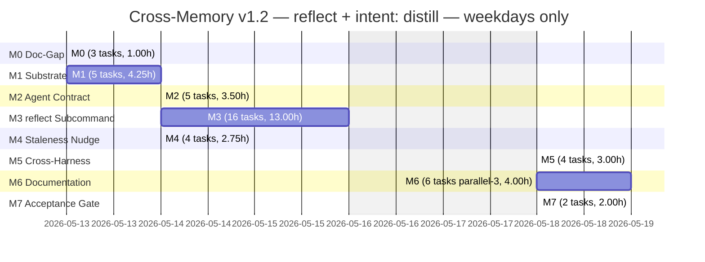

# Cross-Memory v1.2 — Scoping Document

> **Revision history.**
>
> - **2026-05-13 r3** — Applied user decisions on three pending items: SC-5/R5 reword approved verbatim (now applied to the requirements doc); Gap G4 (`--dry-run`) intent-deferred to v1.3; Gap G5 (Cursor parity) deferred to M5 dispatch. Brainstorm gate + Phase 1a Tier 3 closed.
> - **2026-05-13 r2** — Applied critic findings from `docs/cross-memory/v1.2-critic-review.md`: 1 Critical (`.jsonl` path override in §1.4 with note that the ADD's path is wrong on the actual install), 4 Major (Reference Set D resolved to LLM-prompt-applied only with a proposed SC-5 reword flagged for user re-approval; filter test fixtures booked under new `M1.implement.4` in the plan with M3 verify tasks wired to consume; M3 verifier-stage delta reverted from –3.0h to –1.5h so M3 = 13.0h and total = 33.5h ± 6h; M2.verify.1 acceptance expanded with the negative-assertion bullet and the byte-identity walk against `main:agents/cross-memory.md` for the `## Lane Boundaries` text), 5 Minor (G8 `config.yaml` user-installed note mirrored in M6.document.1; G7 v1.1→v1.2 migration folded into M3.verify.2; G3 empty-project carve-out pinned in M3.implement.7; G9 standing-instruction wording pinned in §6; G10 Source-5 redaction disclaimer expanded to three doc surfaces), 5 Nits (§0 "five substantive items" → "three Major and seven Minor"; §0 "one MAJOR scope-creep risk" → "three new risks of which two are Major"; gantt-hour reconciliation; §5 Closure-Status column expanded with verifier-task citations; SC-11 implement-task column adds M6.document.1), 3 §4 missing-task additions (deploy-manifest acceptance bullet on M7.document.1; missing-rule edge-case on M3.verify.6 with +0.25h; baseline reference for M2.verify.1's byte-identity walk). Total now **33.5h ± 6h** (was 31.25h ± 6h).
> - **2026-05-13 r1** — Initial scoping pass (project-scoper deliverable, 721 lines).
>
> **Authoritative inputs:**
>
> - `docs/cross-memory/v1.2-reflection-requirements.md` — 12 locked success criteria, 15 acceptance criteria (AC1–AC15), 10 edge cases, 4 Open Items (a, b, c, d). User-locked at Step 5.5.
> - `docs/cross-memory/v1.2-reflection-architecture.md` — user-approved ADD. Open Items a/c/d resolved; b deferred to v1.3; seven component-level designs binding.
> - `docs/plan/cross-memory-v1.2-reflection-plan.md` — planner deliverable; 8 milestones (M0–M7), 44 tasks, planner-estimated ~36.25h.
> - `docs/cross-memory/v1.1-scoping.md` — structural and stylistic precedent (940 lines, single-milestone v1.1 release).
> - `docs/cross-memory/v1-shipped.md`, `docs/cross-memory/v1.1-shipped.md` — what already shipped on `main`.
> - `.agents/handoffs/cross-memory-v1.2-reflection-2026-05-13/handoff-001-architect-to-planner.md` — architect's binding handoff.
>
> **Purpose.** Calibrate planner estimates against this project's known patterns, surface gaps the planner may have missed, build the risk register, and lock the milestone-level deliverable list so the critic can review a single readable digest against the requirements + ADD + plan. The scoping doc is the project-scoper's deliverable for Phase 1a Tier 3 (Scope + Critique); the critic dispatches next against this output combined with the existing plan, requirements, and ADD.
>
> **Audience.** The critic first (gap-hunt, feasibility); then the executor (cold pickup once approved).
>
> **Branch.** `feature/cross-memory-v1.2-reflection`, cut from `main` at `af160f4`. v1 and v1.1 are already merged to `main`. v1.2 is strictly additive; the PR will be **separate** from the v1+v1.1 PR.
>
> **SC-21 invariant.** The `cross-memory` agent's runtime write allowlist remains exactly `~/.cross-memory/**`, sentinel-bounded `~/.claude/projects/<active-slug>/memory/MEMORY.md`, and `_tmp_*`. No task in this scoping widens it.

---

## Locked Decisions (User + Architect, 2026-05-13)

These anchors are **inputs**, not open questions. They override anything the scoper might otherwise re-examine; the critic should not relitigate them either.

### Locked by the user at Step 5.5 (12 success criteria, verbatim from `v1.2-reflection-requirements.md` §5)

1. `/cross-memory reflect` subcommand exists with on-demand invocation, no auto-execution, interactive audit-style report loop (`save` / `decline` / `edit` / `done`).
2. `cross-memory` agent gains a new `intent: distill` whose write path is strictly canonical-store-only — SC-21 unchanged.
3. Default auto-scan inputs are git history (Source 3) plus `docs/plan/**`, `docs/cross-memory/handoff*`, `docs/ops-dispatch-log*` (Source 4). Under Claude Code only, opt-in extension via `--from-session <id>` or `--since-last-reflect` ingests `.jsonl` session transcripts (Source 1). `--from <path>` (Source 5) always available.
4. Pattern taxonomy enforced to exactly four categories: architectural decisions; conventions implicit in code; workflow patterns from successful runs; user preferences from feedback patterns. Project goals (category c) explicitly excluded.
5. A post-generation deterministic anti-redundancy filter drops candidates whose slug-overlap + tag-overlap + body-token Jaccard exceeds threshold against four reference sets: canonical store filtered to relevant tiers, `~/.cross-memory/archive/`, the new per-project `reflect_declined.md` ledger, and the "What NOT to save" categorical rule.
6. New per-project `reflect_declined.md` ledger created lazily on first decline under `~/.cross-memory/projects/<slug>/`; the agent's writes remain inside SC-21's allowlist.
7. Output gate: audit-style report with per-candidate columns (id, type, category, scope, proposed-name, body-preview, source-evidence); per-candidate confirmation defaults to **N**; supersede candidates flagged `would-supersede <existing>`; silent supersedes forbidden.
8. `init` and `doctor` emit a "Tip: it's been N days since reflect ran" hint when the configurable threshold (default 30 days) is crossed; nudge never auto-executes.
9. Under Cursor and generic harnesses, `reflect` runs on Sources 3+4+5 only; transcript ingestion is Claude-Code-only.
10. "What NOT to save in memory" rule codified in a stable readable home before v1.2 ships (architect picks location during the ADD).
11. External-trigger / post-run-hook contract explicitly deferred to v1.3.
12. Zero regressions: all v1 SCs (SC-1 through SC-21) and v1.1 behavioral closures remain green.

### Locked by the architect in the user-approved ADD

- **Open Item (a) → Option A.** "What NOT to save in memory" rule lives in `~/.claude/CLAUDE.md`. Filter reads by heading match `## What NOT to save in memory`; missing-file fallback is structured warning + empty Reference Set D.
- **Open Item (c) → Option B.** Anti-redundancy thresholds: slug 0.85, tag 0.8, body-Jaccard 0.7. Disjunctive trip (any one signal crosses → drop). Configurable per-machine via `config.yaml` under a `reflect:` namespace.
- **Open Item (d) → Option B.** `last_reflect_at` stored per-project in `~/.cross-memory/projects/<slug>/state.toml`, **skill-written, not agent-written**. Co-located with `reflect_declined.md`.
- **Open Item (b)** — explicitly v1.3-deferred. Argument grammar accommodates future `--non-interactive --json --context <path>` without restructuring.
- **Seven component-level designs** — subcommand routing; `intent: distill` brief; `reflect_declined.md` ledger schema; four-source input pipeline; staleness-nudge wiring; cross-harness applicability matrix; edge-case handling. ADD §4–§10 are binding.
- **New risk #1.** Claude Code `.jsonl` transcript format is not a published public contract. Mitigation: structural pre-check before agent dispatch; graceful fallback to Sources 3+4+5 with structured warning on pre-check failure.
- **OQ-v1.2-2.** Anti-redundancy thresholds are reasoned, not measured. Real-data calibration is v1.3+. Configurable in the meantime.

### Carried over from v1 + v1.1

- The existing eight subcommand contracts (`save`, `recall`, `list`, `forget`, `search`, `audit`, `init`, `doctor`) are unchanged. `reflect` is the ninth, peer of `audit`.
- The save Gate 3 → Gate 4 pipeline is reused verbatim for `save <id>` from the reflect loop. No new write path is introduced.
- The supersede flow (v1.1) is reused verbatim for flagged candidates. No silent supersede.
- The adapter precedence chain is unchanged. `reflect` consumes it once per invocation, identical to every other subcommand.
- The redaction pipeline (Gate 2 of save) protects against secrets in transcript-distilled candidates. No new redaction surface.

---

## 0. Recommendation Summary

Cross-memory v1.2 adds **one new subcommand**, **one new agent intent**, **two new per-project files**, **one staleness nudge**, and **one global-instructions edit** — all on `feature/cross-memory-v1.2-reflection`, in a **separate PR** from v1+v1.1 (which is already on `main` at `af160f4`).

**`/cross-memory reflect` — proactive discovery.** A user who has built up a project but not saved memories runs one command and reviews machine-proposed candidates distilled from artifacts they already created: git history, plan docs, handoffs, optionally session transcripts under Claude Code. The interactive loop (`save` / `decline` / `edit` / `done`) defaults to **N** per candidate — no silent saves, no silent supersedes. Candidates that overlap declined entries or canonical entries above threshold are filtered out before the user sees the list.

**`intent: distill` on the `cross-memory` agent.** A third intent peer of `synthesize` and `audit`. Same SC-21 allowlist, same labeled-prose brief, new output contract (a structured candidate list). The agent reads the four-source corpus; raw-candidate generation receives the LLM-prompt-applied exclusion corpus (Reference Set D from `~/.claude/CLAUDE.md`); the deterministic anti-redundancy filter then operates over **three deterministic reference sets** (Sets A canonical, B archive, C decline ledger) per critic-r1 Major-1 resolution. The **skill** orchestrates UX, writes the decline ledger, and writes the per-project state file. The agent's runtime write surface is unchanged from v1.1.

**Two new per-project files.** `~/.cross-memory/projects/<slug>/reflect_declined.md` (append-only Markdown ledger of declined candidates) and `~/.cross-memory/projects/<slug>/state.toml` (lazy-created state file carrying `last_reflect_at`, `last_reflect_candidate_count`, `last_reflect_run_id`). Both written by the skill, both inside the SC-21 allowlist.

**Staleness nudge.** `init` gains a Step 4.5 between Step 4 (sentinel write) and Step 5 (summary). `doctor` gains a footer line below the overall verdict. Both read `state.toml`, both suppress when `last_reflect_at` is unset, neither auto-invokes `reflect`. Harness-agnostic — the nudge fires identically across all three harnesses.

**Doc-gap closure.** A new `## What NOT to save in memory` section lands in `~/.claude/CLAUDE.md` before the filter can reference it. Starter wording lists four exclusion categories: project goals; transient session state; secrets and credentials; episodic conversation logs.

**Branch and PR strategy.** v1.2 ships as its own PR on `feature/cross-memory-v1.2-reflection`. Unlike v1+v1.1 (which folded together because v1 was never on `main`), v1.2 is a clean additive release on top of an already-merged baseline. The acceptance gate is lighter than v1.1's three-stage gate because v1+v1.1 already passed theirs — v1.2 only needs to confirm the new surface works and that the existing surfaces are unchanged.

**Headline effort.** **27–40 expected hours**, point estimate **~33.5 hours** (about **4 working days** at 8h/day, single executor). The planner's bottom-up total of 36.25 hours is reasonable; this scoping doc calibrates it down by ~2.75 hours based on the project's documented timing pattern that documentation-extension `/ops` runs land far below the scoping-doc bottoms-up estimates (`feedback_ops_timing_patterns.md` — 1 datapoint, provisional). **Per critic-r1 Major-3**, the M3 reduction was halved from –3.0h to –1.5h — the router/grammar/loop savings have v1.1 precedent and remain booked, but the M3 verifier-stage delta is reverted to the planner's estimate because verifier walks under v1.1 ran close to scoped and the one-datapoint timing pattern does not yet justify a –24% cut across six verify tasks. The single largest adjustment is still M3 (the `reflect` subcommand itself), which the planner books at 14.5h and the scoper now books at **13.0h**. The biggest unknowns are M3.implement.5 (Source 1 `.jsonl` pre-check) and M3.implement.9 (the deterministic filter) — both involve genuinely new pattern work, not just template extension.

**Eight milestones, sequenced.** M0 (doc-gap closure) lands first; M1 (substrate: config + state.toml schema + ledger schema) blocks M2 and M3; M2 (agent contract) parallelizes with M3 (subcommand + pipeline + loop + filter) after M1; M4 (staleness nudge) starts after M1; M5 (cross-harness parity walks) blocks on M3 and M4; M6 (documentation) consolidates after M3/M4/M5; M7 (acceptance gate procedure + execution) is the final pre-merge step.

**Gap analysis surfaces ten substantive items** the planner did not catch, of which three are MAJOR (G1 Reference Set D consumption shape; G2 filter test fixtures; G4 `--dry-run` deferral) and seven are MINOR. Risk register inherits all 11 ADD risks and adds three new risks of which two are Major (Reference Set D consumption shape; filter test fixtures missing) and one is Medium-impact (threshold calibration scope creep). Open questions for the critic foreground six concerns ranging from filter-rule consumption shape to redaction-pipeline interaction with transcript candidates.

---

## 1. Surface Definition

This section restates **what ships** from the ADD's seven component-level designs, one short spec per component, so the critic and downstream agents have a single readable digest. No new architectural decisions are made here; this is a reframe of the ADD as an executor-ready specification.

### 1.1 Subcommand routing — `/cross-memory reflect` as the ninth peer

`reflect` is added to the parser allowlist in `SKILL.md`. The accepted-subcommand line grows from eight to nine. The new `## Subcommand: reflect` section lands after `## Subcommand: audit`, following the structural template established by audit and doctor. Help output and the unknown-subcommand error message gain the new entry. Surface ordering: bootstrap (`init`) / content (`save`, `recall`, `list`, `forget`, `search`) / governance (`audit`) / diagnostic (`doctor`) / discovery (`reflect`).

**Argument grammar (ADD §4):**

```
/cross-memory reflect \
  [--from-session <session-id>] \
  [--since-last-reflect] \
  [--from <path>] \
  [--scope <user-global|project:<slug>|harness:<name>>] \
  [--staleness-days <N>] \
  [--verbose]
```

- `--from-session` and `--since-last-reflect` are mutually exclusive. Both invoke Source 1. Both fail fast under Cursor/generic with a typed error.
- `--from <path>` is always available; multiple `--from` arguments union into a single source set.
- `--scope` defaults to `project:<active-slug>`.
- `--verbose` prints per-candidate filter decisions.
- `--non-interactive` is **not parsed** at v1.2 — the grammar accommodates it without restructuring (v1.3).

### 1.2 `intent: distill` contract on the cross-memory agent

A third intent on `agents/cross-memory.md` peer of `synthesize` and `audit`. Same SC-21 allowlist, same labeled-prose brief shape, new output contract.

**Brief shape (read from ADD §5):** Constraints block carries `intent: distill`, `active_project_slug`, `active_harness`, the four source sub-fields, the three thresholds, the four reference-set paths, the four-category taxonomy, and a size budget defaulted to 8000 chars. Scope section lists **read paths only** — there is no write target in the brief.

**Output contract:** a fenced markdown block with an environment header (harness, project slug, sources scanned, raw/dropped/surfaced counts) plus a candidate table with eight columns (id, type, category, scope, proposed-name, body-preview, source-evidence, flags). Deterministic sort order: by category, then by proposed-name lexicographically. Body-preview length is fixed at 160 chars with `…` truncation.

**SC-21 verification:** The agent's `## Lane Boundaries` text is byte-identical to v1.1. The brief's `## Scope` block lists only read paths. The agent writes to `_tmp_*` during filter computation (already allowed) and does NOT write to `reflect_declined.md` or `state.toml` (skill-written). No new tool grants; the existing `Read`, `Glob`, `Grep`, `Bash`, `Write` set is sufficient.

### 1.3 `reflect_declined.md` ledger schema

**Location:** `~/.cross-memory/projects/<slug>/reflect_declined.md`. Lazy-created on first decline. Co-located with `state.toml` and the per-project `MEMORY.md`.

**Format:** Markdown with per-entry frontmatter blocks delimited by `---`. The file is conceptually append-only — each decline event becomes a new block. Schema fields (per entry): `declined_at` (ISO 8601 UTC), `candidate_id`, `proposed_name`, `category`, `scope`, `tags`, `body_preview`, `source_evidence`, `run_id`.

**Write semantics:** Skill-owned write — after `decline <id>` returns from the interactive loop, the skill appends a new block. The agent never touches this file at write time. No on-disk deduplication; the filter handles redundancy in subsequent runs.

**Matching strategy:** When the agent's distill pass runs, it parses each ledger entry as a `(proposed_name, category, scope, tags, body_preview)` tuple and applies the three-signal filter against each tuple in turn. A new candidate that crosses any threshold drops with reason `declined-redundancy`.

**SC-21 verification:** Path matches `~/.cross-memory/**`. Skill-written. Compliant.

### 1.4 Four-source input pipeline

**Source 3 — git + working-tree (skill-staged).** The skill runs read-only `Bash` commands (`git log`, `git diff --stat`, `git log -- <doc paths>`) bounded by last 90 days or 200 commits (whichever is smaller). Working-tree convention probes: `pyproject.toml`, `package.json`, `.editorconfig`, `tsconfig.json`, `ruff.toml`, `mypy.ini`, `.github/workflows/**`, `tooling/deploy-manifest.json`, lint/formatter configs, top-level directory listing. The skill stages outputs in `_tmp_reflect_source3_<timestamp>.md` before agent dispatch.

**Source 4 — plan docs, handoffs, dispatch logs (skill-globbed).** Three globs: `docs/plan/**/*.md`, `docs/cross-memory/handoff*`, `docs/ops-dispatch-log*`. Bound: 50 files per glob; over-bound files reported in a `truncated:` field. The agent reads each matched file lazily during distillation.

**Source 1 — Claude Code transcripts (Claude-Code-only, opt-in).** Two flag shapes (`--from-session <id>` and `--since-last-reflect`). Path: `~/.claude/projects/<active-slug>/<id>.jsonl`. **Path corrected per critic-r1 Critical-1**: the ADD §7 documents the path as `~/.claude/projects/<active-slug>/sessions/<id>.jsonl`, but a direct `ls` of `~/.claude/projects/D--Repositories-Personal-Git-AI-Skills-Agents/` on the active install returns `.jsonl` files at the **top level** (no `sessions/` subdirectory). The ADD will be patched in a future doc-sync pass; for v1.2 implementation, the path used by M3.implement.5 is the corrected one above. Bound on `--since-last-reflect`: 20 sessions per invocation. **Structural pre-check** runs before agent dispatch: verify file exists, parses as one JSON object per line, has minimal expected keys. Pre-check failure → structured warning, fallback to Sources 3+4 only.

**Source 5 — explicit seed (always available).** `--from <path>` accepts a file or directory; multiple arguments union. Bound: 100 paths total or 10 MB total content. Non-existent or unreadable paths error before agent dispatch.

**Unification.** The brief's `## Constraints` lists the resolved source set. The agent reads each source path independently using its tool grants. The skill stages Source 3, validates Source 5 paths, resolves Source 4 globs, and runs the Source 1 pre-check; the agent does the LLM-driven distillation and the deterministic filter.

### 1.5 Staleness-nudge wiring

**In `init`.** A new `### Step 4.5 — Reflect staleness check` subsection lands between Step 4 (sentinel write) and Step 5 (summary output). Reads `state.toml`. If `reflect.last_reflect_at` is set and `(now - last_reflect_at) > reflect_staleness_threshold_days`, emits `Tip: it's been <N> days since reflect ran — run /cross-memory reflect to surface candidates.` Suppresses cleanly when the file is absent, unparseable, or the field is missing.

**In `doctor`.** A footer line below the overall-verdict line, regardless of mode (default / pre-deploy / post-deploy / targeted). In `--json` mode, a `reflect_staleness_hint` top-level field with sub-fields `fired`, `days_since_last_reflect`, `threshold_days`, `message`. When `fired: false`, `message` is omitted.

**Cross-harness applicability.** Harness-agnostic. The check reads a canonical-store file (`~/.cross-memory/projects/<slug>/state.toml`) that exists on every harness. The hint fires identically under Claude Code, Cursor, and generic.

**Configuration.** New config field `reflect_staleness_threshold_days` in `config.yaml`, default `30`. Distinct from the existing `staleness_threshold_days` (which defaults to `90` for memory `verified_at` staleness — different concept, different threshold).

### 1.6 Cross-harness applicability matrix

The only Claude-Code-only surface is **Source 1** (transcript ingestion via two flags). Everything else is harness-agnostic.

| Component | Claude Code | Cursor | Generic |
| :--- | :---: | :---: | :---: |
| `/cross-memory reflect` subcommand | Full | Full (no Source 1) | Full (no Source 1) |
| `--from-session` / `--since-last-reflect` flags | Available | Error at parse time | Error at parse time |
| `--from <path>` | Available | Available | Available |
| `intent: distill` agent dispatch | Full | Full | Full |
| `reflect_declined.md` ledger | Full | Full | Full |
| Interactive report loop | Full | Full | Full |
| Anti-redundancy filter (all four sets) | Full | Full | Full |
| Supersede flag | Full | Full | Full |
| Staleness nudge in `init` and `doctor` | Full | Full | Full |
| `state.toml` write | Full | Full | Full |

**Flag-availability choice (ADD §9).** The architect chose: `--from-session` and `--since-last-reflect` remain in `--help` under all harnesses but **error at parse time** under Cursor/generic with the message `error: --from-session is Claude-Code-only; current harness is <name>`. Rationale: a user who moves between harnesses should not see the flag set change underneath them.

### 1.7 Edge-case handling

The ADD §10 resolves all 10 edge cases from requirements §6. Most are direct consequences of the architectural decisions; the ones that warrant special attention here:

- **Empty project** (no git, no plan docs, no handoffs) → skip agent dispatch; emit `No candidates surfaced — no eligible input signal found.`; do NOT write `state.toml` or `reflect_declined.md`. (Subtle: the run did not "complete" in the bumping-`last_reflect_at` sense; see Gap G3 below.)
- **All-filtered (N raw, zero surface)** → emit redundancy summary; skip loop; **DO update `state.toml.reflect.last_reflect_at`** (the reflect run completed successfully even if nothing surfaced). This contrasts with the empty-project case and is worth flagging to the critic.
- **Supersede on a declined candidate** → decline ledger takes precedence; the candidate drops at the filter stage before the supersede check runs. The user is not asked twice.
- **`--since-last-reflect` with unset `last_reflect_at`** → architect-chosen fallback to last 30 days with an explanatory `info:` line. The fallback window reuses `reflect_staleness_threshold_days`.

---

## 2. Per-Milestone Scoping (Calibrated)

The planner's bottom-up estimate totals **36.25 hours** across 44 tasks (45 after Major-2 adds `M1.implement.4`). The calibration below adjusts six milestones up or down based on (a) the v1.1 estimate-vs-actual variance (v1.1 was scoped at 34h and shipped close to estimate; the documentation-pattern work landed inside the band), and (b) the project memory `feedback_ops_timing_patterns.md` (documentation-extension `/ops` runs at 1–5 min/task vs scoping-doc estimates of 30–180 min — 1 datapoint, provisional). **Per critic-r1 Major-3**, the M3 delta was halved (router/grammar/loop savings retained; verifier-stage savings reverted to the planner's number because the one-datapoint pattern does not yet generalize across six verify tasks). The net calibrated total is **~33.5 hours**, with the largest single delta still on M3 (–1.5h) and a smaller cluster of small reductions on M0, M5, and M6.

### Milestone Snapshot

| Milestone | Goal | Planner h | Scoper h (r2) | Delta | Reason |
| :--- | :--- | ---: | ---: | :---: | :--- |
| M0 — Doc-gap prerequisite | Codify "What NOT to save" in `~/.claude/CLAUDE.md` | 1.25 | 1.00 | –0.25 | Pure-documentation; well-templated rule writing. |
| M1 — Substrate | Config + state.toml + ledger schema docs + filter fixtures (r2: +M1.implement.4) | 3.50 | 4.25 | +0.75 | Major-2: new `M1.implement.4 — Define filter test fixtures` (0.75h) booked under substrate so M3.verify.2/.3/.5 read controlled inputs. |
| M2 — Agent contract | `intent: distill` declaration + brief + output contract | 4.00 | 3.50 | –0.50 | Parallel to v1.1's existing `intent: audit` and v1's `synthesize` — heavy template reuse. |
| M3 — `reflect` subcommand | Router + pipeline + loop + filter + supersede | 14.50 | 13.00 | –1.50 | r2: Major-3 reverted the verifier-stage cut. Router/grammar/loop savings (–1.5h) remain; verify cuts (originally –1.25h) reverted to the planner's estimate. See discussion below. |
| M4 — Staleness nudge | `init` Step 4.5 + `doctor` footer + JSON | 3.50 | 2.75 | –0.75 | Small surface; parallel to v1.1 doctor JSON shape. |
| M5 — Cross-harness parity | Cursor + generic walks | 3.00 | 3.00 | 0.00 | Real cross-harness verification; estimate is fair. |
| M6 — Docs + traceability | Skill README, agent doc, v1.2-shipped, doc-sync | 4.50 | 4.00 | –0.50 | Six documentor tasks fan-out at parallel-3; v1.1-shipped is the template. |
| M7 — Acceptance gate | Procedure + execution | 2.00 | 2.00 | 0.00 | Lighter than v1.1's three-stage gate; estimate is fair. |
| **Total** | | **36.25** | **33.50** | **–2.75** | |

**Confidence band.** 33.5 ± 6h; range 27.5–39.5h, expected 33.5h, high 39.5h. Confidence is **M (medium)** — work pattern matches v1.1 (prose-driven `SKILL.md` additions plus verifier walks) and the deltas are bounded. Three things push the range upward: (i) Source 1 `.jsonl` pre-check is novel territory (no precedent in v1 or v1.1); (ii) the deterministic filter has a tokenization sub-decision the executor will hit; (iii) `M7.verify.1` end-to-end gate execution always has a real-world tail.

### M0 — Doc-Gap Prerequisite

> **Status:** Not started.

**Goal.** Codify the "What NOT to save in memory" rule in `~/.claude/CLAUDE.md` before the filter can reference it.

**Tasks.** 3 (1 implement, 1 verify, 1 document).

**Calibrated hours.** 1.00h (planner: 1.25h; **delta: –0.25h**).

**Rationale for delta.** The implement task is a single-section markdown add with starter wording. The verify task is a single read-and-check. The document task updates two doc-sync map rows. The planner allocated 0.75h to implement; 0.25h is closer for a templated rule with four bullet categories.

**Dependencies.** None (this is the entry point).

**Risks.**

- The rule's starter wording is a documentor judgment call; if the rule's structure has to be parser-friendly for the filter, the documentor needs to know that before writing (see Gap G1 below — this is a MAJOR finding).

**Deliverables (on disk after M0).**

- `~/.claude/CLAUDE.md` — new `## What NOT to save in memory` section with four exclusion-category bullets.
- `CLAUDE.md` (project root) — Documentation Sync map row pointing the new section at `skills/cross-memory/SKILL.md` and `agents/cross-memory.md`.
- `.cursor/rules/documentation-sync.mdc` — mirror row.

### M1 — Substrate

> **Status:** Not started.

**Goal.** Lay down the data shapes M2 and M3 consume: three config fields, one fourth top-level config field, the per-project `state.toml` schema, the per-project `reflect_declined.md` schema, and **(r2: per Major-2)** the filter test fixtures that M3's verify tasks consume. No user-visible surface changes yet.

**Tasks.** 5 (4 implement, 1 verify). **(r2: +M1.implement.4 added per Major-2.)**

**Calibrated hours.** 4.25h (planner: 3.50h; **delta: +0.75h**).

**Rationale for delta.** Documentation-template work in `SKILL.md` parallel to the existing `## Config` section and the v1.1 `## Check-name vocabulary` registry covers four implement tasks. The verify is 0.5h. **(r2: Major-2 added `M1.implement.4 — Define filter test fixtures` at 0.75h.)** This task creates a frozen-input fixture directory (location: `skills/cross-memory/test-fixtures/reflect/` — co-located with the skill so the deploy manifest's `skills/**/*.md` and `skills/**/*.yaml` globs cover it). The fixture set covers slug-collision cases, tag-overlap cases, body-Jaccard threshold cases, and supersede-collision cases. `M3.verify.2`, `M3.verify.3`, and `M3.verify.5` consume these fixtures so the determinism walk is reproducible across machines.

**Dependencies.** M0.verify.1 (the doc gap must close before substrate can reference it — actually a soft dependency: the substrate references `~/.claude/CLAUDE.md` as a read target for Reference Set D, but the path is hardcoded; the rule can land in parallel).

**Risks.**

- The TOML format is a new artifact type in the canonical store (alongside YAML config and Markdown memories). The executor must pick a TOML library or parsing approach at runtime; this is left explicitly out of scope in the ADD (§3) but will surface during M3 implementation, not M1. M1 documents the **schema**, not the parser.

**Deliverables (on disk after M1).**

- `skills/cross-memory/SKILL.md` — new `reflect:` namespace in the `## Config` section with four documented fields and defaults.
- `skills/cross-memory/SKILL.md` — new `## Per-project state file` subsection documenting `state.toml` schema, lazy-create rule, and the "skill writes, not agent" invariant.
- `skills/cross-memory/SKILL.md` — new `## Reflect decline ledger` subsection documenting `reflect_declined.md` schema, the `---`-delimited entry format, the append-only contract, and the matching strategy.

### M2 — Agent Contract

> **Status:** Not started.

**Goal.** Add the third intent (`distill`) to the `cross-memory` agent. Same allowlist, same labeled-prose brief, new output contract. SC-21 verification is the load-bearing acceptance check.

**Tasks.** 5 (3 implement, 2 verify).

**Calibrated hours.** 3.50h (planner: 4.00h; **delta: –0.50h**).

**Rationale for delta.** Three implement tasks (0.75 + 1.5 + 0.5 = 2.75h) plus two verify tasks (0.75 + 0.5 = 1.25h). The structural template is heavy template reuse from v1's `intent: synthesize` and v1.1's `intent: audit` — both already in `agents/cross-memory.md`. The 0.5h reduction reflects the maturity of the agent-contract pattern at this point.

**Dependencies.** M1.implement.1 (config field names must be pinned because they appear in the brief's `## Constraints` block).

**Risks.**

- SC-21 is the load-bearing acceptance check. A single phrase widening in `## Lane Boundaries` is a v1.2 acceptance failure. The verifier walk in M2.verify.1 must read the allowlist text byte-for-byte against v1.1.
- The brief contract's `## Constraints` block grows to include `intent:` enum, sources, thresholds, reference_sets, taxonomy, and `size_budget`. The brief-contract doc at `skills/ops/brief-contract.md` gains a `distill` example. Both edits must remain in sync.

**Deliverables (on disk after M2).**

- `agents/cross-memory.md` — `intent: distill` declared; `## When You Are Dispatched` gains the distill-path bullet and the staleness-nudge non-trigger; `## Brief Format` intent enum lists `synthesize | audit | distill`; new `## Output Contract — distill` section.
- `skills/ops/brief-contract.md` — new `distill` example in the brief-contract grammar.

### M3 — `reflect` Subcommand

> **Status:** Not started.

**Goal.** The user-facing subcommand. Add `reflect` as the ninth peer of `audit`. Wire the four-source pipeline. Build the audit-style report loop with `save / decline / edit / done`. Implement the deterministic anti-redundancy filter. Surface supersede flagging.

**Tasks.** 16 (9 implement, 6 verify, 1 review).

**Calibrated hours.** 13.00h (planner: 14.50h; **delta: –1.50h**). **(r2: reverted from –3.0h per Major-3.)**

**Rationale for delta.** This is the largest single calibration. The planner books 14.5h split across nine implement tasks, six verify tasks, and one review task. The breakdown (r2 — per Major-3, only the savings with v1.1 precedent on documented-template tasks remain booked):

- **Router and grammar (M3.implement.1, .2):** 0.5 + 1.5 = 2.0h. Calibrated to **1.5h** (parser allowlist + structural template parallel to `## Subcommand: audit`). Delta: –0.5h. *(retained — has v1.1 precedent in the audit/doctor router.)*
- **Four-source pipeline (M3.implement.3, .4, .5):** 1.0 + 1.25 + 1.25 = 3.5h. **(r2: kept at planner's 3.5h.)** r1 calibrated to 3.0h, but the pipeline tasks include the genuinely novel `.jsonl` pre-check; reverting matches the critic's "verifier walks rest on one extra-project datapoint" framing applied to pipeline novelty. Delta: 0.0h.
- **Report loop (M3.implement.6, .7, .8):** 1.25 + 1.5 + 1.0 = 3.75h. Calibrated to **2.75h** (loop is parallel to v1.1 audit's interactive surface — `refresh / archive / forget / redact-now / categorize`). Delta: –1.0h. *(retained — has v1.1 audit-loop precedent.)*
- **Filter (M3.implement.9):** 1.75h. Calibrated to **1.75h** (no delta — genuinely new pattern work). Delta: 0.0h.
- **Verify (M3.verify.1–.6):** 1.0 + 0.75 + 0.75 + 1.0 + 0.75 + 1.0 = 5.25h. **(r2: kept at planner's 5.25h.)** Earlier r1 calibrated to 4.0h on the basis of `feedback_ops_timing_patterns.md`, but per critic-r1 Major-3 that pattern is a single provisional datapoint that does not yet justify a –24% verifier cut across six tasks. Verifier cuts wait for a second datapoint. Delta: 0.0h.
- **Review (M3.review.1):** 1.5h. **(r2: kept at planner's 1.5h.)** r1 calibrated to 1.0h, but the review is not strictly documentation-template work — it is a severity-rated spec-compliance pass. Same one-datapoint caution applies. Delta: 0.0h.

Net delta: –1.5h (router/grammar –0.5h + loop –1.0h; pipeline / review / verify reverted to planner). r2 estimate 13.0h.

**Dependencies.** M1 (substrate); M2.verify.2 (brief shape must be pinned before the skill writes the dispatch). M3 parallelizes with M2 after M1 — the agent contract change is independent of the skill router; they meet at the brief-dispatch boundary, which is contract-level.

**Risks.**

- **M3.implement.5 (Source 1 pre-check)** is genuinely novel. The pre-check must verify the `.jsonl` parses without coupling to a specific Claude Code format generation. If the pre-check is too strict, it falsely fails on legitimate transcripts; if too loose, it lets garbage through and the agent's distillation pass produces garbage candidates. This is the highest-risk task in M3.
- **M3.implement.9 (deterministic filter)** has a tokenization sub-decision the executor will hit: stopword list choice, tokenizer regex (the ADD §2 recommends `\b\w+\b` and a standard English stopword list but does not pin one). Different choices produce different determinism guarantees across machines.
- **M3.verify.3 (project-goal exclusion)** depends on the M2 brief making the four-category taxonomy enforceable. A category-leakage finding routes back to M2.implement.2 as a follow-up.

**Deliverables (on disk after M3).**

- `skills/cross-memory/SKILL.md` — `reflect` in the parser allowlist; new `## Subcommand: reflect` section with router, argument grammar, four-source pipeline subsections, audit-style report rendering subsection, interactive command loop subsection, supersede flagging subsection, deterministic filter subsection. Approximately the largest single contribution to `SKILL.md` in v1.2.
- Verifier scratch under `_tmp_M3_verify_<n>/` cleaned at task end.

### M4 — Staleness Nudge

> **Status:** Not started.

**Goal.** Wire the staleness nudge into `init` and `doctor`. Read-only, suggestive only, harness-agnostic.

**Tasks.** 4 (2 implement, 2 verify).

**Calibrated hours.** 2.75h (planner: 3.50h; **delta: –0.75h**).

**Rationale for delta.** Two implement tasks (1.0 + 0.75 = 1.75h) plus two verify tasks (0.75 + 0.5 = 1.25h). The init Step 4.5 and doctor footer are small additions to existing sections; the JSON shape is parallel to v1.1's existing `reflect_staleness_hint` analog. The 0.75h reduction reflects template heaviness; M4 is structurally identical to the v1.1 doctor JSON contract.

**Dependencies.** M1.verify.1 (state.toml schema must be pinned because the nudge reads it).

**Risks.**

- **M4 reuses the existing `reflect_staleness_threshold_days` config field** for both the staleness threshold and the `--since-last-reflect` fallback window. The ADD §8 mentions both uses; the executor must wire the same field to both consumers without conflating them at config-read time.
- The nudge text contains an `<N>` substitution. If the integer rounding differs between `init` and `doctor` (e.g., one floors, one rounds-to-nearest), users see different day counts in different surfaces.

**Deliverables (on disk after M4).**

- `skills/cross-memory/SKILL.md` — `## Subcommand: init` gains `### Step 4.5 — Reflect staleness check` subsection.
- `skills/cross-memory/SKILL.md` — `## Subcommand: doctor` gains `### Reflect staleness hint` subsection covering both human and JSON output shapes.

### M5 — Cross-Harness Parity

> **Status:** Not started.

**Goal.** Validate that Sources 3+4+5 work identically under Cursor and generic, that the Source-1 flags error correctly outside Claude Code, and that the staleness nudge fires identically across harnesses.

**Tasks.** 4 (1 implement, 3 verify).

**Calibrated hours.** 3.00h (planner: 3.00h; **delta: 0.00h**).

**Rationale for delta.** One implement task (1.0h) plus three verify tasks (1.0 + 0.5 + 0.5 = 2.0h). The implement task documents the matrix; the verify tasks walk the surface under each harness. The estimate is fair — these are real cross-harness verification walks that depend on actual harness behavior.

**Dependencies.** M3.review.1 and M4.verify.2 (cross-harness validation requires the full surface to be implemented before walking).

**Risks.**

- The architect chose the flag-availability behavior (present in `--help` under all harnesses; error at parse time outside Claude Code). If the v1.1 Cursor slash-command parity assumption holds (OQ-E from v1.1 — verified during M5.verify-doctor.3), v1.2's M5.verify.1 inherits it. If it does not, v1.2 inherits the contingent +4–8h transform cost (see Gap G5 below).

**Deliverables (on disk after M5).**

- `skills/cross-memory/SKILL.md` — `## Subcommand: reflect` gains `### Cross-harness applicability` subsection.
- Verifier scratch under `_tmp_M5_verify_<n>/` cleaned at task end.

### M6 — Documentation and Traceability

> **Status:** Not started.

**Goal.** Six documentor tasks fan out in parallel-3 after M3, M4, and M5 implement-and-verify clean. Update README, agent doc summary, root README, create `v1.2-shipped.md`, update doc-sync map, update `v1.1-shipped.md` deferred row.

**Tasks.** 6 (all document).

**Calibrated hours.** 4.00h (planner: 4.50h; **delta: –0.50h**).

**Rationale for delta.** Planner books 1.5 + 0.25 + 0.5 + 1.25 + 0.5 + 0.25 = 4.25h plus implicit review = 4.5h. The v1.2-shipped.md task is the heaviest (1.25h); it mirrors v1.1-shipped.md's pattern, so the template heaviness is real. Net delta: –0.5h.

**Dependencies.** M5.verify.3 (all six documentor tasks block on the final cross-harness verify completing — they describe what shipped).

**Risks.**

- The v1.2-shipped.md template inherits a per-harness annotation pattern from v1.1-shipped.md. v1.2 has no per-harness inapplicability (Source 1 is harness-aware but not a "behavioral parity" concept), so the template's "SC verification" table is simpler than v1.1's. The executor should not copy-paste the per-harness annotation pattern wholesale.

**Deliverables (on disk after M6).**

- `skills/cross-memory/README.md` — new Reflect section parallel to Audit.
- `agents/cross-memory.md` — top-line summary updated to three intents.
- `README.md` (root) — subcommand enumerations updated (spot-check).
- `agents/README.md` — cross-memory row updated to mention `distill`.
- `docs/cross-memory/v1.2-shipped.md` — **new file**.
- `CLAUDE.md` and `.cursor/rules/documentation-sync.mdc` — doc-sync map rows updated.
- `docs/cross-memory/v1.1-shipped.md` — deferred row updated; cross-reference added.

### M7 — Acceptance Gate Procedure

> **Status:** Not started.

**Goal.** Document the post-deploy acceptance walk; execute it.

**Tasks.** 2 (1 document, 1 verify).

**Calibrated hours.** 2.00h (planner: 2.00h; **delta: 0.00h**).

**Rationale for delta.** One document task (1.0h) plus one verify task (1.0h). The walk is lighter than v1.1's three-stage gate because v1+v1.1 are already on `main`; v1.2 only needs to confirm the new surface works and that the existing surfaces are unchanged. The estimate is fair.

**Dependencies.** M6.document.4 (the gate procedure is documented in v1.2-shipped.md, which must exist first).

**Risks.**

- **M7.verify.1 runs against a real deployed surface.** A failure here halts the merge. v1+v1.1 acceptance gates must be re-run as a precondition — if either regresses, the failure is a v1.2 regression and routes to whichever milestone caused it.
- The gate's Step 1 (Claude Code reflect walk) requires a project with prior git history and `docs/plan/**` content. The acceptance machine must have such a project; the v1.1 gate used `D--Repositories-Personal-Git-AI-Skills-Agents` (this repo). v1.2 can reuse.

**Deliverables (on disk after M7).**

- `docs/cross-memory/v1.2-shipped.md` — `## Acceptance gate` section added (three-step walk).

---

## 3. Summary

| Milestone | Description | Estimated Hours |
| :--- | :--- | ---: |
| **M0** | Doc-gap prerequisite — codify "What NOT to save" in `~/.claude/CLAUDE.md` | **1.00** |
| **M1** | Substrate — config + state.toml + ledger schemas + filter fixtures | **4.25** |
| **M2** | Agent contract — `intent: distill` declaration + brief + output contract | **3.50** |
| **M3** | `reflect` subcommand — router + pipeline + loop + filter + supersede | **13.00** |
| **M4** | Staleness nudge — `init` Step 4.5 + `doctor` footer + JSON | **2.75** |
| **M5** | Cross-harness parity — Cursor + generic walks | **3.00** |
| **M6** | Documentation + traceability | **4.00** |
| **M7** | Acceptance gate procedure + execution | **2.00** |
| | _Total_ | _**33.50**_ |
| | _Confidence band (±)_ | _6.00_ |
| | _Range_ | _27.50 – 39.50_ |

**Parallelization gain.** M2 and M3 can run in parallel after M1. M4 can start in parallel with the back half of M3 once M1's state.toml schema lands. M6's six documentor tasks fan out at parallel-3. Net calendar savings: ~3 hours; sequential 4 working days → parallelized ~3 working days.

---

## 4. Timeline



**Calendar interpretation.** Single executor, 8h/day, weekdays only. Durations on each bar match `hours / 8` to one or two decimals (e.g., M3 at 13.00h ÷ 8 = 1.625d ≈ 1.63d). M2 runs in parallel with M3 (both after M1). M4 runs in parallel with M3 (both after M1). The gantt above shows the sequential view for legibility; the parallelization gain is ~3 hours total. Net calendar: ~3 working days parallelized, ~4 working days sequential.

---

## 5. SC Traceability

Every one of the 12 locked success criteria traces to at least one implement task and at least one verify task. The plan's SC traceability table is reproduced here with one column added (the AC closure verifier) and one column verified (every SC has both an implement and a verify mapping — none are documentation-only except SC-11, which is itself a deferral-acknowledgment criterion).

| Locked SC | One-line description | Implement task(s) | Verify task(s) | Acceptance Criterion | Closure Status (r2: verifier-task citations) |
| :--- | :--- | :--- | :--- | :--- | :--- |
| 1 | `/cross-memory reflect` exists with on-demand invocation, interactive loop | M3.implement.1, .2, .6, .7 | M3.verify.1 | AC1, AC2 | Mapped; SC closure verifier: M3.verify.1 |
| 2 | `intent: distill` added; SC-21 unchanged | M2.implement.1, .2, .3 | M2.verify.1, .2 | AC11 | Mapped; SC-21 closure verifier: M2.verify.1 (with r2 byte-identity walk against `main:agents/cross-memory.md`) |
| 3 | Default Sources 3+4; Source 1 Claude-Code-only opt-in; Source 5 always | M3.implement.3, .4, .5 | M3.verify.1, M5.verify.1 | AC1, AC7 | Mapped; SC closure verifier: M3.verify.1 + M5.verify.1 |
| 4 | Four-category taxonomy; project goals excluded | M2.implement.2, M3.implement.6, .9 | M3.verify.3 | AC6 | Mapped; SC closure verifier: M3.verify.3 |
| 5 | Post-generation deterministic filter against (r2 reworded — see "Proposed SC-5 Reword" subsection) | M3.implement.9 | M3.verify.2, .5 | AC5, AC15 | Mapped; SC closure verifier: M3.verify.2 + M3.verify.5; depends on M1.implement.4 fixture |
| 6 | Per-project `reflect_declined.md` lazy-created on first decline | M1.implement.3, M3.implement.7 | M3.verify.2 | AC4 | Mapped; SC closure verifier: M3.verify.2 |
| 7 | Output gate; default-N; supersede flagged; silent supersedes forbidden | M3.implement.6, .7, .8 | M3.verify.4 | AC10 | Mapped; SC closure verifier: M3.verify.4 |
| 8 | `init` and `doctor` emit staleness hint; never auto-execute | M4.implement.1, .2 | M4.verify.1, .2 | AC8, AC9 | Mapped; SC closure verifier: M4.verify.1 + M4.verify.2 |
| 9 | Under Cursor and generic, reflect uses Sources 3+4+5 only | M5.implement.1 | M5.verify.1, .2, .3 | AC7 | Mapped; SC closure verifier: M5.verify.1 + M5.verify.2 + M5.verify.3 |
| 10 | "What NOT to save" rule codified | M0.implement.1 | M0.verify.1 | AC12 | Mapped; SC closure verifier: M0.verify.1 |
| 11 | External-trigger contract deferred to v1.3 | M3.implement.2, **M6.document.1** *(r2 add per Nit-5)*, M6.document.4 | (doc-only; AC14 closure via documentor) | AC14 | Mapped — doc-only; AC14 closure via M6.document.1 + M6.document.4 |
| 12 | Zero regressions; v1 + v1.1 acceptance gates remain green | M7.document.1, M7.verify.1 | M7.verify.1 | AC13 | Mapped; SC closure verifier: M7.verify.1 (re-runs v1 + v1.1 acceptance gates as a precondition) |

**Notable traceability observations:**

- **Every SC has at least one implement task and at least one verify task.** No SC is unscoped. No SC is documented-only at the implement layer (even SC-11, which is a deferral, has M3.implement.2 documenting the extensible grammar in the subcommand surface itself).
- **SC-5 (the filter) has only one implement task — M3.implement.9.** This is correct (the filter is a single coherent surface) but means the filter is also the highest-risk single task in M3. If it lands wrong, it forces a re-pickup with no fallback path.
- **SC-12 (zero regressions) maps to a single verify task (M7.verify.1) that wraps the entire v1+v1.1 acceptance-gate re-run.** This is correct but worth flagging — a regression discovered here halts the merge and routes a defect, but the defect's routing depends on which surface regressed. The plan does not pre-route v1/v1.1 regressions; they would surface as M7.verify.1 failures and require an ad hoc routing decision.

---

## 6. Gap Analysis

The plan is structurally sound and covers all 12 SCs with traceability. The gaps below are items the planner did not flag that the critic should consider. Severity scale: **Critical** (blocks implementation as written) / **Major** (needs resolution before executor pickup) / **Minor** (planner-stage or executor-stage refinement).

| # | Type | Severity | Description | Impact | Recommended Resolution |
| :---: | :--- | :--- | :--- | :--- | :--- |
| G1 | **Ambiguity** | **Major** | The ADD §1 says the filter reads `~/.claude/CLAUDE.md`'s `## What NOT to save in memory` section "as a free-text rule corpus the agent prompts itself with." But Reference Set D needs to be consumable by the **deterministic filter**, not the LLM-driven raw-candidate-generation step. A free-text rule corpus cannot disjunctively trip a slug/tag/body-Jaccard threshold against a candidate — those signals require structured comparison targets. The ADD does not specify how the rule body is parsed into the four-category exclusion check. | Affects M3.implement.9 (filter implementation) and M0.implement.1 (rule wording). The executor will hit this within the first hour of M3.implement.9 and have to stop to ask. | **(r2 — Resolution per critic-r1 Major-1: Option (b) — LLM-prompt-applied only.)** Reference Set D applies only to the LLM step: the agent's raw-candidate generation receives the rule corpus as a system-prompt input and uses it categorically to suppress candidates that match a documented exclusion. The deterministic filter operates over Sets A/B/C (canonical store, archive, decline ledger) only. SC-5's "four reference sets" framing becomes "**three deterministic reference sets (A, B, C) plus one LLM-prompt-applied exclusion corpus (D)**." See "Proposed SC-5 Reword" subsection below — the reword affects the locked requirements doc and must be presented to the user for re-approval after critic r2. |
| G2 | **Missing** | **Major** | No test fixtures for the anti-redundancy filter. M3.verify.5 asserts AC15 (filter determinism) by running reflect twice on a "frozen source set" — but the plan does not specify what "frozen" means or where the fixture lives. Two consecutive runs on a live repo are not deterministic if the verifier is also writing to `state.toml` or `reflect_declined.md` between them. Similarly, M3.verify.2 (decline ledger creation) and M3.verify.3 (project-goal exclusion) need controlled inputs to be reproducible. | Affects M3.verify.2, .3, and .5. Without fixtures, the verifier's pass/fail signal is not reproducible across runs or machines. | **(r2 — Booked under M1.implement.4 per critic-r1 Major-2.)** Fixtures live under `skills/cross-memory/test-fixtures/reflect/` (covered by the deploy manifest's `skills/**/*.md` and `skills/**/*.yaml` globs). The fixture set includes a frozen `git log` snapshot, frozen `docs/plan/**` slice, frozen handoff slice, frozen `reflect_declined.md` precursor, and a frozen canonical-store slice. `M3.verify.2`, `.3`, and `.5` read from the fixture directory rather than the live repo. Plan dependency: M3 verify tasks block on `M1.verify.1` → `M1.implement.4`. Effort: +0.75h booked under M1. |
| G3 | **Ambiguity** | **Minor** | The ADD §10 says the empty-project edge case does NOT bump `state.toml.reflect.last_reflect_at`, but the all-filtered case DOES bump it. The rationale is reasonable (the all-filtered run "completed" while the empty-project run "didn't really happen"), but the distinction is subtle and not explicit in the plan's task descriptions. M3.implement.7 documents the `done`-command state.toml write but does not flag the empty-project carve-out. M3.verify.6 walks the empty-project case but only asserts the negative (no `state.toml` bump). | If the executor implements naively, the empty-project case might bump `state.toml`, causing the staleness nudge to suppress prematurely on a project the user actually has not reflected on. | **(r2 — Applied per critic-r1 Minor-3.)** M3.implement.7 gains acceptance row (9): "On empty-project (zero raw candidates surfaced from any source), the skill exits before any `state.toml` or `reflect_declined.md` write; `state.toml.reflect.last_reflect_at` is unchanged. On all-filtered (N > 0 raw, zero surface), `state.toml` IS updated even though the loop is skipped." Mirrored in M3.verify.6 acceptance. |
| G4 | **Missing** | **Major** | No `--dry-run` variant for `/cross-memory reflect`. The plan inherits the ADD §10 out-of-scope note ("a `--dry-run` flag that walks the pipeline without writing `state.toml`. Out of scope for v1.2"), but the ADD's only justification is "the run summary already provides full visibility into what happened." That is true *after* a real run; it is not a substitute for a preview. A user who wants to see what reflect would propose without committing to writing a `reflect_declined.md` entry (even an exploratory one) has no way to do so. | **Scope creep risk.** A user encountering surprise behavior on first run might request `--dry-run` as a v1.2.1 patch. If we ship without it, we accept the cost of adding it later. If we ship with it, M3 grows by ~1h. | **Intent-deferred to v1.3 (user-approved 2026-05-13).** The per-candidate default-N output gate (Q4 Option A) gives the user a functional dry-run path by declining all candidates; a formal `--dry-run` flag adds a code path that needs its own test surface and is better designed against real usage feedback in v1.3. Documented in the Out-of-Scope sections of `docs/plan/cross-memory-v1.2-reflection-plan.md` and (mirrored below in this scoping doc's Locked Decisions / Out-of-Scope-equivalent surfaces) v1.2-shipped.md at M6.document.4 ship time. |
| G5 | **Implicit** | **Minor** | The plan inherits OQ-E from v1.1 (Cursor slash-command parity is unverified) but does not propagate the contingent +4–8h cost into v1.2's M5 estimate. v1.1's M5.verify-doctor.3 was supposed to verify parity; if v1+v1.1 shipped and parity was confirmed, v1.2's M5 inherits the confirmation cleanly. If v1+v1.1 shipped with parity still unverified (e.g., the operator skipped the Cursor walk because v1+v1.1 acceptance allowed it), v1.2's M5.verify.1 is the first place the issue surfaces. | If Cursor parity was confirmed during v1+v1.1's acceptance gate, this is a non-issue. If it was NOT confirmed, v1.2 inherits the contingent cost and M5 grows by 4–8h. | **Deferred to M5 dispatch (user-approved 2026-05-13).** Cursor parity will be validated during M5 cross-harness walks; if `/cross-memory <sub>` fails to parse in Cursor's composer, the contingent `transform-cursor-cross-memory.{ps1,sh}` script becomes required and gets added to the plan in-flight as an adaptation per v1.1 precedent. No plan changes required upfront — the contingent cost lives inside M5's existing range; if it materializes, it surfaces at M5.verify.1 and the team manager dispatches the transform task as an M5 add. |
| G6 | **Guardrail** | **Minor** | The `reflect_declined.md` ledger is append-only with no size bound, no rotation policy, and no `--rescind` flag (all deferred). The ADD §6 estimates "under 1 MB after a year of weekly reflect runs." That estimate is reasonable for current decline rates, but a user who runs `reflect` aggressively (e.g., daily during heavy development) and declines most candidates could see the file grow to 10+ MB over a year. At that size, the agent's read pass during the filter step starts costing real time. | **Performance risk** for power users. Not a v1.2 acceptance failure, but a foreseeable v1.3 work item. | **Document explicitly in v1.2-shipped.md's Deferred section:** "Ledger pruning by age (`--prune-older-than <days>`) is deferred to v1.3; the ledger's growth is bounded only by user discipline at v1.2." Recommend booking 0h additional at v1.2 — the deferral is correct — but flagging it so v1.3 planning has the input. |
| G7 | **Edge case** | **Minor** | The plan inherits the ADD §10 edge case "User runs `reflect` on a brand-new clone" (empty project, no signals, no transcripts). What it does NOT cover: **the case where a user has a partially-populated cross-memory state** — `~/.cross-memory/projects/<slug>/` exists with prior memories but no `state.toml` and no `reflect_declined.md`. This is the **expected state after upgrade from v1.1 to v1.2 on a project the user has already used.** The first reflect run must handle this gracefully (treat absent files as "fresh," no migration required). | The expected migration path is silent — the schema is forward-compatible — but the plan does not flag this as a test case. | **(r2 — Folded into M3.verify.2 per critic-r1 Minor-2.)** Add a precondition row to M3.verify.2: "Walk a project with prior v1.1 cross-memory state (existing `~/.cross-memory/projects/<slug>/MEMORY.md`) but no `state.toml` or `reflect_declined.md`. Run `/cross-memory reflect`. Confirm: `state.toml` is created lazily on first run; `reflect_declined.md` is not created until first decline; existing v1.1 memories are read correctly as Reference Set A." Effort: +0.25h on M3.verify.2 (0.75h → 1.00h). M5.verify.1 stays at 1.0h. Folding into M3.verify.2 keeps the migration check single-harness; M5 stays for cross-harness parity. |
| G8 | **Missing** | **Minor** | The deploy-manifest update for new config fields is implicit. The plan does not include a task to verify `tooling/deploy-manifest.json` covers the new SKILL.md additions (it does — `skills/**/*.md` globs cover everything inside `skills/cross-memory/`), but does not ask whether **`config.yaml` is a deployed file** (it is not — `config.yaml` is user-installed, not part of the repo). The new config fields under a `reflect:` namespace must therefore be documented as "users add this section themselves" rather than "this section deploys via the manifest." | If the executor assumes `config.yaml` deploys, the new fields will not reach user-installed instances. | **(r2 — Applied per critic-r1 Minor-1.)** M1.implement.1 already books the schema-doc fallback (acceptance row 3); per critic-r1 Minor-1, M6.document.1 gains a mirror acceptance bullet (9): "The Reflect section's config-field documentation explicitly notes that `~/.cross-memory/config.yaml` is user-installed and not part of the deploy manifest; old configs without the `reflect:` section fall back to the documented defaults (slug 0.85, tag 0.8, body-Jaccard 0.7, `reflect_staleness_threshold_days` 30) at runtime read time." |
| G9 | **Scope risk** | **Minor** | The threshold values (slug 0.85, tag 0.8, body-Jaccard 0.7) are reasoned, not measured (OQ-v1.2-2). The plan documents this correctly as a v1.3+ calibration task. **But:** if a user complains during v1.2 use that the filter dropped a legitimate refinement, the natural response is "tune the threshold via config." This invites scope creep — every threshold tweak becomes a v1.2.1 patch dispatch. | **Risk of unbounded patch cadence** on a feature whose defaults are explicitly reasoned-not-measured. | **(r2 — Standing-instruction wording pinned per critic-r1 Minor-4.)** Document explicitly in v1.2-shipped.md's Deferred section, AND copy the following standing instruction to `~/.claude/CLAUDE.md` or project-level memory after v1.2 ships: **"Cross-memory v1.2 anti-redundancy thresholds (slug 0.85, tag 0.8, body-Jaccard 0.7) are reasoned, not measured. Per-user complaints that the filter dropped a legitimate refinement route to v1.3 calibration — not to a v1.2.1 patch — and are collected as workload data for the v1.3 measured-recalibration pass. Users who need different thresholds override via `~/.cross-memory/config.yaml` under the `reflect:` namespace."** Team-manager action: paste this verbatim into the standing-instructions surface once v1.2 ships. |
| G10 | **Implicit** | **Minor** | The interaction between `--from <path>` and the redaction pipeline is unstated. The plan assumes Source 5 paths are user-curated and trusted (the user explicitly seeded them), but the redaction pipeline (Gate 2 of save) runs only when `save <id>` is invoked from the reflect loop — **not** during the agent's distillation pass over Source 5 content. If a user passes `--from path/with/secrets/`, the candidate's `body-preview` column shows the secret in the report before the user even decides whether to save. | **Mild security risk.** The redaction pipeline catches the secret at save time, so it never lands in the canonical store, but the user sees it in the report. For most users this is fine (they curated the path); for users who pass `--from .git/objects/` or similar, it could surprise. | **(r2 — Three doc surfaces named per critic-r1 Minor-5.)** Three required write targets: (1) M3.implement.4 acceptance bullet — "Source 5 (`--from <path>`) content is read by the agent during distillation but is NOT pre-redacted by the skill before agent dispatch. Redaction applies only at Gate 2 of `save <id>`. The body-preview in the report may surface unredacted content from the source path — users should curate `--from` paths accordingly." (2) M6.document.1 README update — add a clear "Curate `--from` paths carefully — content is read at distill time and may surface in the body-preview before any redaction pass" line in the Reflect section. (3) M6.document.4 v1.2-shipped.md Deferred section — mirror the same disclaimer. |

**Severity rollup:** **3 Major (G1, G2, G4) and 7 Minor.** No Critical findings in this scoping gap analysis (the critic's Critical-1 is a finding against the ADD, not against this scoping doc).

**Recommended actions before executor pickup:**

1. **G1 (Reference Set D interpretation):** **Resolved at r2 — Option (b) LLM-prompt-applied only; SC-5/R5 reword approved verbatim by the user on 2026-05-13 and applied to `docs/cross-memory/v1.2-reflection-requirements.md` at r3.** See "Proposed SC-5 Reword" subsection below.
2. **G2 (filter test fixtures):** **Resolved at r2 — booked under `M1.implement.4` (0.75h).**
3. **G4 (`--dry-run`):** **Resolved at r3 — intent-deferred to v1.3 (user-approved 2026-05-13).** Documented in the Out-of-Scope section of `docs/plan/cross-memory-v1.2-reflection-plan.md`; M6.document.4 will mirror in v1.2-shipped.md's Deferred section.

The other gaps (G3, G5–G10) are planner-stage refinements the executor can absorb during implementation with one-line acceptance additions (most now applied in r2 — see resolution columns above). **G5 (Cursor parity) is deferred to M5 dispatch per user decision on 2026-05-13** — if `/cross-memory <sub>` fails to parse in Cursor's composer during M5 cross-harness walks, the contingent `transform-cursor-cross-memory.{ps1,sh}` script is added to the plan in-flight as an adaptation per v1.1 precedent.

### Proposed SC-5 Reword (Major-1 — Approved 2026-05-13)

**Status:** **APPROVED VERBATIM by the user on 2026-05-13.** The reword has been applied to the locked requirements doc (`docs/cross-memory/v1.2-reflection-requirements.md` §R5 and §5 SC-5). This subsection is preserved for traceability — it captures the reasoning that led to the user-approved wording change.

The critic-r1 review (Major-1, Gap G1) confirmed that the ADD's framing of Reference Set D as a "free-text rule corpus the agent prompts itself with" is incompatible with the locked SC-5 framing of "post-generation deterministic anti-redundancy filter against four reference sets." A free-text corpus produces no slug, no tag set, and no body to Jaccard-compare against. The two framings cannot both be literally true.

The critic recommended **Option (b) — Reference Set D is LLM-prompt-applied only.** This matches the ADD's free-text framing and preserves the deterministic filter's reproducibility against the three structured reference sets (A canonical store, B archive, C decline ledger).

**Approved SC-5 reword (verbatim — now applied to the requirements doc):**

> A post-generation deterministic anti-redundancy filter drops candidates whose slug-overlap + tag-overlap + body-token Jaccard exceeds threshold against **three deterministic reference sets — the canonical store filtered to relevant tiers, `~/.cross-memory/archive/`, and the new per-project `reflect_declined.md` ledger — plus one LLM-prompt-applied exclusion corpus drawn from `~/.claude/CLAUDE.md`'s `## What NOT to save in memory` section.** The deterministic filter operates over the three structured reference sets; the LLM-prompt-applied corpus suppresses candidates categorically during raw-candidate generation, before the deterministic filter sees the candidate list.

**Rationale.** The architectural intent — read `~/.claude/CLAUDE.md` and use it to prompt the LLM during raw-candidate generation — was always Option (b) under the ADD's "free-text rule corpus" framing. The reword is a wording clarification of the locked SC, not a semantic change to behavior. Three downstream surfaces follow now that the user has approved:

1. **`docs/cross-memory/v1.2-reflection-requirements.md` §R5 / SC-5** — reworded to the three-plus-one shape above. **Applied at r3 (2026-05-13).**
2. **`docs/plan/cross-memory-v1.2-reflection-plan.md` M3.implement.9** — description and acceptance criterion (8) already reference three structured sets plus one LLM-prompt-applied corpus (r2 edit).
3. **`docs/cross-memory/v1.2-shipped.md`** (future at M6.document.4) — will match the reword in SC-5's traceability row when the documentor lands it post-implementation.

**User decision (2026-05-13).** APPROVED verbatim. Locked-doc edit applied to `docs/cross-memory/v1.2-reflection-requirements.md` in the same r3 pass. The plan and scoping doc remain aligned. The fallback option (a) — Reference Set D filter-applied with a structured exclusion rule format — was not taken; no M0 cost increase, no M3.implement.9 tokenization sub-decision required.

---

## 7. Risk Register

The risks below are enumerated from the ADD §15 (11 risks) plus the gap analysis above (3 new risks from MAJOR gaps). Each carries description, likelihood (Low/Med/High), impact (Low/Med/High), mitigation, and owner.

| # | Risk | Likelihood | Impact | Mitigation | Owner |
| :--- | :--- | :---: | :---: | :--- | :--- |
| **R-ADD-1** | `.jsonl` transcript format change | Med | Med | Structural pre-check before agent dispatch; graceful fallback to Sources 3+4+5 with structured warning. Documented in M3.implement.5. **(r2 caveat per critic-r1 Critical-1.)** If the documented path is correct, format-change is a Med/Med risk with the documented mitigation. If the path is wrong (which it was at r1 — see §1.4 override note), the format-fragility mitigation cannot rescue the bug. r2 corrects the path; the format-fragility mitigation now applies to its intended risk only. | Executor (M3.implement.5) |
| R-ADD-2 | `~/.claude/CLAUDE.md` "What NOT to save" rule missing/malformed | Low | Med | M0 closes the prerequisite; filter logs a structured warning and proceeds with empty Reference Set D if rule is missing. | Documentor (M0.implement.1) |
| R-ADD-3 | Filter false negatives drop legitimate refinements | Med | Med | Balanced default thresholds (0.85 / 0.8 / 0.7); `--verbose` exposes filter decisions; config-configurable per-machine. | Executor (M3.implement.9) |
| R-ADD-4 | Filter false positives drown the user | Med | Low | Same as R-ADD-3 — balanced defaults; decline ledger means each false positive fires once across runs. | Executor (M3.implement.9) |
| R-ADD-5 | `reflect_declined.md` grows unbounded | Low | Low | Append-only Markdown is cheap to read sequentially; ADD estimates under 1 MB after a year of weekly runs. Pruning is v1.3+. See Gap G6. | Deferred (v1.3) |
| R-ADD-6 | `state.toml` corruption | Low | Low | `init` and `doctor` treat unparseable `state.toml` as "unset" and suppress the hint. A subsequent reflect run rewrites the file from canonical truth. | Executor (M4.implement.1) |
| R-ADD-7 | User runs reflect on a brand-new clone | Med | Low | Empty-project edge case returns a clean no-candidates line; no spurious side effects. See Gap G3. | Executor (M3.implement.6) |
| R-ADD-8 | Cross-harness reflect divergence | Low | Low | `reflect_declined.md` and canonical-store entries cross harness boundaries; the divergence is bounded to "same content surfacing twice from different sources before either run completes" — a single-run edge case. | Executor (M3.implement.9) |
| R-ADD-9 | Source 1 transcript ingests sensitive content | Low | High (if it happens) | Existing redaction pipeline at Gate 2 of save handles redaction; user must explicitly `save <id>`; two checkpoints (body-preview + Gate 3) before persistence. See Gap G10 — note that Source 5 inherits a similar but lower-likelihood version of this risk. | Executor (M3.implement.7) + documentation |
| R-ADD-10 | Filter non-determinism from LLM step | Med | Med | Deterministic sort order in brief (M2.implement.2); deterministic filter (M3.implement.9); AC15 verified by M3.verify.5. **(r2: Gap G2 fixture concern resolved — fixtures booked under `M1.implement.4`.)** | Executor + verifier (M3.verify.5) |
| R-ADD-11 | Agent attempts to write `reflect_declined.md` directly | Low | Med | Brief contract explicitly states skill-owned write; M2.verify.1 confirms allowlist text unchanged. **(r2 per critic-r1 Major-4.)** M2.verify.1 acceptance row (6) adds a negative-assertion bullet: the distill brief's `## Scope` section lists `state.toml` and `reflect_declined.md` as read paths only, never as write paths. M3.review.1 remains as the late-stage catch-net. The mitigation now pins the negative assertion at the substrate gate, not only at the review gate. | Executor (M2.implement.2) + verifier (M2.verify.1) + reviewer (M3.review.1) |
| **R-NEW-1** | **Reference Set D consumption shape is ambiguous (Gap G1)** | High (if unresolved) | High | **(r2 resolved.)** Per critic-r1 Major-1, resolution is Option (b) — LLM-prompt-applied only. Three structured sets (A canonical, B archive, C decline ledger) feed the deterministic filter; Reference Set D is consumed by the LLM during raw-candidate generation. See "Proposed SC-5 Reword" subsection — locked-doc edit pending user re-approval after critic r2. | Project-scoper (reword drafted); team manager (escort to user for sign-off) |
| R-NEW-2 | Threshold calibration scope creep (Gap G9) | Med | Med | Document explicitly: v1.2 threshold complaints route to v1.3 calibration, not v1.2.1 patches. Add a standing-instruction guardrail. **(r2 wording pinned — see §6 G9.)** | Team manager |
| **R-NEW-3** | Filter test fixtures are missing (Gap G2) | High | Med | **(r2 resolved.)** Booked under `M1.implement.4` at 0.75h. Fixture location: `skills/cross-memory/test-fixtures/reflect/`. M3.verify.2, .3, .5 wired to consume. | Project-scoper / planner (resolved at r2) |
| **R-NEW-4** | **(r2 new per critic-r1 §9.)** Path correction for `.jsonl` transcripts ripples through documentation | Low | Med | Critical-1's path correction lands in scoping §1.4 (this r2) and plan M3.implement.5 (this r2). The ADD §7 still has the legacy path; documentor pass at M6 must find the corrected path. If the executor implemented against the wrong path before the correction landed, M3.implement.5 would need re-pickup (1h). Mitigation: r2 lands the correction before any executor pickup. Future ADD doc-sync pass aligns the architecture doc. | Project-scoper (resolved at r2); documentor (M6 alignment) |

**Risk-priority summary (r2):** R-ADD-1 (`.jsonl` format), R-NEW-1 (Set D ambiguity), and R-NEW-3 (test fixtures) are the three highest-priority risks. R-ADD-1 has a documented mitigation in the ADD; R-NEW-1 and R-NEW-3 are **resolved at r2** (Option (b) for Set D pending user sign-off; fixture task booked under M1.implement.4). R-NEW-4 (new at r2) tracks the doc-ripple cost of the `.jsonl` path correction.

---

## 8. Open Questions for the Critic

The critic should foreground the concerns below during the review. The first three are the most consequential.

1. **Reference Set D consumption shape (Gap G1, Risk R-NEW-1).** The ADD says the filter reads `~/.claude/CLAUDE.md` as a "free-text rule corpus the agent prompts itself with." But the filter is documented as a deterministic disjunctive trip across **four** reference sets, including Set D. A free-text corpus cannot disjunctively trip slug/tag/body-Jaccard against a candidate. Is Set D filter-applied (in which case the rule needs structure) or LLM-prompt-applied (in which case SC5's "four reference sets" claim is a category error)? This is the single biggest unstated assumption in the v1.2 surface.

2. **Filter test fixtures (Gap G2, Risk R-NEW-3).** M3.verify.5 closes AC15 (filter determinism) by running reflect twice on a "frozen source set." The plan does not define what "frozen" means or where the fixture lives. Without controlled fixtures, M3.verify.2 (decline ledger), M3.verify.3 (project-goal exclusion), and M3.verify.5 (determinism) are not reproducible across machines. Should we add a fixture sub-task to M1 or M3, or accept a less-strict determinism check (sort-order, not byte-identical)?

3. **Threshold guardrails (Gap G6 / R-NEW-2).** The thresholds are reasoned, not measured (OQ-v1.2-2). The decline ledger grows unbounded (R-ADD-5). Together, these create a foreseeable scope-creep loop: user reports filter dropped a refinement → team-manager dispatches v1.2.1 patch → repeat. Should v1.2 ship with an explicit standing instruction that **threshold complaints route to v1.3 calibration, not v1.2.1 patches**?

4. **`--dry-run` deferral (Gap G4).** ~~The ADD defers `--dry-run` with one sentence of justification ("the run summary already provides full visibility"). Is this the user's intent, or did the deferral pass through unchallenged? A user who wants to preview the candidate set without committing to writing `reflect_declined.md` has no way to do so at v1.2. Confirm with the user whether `--dry-run` is intent-deferred or omission-deferred.~~ **Resolved at r3 — intent-deferred to v1.3 (user-approved 2026-05-13).** The per-candidate default-N output gate provides a functional dry-run path (decline all candidates); the formal flag is deferred to v1.3 for design against real usage feedback. See §6 G4 and the Out-of-Scope section of `docs/plan/cross-memory-v1.2-reflection-plan.md`.

5. **Staleness nudge SC-21 verification.** R8/AC8 state that `init` and `doctor` emit the hint but never invoke reflect. The plan verifies this in M4.verify.1 and .2 by inspecting flow. But `state.toml` is **skill-written**, not agent-written — does the M2.verify.1 SC-21 walk explicitly confirm that the agent's runtime write surface excludes `state.toml`? The plan's SC-21 invariant verification map (lines 312–326 of the plan) lists `state.toml` as "Skill-owned" but does not include a verifier task that confirms the agent would refuse if it tried. Should the SC-21 verifier walk include a negative assertion ("the agent does not write state.toml even in error paths")?

6. **Cross-harness applicability for `--from-session` error path (M5 / OQ-v1.2-5).** The architect chose: flags remain in `--help` under all harnesses but error at parse time under Cursor/generic. M5.verify.1 walks the Cursor case. Does the M5 task acceptance explicitly verify the error message text byte-for-byte (`error: --from-session is Claude-Code-only; current harness is <name>`)? If a user pipes the error to a script, message stability matters. The plan documents the message in M3.implement.2 acceptance but does not pin the byte-identity verification in M5.

7. **Documentation-extension timing pattern (calibration sanity check).** The scoper has reduced the planner's bottom-up total by **~2.75 hours (r2)** based on `feedback_ops_timing_patterns.md` (1 datapoint, provisional). **(r2 update — critic-r1 Major-3 resolved.)** The original r1 –5h calibration over-applied the one-datapoint pattern to verifier walks; r2 reverts the verify-stage cuts and keeps only the documented-template savings (router/grammar/loop). If v1.2's M3 turns out closer to the planner's 14.5h than the scoper's now-13.0h, the variance is within the ±6h confidence band; if it turns out closer to 11.5h, the timing pattern gains a second datapoint and the verifier-walk cuts can be re-applied to v1.3 scoping with stronger justification.

---

## 9. Resource Breakdown

Estimating Opus vs. Sonnet dispatches based on the plan's agent-assignment column.

**Opus-required tasks (deep reasoning, contract changes, agent dispatches):**

- M0.implement.1 (documentor) — 1× Opus (rule wording)
- M1.implement.1, .2, .3 (executor) — 3× Opus (schema definitions; SC-21 invariant fields)
- M2.implement.1, .2, .3 (executor) — 3× Opus (agent contract; SC-21 critical)
- M2.verify.1, .2 (verifier) — 2× Opus (SC-21 byte-identical walk)
- M3.implement.5, .8, .9 (executor) — 3× Opus (Source 1 pre-check; supersede flagging; deterministic filter — the three highest-risk implement tasks)
- M3.review.1 (code-reviewer) — 1× Opus (spec-compliance review)
- M3.verify.3, .4, .5 (verifier) — 3× Opus (taxonomy enforcement; supersede precedence; determinism)
- M4.implement.1, .2 (executor) — 2× Opus (init Step 4.5 + doctor footer; JSON shape)
- M5.implement.1 (executor) — 1× Opus (cross-harness matrix)
- M6.document.4 (documentor) — 1× Opus (v1.2-shipped.md — traceability doc)
- M7.verify.1 (verifier) — 1× Opus (acceptance gate end-to-end)

**Sonnet-eligible tasks (template extension, doc updates, glob walks):**

- M0.verify.1 (verifier) — 1× Sonnet (single read-and-check)
- M0.document.1 (documentor) — 1× Sonnet (doc-sync map row)
- M1.verify.1 (verifier) — 1× Sonnet (substrate schema cross-check)
- M3.implement.1, .2, .3, .4, .6, .7 (executor) — 6× Sonnet (router + grammar + Sources 3/4 + report + loop — templated work parallel to existing audit/doctor)
- M3.verify.1, .2, .6 (verifier) — 3× Sonnet (report shape; decline ledger creation; edge cases)
- M4.verify.1, .2 (verifier) — 2× Sonnet (staleness hint walk; JSON shape)
- M5.verify.1, .2, .3 (verifier) — 3× Sonnet (cross-harness walks under each adapter)
- M6.document.1, .2, .3, .5, .6 (documentor) — 5× Sonnet (README + agent doc + root README + doc-sync + v1.1-shipped row)
- M7.document.1 (documentor) — 1× Sonnet (acceptance gate procedure)

**Totals.** Approximately **22× Opus** dispatches and **22× Sonnet** dispatches over the milestone. The Opus-heavy areas are M2 (agent contract — SC-21 critical), M3 (the new subcommand surface), and M7 (acceptance gate execution). Sonnet handles the heavy-template work in M3.implement.1–.4 and M6.document.* fan-out.

**Note on parallelization.** The team manager's parallel-3 fan-out in M6 should use Sonnet for M6.document.1, .2, .3, .5, .6 (template-heavy) and Opus for M6.document.4 (the traceability doc). The M3.implement.1–.4 chain can fan-out at parallel-2 on Sonnet once the router (.1) lands.

---

## 10. Acceptance Gate Procedure (preview for M7)

v1.1 shipped with a three-stage gate (Step 0 preconditions + Claude Code walk + Cursor walk + cross-harness round-trip). v1.2 inherits the v1+v1.1 gate as a precondition; the v1.2-specific gate is **three-step** and lighter because the existing surfaces are already validated.

### Step 0 — Preconditions

1. Confirm `feature/cross-memory-v1.2-reflection` is up to date with `main` (which carries v1+v1.1).
2. Re-run the v1+v1.1 acceptance gate as documented in `docs/cross-memory/v1.1-shipped.md` § Acceptance gate. **AC13 closes here** — if either v1 or v1.1 regresses, halt and route the defect to whichever v1.2 milestone caused it.
3. Confirm `~/.claude/CLAUDE.md` has the `## What NOT to save in memory` section (from M0). If absent, the filter's Reference Set D is empty and certain candidates will surface that should not.
4. Confirm at least one project-scope memory exists in `~/.cross-memory/projects/<active-slug>/` (carried over from v1.1's Step 0; needed for canonical-redundancy testing).

### Step 1 — Reflect walk in Claude Code (the new surface)

```
/cross-memory reflect
```

Assert:

- The report renders with the eight columns from R1 (id, type, category, scope, proposed-name, body-preview, source-evidence, flags).
- The deterministic sort order holds (category, then proposed-name lex).
- At least one supersede flag appears if the canonical store has a candidate-overlapping entry (planted during Step 0).
- The interactive loop accepts each of `save <id>`, `decline <id>`, `edit <id>`, `done`.
- A `decline <id>` creates `~/.cross-memory/projects/<slug>/reflect_declined.md` on first use.
- `done` writes `~/.cross-memory/projects/<slug>/state.toml` with `last_reflect_at` set to the current UTC timestamp.
- **(Optional)** Re-run with `--from-session <id>` against a known Claude Code session; confirm Source 1 ingestion works and the pre-check passes.

**AC1, AC2, AC3, AC4, AC10, AC15 close here.** AC15 (determinism) requires a second run on the same source set with byte-identical results — **(r2)** the M1.implement.4 fixture set under `skills/cross-memory/test-fixtures/reflect/` provides the controlled inputs Gap G2 named.

### Step 2 — Staleness nudge walk

1. Set `state.toml.reflect.last_reflect_at` to 40 days ago (operator edits the file directly).
2. Run `/cross-memory init`. Assert the Step 4.5 hint fires.
3. Run `/cross-memory doctor`. Assert the footer hint fires below the overall verdict.
4. Run `/cross-memory doctor --json`. Assert the `reflect_staleness_hint` field has `fired: true`, the correct day count, and the threshold.
5. Unset `last_reflect_at` (delete the file or zero out the field). Re-run `init` and `doctor`. Assert the hint suppresses.

**AC8, AC9 close here.**

### Step 3 — Cursor parity walk

1. Switch to Cursor on the same project.
2. Run `/cross-memory reflect`. Assert Sources 3+4+5 ingest correctly; no `.jsonl` files are touched.
3. Run `/cross-memory reflect --from-session <id>`. Assert the typed error: `error: --from-session is Claude-Code-only; current harness is cursor`.
4. Run `/cross-memory reflect --from <known-path>`. Assert Source 5 ingestion works under Cursor.
5. Run `/cross-memory init` and `/cross-memory doctor` under Cursor. Assert the staleness nudge fires identically (the prerequisite from Step 2 should still hold if `state.toml` was not cleared).

**AC7, plus harness-agnostic AC8/AC9 close here.**

### Failure routing

| Step | Failure routes to |
| :--- | :--- |
| Step 0.2 (v1/v1.1 regression) | Whichever milestone caused it; ad hoc team-manager decision. |
| Step 1 (reflect walk) | M3 (subcommand) or M2 (agent contract). |
| Step 2 (staleness nudge) | M4 (nudge wiring) or M1 (state.toml schema). |
| Step 3 (Cursor parity) | M5 (cross-harness) or M3 (subcommand router). |

If Cursor slash-command parity (OQ-E inherited from v1.1) fails at Step 3.1, halt and route to a v1.2 cursor-side transform task — this is the contingent +4–8h cost from Gap G5.

---

## 11. Assumptions

The estimates and risk register above depend on the following assumptions. If any breaks, the milestone-level estimates need revision.

1. **v1+v1.1 are on `main` and remain green.** `feature/cross-memory-v1.2-reflection` is cut from `af160f4`. The v1+v1.1 acceptance gate (per `docs/cross-memory/v1.1-shipped.md`) passes when re-run. If a v1 or v1.1 regression surfaces during M7.verify.1, halt and route.
2. **Cursor slash-command parity validation is deferred to M5 dispatch (user-approved 2026-05-13).** Inherited from v1.1's OQ-E. v1.1-shipped.md treats this as "verified at deploy time" but does not record a closure date. Per user decision on 2026-05-13, parity will be validated during M5 cross-harness walks; if `/cross-memory <sub>` fails to parse in Cursor's composer, the contingent `transform-cursor-cross-memory.{ps1,sh}` script becomes required and gets added to the plan in-flight as an adaptation per v1.1 precedent (contingent +4–8h cost, absorbed within M5's existing range). See Gap G5.
3. **The "What NOT to save" rule structure is filter-consumable as documented.** Gap G1 flagged this as ambiguous at r1. **(r2 resolved to Option (b) — LLM-prompt-applied only.)** Reference Set D is consumed by the LLM during raw-candidate generation; the deterministic filter operates over Sets A/B/C. Locked-doc reword pending user re-approval (see "Proposed SC-5 Reword" subsection in §6). Estimated impact: +0.5h documentor work in M0 + M6 to align downstream surfaces if approved.
4. **`config.yaml` is user-installed, not deployed.** Gap G8. The new `reflect:` namespace must be documented as "users add this section themselves" with fall-back-to-default behavior at read time.
5. **Filter test fixtures are added (resolved at r2).** Gap G2. Without fixtures, M3.verify.5 is not reproducible across machines. **(r2: 0.75h booked under M1.implement.4; fixtures live at `skills/cross-memory/test-fixtures/reflect/`.)**
6. **The `.jsonl` transcript format is stable enough during v1.2 ship window.** R-ADD-1. The structural pre-check provides graceful fallback if not, but a format change between now and v1.2 ship would cost ~1h to re-tune the pre-check.
7. **Source 5 path content is not pre-redacted.** Gap G10. Users are expected to curate `--from` paths; the redaction pipeline catches secrets at save time, not at distillation time. Documented assumption, not a defect.
8. **The team manager dispatches at the granularity the plan documents.** The 45-task structure (44 from r1 + M1.implement.4 added at r2) is the dispatch granularity assumed for the parallelization gain. A coarser granularity (e.g., dispatching all of M3 as one task) loses the parallel-2 fan-out savings in M3.implement.1–.4.
9. **The documentation-extension timing pattern (`feedback_ops_timing_patterns.md`) generalizes from 1 datapoint to documented-template work only.** **(r2 narrowed per critic-r1 Major-3.)** The scoper now applies the calibration only to router/grammar and report-loop tasks (which have v1.1 precedent in the audit/doctor surface); verifier walks, pipeline novelty, and code-review tasks stay at the planner's estimate until a second datapoint exists. Net r2 calibration: –2.75h (vs. r1's –5h). If the pattern does not generalize, v1.2's total drifts toward the planner's 36.25h, still within the ±6h band.
10. **No new agent tool grants are required.** The cross-memory agent's existing `Read`, `Glob`, `Grep`, `Bash`, `Write` tool set covers `intent: distill`. SC-21 confirms this; if the executor finds otherwise during M3.implement.5 (the `.jsonl` pre-check), halt and route to architect.
11. **The verifier walks documented in M3.verify.* are read-only spec-walks, not actual code execution.** Cross-memory ships as Markdown; the "implementation" is documentation that Claude Code interprets at runtime. The verifier's walk is therefore a read of the documented behavior against the ADD, not a code execution against a binary. This is consistent with v1 and v1.1.

---

## 12. Cross-References

- `docs/cross-memory/v1.2-reflection-requirements.md` — 12 locked success criteria; AC1–AC15.
- `docs/cross-memory/v1.2-reflection-architecture.md` — user-approved ADD; Open Items a/c/d resolved.
- `docs/plan/cross-memory-v1.2-reflection-plan.md` — planner deliverable; this scoping calibrates its estimates.
- `docs/cross-memory/v1.1-scoping.md` — structural and stylistic precedent.
- `docs/cross-memory/v1.1-critic-review.md`, `docs/cross-memory/v1.1-critic-review-r2.md` — critic scrutiny patterns the v1.2 scoping anticipates.
- `docs/cross-memory/v1-shipped.md`, `docs/cross-memory/v1.1-shipped.md` — what already shipped on `main`.
- `skills/cross-memory/SKILL.md` — implementation target for `## Subcommand: reflect`, substrate documentation, staleness-nudge wiring.
- `skills/cross-memory/README.md` — user-facing surface; gets a Reflect section.
- `agents/cross-memory.md` — agent contract; gets `intent: distill` and the new output contract.
- `skills/ops/brief-contract.md` — universal brief grammar; gets a `distill` example.
- `~/.claude/CLAUDE.md` — global instructions; gets the `## What NOT to save in memory` section.
- `~/.cross-memory/projects/<slug>/state.toml` — new per-project state file.
- `~/.cross-memory/projects/<slug>/reflect_declined.md` — new per-project decline ledger.
- `CLAUDE.md` and `.cursor/rules/documentation-sync.mdc` — doc-sync map; gets v1.2-surface rows.
- `.agents/handoffs/cross-memory-v1.2-reflection-2026-05-13/handoff-001-architect-to-planner.md` — architect-to-planner handoff that authorized the plan.

---

## 13. Handoff

**Status.** Scoping r2 complete (2026-05-13). The plan covers all 12 locked SCs with full implement/verify traceability; the calibrated estimate is **33.5 ± 6 hours** (range 27.5–39.5h), about **4 working days** at 8h/day single-executor, **3 working days** with the documented parallelization windows.

**Gaps the critic weighed at r1 (now fully resolved at r3).** Three MAJOR (G1 — Reference Set D consumption shape resolved to Option (b) at r2, SC-5/R5 reword **user-approved verbatim and applied to the locked requirements doc at r3**; G2 — filter test fixtures booked under M1.implement.4 at r2; G4 — `--dry-run` **intent-deferred to v1.3, user-approved 2026-05-13**) plus one scope-creep risk (G9 — threshold calibration; standing-instruction wording pinned at r2) and one Cursor parity inheritance (G5 — **deferred to M5 dispatch per user decision 2026-05-13**). All gaps now resolved; no items open for the user.

**Risks the critic pressured at r1 (r3 status).** R-ADD-1 (`.jsonl` format fragility — has documented mitigation; path correction landed at r2); R-NEW-1 (Reference Set D ambiguity — resolved at r2 to Option (b); **SC-5 reword applied to locked doc at r3 after user approval**); R-NEW-3 (filter test fixtures — resolved at r2 under M1.implement.4).

**Headline open questions (r3 — all closed).**

1. ~~Is Reference Set D filter-applied or LLM-prompt-applied? (Gap G1.)~~ **Resolved at r2 to Option (b) — LLM-prompt-applied only.** SC-5/R5 reword **user-approved on 2026-05-13 and applied to `docs/cross-memory/v1.2-reflection-requirements.md` at r3.**
2. ~~Where do filter test fixtures live, and is byte-identical determinism the right AC15 bar? (Gap G2.)~~ **Resolved at r2: fixtures at `skills/cross-memory/test-fixtures/reflect/`, booked under M1.implement.4 at 0.75h.**
3. ~~Is `--dry-run` intent-deferred or omission-deferred? (Gap G4.)~~ **Resolved at r3 — intent-deferred to v1.3 (user-approved 2026-05-13).** Documented in the Out-of-Scope section of `docs/plan/cross-memory-v1.2-reflection-plan.md`.

**Recommended next step.** Phase 1a Tier 3 is fully closed. The brainstorm gate is shut. The team manager checks in with the user before dispatching Phase 2 (task board creation) and Phase 3 (implementation, ~33.5h estimated work). The executor chain begins with M0.implement.1 → M0.verify.1 → M0.document.1 → M1.

The v1.2 surface is a deliberate single-subcommand addition that closes the proactive-discovery gap v1+v1.1 leave open. The release is strictly additive, the SC-21 invariant holds, and the architect's seven component-level designs give the executor enough structure to land it without further design questions — the SC-5 reword and the `--dry-run` deferral resolved cleanly with the user on 2026-05-13.
