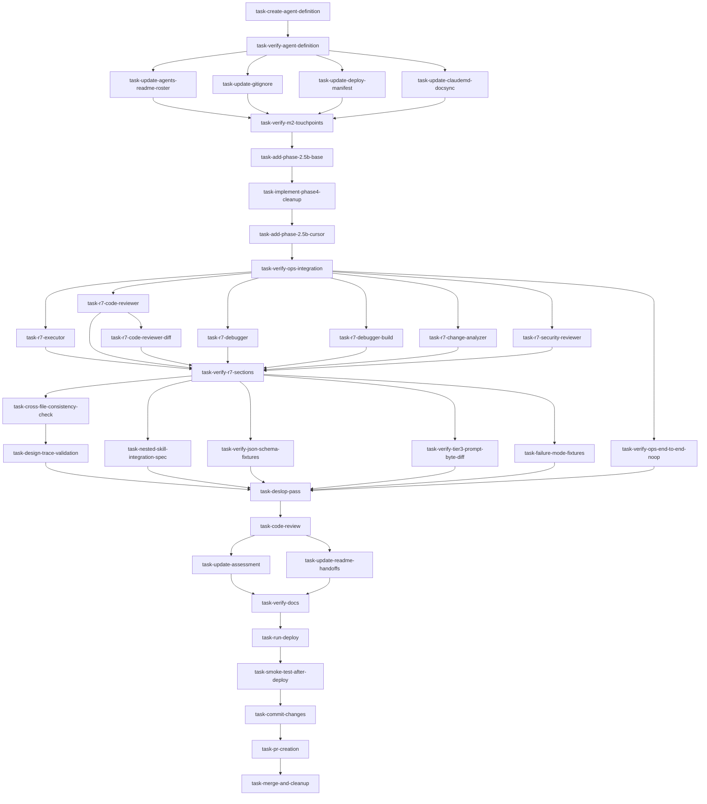

# Implementation Plan — `code-intel` Agent

## Summary

This plan breaks the work to land the `code-intel` agent into eight milestones, sequenced so the foundational *agent body* lands first and every downstream integration depends on it. The agent is a **code-intelligence layer**: it indexes the project into a SQLite-backed *symbol graph* at `.code-intel/index.sqlite` and answers structural questions (callers, dependencies, impact, implementations, execution flow) for other agents through a small, deterministic query API. The point is **prevention-first** — replace the structural guessing the executor, debugger, and code-reviewer do today with citable lookups, so an edit to `process_data` does not silently strand its callers.

The shape of v1 is deliberately boring: one new agent file (`agents/code-intel.md`), four small repo-integration touchpoints, a new `/ops` Phase 2.5b stage, seven agent definitions that gain a Code Intelligence Context section, and a verifier sweep across every agent-contract surface that changed. No new tooling channel, no new deploy script, no Cursor variant. The architect already pinned the ten design questions; this plan encodes those decisions as constraints, sequences the work to honor lane discipline, and identifies which tasks are parallel-safe so the team manager can keep the executor pool busy without stepping on shared files.

## Inputs

The executor and verifier agents should treat the following documents as binding when carrying out the tasks below:

- **Requirements doc:** `docs/plan/code-intel-agent-requirements.md` — 11 resolved dimensions (R1–R11), four hard constraints, agent contract sketch, integration touchpoints, acceptance criteria.
- **Architecture Decision Document (ADD):** `docs/plan/code-intel-agent-design.md` — resolutions for Q1–Q10, authoritative SQLite schema, six recursive-CTE templates, 17-section agent body skeleton, `/ops` Phase 2.5b integration JSON contract, tier cascade pseudocode, indexer pipeline (5 phases), 10 implementation risks.
- **Handoffs (in order):** `docs/plan/.handoffs/code-intel-agent-2026-04-26/handoff-000-plan-to-design.md`, `handoff-001-design-to-approval.md`, `handoff-002-approval-to-plan.md` — captures user approval, the path amendment (orchestrator render artifacts now at `.code-intel/runs/<run-id>/`, not `docs/code-intel/.runs/`), and the locked-in defaults for the five architect-surfaced questions.

Where this plan and an upstream doc disagree, the upstream doc wins. The plan's job is to *sequence* the work, not to override design decisions.

## Out-of-Scope (v2 deferrals)

These items are explicitly **not** part of v1, captured here so they do not silently leak into executor briefs:

- **Capability-detection cache.** Per the user's locked-in default: re-probe each dispatch in v1. Adding a `metadata.tier1_runtimes_probed_at` key with a freshness check is a v2 concern (Open Implementation Risk #10).
- **Incremental reindex (R11b option β).** Diff-aware reindex is a multi-week project on its own. v1 does a full reindex on every staleness check, bounded by R9's wall-clock caps.
- **Per-project config file** (`.code-intel/config.toml` or similar). The hardcoded excludes in Q8 cover the project layouts the user works in. v2 adds config when a real project produces a need the hardcoded list cannot cover.
- **30-day garbage collection for `.code-intel/runs/`.** Not needed in v1 — `/ops` Phase 4 cleans the run subdirectory at end-of-run, so unbounded growth cannot accumulate. Mentioned for completeness because earlier drafts considered a GC sweep.
- **Cursor variant of `agents/code-intel.md`.** Per Q9: single body, deployed to both `~/.claude/agents/` and `~/.cursor/agents/` via the existing manifest. No transform script.
- **Schema migration logic.** v1 stamps `schema_version: "1"` in `metadata`. When v2 changes the schema, the agent will *refuse-and-rebuild*. Migration logic is a v2 problem and the planner explicitly does **not** want it over-designed in v1 (Open Implementation Risk #7).
- **Worker-pool indexer (Q2 option).** Single-threaded for v1; revisit only if R9's 60s soft cap is routinely hit.
- **Tree-sitter pre-installation.** Tier-3 stays interactive-only. The agent never installs `tree-sitter` silently and never bundles grammars.
- **A `/code-intel` slash command or skill.** The agent is dispatched by `/ops` Phase 2.5b, by other agents indirectly (via the team manager), or by humans typing labeled-prose briefs. No skill scaffolding ships in v1.

---

## Milestone Hierarchy

The eight milestones below are roughly ordered by dependency, with parallel-safe sub-tasks called out in the per-milestone tables. Every code-modifying task lists the files it touches and the agent the team manager should dispatch. **Lane discipline:** source-modifying work goes to `executor`; read-only checks go to `verifier`; doc-only changes go to `documentor`; code review goes to `code-reviewer`; git operations go to `git-master`. Effort estimates are in **minutes**, deliberately honest (no padding, no shaving).

---

## Milestone M1 — Agent Definition and Infrastructure

**What this milestone does.** Build the `agents/code-intel.md` file itself — the 17-section body the ADD specifies, the SQLite schema CREATE TABLEs embedded inline, the six recursive-CTE templates, the JSON brief schema, the lane-enforcement wording, the `/ops` integration output contract, the tier cascade logic, and the five-phase indexer pipeline. This milestone is the foundation; everything in M2-M8 depends on it.

**Why it goes first.** Every later milestone references `agents/code-intel.md` — the deploy manifest needs the path, the README needs the description, the seven R7 agents reference the `code-intel` consultation pattern, and the `/ops` Phase 2.5b prose embeds the JSON in/out contract from the ADD. Until the body exists, the rest is speculative.

| # | Task ID | Subject | Stage | Agent | Files Touched | Effort (min) | Depends On |
| :-- | :-- | :-- | :-- | :-- | :-- | :-- | :-- |
| 1 | `task-create-agent-definition` | Create `agents/code-intel.md` (the 17-section body) | implement | executor | `agents/code-intel.md` (new) | 75 | — |
| 2 | `task-verify-agent-definition` | Verify agent body against ADD and requirements | verify | verifier | `agents/code-intel.md` (read-only) | 25 | task-create-agent-definition |

### Task details

#### `task-create-agent-definition`

**Description.** Author `agents/code-intel.md` end-to-end, using the **17-section skeleton** in the ADD as the structural spine. The body must inline the authoritative SQLite schema (with the three pragmas: `foreign_keys=ON`, `journal_mode=WAL`, `synchronous=NORMAL`), the six recursive-CTE templates, the JSON brief schema (strict — `additionalProperties: false`), the R8b allow-list and deny-list **verbatim**, the Q4 Tier-3 escalation prompt copy **verbatim**, the Q3 per-query Markdown render templates, the Q7 language-profile detection algorithm, the Q8 hardcoded excludes list, the Q10 skipped-file log format, the Q4 lookup table for `(query_type, language)` Tier-3 beneficial pairs, the `/ops` Phase 2.5b JSON output contract from the ADD's integration section, and the **orchestrator-context detection** for suppressing the Tier-3 prompt when the brief is **JSON-fenced** (per surfaced-question 5, revised by the architect's C-ADD-1 fix — the brief format itself is the authoritative caller-type signal, not any `[context]` block). Per R3, JSON-fenced briefs come exclusively from orchestrators; labeled-prose briefs come exclusively from humans — so brief-format detection cleanly separates interactive from non-interactive contexts without inventing a second contract. Frontmatter follows the existing 19-agent shape: `name: code-intel`, `model: opus`, `description` with two sentences (what + why), `tools: [Read, Glob, Grep, Bash, Write]`. Target length is 300-400 lines per the ADD's recommendation, but if the inline CTEs and templates push it to 450, that is acceptable — readability beats line-count gospel.

**Acceptance criteria.**
- Frontmatter declares exactly five tools: `Read`, `Glob`, `Grep`, `Bash`, `Write`. No others.
- All 17 sections from the ADD's skeleton are present in order, but the skeleton is a structural outline — the agent body uses Markdown `## <Section Name>` headings with names paraphrased from the skeleton entries to natural Markdown convention (addresses C-PLAN-2). Section *order* must match the skeleton exactly; section *naming* is paraphrased. Concrete examples: the skeleton's "1. YAML frontmatter" is replaced by the literal frontmatter block (no heading), "2. Brief Format" becomes `## Brief Format`, "6. Lane Boundaries" becomes `## Lane Boundaries`, "12. Tier Cascade" becomes `## Tier Cascade Logic`, and so on. Headings should read naturally to a human, not as outline labels.
- The SQLite schema block matches the ADD's authoritative schema **byte-for-byte** (the executor copies it; does not paraphrase). Pragmas included.
- All six recursive-CTE templates are inlined, parameter-bound with `?` placeholders, and labeled with their query type.
- The JSON brief schema is inlined as a fenced ```json block matching the ADD's schema. `additionalProperties: false`. All eight `query_type` enum values present (six query types plus `reindex` and `clean`). All `max_*` upper bounds match R9's hard caps.
- The Lane Boundaries section enumerates the three Write-allowed path globs (`docs/code-intel/**`, `.code-intel/**`, `_tmp_*`) and includes the refuse-and-halt language from R8a verbatim.
- The Bash Scope section reproduces R8b's allow-list and deny-list **verbatim** — no paraphrase, no generalization.
- The Tier-3 escalation prompt copy from Q4 is reproduced verbatim, including the `<T>` / `<U>` / `<V>` placeholder marks.
- The Tier-3 logic includes the orchestrator-suppression branch: when the brief is **JSON-fenced** (per R3, exclusively an orchestrator-path signal — addresses C-ADD-1), the prompt is suppressed and the agent falls through to "proceed with current data + caveat" silently. The agent body's pseudocode for `consider_tier3_escalation()` accepts a `brief_format` parameter and early-returns `False` when `brief_format == 'json-fenced'` (per ADD lines ~819–829). The agent body must not look for any `[context]` literal block, marker, or sentinel — earlier drafts proposed one but it was retracted to avoid colliding with the existing `## Context` Markdown heading in the standard `/ops` agent brief format (`skills/ops/SKILL.md:486-506`).
- The `/ops` Phase 2.5b output contract returns JSON with the seven required fields (`status`, `report_path`, `json_sidecar`, `summary`, `db_indexed_sha`, `generated_at`, `caveats`) for `output_mode: "disk"`, and substitutes `report_inline` for `output_mode: "inline"`. `output_mode: "both"` returns summary plus path inline (not duplicated full content).
- Render artifacts are written to `.code-intel/runs/<run-id>/<query>-<symbol>.md` for orchestrator dispatches and `docs/code-intel/<symbol>-<query>.md` for human `output_mode: "disk"` opt-ins. The path encodes the lifetime (per the user's path amendment).
- Output dispatch logic includes self-creation of the target directories before writing (addresses C-PLAN-5 and C-PLAN-8). The agent body's prose for the disk-write path explicitly covers `mkdir -p docs/code-intel/` and `mkdir -p .code-intel/runs/<run-id>/` as the first step of the write sequence. M2 does **not** seed these directories with `.gitkeep`; the agent self-creates on first need. Both `mkdir` invocations target paths inside the R8a glob allow-list (`docs/code-intel/**` and `.code-intel/**`) so they pass write enforcement, and the `mkdir -p` Bash invocation is permitted under R8b's allow-list (creating directories inside already-permitted Write roots is a normal filesystem operation, not an install or external call).
- Quick-reference card (the `help` task) renders cleanly and matches the agent's tone.
- File ends with no trailing whitespace and a single trailing newline.

**Risks / notes.** This is the densest single task in the plan. The ADD has done the design work — the executor's job is *transcription with care*, not invention. If a section is ambiguous, the executor should re-read the ADD section it maps to rather than guessing. The CTEs use SQLite-specific syntax (`WITH RECURSIVE`, `instr()`, `GLOB`) — do not silently rewrite to standard SQL. The Q4 prompt copy includes ASCII-only characters — preserve them; do not "improve" with em-dashes or smart quotes.

#### `task-verify-agent-definition`

**Description.** Read `agents/code-intel.md` end-to-end against `docs/plan/code-intel-agent-design.md` and `docs/plan/code-intel-agent-requirements.md`. Verify the schema matches, the CTEs are intact, the JSON schema is strict, the Bash allow-list and deny-list are verbatim, the lane phrasing includes the refuse-and-halt language, the orchestrator-context Tier-3 suppression is present, and the JSON output contract returns the right fields per `output_mode`. This is a contract verification, not a stylistic review — the verifier's job is to confirm every R1-R11 commitment and every Q1-Q10 decision lands in the file.

**Acceptance criteria.**
- Per-section pass/fail report covering all 17 ADD-skeleton sections.
- Explicit confirmation that the SQLite schema matches the ADD byte-for-byte.
- Explicit confirmation that R8b's allow-list and deny-list are verbatim.
- Explicit confirmation that the JSON brief schema rejects unknown fields (`additionalProperties: false` is present).
- **JSON brief field-name match (addresses scoper G6):** verifier greps the agent body's JSON schema definitions and the ADD's Q5 JSON schema (lines ~223–249), and confirms every field name appears identically (case-sensitive) in both — `query_type`, `symbol`, `scope`, `depth`, `output_mode`, `max_results`, `max_depth`, `max_files`, `max_wall_clock_s`. Any case-mismatch or rename is at minimum MAJOR.
- Explicit confirmation that the `.code-intel/runs/<run-id>/` path appears (not `docs/code-intel/.runs/`).
- Explicit confirmation that the orchestrator-suppression branch for Tier-3 keys on **JSON-fenced brief format** per C-ADD-1 (and that no `[context]` literal block reference survives).
- Explicit list of any deviations from the ADD with severity (CRITICAL / MAJOR / MINOR).
- Verdict: **PASS** | **REVISE** | **REJECT**. CRITICAL or MAJOR findings → REVISE. Stylistic-only findings → PASS with notes.

**Risks / notes.** Per project memory ("verify agent-contract edits"), this verifier pass is mandatory regardless of diff size — `code-intel.md` is itself an agent contract. If REVISE, return to executor with the specific findings; do not let stylistic preferences turn into churn.

**Parallel safety:** The two tasks are sequential within M1. M1 itself blocks every other milestone except M2 (which only touches infrastructure and could in principle start before M1 finishes — but for clarity we sequence it after).

---

## Milestone M2 — Repo Integration Touchpoints

**What this milestone does.** Land the four small repo-level integrations the agent needs to be discoverable and deployable: the agent roster entry, the `.gitignore` line, the deploy manifest entry, and the documentation-sync table row. None of these touches code logic — they're plumbing.

**Why it goes here.** Once `agents/code-intel.md` exists (M1), the deploy machinery and the agent roster need to know about it. These four files are independent of each other, so M2's tasks are **fully parallel-safe**: four executor agents can run simultaneously, one per file, with no shared-state collisions.

| # | Task ID | Subject | Stage | Agent | Files Touched | Effort (min) | Depends On |
| :-- | :-- | :-- | :-- | :-- | :-- | :-- | :-- |
| 1 | `task-update-agents-readme-roster` | Add `code-intel` row to `agents/README.md` roster table and dedicated section | document | documentor | `agents/README.md` | 25 | task-create-agent-definition |
| 2 | `task-update-gitignore` | Add explicit `.code-intel/` entry to `.gitignore` | implement | executor | `.gitignore` | 5 | task-create-agent-definition |
| 3 | `task-update-deploy-manifest` | Confirm `agents/code-intel.md` is picked up by the existing manifest globs | verify | verifier | `tooling/deploy-manifest.json` (read-only) | 10 | task-create-agent-definition |
| 4 | `task-update-claudemd-docsync` | Add row to Documentation Sync table in `CLAUDE.md` (and mirror) | document | documentor | `CLAUDE.md`, `.cursor/rules/documentation-sync.mdc` | 10 | task-create-agent-definition |
| 5 | `task-verify-m2-touchpoints` | Spot-check all four M2 touchpoints landed correctly | verify | verifier | All four files (read-only) | 10 | tasks 1-4 |

### Task details

#### `task-update-agents-readme-roster`

**Description.** `agents/README.md` already follows a roster pattern: a top-level table at line 7 (`## Available Agents`), per-agent dedicated sections from line 54 onward (`### Architect`, `### Planner`, etc.), a Model assignments paragraph, and Utility Agent Handoffs. Add `code-intel` to the roster table (alphabetical or grouped with code-related agents — match existing ordering), add a dedicated `### Code Intel` section explaining what it does, when it is invoked, and what consumers can expect, and add it to the Model assignments paragraph (model: `opus` per frontmatter). The description matches the agent's frontmatter: indexes the project into a SQLite-backed symbol graph and answers structural queries for other agents and orchestrators.

**Acceptance criteria.**
- New row in the roster table linking to `code-intel.md` with a one-line description that matches the agent frontmatter's description sentence.
- New `### Code Intel` (or analogous) section with: what it does, primary consumers (executor, code-reviewer, debugger), brief format (JSON for orchestrators, labeled-prose for humans), output (summary + path for `/ops` dispatches; full inline for humans).
- `code-intel` listed in the Model assignments paragraph alongside the other `opus` agents.
- Cross-references to `/ops` Phase 2.5b in any section that mentions invocation paths.

**Risks / notes.** Documentor is the right lane — this is a doc edit, not an agent-contract edit. Keep the tone consistent with the existing roster; do not invent a new template.

#### `task-update-gitignore`

**Description.** Add `.code-intel/` as an explicit `.gitignore` line. The existing `**/.*/` pattern at line 1 already matches hidden directories, so `.code-intel/` is **already** ignored implicitly. The explicit entry is a *documentation* gesture — a developer reading `.gitignore` should not have to know that `.code-intel` happens to start with a dot to understand it is gitignored. Place the new line near the existing `.ops-state/` entry (line 6) since they are sibling state directories.

**Acceptance criteria.**
- `.code-intel/` appears as an explicit line in `.gitignore`.
- No accidental change to existing patterns or exceptions.
- Verify with `git check-ignore -v .code-intel/` that the new explicit pattern matches.

**Risks / notes.** Tiny task. Executor lane because `.gitignore` is a config file, not docs.

#### `task-update-deploy-manifest`

**Description.** The existing `tooling/deploy-manifest.json` deploys `agents/*.md` (excluding `README.md`) to `~/.claude/agents/`, the WSL mirror, and `~/.cursor/agents/`. `agents/code-intel.md` is a `*.md` file, not `README.md`, so it should be picked up automatically by the existing globs in all three channels. **No edit is needed unless the verifier finds the manifest fails to pick the file up.**

**Acceptance criteria.**
- Verifier confirms `agents/code-intel.md` matches the `agents.include: ["*.md"]` glob in all three deploy channels.
- Verifier confirms it does **not** match the `exclude: ["README.md"]` filter.
- Verifier greps `tooling/deploy.ps1` for the manifest-glob handling logic (the include/exclude-pattern matching code) and confirms `agents/code-intel.md` would be picked up by a real deploy run — not just by a paper read of the manifest (addresses C-PLAN-7). The check is a code-trace, not a dry-run execution.
- If the manifest needs an explicit edit, the task is reclassified as `implement` and re-dispatched to executor.

**Risks / notes.** Project-memory note: "Edit project files, not global installs" — the verifier confirms the *project* manifest, not the user's `~/.claude/`. Deploy itself happens in M8.

#### `task-update-claudemd-docsync`

**Description.** `CLAUDE.md` (project root) has a Documentation Sync table mapping doc paths to the code/config they describe. Add a row for `agents/code-intel.md` mapping to whichever code/config files are the canonical inputs (the agent body itself + the `/ops` SKILL.md Phase 2.5b prose + the deploy manifest). The doc-sync table mirror lives at `.cursor/rules/documentation-sync.mdc` — this task touches both files.

**Acceptance criteria.**
- New row in `CLAUDE.md` Documentation Sync table for `agents/code-intel.md`.
- Mirror row added to `.cursor/rules/documentation-sync.mdc`.
- Both rows phrased consistently with the existing rows in each table.

**Risks / notes.** The mirror is a known maintenance hazard (called out in CLAUDE.md itself). The documentor agent must update *both* files in this task, not just one.

#### `task-verify-m2-touchpoints`

**Description.** Read all four touchpoint files and confirm the M2 edits landed correctly, including the doc-sync mirror consistency.

**Acceptance criteria.**
- One-page report covering all four files with PASS/FAIL per file.
- Specific check: the doc-sync mirror is consistent (same row content in both files).
- Verdict: **PASS** | **REVISE** | **REJECT**.

**Parallel safety within M2:** Tasks 1-4 are fully parallel-safe. Task 5 is the join — runs after all four complete.

---

## Milestone M3 — `/ops` Skill Integration (Phase 2.5b)

**What this milestone does.** Wire `code-intel` into the `/ops` orchestrator skill. Three pieces of content land in `skills/ops/SKILL.md` (and its mirror `skills/ops/SKILL.cursor.md`): a row in the Agent Assignment Rules table, a row in the lane-boundary table, and a new **Phase 2.5b** stage between Phase 2 (task board) and Phase 3 (dispatch loop). The Phase 2.5b prose embeds the predicate `(ii) OR (iv)`, the flags `--code-intel` / `--code-intel=off` / `--code-intel=always`, the JSON dispatch contract from the ADD's integration section, the orchestrator-context Tier-3 suppression rule, and the dispatch-log entry format.

**Why it goes here.** The `/ops` integration cannot happen until M1 has produced the agent body (because the JSON contract embeds shapes the agent body specifies) and M2 has registered the agent in the roster (because the dispatch loop reads the roster to look up the agent's model). Within M3, the SKILL.md edits are **sequential** — they all touch the same file, so two executors editing it in parallel would race.

| # | Task ID | Subject | Stage | Agent | Files Touched | Effort (min) | Depends On |
| :-- | :-- | :-- | :-- | :-- | :-- | :-- | :-- |
| 1 | `task-add-phase-2.5b-base` | Add Phase 2.5b stage, Agent Assignment Rules row, lane-boundary row to `skills/ops/SKILL.md` | implement | executor | `skills/ops/SKILL.md` | 50 | task-verify-agent-definition |
| 2 | `task-implement-phase4-cleanup` | Edit Phase 4 step 9 in `skills/ops/SKILL.md` to add cleanup of `.code-intel/runs/<run-id>/` (addresses scoper G8) | implement | executor | `skills/ops/SKILL.md` | 15 | task-add-phase-2.5b-base |
| 3 | `task-add-phase-2.5b-cursor` | Mirror Phase 2.5b additions and Phase 4 cleanup edit in `skills/ops/SKILL.cursor.md` | implement | executor | `skills/ops/SKILL.cursor.md` | 25 | task-implement-phase4-cleanup |
| 4 | `task-verify-ops-integration` | Verify Phase 2.5b prose, predicate, flags, JSON contract, suppression rule, and Phase 4 cleanup edit | verify | verifier | `skills/ops/SKILL.md`, `skills/ops/SKILL.cursor.md` (read-only) | 25 | tasks 1-3 |

### Task details

#### `task-add-phase-2.5b-base`

**Description.** Edit `skills/ops/SKILL.md` (838 lines) in three places:

1. **Agent Assignment Rules table** (around line 266): add a row for `code-intel`. Trigger: tasks whose brief contains a risk keyword (`refactor`, `rename`, `delete`, `breaking change`, `migrate`, `deprecate`, `extract`, `move`) or that touch multiple files. The row is *informational* — code-intel is not assigned to *tasks* the way executor or verifier is; it is dispatched as a Phase 2.5b preflight per code-modifying task. The row exists so the table is complete for readers reasoning about the assignment surface.
2. **Lane-boundary table** (find via grep): add a row for `code-intel`. Lane: read-only on source code; Write only to `docs/code-intel/**`, `.code-intel/**`, `_tmp_*`; refuse-and-halt on first violation per R8a; Bash constrained per R8b allow/deny lists.
3. **New Phase 2.5b section** between Phase 2 (task board) and Phase 2.5 (preflight, around line 338). The section should include:
   - **Trigger predicate**: `(ii) OR (iv)` — multi-file scope (`files_touched > 1`) **OR** brief contains a risk keyword from the list above.
   - **Flags**: `--code-intel` (alias for `--code-intel=always`, fires every code-modifying task), `--code-intel=off` (disables Phase 2.5b for the run).
   - **Dispatch contract**: the JSON brief shape from the ADD's "What the team manager passes in" section (literal copy with the seven field names).
   - **Run context**: per the architect's C-ADD-1 fix, run-scoped context (`run_id`, `files_touched`, `predicate_match`, `executor_brief_excerpt`) lives in the standard `## Context` Markdown section of the `/ops` agent brief (per `skills/ops/SKILL.md:486-506`), **not** in any `[context]` literal block. The agent reads the JSON-fenced query brief programmatically and reads the `## Context` Markdown for human-readable error messages only — it does not act on the Markdown programmatically. **Tier-3 suppression triggers on the brief format itself** (a JSON-fenced brief signals an orchestrator caller per R3, so suppress), not on any sentinel inside the brief.
   - **Output contract**: the JSON response shape with the seven fields (`status`, `report_path`, `json_sidecar`, `summary`, `db_indexed_sha`, `generated_at`, `caveats`) and the per-`output_mode` variations.
   - **Refusal handling**: refusal does not block the executor; team manager records in dispatch log, attaches refusal reason to executor's brief, proceeds. Phase 2.5b is *advisory*.
   - **Attaching to executor brief**: `Code Intelligence Context:` line with `report_path`, summary, caveats.
   - **Cleanup pointer**: Phase 4 cleans `.code-intel/runs/<run-id>/` (ephemeral). Persistent infrastructure (`.code-intel/index.sqlite` + sidecars) is **not** Phase 4 cleaned per R11c.

**Acceptance criteria.**
- New row in Agent Assignment Rules table for `code-intel`.
- New row in lane-boundary table for `code-intel`.
- New Phase 2.5b section physically located between Phase 2 and Phase 2.5 in the document order.
- Phase 2.5b text includes: predicate `(ii) OR (iv)`, the eight risk keywords listed, the three flags, the JSON in-brief shape (no `[context]` literal block per C-ADD-1 — run context lives in the standard `## Context` Markdown section), the JSON output contract with all seven fields, refusal-handling prose, executor-brief-attach prose, cleanup-pointer prose.
- **Dispatch trigger point (addresses C-PLAN-4):** the section explicitly specifies that the team manager dispatches `code-intel` during **Phase 3 Step 2 (Batch parallel work), before each code-modifying executor dispatch**. The team manager evaluates the predicate `(ii) OR (iv)` against the task's `files_touched` and brief contents at that moment; if matched, dispatches `code-intel` synchronously (waits for the report path) before composing the executor brief. Synchronous dispatch closes the door on race conditions with mid-Phase-3 work.
- **First-time index build at first dispatch (addresses scoper G10):** the section specifies that on the first Phase 2.5b dispatch when `.code-intel/index.sqlite` is absent, the agent builds the index synchronously as preflight per R11a; the indexer wall-clock counts against `max_wall_clock_s`. The team manager's wait covers both the build and the query.
- **State cache invalidation (addresses critic open Q2):** the section specifies that after `code-intel` returns from a Phase 2.5b dispatch, the team manager invalidates its state cache (read-on-next-Step-1, per `skills/ops/SKILL.md:353` nested-skill-return rule) before composing the executor brief. `code-intel` is an agent rather than a skill, so the rule does not strictly fire on its own, but because `code-intel` writes a report to disk that the executor must subsequently read, invalidation is required to keep the executor's view consistent.
- **Refusal handling (addresses critic open Q3):** the section specifies that if `code-intel` returns `status: refused` for any reason (timeout, symbol-not-found, hard-cap hit, malformed brief, lane violation, DB corruption), the team manager logs the refusal in the dispatch log (when `--dispatch-log` is set), attaches the refusal reason to the executor's brief so the executor knows the consultation was attempted but did not yield results, and proceeds. Phase 2.5b is *advisory* — refusal does not block the executor (per ADD line ~790).
- **Dispatch log entry format (addresses critic open Q4):** the section specifies that Phase 2.5b dispatches append to `docs/ops-dispatch-log.md` when the `--dispatch-log` flag is set, following the standard dispatch-log entry format (timestamp, agent name, task ID, brief excerpt, return status). When `--dispatch-log` is unset, no log entry is written; this matches the existing per-dispatch behavior in `skills/ops/SKILL.md` and `dispatch-log.md`.
- **`--code-intel=off` semantics (addresses critic open Q1):** the section clarifies that the R5 predicate already excludes non-code-modifying tasks from Phase 2.5b. `--code-intel=off` is additionally a no-op for those tasks (they would not have triggered Phase 2.5b anyway), and disables Phase 2.5b for the entire run for code-modifying tasks that would otherwise have triggered.
- **Phase 4 cleanup pointer:** the cleanup-pointer prose names `.code-intel/runs/<run-id>/` as the ephemeral artifact directory cleaned by Phase 4 step 9, analogous to `docs/plan/.handoffs/<run_id>/`. Persistent infrastructure (`.code-intel/index.sqlite` and its WAL/SHM sidecars) is **not** Phase 4 cleaned per R11c. The implementation work for the Phase 4 cleanup is captured in the separate task `task-implement-phase4-cleanup` (addresses scoper G8).
- Document still flows after the insertion — the surrounding Phase 2 to Phase 3 transitions still make sense.
- Doc-sync row in `CLAUDE.md` (already added in M2) maps to `skills/ops/SKILL.md` correctly.

**Risks / notes.** SKILL.md is dense. The executor must not paraphrase the JSON contract — copy it from the ADD's integration section literally. The risk-keyword list must match R5 verbatim (eight keywords).

#### `task-implement-phase4-cleanup`

**Description.** Edit `skills/ops/SKILL.md` Phase 4 (around line 481, the cleanup step in the run-conclusion phase) to add `.code-intel/runs/<run-id>/` to the list of run-scoped artifact directories cleaned at end-of-run (addresses scoper G8). The existing Phase 4 step 9 prose covers `_tmp_*` removal, this run's handoff subdirectory (`docs/plan/.handoffs/<run_id>/`), and this run's state file (`.ops-state/<run-id>-board.json`). The new entry is structurally analogous to the handoff-subdirectory entry: clean only **this run's** subdirectory, never the parent `.code-intel/runs/` directory or the persistent `.code-intel/index.sqlite` (per R11c, the index is persistent infrastructure that survives `/ops` runs). The edit should follow the existing prose pattern (the same sentence shape used for handoffs and state files) so a reader sees the cleanup symmetry.

**Acceptance criteria.**
- Phase 4 step 9 prose in `skills/ops/SKILL.md` explicitly names `.code-intel/runs/<run-id>/` as cleaned.
- Prose is structurally analogous to the existing handoff and state-file cleanup entries (same sentence shape).
- Prose explicitly excludes `.code-intel/index.sqlite`, `.code-intel/index.sqlite-wal`, `.code-intel/index.sqlite-shm`, and the parent `.code-intel/runs/` directory itself from cleanup (the persistent infrastructure must survive — per R11c).
- The edit is targeted (no rewrites of unrelated Phase 4 prose).
- Cross-references in the Phase 2.5b cleanup-pointer prose (added by `task-add-phase-2.5b-base`) match: both sections agree on what is cleaned and what is preserved.

**Risks / notes.** Per project memory ("Ops cleanup must be targeted"), this edit must NOT introduce a `rm -rf .code-intel/runs/` or any pattern that could nuke another run's subdirectory. The cleanup is scoped to `<run-id>/` only. The Cursor mirror edit is captured in the next task; this task only edits the base `SKILL.md`.

#### `task-add-phase-2.5b-cursor`

**Description.** `skills/ops/SKILL.cursor.md` is the Cursor-portable mirror of `SKILL.md`. The transform script (`tooling/transform-cursor-ops.ps1` / `.sh`) rewrites Claude Code-specific phrasing into Cursor-compatible phrasing, but the *semantics* of Phase 2.5b and Phase 4 cleanup are identical between the two files. Apply the same edits — the three Phase 2.5b additions (Agent Assignment Rules row, lane-boundary row, Phase 2.5b section) **plus the Phase 4 cleanup line** for `.code-intel/runs/<run-id>/` (addresses scoper G8) — to `SKILL.cursor.md`, adapting any Claude Code-specific paths or commands to their Cursor equivalents (e.g., `~/.claude/agents/` to `~/.cursor/agents/` where the surrounding text references it).

**Acceptance criteria.**
- Same three Phase 2.5b edits applied to `skills/ops/SKILL.cursor.md`.
- Phase 4 cleanup line for `.code-intel/runs/<run-id>/` added to the Cursor mirror, matching the base file (addresses scoper G8 mirror).
- Path differences correctly substituted (`~/.cursor/agents/` etc.).
- The Phase 2.5b section and Phase 4 cleanup are functionally identical between the two files (no semantic drift).

**Risks / notes.** Drift between `SKILL.md` and `SKILL.cursor.md` is a known maintenance hazard. The Cursor-portability guide (`docs/portability-guide.md`) covers this pattern. If the executor is unsure whether a difference is semantic or cosmetic, defer to the existing pattern in adjacent sections.

#### `task-verify-ops-integration`

**Description.** Read both files and confirm the four edits landed correctly (three Phase 2.5b edits plus the Phase 4 cleanup line), the predicate and flags match R5 verbatim, the JSON contract matches the ADD, the suppression rule references brief-format detection (JSON-fenced) per C-ADD-1 (not the obsolete `[context]` block), and the cursor mirror is functionally identical to the base.

**Acceptance criteria.**
- PASS/FAIL per edit per file (eight checkpoints — four edits times two files).
- Specific check: the JSON output contract field names match the ADD byte-for-byte.
- Specific check: the predicate `(ii) OR (iv)` and the eight risk keywords match R5 verbatim.
- Specific check (addresses C-ADD-1 propagation): the suppression rule keys on **JSON-fenced brief format**, not on a `[context]` block. The obsolete `[context]` literal must not appear in either SKILL file's Phase 2.5b prose.
- Specific check (addresses scoper G8): Phase 4 step 9 prose explicitly names `.code-intel/runs/<run-id>/` as cleaned and explicitly preserves `.code-intel/index.sqlite` plus its WAL/SHM sidecars.
- Specific check: cursor mirror is semantically identical (path substitutions accepted; semantic drift flagged).
- Verdict: **PASS** | **REVISE** | **REJECT**.

**Risks / notes.** Per project memory ("verify agent-contract edits"), this is mandatory — Phase 2.5b is an agent-contract surface (it tells the team manager when and how to dispatch `code-intel`).

**Parallel safety within M3:** Tasks 1, 2, and 3 must run sequentially (Phase 4 cleanup edit follows the base Phase 2.5b edit, and the Cursor mirror follows both because it mirrors all SKILL.md changes). Task 4 (verify) joins after all three implement-tasks complete.

---

## Milestone M4 — Cross-Agent Code Intelligence Context Sections (R7)

**What this milestone does.** Add a "Code Intelligence Context" section to each of the seven R7 agent definitions. The section explains: (1) when the consumer should expect a `Code Intelligence Context:` line in its brief, (2) how to read the linked report, (3) how to interpret the precision caveats, (4) what to do when the report says `status: refused` (proceed without it). The section does **not** invoke `code-intel` directly — that is the team manager's job. The R7 agents are *consumers*, not callers.

**Why it goes here.** Each of the seven sections is independent (different files, no shared content), so the seven tasks are **fully parallel-safe**. They depend on M1 (the agent body specifies the report shape) and M3 (the SKILL.md prose specifies the brief-attach format), but not on each other. The team manager can dispatch up to seven executors in parallel here — one of the easier wins for wall-clock compression.

| # | Task ID | Subject | Stage | Agent | Files Touched | Effort (min) | Depends On |
| :-- | :-- | :-- | :-- | :-- | :-- | :-- | :-- |
| 1 | `task-r7-executor` | Add Code Intelligence Context to `agents/executor.md` | implement | executor | `agents/executor.md` | 20 | task-verify-ops-integration |
| 2 | `task-r7-code-reviewer` | Add Code Intelligence Context to `agents/code-reviewer.md` | implement | executor | `agents/code-reviewer.md` | 20 | task-verify-ops-integration |
| 3 | `task-r7-code-reviewer-diff` | Add Code Intelligence Context to `agents/code-reviewer-diff.md` (copy-then-rename from code-reviewer.md per surfaced-question 4 to enforce byte-equivalence — addresses C-PLAN-3) | implement | executor | `agents/code-reviewer-diff.md` | 15 | task-r7-code-reviewer |
| 4 | `task-r7-debugger` | Add Code Intelligence Context to `agents/debugger.md` | implement | executor | `agents/debugger.md` | 20 | task-verify-ops-integration |
| 5 | `task-r7-debugger-build` | Add Code Intelligence Context to `agents/debugger-build.md` | implement | executor | `agents/debugger-build.md` | 20 | task-verify-ops-integration |
| 6 | `task-r7-change-analyzer` | Add Code Intelligence Context to `agents/change-analyzer.md` | implement | executor | `agents/change-analyzer.md` | 20 | task-verify-ops-integration |
| 7 | `task-r7-security-reviewer` | Add Code Intelligence Context to `agents/security-reviewer.md` | implement | executor | `agents/security-reviewer.md` | 20 | task-verify-ops-integration |
| 8 | `task-verify-r7-sections` | Verify all seven R7 sections are present, consistent, and lane-correct | verify | verifier | All seven agent files (read-only) | 25 | tasks 1-7 |

### Task details

Each of tasks 1-7 follows the same structure, with content tailored to the consumer's role. The shared shape:

**Description (template).** Add a `## Code Intelligence Context` section (around the agent's mid-body, after lane boundaries and before constraints). The section explains:

- **When the consumer receives one.** The team manager attaches a `Code Intelligence Context:` line to the executor's brief during `/ops` Phase 2.5b dispatch (per the predicate in R5). For `code-reviewer`, `debugger`, etc., the section explains *if* and *when* the team manager would attach an analogous line during their respective stages (e.g., `code-reviewer` may receive an impact-analysis pointer during diff-scope verification).
- **How to read the report.** The path follows `.code-intel/runs/<run-id>/<query>-<symbol>.md`. The report has a header with `db_indexed_sha`, `generated_at`, `precision`, and a query-specific body (table or tree). The footer carries Tier-2 caveats and truncation notes.
- **Precision caveats.** A `~` glyph next to a citation marks Tier-2 (regex) precision. The consumer treats those rows as *suggestive*, not authoritative — the user should confirm before destructive action.
- **Refusal handling.** If the brief says the consultation was attempted but refused (symbol not found, hard cap hit, malformed brief), the consumer proceeds *without* the context, calling out the absence in any user-facing summary. Refusal is not a blocker.
- **The consumer does not invoke `code-intel` directly.** That is the team manager's job. The consumer only consumes.

**Per-agent customization** (what differs across the seven):

| Agent | What its CIC section emphasizes |
| :--- | :--- |
| `executor` | Pre-edit impact surfacing (R1-A). The keystone consumer. Read the `impact_analysis` report *before* the first `Edit` operation. Direct callers and test exposure are the highest-signal sections. |
| `code-reviewer` | Diff-scope verification (R1-C). After staging a diff, the team manager may attach an impact-analysis pointer; the reviewer cross-checks that the diff touches what it claims to and surfaces collateral effects. |
| `code-reviewer-diff` | **Identical content to `code-reviewer`** per the user's locked-in default for surfaced-question 4. The two reviewers consume the same kind of report; the only operational difference is which is invoked, not how the report is read. **Authoring discipline (addresses C-PLAN-3):** the executor for `task-r7-code-reviewer-diff` reads the rendered Code Intelligence Context section from `agents/code-reviewer.md` (the immediate predecessor task's output) and **copies-then-renames** the self-references (e.g., `s/code-reviewer/code-reviewer-diff/g` where appropriate). The executor must not re-author the section from scratch — that would risk stylistic drift and break the byte-equivalence verifier check. |
| `debugger` | Call-chain tracing (R1-B). When investigating a bug, the team manager may attach an `execution_flow` or `find_callers` report rooted at the symptomatic symbol. |
| `debugger-build` | Build-time symbol-resolution failures. The team manager may attach a `find_definition` or `find_dependencies` report when the build error is symbol-shaped (e.g., `ImportError`, `cannot find symbol`). |
| `change-analyzer` | Cross-cutting structural impact assessment. Useful when the analyzer is asked to predict blast radius for a proposed change. The team manager attaches the impact_analysis report as background. |
| `security-reviewer` | Reachability of vulnerable symbols. When a CVE flags a function, the reviewer needs to know whether project code reaches it. `find_callers` rooted at the vulnerable symbol is the relevant query. |

**Acceptance criteria (per task).**
- A `## Code Intelligence Context` section is present in the file.
- The section includes the four bullets above (when, how to read, precision, refusal handling) plus the per-agent emphasis.
- The section explicitly states the agent does **not** invoke `code-intel` directly.
- The phrasing is consistent with the agent's existing tone.
- For `task-r7-code-reviewer-diff`: the section content is identical (modulo the agent's own name) to the section added to `code-reviewer.md`.

**Acceptance criteria (task-verify-r7-sections).**
- Verifier reads all seven files.
- Confirms each has the `## Code Intelligence Context` section.
- Confirms `code-reviewer.md` and `code-reviewer-diff.md` have identical CIC sections.
- Confirms each section explicitly disclaims direct invocation.
- Verdict: **PASS** | **REVISE** | **REJECT** with per-file notes.

**Risks / notes (M4).** Six of the seven implement-tasks are parallel-safe — different files, no shared state. The seventh (`task-r7-code-reviewer-diff`) is **serialized after** `task-r7-code-reviewer` per C-PLAN-3 to enforce byte-equivalence; parallelizing the two would risk stylistic drift between the rendered sections. The serialization costs ~20 minutes of wall-clock relative to a hypothetical seven-way run but eliminates the byte-equivalence verifier loop risk (per scoper §6 codebase-specific risk #1). The verifier task `task-verify-r7-sections` checks for byte-equivalence (modulo agent self-references). Per project memory ("verify agent-contract edits"), this verifier sweep is mandatory — these are seven agent contracts.

---

## Milestone M5 — Verification Sweep

**What this milestone does.** A dedicated verifier milestone covering integration-level checks that span multiple files. The per-milestone verifier tasks (in M1, M2, M3, M4) cover *that milestone's* surface; M5 covers cross-cutting concerns: lane-enforcement language is consistent between `agents/code-intel.md` and `skills/ops/SKILL.md`'s lane-boundary row; the JSON brief schema in the agent body matches the JSON shape in the SKILL.md Phase 2.5b dispatch contract; the brief-format detection (JSON-fenced vs labeled-prose) is consistent between the two files; the orchestrator-context Tier-3 suppression keys on **JSON-fenced brief format** per R3 and the architect's C-ADD-1 fix (and no obsolete `[context]` literal block reference survives in either file); and the path `.code-intel/runs/<run-id>/` (not `docs/code-intel/.runs/`) is used everywhere. M5 also produces the **nested-skill integration test spec** specified in surfaced-question 3 (ralph-loop to ops to code-intel), and now includes four additional verifier tasks added during the revision pass — JSON schema fixture walkthrough (G1), Tier-3 prompt byte-diff (G4), failure-mode fixture walkthrough (C-FAILURE-1), and end-to-end `/ops` no-op check (C-PLAN-1).

**Why it goes here.** All earlier milestones have their own verifier tasks for *intra*-milestone correctness. M5 is for *inter*-milestone consistency — the kind of drift that any single verifier would not catch because each one has a partial view.

| # | Task ID | Subject | Stage | Agent | Files Touched | Effort (min) | Depends On |
| :-- | :-- | :-- | :-- | :-- | :-- | :-- | :-- |
| 1 | `task-cross-file-consistency-check` | Verify lane phrasing, JSON shapes, path references are consistent across all changed files | verify | verifier | All M1-M4 changed files (read-only) | 35 | task-verify-r7-sections |
| 2 | `task-design-trace-validation` | Trace every R1-R11 commitment and Q1-Q10 decision back to a concrete artifact | verify | verifier | All changed files (read-only) | 30 | task-cross-file-consistency-check |
| 3 | `task-nested-skill-integration-spec` | Document a ralph-loop to ops to code-intel integration test (no execution; spec-only for v1) | document | documentor | `docs/code-intel/integration-test.md` (new) | 25 | task-verify-r7-sections |
| 4 | `task-verify-json-schema-fixtures` | Walk 3-5 mock JSON briefs through the agent body's `## Brief Format` prose and confirm refusal posture (addresses scoper G1 / C-PLAN-6) | verify | verifier | `agents/code-intel.md` (read-only) | 20 | task-verify-r7-sections |
| 5 | `task-verify-tier3-prompt-byte-diff` | Byte-compare the Tier-3 escalation prompt prose in the agent body against ADD Q4 (lines ~184-201) (addresses scoper G4 / C-PLAN-6) | verify | verifier | `agents/code-intel.md`, `docs/plan/code-intel-agent-design.md` (read-only) | 10 | task-verify-r7-sections |
| 6 | `task-failure-mode-fixtures` | Walk all 13 R10 failure-matrix rows through mock briefs / DB states and confirm the agent body's prose matches the matrix (addresses C-FAILURE-1) | verify | verifier | `agents/code-intel.md`, `docs/plan/code-intel-agent-requirements.md` (read-only); writes `docs/code-intel/failure-mode-walkthrough.md` | 35 | task-verify-r7-sections |
| 7 | `task-verify-ops-end-to-end-noop` | Dispatch a trivial `/ops` run (single-file doc edit, no risk keywords) and confirm Phase 2.5b is skipped per the predicate and the run completes through Phase 4 (addresses C-PLAN-1) | verify | verifier | `skills/ops/SKILL.md` (read-only); dispatches a synthetic single-task `/ops` invocation | 25 | task-verify-ops-integration |

### Task details

#### `task-cross-file-consistency-check`

**Description.** Read every file changed in M1-M4 in a single pass and check for cross-file consistency. Concrete checks:

- The Write-allowed paths in `agents/code-intel.md` Lane Boundaries section (`docs/code-intel/**`, `.code-intel/**`, `_tmp_*`) match the lane-boundary row in `skills/ops/SKILL.md` byte-for-byte.
- The JSON brief schema in `agents/code-intel.md` matches the JSON dispatch contract in `skills/ops/SKILL.md` Phase 2.5b (same field names, same enum values, same upper bounds).
- The Tier-3 suppression heuristic in `agents/code-intel.md` keys on **JSON-fenced brief format** (per R3 and architect's C-ADD-1 fix), not on any `[context]` literal block. Cross-check that no `[context]` literal block reference survives in either `agents/code-intel.md` or `skills/ops/SKILL.md` (it is obsolete). The run-context Markdown section in SKILL.md uses the standard `## Context` heading per `skills/ops/SKILL.md:486-506` and contains the `run_id`, `files_touched`, `predicate_match`, `executor_brief_excerpt` fields as Markdown prose, not as a JSON block.
- The path `.code-intel/runs/<run-id>/` appears consistently — never `docs/code-intel/.runs/` — in `agents/code-intel.md`, `skills/ops/SKILL.md`, the seven R7 sections, and the doc-sync table.
- The R5 risk keywords (`refactor`, `rename`, `delete`, `breaking change`, `migrate`, `deprecate`, `extract`, `move`) match between the agent body and SKILL.md (eight items, same words).

**Acceptance criteria.**
- Per-check PASS/FAIL with concrete file:line citations on FAIL.
- Verdict: **PASS** | **REVISE** | **REJECT**. Any drift is at minimum MAJOR.

**Risks / notes.** This is the most important verifier task in the plan. The per-milestone verifiers cover their own surface; only this one catches the kind of drift that hides in plain sight (e.g., the agent body says `output_mode: "both"` but SKILL.md says `output: both`).

#### `task-design-trace-validation`

**Description.** For each of the 11 resolved dimensions (R1-R11) in the requirements doc and each of the 10 design questions (Q1-Q10) in the ADD, trace the commitment to a concrete artifact in the changed files. Produce a table: dimension/question to file:section to status. This is the master validation that the plan landed everything the upstream docs committed to.

**Acceptance criteria.**
- 21-row table (R1-R11 plus Q1-Q10) with file:section pointers and status per row.
- Any **MISSING** rows are CRITICAL findings.
- Any **PARTIAL** rows are MAJOR findings.
- Verdict: **PASS** | **REVISE** | **REJECT**.

**Risks / notes.** This is the contract-trace audit. If anything from the upstream docs did not land, it surfaces here.

#### `task-nested-skill-integration-spec`

**Description.** Per surfaced-question 3 (locked in as accepted): document a `ralph-loop` -> `ops` -> `code-intel` integration test. The deliverable is **a spec, not a passing test** — v1 does not include automated test infrastructure for this scenario. The spec describes: the user kicks off `/ralph-loop` with a task that involves a code refactor; ralph-loop reaches its `act` stage, which dispatches `/ops`; `/ops` reaches Phase 2.5b for the code-modifying task; the team manager dispatches `code-intel` with a JSON-fenced brief (the orchestrator-path signal per R3); the agent detects the JSON-fenced brief and suppresses Tier-3 per the architect's C-ADD-1 fix; the report writes to `.code-intel/runs/<run-id>/`; ralph-loop's `reflect` stage reads the report's path. Document the expected file paths, the JSON shapes at each handoff boundary, and the cleanup behavior of `/ops` Phase 4 against `.code-intel/runs/<run-id>/`. The spec must also enumerate the **state-cache-invalidation events** that fire when `code-intel` returns inside the Phase 2.5b dispatch (per critic finding C-ADD-5: the team manager invalidates its state cache before composing the executor brief). Place the spec at `docs/code-intel/integration-test.md` (creating the `docs/code-intel/` directory).

**Acceptance criteria.**
- New file at `docs/code-intel/integration-test.md`.
- Spec includes: invocation chain, brief shapes at each boundary, expected paths, cleanup behavior.
- Spec is **not** an automated test runner — it is a checklist humans (or a future test agent) can walk through manually.
- File creation lands cleanly (the directory `docs/code-intel/` exists after the task).

**Risks / notes.** This task creates the `docs/code-intel/` directory for the first time. It is a side benefit — proving the directory exists confirms it is a valid Write target for the agent's durable reports.

#### `task-verify-json-schema-fixtures`

**Description.** Verifier composes 3-5 mock JSON briefs and walks each one through the agent body's `## Brief Format` section to confirm the documented refusal posture matches what would happen at runtime (addresses scoper G1 / C-PLAN-6). This is a **documented walkthrough**, not an executed test. The agent body's prose is the source of truth, and the verifier's job is to confirm that prose says the right thing for each fixture. The fixture set covers, at minimum: (a) a valid brief that should be accepted, (b) a brief with an unknown field that should be refused per `additionalProperties: false`, (c) a brief with a missing required field (`query_type` or `symbol`) that should be refused, (d) a brief with malformed JSON syntax that should be refused, (e) a brief with a value that exceeds R9's hard caps (e.g., `max_files: 10000`) that should be refused per the override-cap rule.

**Acceptance criteria.**
- Verifier composes the 3-5 fixture briefs as Markdown blocks in the report.
- For each fixture, verifier cites the agent body section/line that determines its disposition and quotes the relevant prose.
- Verifier states the expected disposition (`accept` / `refuse with reason X`) and confirms the agent body prose specifies it.
- Any disposition mismatch is at minimum MAJOR (the strict-validation contract is at risk).
- Verdict: **PASS** | **REVISE** | **REJECT**.

**Risks / notes.** This is a behavioral fixture verification, not an executed test. The pattern matches `task-nested-skill-integration-spec` — produce a documented walkthrough that a human can read end-to-end. Parallel-safe with the other M5 verifier tasks because each touches `agents/code-intel.md` read-only.

#### `task-verify-tier3-prompt-byte-diff`

**Description.** Verifier reads the Tier-3 escalation prompt prose from the agent body (the section that includes the `<T>` / `<U>` / `<V>` placeholder marks and the strict-`yes` confirmation language) and **byte-compares** it against the verbatim text in ADD Q4 (lines ~184-201) (addresses scoper G4 / C-PLAN-6). The check is byte-equal modulo whitespace normalization (collapse runs of internal whitespace, trim leading/trailing whitespace per line). Any character-level deviation — em-dash drift, smart-quote substitution, paraphrase, reordered sentences — is at minimum MAJOR.

**Acceptance criteria.**
- Verifier produces a side-by-side diff (or a unified diff) between the agent body's Tier-3 prompt prose and ADD lines ~184-201.
- Verifier reports whether the byte-equivalence-modulo-whitespace check passed.
- Any deviation is enumerated with file:line citations.
- Verdict: **PASS** | **REVISE** | **REJECT**.

**Risks / notes.** Q4's strict-`yes` confirmation is the protection against accidental tree-sitter installs — the prompt copy must be precise, not paraphrased. The verifier should use a programmatic diff (e.g., `diff` or Python's `difflib`) rather than eyeballing the two blocks. Parallel-safe with other M5 read-only verifier tasks.

#### `task-failure-mode-fixtures`

**Description.** Verifier reads the R10 failure matrix in `docs/plan/code-intel-agent-requirements.md` (lines ~175-191) and the agent body's failure-handling prose. For **each of the 13 R10 rows**, verifier composes a mock brief or DB state representing the failure condition and confirms the agent body's prose specifies the correct refusal/partial/skip posture and output format (addresses C-FAILURE-1). The 13 rows cover: symbol not found, soft cap hit, hard cap hit, Tier-2 only (precision degraded), ambiguous symbol, file unreadable, Tier-1 runtime missing, DB corrupted, query timeout, brief malformed, lane violation, Bash violation, DB missing/stale. This is a **documented walkthrough**, not an executed test — same pattern as `task-verify-json-schema-fixtures` and `task-nested-skill-integration-spec`.

**Acceptance criteria.**
- Verifier produces a 13-row table (one per R10 row) with columns: failure type, mock fixture description, expected posture, agent body file:section citation, agent body prose excerpt, PASS/FAIL.
- Verifier writes the walkthrough to `docs/code-intel/failure-mode-walkthrough.md`.
- Each FAIL row is at minimum MAJOR — a documented failure mode without behavioral coverage in the agent body is exactly the kind of gap this agent exists to prevent in other code.
- Verdict: **PASS** | **REVISE** | **REJECT**.

**Risks / notes.** This is the largest of the new M5 verifier tasks. The 13 rows can be checked in any order — the verifier produces the walkthrough as a single artifact, then writes it to disk in one operation. Depends on M4 completing because the agent body must be in its post-M4 state before this walkthrough is meaningful. Parallel-safe with the other M5 read-only verifier tasks because the only write is `docs/code-intel/failure-mode-walkthrough.md` (a fresh file, no contention).

#### `task-verify-ops-end-to-end-noop`

**Description.** End-to-end regression check (addresses C-PLAN-1). Verifier dispatches a **trivial `/ops` run** that should NOT trigger Phase 2.5b under the R5 predicate — for example, a single-file documentation edit (no risk keywords, single file touched, no code modification). The verifier confirms three things: (a) Phase 2.5b is skipped for this run because the predicate `(ii) OR (iv)` does not match; (b) the run completes through Phase 4 without error; (c) the existing Phase 2 -> Phase 3 control flow is preserved (no regressions introduced by the M3 edits). The trivial run can be either a synthetic minimal `/ops` invocation that does nothing of substance (e.g., a doc-only single-line edit on a `_tmp_*` file the verifier creates and then immediately reverts), or a real but trivial doc edit elsewhere in the plan (e.g., the M7 `task-update-readme-handoffs` if it can be coordinated).

**Acceptance criteria.**
- Verifier reports the synthetic or real `/ops` invocation it dispatched.
- Verifier confirms Phase 2.5b was skipped for the run (cites the predicate evaluation: no risk keyword in the brief, single file touched).
- Verifier confirms the run completed through Phase 4 step 9 (cleanup) without error.
- Verifier confirms the run produced no `code-intel`-related artifacts (no `.code-intel/runs/<run-id>/` subdirectory, no entries in `docs/ops-dispatch-log.md` referencing `code-intel`).
- Verifier confirms the existing Phase 2 -> Phase 3 transition is intact (the M3 edits did not break the surrounding flow).
- Verdict: **PASS** | **REVISE** | **REJECT**. Any regression is CRITICAL — Phase 2.5b is on the critical path of every `/ops` run.

**Risks / notes.** This task depends on `task-verify-ops-integration` completing (M3 must be verified before this end-to-end check is meaningful). It runs in parallel with the other M5 verifier tasks because they touch different files / surfaces. Per project memory ("Ops ceremony must be proportional"), the verifier dispatches the synthetic `/ops` run directly via Bash (single-task, no task board), not as a nested orchestration ritual. Cleanup of any temporary files created by the trivial run follows the standard `_tmp_*` protocol.

---

## Milestone M6 — Code Review

**What this milestone does.** Run the standard `/ops`-default code review pipeline (deslop then code-reviewer) against the M1-M4 changes. The reviewer specifically validates: (1) the new agent body's Bash allow-list does not regress against the established R8b posture, (2) the Phase 2.5b additions to SKILL.md do not introduce regressions in the existing `/ops` flow (Phase 2 to Phase 3 still works for tasks that do not trigger Phase 2.5b), (3) the seven R7 sections are stylistically consistent with the agents' existing voices, and (4) the JSON contracts have no malformed syntax that a strict validator would reject.

**Why it goes here.** Code review happens after verification but before deploy. This is the standard `/ops` pipeline order.

| # | Task ID | Subject | Stage | Agent | Files Touched | Effort (min) | Depends On |
| :-- | :-- | :-- | :-- | :-- | :-- | :-- | :-- |
| 1 | `task-deslop-pass` | Run deslop pass on all changed files | review | (deslop skill) | All changed files | 15 | task-design-trace-validation |
| 2 | `task-code-review` | Code review pass on all changed files | review | code-reviewer | All changed files (read-only) | 40 | task-deslop-pass |

### Task details

#### `task-deslop-pass`

**Description.** Run the `/deslop` skill against the diff. Targets: redundant prose, slop in the agent body's CTE comments, repeated boilerplate across the seven R7 sections.

**Acceptance criteria.**
- Deslop report identifying any cleanup opportunities (low severity if the executor was disciplined).
- Cleanup applied if the user accepts the proposals.
- Final state: changed files free of obvious slop.
- **Byte-check protection (addresses critic open Q5):** if deslop modifies `agents/code-intel.md` (the agent body) in this run, the M5 verifier tasks that perform byte-equivalence or fixture checks against the agent body — specifically `task-verify-tier3-prompt-byte-diff` (Q4 prompt verbatim), `task-verify-json-schema-fixtures`, `task-failure-mode-fixtures`, and the relevant cross-checks in `task-cross-file-consistency-check` — must re-run before M7 begins. Alternatively, the team manager dispatches this deslop pass with a `--no-touch agents/*.md` constraint for this run (recommended), in which case no re-verification is needed. The team manager records which path was taken in the dispatch log.

**Risks / notes.** The `/deslop` skill is dispatched by `/ops` Phase 4 in normal pipeline runs; this plan invokes it as part of the review milestone consistent with that pattern.

#### `task-code-review`

**Description.** Code review on all changed files. The reviewer pays particular attention to:
- `agents/code-intel.md`: Bash allow-list correctness, JSON schema strictness, recursive CTE syntax, lane phrasing.
- `skills/ops/SKILL.md`, `skills/ops/SKILL.cursor.md`: Phase 2.5b prose readability, predicate logic correctness, JSON contract well-formedness, no regressions in the existing Phase 2 -> Phase 3 flow.
- The seven R7 agent files: tone consistency with the agent's existing voice, refusal-handling clarity, no implicit invocation paths.
- `agents/README.md`, `CLAUDE.md`, `.cursor/rules/documentation-sync.mdc`: doc consistency.

**Acceptance criteria.**
- Severity-rated findings (CRITICAL / MAJOR / MINOR).
- Verdict: **APPROVE** | **REVISE** | **REJECT**.
- CRITICAL or MAJOR findings -> REVISE (route back to executor); MINOR findings can be deferred.

**Risks / notes.** Code review is the lane that catches stylistic and semantic-but-not-broken issues that the verifier passes do not. The reviewer cannot fix issues directly (per project memory: review-type agents have no Edit/Write).

---

## Milestone M7 — Documentation

**What this milestone does.** Update any documentation that references the agent inventory or the `/ops` integration surface beyond what M2 already touched. Specifically: `docs/ASSESSMENT.md` (per CLAUDE.md doc-sync map, this file references the entire agent and skill ecosystem), and any cross-references in `agents/README.md` that need to mention `code-intel` in handoff or pipeline-position contexts.

**Why it goes here.** Documentation always lands after the code is verified and reviewed — the plan's job is to capture the *real* state of the system, not the hopeful state.

| # | Task ID | Subject | Stage | Agent | Files Touched | Effort (min) | Depends On |
| :-- | :-- | :-- | :-- | :-- | :-- | :-- | :-- |
| 1 | `task-update-assessment` | Update `docs/ASSESSMENT.md` agent inventory and changes-since-last-assessment section | document | documentor | `docs/ASSESSMENT.md` | 25 | task-code-review |
| 2 | `task-update-readme-handoffs` | If `agents/README.md` Utility Agent Handoffs or Pipeline diagram references need code-intel mentions, update | document | documentor | `agents/README.md` | 15 | task-code-review |
| 3 | `task-verify-docs` | Verify documentation updates landed and are consistent with the actual changes | verify | verifier | `docs/ASSESSMENT.md`, `agents/README.md` (read-only) | 10 | tasks 1-2 |

### Task details

#### `task-update-assessment`

**Description.** `docs/ASSESSMENT.md` is the project's running inventory and change log. Add `code-intel` to the agent inventory section (around line 12, `### Agents (agents/)`), increment the agent count from 19 to 20 wherever it appears, add a new "Changes Since Last Assessment" entry dated 2026-04-26 documenting the addition (the agent itself, the seven R7 integrations, the `/ops` Phase 2.5b stage, and the supporting touchpoints), and update any cross-reference spot-checks that were stale. Match the existing prose style (academic-but-conversational, per the project's tone preference).

**Acceptance criteria.**
- Inventory section lists `code-intel` with a one-line description.
- Agent count updated everywhere (search the file for `19 agent` or `19 agents` and replace appropriately).
- New "Changes Since Last Assessment (2026-04-26 — code-intel agent)" section with the four bullets above.
- Existing structure preserved.

**Risks / notes.** ASSESSMENT.md has a specific change-log style. The documentor follows it; does not invent a new style.

#### `task-update-readme-handoffs`

**Description.** Re-read `agents/README.md` Utility Agent Handoffs and Pipeline Position sections (around lines 330+ and 233+ respectively). If `code-intel` belongs in either — for example, as a consultation step in the pipeline — add it. If neither section needs an update (because `code-intel` is not part of the canonical pipeline; it is a sidecar invoked by `/ops`), document that finding briefly in the task closure.

**Acceptance criteria.**
- Either: README sections updated with `code-intel` mentions where appropriate.
- Or: documented closure that no update was needed.

**Risks / notes.** This task is intentionally diagnostic — the documentor reads first, decides whether to edit, and reports either way. Do not force an edit if one is not needed.

#### `task-verify-docs`

**Description.** Verifier reads ASSESSMENT.md and README.md, confirms the documentor edits landed, and confirms cross-references are consistent.

**Acceptance criteria.**
- PASS/FAIL per file.
- Verdict: **PASS** | **REVISE** | **REJECT**.

**Risks / notes.** Per project memory, doc edits are not strictly agent-contract edits, but the verifier pass keeps the pattern consistent.

---

## Milestone M8 — Deploy and Merge

**What this milestone does.** Run the deploy script to propagate `code-intel` and the supporting changes to the local Claude Code and Cursor agent directories, and then handle the git mechanics: commit on the working branch (or feature branch — `/ops` Phase 1.5 logic decides at run time), and gate the PR creation, merge, and remote-side branch cleanup behind explicit user approval.

**Why it goes here.** Deploy is the last step before the agent is usable in real workflows. Deploy itself is gated on M7 completing, because deploying without the documentation-of-record is asking for confusion later.

| # | Task ID | Subject | Stage | Agent | Files Touched | Effort (min) | Depends On |
| :-- | :-- | :-- | :-- | :-- | :-- | :-- | :-- |
| 1 | `task-run-deploy` | Run `tooling/deploy.ps1` (or `.sh` on POSIX) to propagate changes | implement | git-master | (deploy targets — `~/.claude/agents/`, `~/.cursor/agents/`, WSL mirror) | 15 | task-verify-docs |
| 2 | `task-smoke-test-after-deploy` | Dispatch a trivial `code-intel` query end-to-end against the deployed agent and confirm it answers (addresses scoper G15 / C-PLAN-6) | verify | verifier | `~/.claude/agents/code-intel.md` (read-only via deployed copy); dispatches a synthetic labeled-prose brief | 15 | task-run-deploy |
| 3 | `task-commit-changes` | Commit all changes on working branch with conventional-commits message (no trailers) | implement | git-master | git index | 10 | task-smoke-test-after-deploy |
| 4 | `task-pr-creation` | Create PR (user-gated — confirm with user before invoking `gh pr create`) | implement | git-master | git remote, GitHub | 15 | task-commit-changes |
| 5 | `task-merge-and-cleanup` | Merge to main and delete local branch (user-gated; remote-side cleanup also user-gated per project memory) | implement | git-master | git remote, local branches | 10 | task-pr-creation |

### Task details

#### `task-run-deploy`

**Description.** Dispatched to `git-master` per project memory ("Use git-master for git operations"). Runs `tooling/deploy.ps1` on Windows or `tooling/deploy.sh` on POSIX. Confirms the new `code-intel.md` lands in `~/.claude/agents/`, `~/.cursor/agents/`, and the WSL mirror. Confirms the seven R7 agent files re-deploy with their updates. Confirms the SKILL.md changes propagate to `~/.claude/skills/ops/` and `~/.cursor/skills/ops/`.

**Acceptance criteria.**
- Deploy script runs without errors.
- `~/.claude/agents/code-intel.md` exists and matches the source file.
- `~/.cursor/agents/code-intel.md` exists (transformed if necessary by the deploy script's `transform: true` setting; for v1 the transform is effectively a no-op).
- WSL mirror updated.
- Updated SKILL.md, SKILL.cursor.md propagated.
- Updated R7 agents propagated.

**Risks / notes.** Deploy is the moment of truth — if the manifest globs were wrong (M2 verifier missed something), deploy fails here. The git-master agent is the right lane for this; project memory ("No /deploy skill for this project") confirms `tooling/deploy.{ps1,sh}` is invoked directly, not through a skill.

#### `task-smoke-test-after-deploy`

**Description.** End-to-end smoke test of the deployed `code-intel` agent (addresses scoper G15 / C-PLAN-6). Verifier dispatches a trivial `code-intel` query against the deployed agent (now living at `~/.claude/agents/code-intel.md` after `task-run-deploy`) using a labeled-prose brief — for example, `Query: find_definition
Symbol: deploy_agents` or another real symbol from this repo's tooling. The smoke test confirms four things: (a) the deployed agent file is loadable (the file exists at the deploy target and matches the source), (b) the JSON brief schema parses correctly when invoked with a labeled-prose brief (no parse error on a well-formed brief), (c) the lane enforcement engages (the agent rejects an attempt to write outside the allow-list, validated by inspecting the agent body's prose), (d) a `find_definition` query against the indexed self-source-tree (this repo) returns a result. This is the **minimum confidence-building step before merge**; if anything is broken (bad CTE syntax, refused brief, missing pragma), it surfaces here rather than in the first real `/ops` run on a downstream task.

**Acceptance criteria.**
- Verifier confirms `~/.claude/agents/code-intel.md` exists post-deploy and matches the source `agents/code-intel.md` file (byte-equal or transform-equivalent).
- Verifier dispatches a trivial labeled-prose brief and reports the response (or refusal reason).
- The agent answers a `find_definition` query for a known symbol in the repo (e.g., `deploy_agents` from `tooling/deploy.ps1` or any other real symbol the verifier confirms exists) — or refuses with a specific reason that points to a fixable bug (not "agent crashed").
- Verifier confirms the index database `.code-intel/index.sqlite` is created on first dispatch (the first-time build path from R11a fires correctly).
- Verdict: **PASS** | **REVISE** | **REJECT**. Any "agent crashed" or "schema parse error" is CRITICAL — the agent should refuse cleanly, not crash.

**Risks / notes.** This task is the final check before commit. Failure here is rare (M1-M5 verifiers should have caught most issues) but the cost of a failure caught at smoke-test time is far lower than the cost of a failure caught in a real `/ops` run. Per project memory ("Ops ceremony must be proportional"), the smoke test is a single synthetic dispatch, not a nested orchestration ritual. Cleanup of `.code-intel/index.sqlite` and `.code-intel/runs/` artifacts created by the smoke test follows R11c — the index is persistent infrastructure (do NOT delete it post-smoke-test); the run subdirectory is cleaned per the standard `/ops` Phase 4 pattern (manually if dispatched outside an `/ops` run).

#### `task-commit-changes`

**Description.** Stage and commit all changes on the working branch. Commit message follows Conventional Commits — likely something like `feat(agents): add code-intel agent for project-wide symbol-graph queries` with a body summarizing the seven integration touchpoints and the new `/ops` Phase 2.5b stage. **No commit trailers** (no `Co-Authored-By`, no `Signed-off-by`) per project memory. Use `git add` with explicit file paths, not `git add -A` or `git add .`, to avoid accidentally staging local artifacts.

**Acceptance criteria.**
- All changed files staged explicitly.
- Commit message follows Conventional Commits format.
- No trailers in the commit message.
- `git status` clean after commit (or contains only intentionally unstaged files like local `.code-intel/` artifacts that should remain ignored).

**Risks / notes.** Per project memory: never include `Co-Authored-By` or any trailer. The git-master agent is dispatched with explicit instructions to omit trailers.

#### `task-pr-creation`

**Description.** **User-gated.** Before invoking `gh pr create`, the team manager pauses and asks the user explicitly: "Ready to open a PR for the code-intel agent landing? (yes/no)". On `yes`, dispatch `git-master` to push the branch (if not already pushed) and run `gh pr create` with a title and body summarizing what landed.

**Acceptance criteria.**
- User confirms with explicit `yes` before any PR action.
- PR opens against `main` with a descriptive title and body.
- PR body summarizes: the new agent, the seven R7 integrations, the `/ops` Phase 2.5b stage, the test plan (manual checklist).

**Risks / notes.** Per project memory: PR creation is user-gated. Do not invoke `gh pr create` without explicit user approval.

#### `task-merge-and-cleanup`

**Description.** **User-gated.** After PR review and approval, merge to main. Per project memory ("Post-merge branch cleanup is part of the merge"): when the user says "merge X to main" and the merge lands clean, the same git-master dispatch includes `git branch -d <branch>` for the local branch. Remote-side deletion stays user-gated (the user invokes it explicitly when they are ready).

**Acceptance criteria.**
- User confirms merge.
- Merge lands cleanly on main.
- Local feature branch deleted via `git branch -d`.
- Remote branch left intact unless user explicitly asks for `git push origin --delete <branch>`.

**Risks / notes.** Per project memory, this combined "merge + local cleanup" pattern is the established norm. Remote cleanup waits for explicit user direction.

---

## Parallel Safety Analysis

The following tasks within a milestone can run in parallel — they touch different files, share no state, and have no upstream dependencies on each other beyond the milestone entry blocker. The team manager should use this to compress wall-clock by dispatching multiple executors simultaneously.

| Milestone | Parallel-Safe Tasks | Reason |
| :--- | :--- | :--- |
| M1 | None (2 tasks, sequential) | Verify follows implement |
| M2 | Tasks 1-4 in parallel; Task 5 joins | Four different files |
| M3 | Tasks 1, 2, 3 sequential (base SKILL.md edit, then Phase 4 cleanup edit, then Cursor mirror); Task 4 joins | Single SKILL.md file means base edits cannot parallelize; cursor mirror needs the final base state |
| M4 | Tasks 1, 2, 4, 5, 6, 7 in parallel (six-way); Task 3 (`task-r7-code-reviewer-diff`) **serialized after Task 2** (`task-r7-code-reviewer`) per C-PLAN-3 to enforce byte-equivalence; Task 8 joins after all seven implement-tasks finish | Six different agent files run in parallel; the seventh (`code-reviewer-diff.md`) is content-derived from the second and must follow it. |
| M5 | Task 1 (cross-file consistency) first; Task 2 (design trace) follows Task 1; Tasks 3 (nested-skill spec), 4 (JSON fixtures), 5 (Tier-3 byte diff), 6 (failure-mode fixtures), 7 (end-to-end no-op) all run in parallel after `task-verify-r7-sections` (M4 verifier) — five-way parallelism in M5 read-only verifier work | Task 2 needs Task 1 findings; the four new verifier tasks (4-7, addresses C-PLAN-1, C-PLAN-6, C-FAILURE-1) are read-only on different surfaces and parallel-safe |
| M6 | Tasks sequential | Deslop before review |
| M7 | Tasks 1-2 in parallel; Task 3 joins | Two different files |
| M8 | Sequential (run-deploy -> smoke-test -> commit -> PR -> merge) | Each task gates the next; the new `task-smoke-test-after-deploy` is the gate between deploy and commit (addresses scoper G15) |

**Cross-milestone parallelism.** M2 could in principle start once M1 task-create-agent-definition finishes (before task-verify-agent-definition), but for cleanliness this plan blocks M2 on the verifier — the small wall-clock gain is not worth deploying against a possibly-broken agent body.

---

## Critical Path Estimate

The critical path is the longest dependency chain through the plan. Total task effort is the sum of all task minutes; critical-path effort is the wall-clock if every parallel-safe task runs concurrently.

| Metric | Minutes | Hours |
| :--- | :--- | :--- |
| Total effort (sum of all tasks, original plan) | 698 | ~11.6 |
| Total effort (after revision pass — six new tasks added) | 818 | ~13.6 |
| Critical-path effort (original plan, with full parallelization) | ~415 | ~6.9 |
| Critical-path effort (after revision — see walk below) | ~460 | ~7.7 |

**Critical-path walk** (the longest chain, post-revision):

1. task-create-agent-definition (75) -> task-verify-agent-definition (25) -> ...
2. ... -> task-add-phase-2.5b-base (50) -> task-implement-phase4-cleanup (15, addresses scoper G8) -> task-add-phase-2.5b-cursor (25) -> task-verify-ops-integration (25) -> ...
3. ... -> M4: six R7 tasks parallel + the serialized code-reviewer/code-reviewer-diff pair (addresses C-PLAN-3) — slowest single chain is 20 + 15 = 35 -> task-verify-r7-sections (25) -> ...
4. ... -> task-cross-file-consistency-check (35) -> task-design-trace-validation (30); in parallel: M5 new verifier tasks (4 fixtures: 20, 10, 35, 25 — five-way parallel after M4 verifier) — slowest of the new five-way parallel set is task-failure-mode-fixtures at 35, which runs concurrently with task-cross-file-consistency-check + task-design-trace-validation (sequential 65 min chain), so these absorb into the existing chain without extending it. The 35-min `task-failure-mode-fixtures` finishes within the 65-min cross-file + design-trace window. ...
5. ... -> task-deslop-pass (15) -> task-code-review (40) -> ...
6. ... -> task-update-assessment (25, parallel with task-update-readme-handoffs) -> task-verify-docs (10) -> ...
7. ... -> task-run-deploy (15) -> **task-smoke-test-after-deploy (15, addresses scoper G15)** -> task-commit-changes (10) -> user-gate -> task-pr-creation (15) -> user-gate -> task-merge-and-cleanup (10).

**Critical-path delta from revision pass.** Six new tasks add 120 minutes of total effort (15 + 15 + 20 + 10 + 35 + 25 = 120 min), but only ~45 minutes land on the critical path: +15 min in M3 (the new `task-implement-phase4-cleanup` is sequential between the base edit and the Cursor mirror), +15 min in M4 (the C-PLAN-3 serialization of `task-r7-code-reviewer-diff` after `task-r7-code-reviewer` adds 15 min that previously ran in parallel), and +15 min in M8 (the new `task-smoke-test-after-deploy` is sequential between deploy and commit). The four new M5 verifier tasks are parallel-safe and absorb into the existing M5 chain (the longest M5 chain — `task-cross-file-consistency-check` 35 min + `task-design-trace-validation` 30 min = 65 min — is unaffected because the four new tasks all complete in 35 minutes or less, well inside that window). Net critical-path: ~415 -> ~460 min (~7.7h).

The biggest parallelization win is M4 (seven R7 tasks ~135 minutes serial collapses to ~25 minutes wall-clock with full parallelism), saving roughly **110 minutes** of wall-clock. The next-biggest is M2 (45 minutes serial to ~25 minutes wall-clock).

**Practical note.** The critical-path estimate assumes user-gates in M8 (PR creation, merge approval) are answered immediately. Real wall-clock includes user response latency, which this plan cannot estimate.

---

## Risks Called Forward from the ADD

The ADD Open Implementation Risks section enumerates 10 risks. The table below restates each with a brief planner note on which task addresses it (or leaves it as a runtime concern).

| # | Risk (ADD title) | Addressed by | Planner note |
| :- | :-- | :-- | :-- |
| 1 | Recursive CTE depth on hub functions | task-create-agent-definition (CTE depth caps in agent body); runtime | Agent body enforces R9 hard cap on max_depth. Verifier confirms cap presence. |
| 2 | Tier-2 false positives in string literals | task-create-agent-definition (precision caveat in render templates) | The precision regex row caveat propagates through query responses. Render template includes ~ glyph. |
| 3 | tsc --noEmit slowness on large TS projects | runtime; v2 worker pool deferred | R9 60s soft cap warns; user can override via max_wall_clock_s. |
| 4 | Cross-file resolve completeness in Phase 4 | task-create-agent-definition (unresolved-edge logging in indexer pipeline section) | Indexer logs unresolved_edge to _tmp_indexer-skipped.log. Tier-1-incomplete is a footer caveat. |
| 5 | WAL sidecars on Windows | task-create-agent-definition (close connection before clean query) | Agent body clean handler closes the connection first, then deletes. |
| 6 | /ops Phase 2.5b in nested-skill scenarios | task-nested-skill-integration-spec (M5) | Integration test spec covers the ralph-loop -> ops -> code-intel chain. |
| 7 | Schema migration story for v2 | Out-of-scope (v2) | v1 stamps schema_version 1; refuse-and-rebuild on mismatch is the v1.5 story. No migration logic in v1. |
| 8 | Symbol-collision with builtin names | runtime; v2 builtin-skip option deferred | User can scope queries to avoid collisions. v2 may add a builtin filter. |
| 9 | runs/<run-id>/ cleanup policy | RESOLVED (/ops Phase 4 cleans subdirectory) | Per surfaced-question 1 default. Phase 2.5b prose in M3 documents the cleanup. |
| 10 | Capability-detection cache | Out-of-scope (v2) | Per surfaced-question 2 default. v1 re-probes each dispatch. |

---

## Open Questions for the Executor

After M1-M8 are sequenced, the following items are *not* fully specified and may surface during execution. They are minor relative to the resolutions in the upstream docs, but the executor should know they exist. **Note:** the original §1 (docs/code-intel/ directory creation) was resolved during the revision pass — the agent body now self-creates the directory on first need (addresses C-PLAN-5 / C-PLAN-8). The five-question list below has been pruned accordingly.

1. **Risk-keyword case sensitivity.** The R5 risk keywords (refactor, rename, etc.) are listed lowercase. SKILL.md Phase 2.5b should explicitly state whether the predicate match is case-insensitive (recommended — many briefs are written in mixed case). Defer to the executor to make a consistent choice in task-add-phase-2.5b-base and document the choice in the prose.

2. **Cursor agent transform behavior for code-intel.md.** The deploy manifest has transform true for the Cursor channel. For agents without Cursor-specific markup, the transform is a no-op. The executor in task-create-agent-definition should not introduce any Claude Code-specific markup (e.g., Agent tool references, `~/.claude/` paths in prose) so the no-op transform does the right thing.

3. **Effort estimates are planner judgment, not project-scoper output.** Per planner lane discipline, these minute estimates are illustrative — the project-scoper agent re-estimates during the scoping pass that follows. They are included here so the team manager can produce an order-of-magnitude task board without waiting on the scoper. The new tasks added during the revision pass (`task-implement-phase4-cleanup`, `task-verify-ops-end-to-end-noop`, `task-smoke-test-after-deploy`, `task-verify-json-schema-fixtures`, `task-verify-tier3-prompt-byte-diff`, `task-failure-mode-fixtures`) carry placeholder estimates that the scoper should re-evaluate.

4. **task-update-deploy-manifest outcome uncertainty.** The task is dispatched as verify on the assumption that the existing globs cover code-intel.md. If verification finds otherwise (the *.md glob fails, or the exclude README.md filter wrongly catches something), the task escalates to implement and re-dispatches to executor. The team manager should be prepared for this branch.

These four items are all low-risk and resolvable at execution time. None blocks the plan from being parsed into a Phase 2 task board.

---

## Dependency Graph



---

## Plan Summary Statistics

- **Milestones:** 8
- **Total tasks:** 36 (30 original + 6 added during revision pass)
- **Tasks per milestone:** M1=2, M2=5, M3=4 (was 3; +1 for `task-implement-phase4-cleanup`), M4=8, M5=7 (was 3; +4 for the four new verifier tasks), M6=2, M7=3, M8=5 (was 4; +1 for `task-smoke-test-after-deploy`)
- **Agent assignments:** executor (11; +1 for `task-implement-phase4-cleanup`), verifier (13; +5 for the four new M5 verifiers and the M8 smoke test), documentor (4), code-reviewer (1), git-master (4), deslop skill (1)
- **Total effort (planner judgment, post-revision):** ~818 minutes (~13.6 hours) — original 698 + 120 added (15+15+20+10+35+25)
- **Critical-path effort with full parallelization (post-revision):** ~460 minutes (~7.7 hours) — original 415 + ~45 added (15 from M3 cleanup serialization, 15 from C-PLAN-3 R7 serialization, 15 from M8 smoke test; the four new M5 verifier tasks absorb into the existing M5 chain via parallelism, contributing zero net to the critical path)
- **Files newly created:** `agents/code-intel.md`, `docs/code-intel/integration-test.md`, `docs/code-intel/failure-mode-walkthrough.md`
- **Files edited:** `agents/README.md`, `.gitignore`, `tooling/deploy-manifest.json` (verify-only, likely no edit), `CLAUDE.md`, `.cursor/rules/documentation-sync.mdc`, `skills/ops/SKILL.md`, `skills/ops/SKILL.cursor.md`, `agents/executor.md`, `agents/code-reviewer.md`, `agents/code-reviewer-diff.md`, `agents/debugger.md`, `agents/debugger-build.md`, `agents/change-analyzer.md`, `agents/security-reviewer.md`, `docs/ASSESSMENT.md`
- **Verifier coverage:** every milestone that touches an agent-contract surface (M1, M2, M3, M4, M5) has a dedicated verifier task. The M5 cross-file consistency check catches inter-milestone drift. The four new M5 verifier tasks (G1 fixtures, G4 byte-diff, C-FAILURE-1 failure-mode walkthrough, C-PLAN-1 end-to-end no-op) cover behavioral fixtures that the original plan checked only for *presence*. The M8 smoke test (G15) catches deploy-time regressions before commit.

---

*Plan authored 2026-04-26 by the planner agent, using the requirements doc, the ADD, and three handoff documents as binding inputs. All eleven dimensions (R1-R11) and all ten design questions (Q1-Q10) are resolved upstream; this plan sequences the work to honor lane discipline and identifies parallel-safe tasks for wall-clock compression. Plan is ready for review. Once confirmed, the project scoper can take over to analyze requirements, refine effort estimates, and produce the formal scoping document.*

---

## Revision History

- **2026-04-26 — Initial plan authored** by the planner agent, using `docs/plan/code-intel-agent-requirements.md`, `docs/plan/code-intel-agent-design.md`, and the three handoffs as binding inputs.
- **2026-04-26 — Revision pass** by the planner agent, addressing critic findings from `docs/plan/code-intel-agent-critique.md` (REVISE verdict). The architect landed C-ADD-1, C-ADD-2, C-ADD-3, and C-REQ-2 in a parallel revision pass; the planner addressed all critic findings routed to the planner lane, plus scoper-flagged CRITICAL gaps:
  - **C-PLAN-1 (CRITICAL).** Added `task-verify-ops-end-to-end-noop` to M5 — verifier confirms a trivial `/ops` run skips Phase 2.5b correctly and completes through Phase 4.
  - **C-PLAN-2 (MAJOR).** Clarified section-heading convention in `task-create-agent-definition` — the 17-section ADD skeleton is a structural outline; the agent body uses `## <Section Name>` Markdown headings paraphrased from the skeleton.
  - **C-PLAN-3 (MAJOR).** Serialized `task-r7-code-reviewer-diff` after `task-r7-code-reviewer` to enforce byte-equivalence; updated M4 parallel-safety from 7-way to 6-way + serialized pair; tightened the customization row to require copy-then-rename rather than re-authoring.
  - **C-PLAN-4 (MAJOR).** Specified Phase 2.5b dispatch trigger point in `task-add-phase-2.5b-base` acceptance: Phase 3 Step 2, before each code-modifying executor dispatch, synchronous wait. Plus state-cache invalidation, refusal handling, dispatch-log entry format, and `--code-intel=off` semantics (addresses critic open Q1-Q4).
  - **C-PLAN-5 (MAJOR).** Resolved `docs/code-intel/` directory creation policy: agent body self-creates via `mkdir -p` on first need; M2 does not seed with `.gitkeep`. Both `mkdir` paths fall under R8a glob allow-list and R8b Bash allow-list.
  - **C-PLAN-6 (MAJOR).** Added four new tasks for scoper CRITICAL gaps: `task-implement-phase4-cleanup` (G8) in M3; `task-smoke-test-after-deploy` (G15) in M8; `task-verify-json-schema-fixtures` (G1) in M5; `task-verify-tier3-prompt-byte-diff` (G4) in M5.
  - **C-PLAN-7 (MINOR).** Tightened `task-update-deploy-manifest` acceptance: verifier greps `tooling/deploy.ps1` for the manifest-glob handling logic in addition to the paper read.
  - **C-PLAN-8 (MINOR).** Resolved Open Questions §1 (`docs/code-intel/` creation) via the C-PLAN-5 fix; section pruned from five to four items.
  - **C-FAILURE-1 (CRITICAL).** Added `task-failure-mode-fixtures` to M5 — verifier walks all 13 R10 failure-matrix rows through mock briefs and confirms agent-body prose matches.
  - **Scoper G6 (MAJOR).** Added JSON brief field-name match acceptance to `task-verify-agent-definition` — verifier greps the agent body and ADD Q5 schema and confirms case-sensitive identity.
  - **Scoper G10 (MAJOR).** Resolved by C-PLAN-4 above (preflight build at first dispatch).
  - **Scoper G12 (MAJOR).** Not encoded as a plan revision — the scoper flagged this as a planner judgment about whether to split `task-create-agent-definition`. Decision: do not split. The whole point of the agent body is internal coherence; splitting authoring across multiple executors would create stylistic seams. Documented here for traceability; flagging as deferred to executor judgment if the first-pass draft genuinely is too large to land in one dispatch (in which case the executor escalates to a planner consultation, not a self-split).
  - **Critic open Q1-Q4 (MINOR).** Resolved inside `task-add-phase-2.5b-base` acceptance criteria — `--code-intel=off` no-op for non-code tasks; state-cache invalidation after `code-intel` returns; refusal handling on timeout; dispatch-log entry format.
  - **Critic open Q5 (MINOR).** Resolved inside `task-deslop-pass` acceptance — if deslop modifies `agents/code-intel.md`, the affected M5 verifier tasks re-run before M7; alternatively the deslop pass uses `--no-touch agents/*.md`.
  - **C-ADD-1 propagation.** Updated all references throughout the plan: the `[context]` block proposal is obsolete; orchestrator detection keys on JSON-fenced brief format per R3. Affected sections: `task-create-agent-definition` description and acceptance, `task-add-phase-2.5b-base` description and acceptance, `task-verify-ops-integration` description and acceptance, `task-cross-file-consistency-check` checks, `task-nested-skill-integration-spec` description.
  - **Dependency graph updated.** Mermaid graph reflects the new tasks and the M3 / M4 / M8 sequencing changes.
  - **Parallel-safety table updated.** M3 row reflects three sequential implement tasks; M4 row reflects 6-way + serialized pair; M5 row reflects five-way parallelism on the new verifier tasks; M8 row reflects the smoke-test gate.
  - **Critical-path estimate updated.** ~415 min -> ~460 min (+45 min on the critical path; +120 min total task effort).
  - All edits cite the corresponding critique ID inline (`addresses C-PLAN-N`, `addresses scoper-GN`, `addresses C-FAILURE-1`, `addresses critic open QN`) so future readers can trace the change. No restructuring of the plan; only targeted edits and new task additions. Plan ready for re-scoping by the project-scoper to refine estimates for the affected sections.
