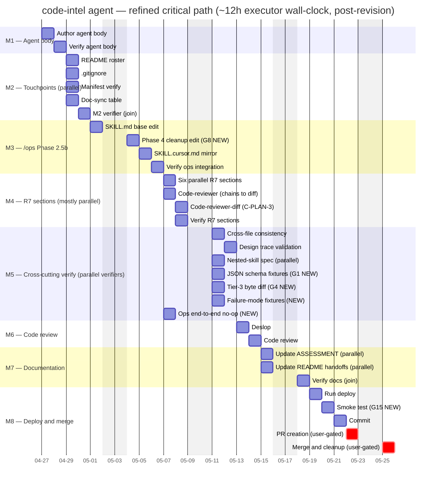

# Scoping — `code-intel` Agent (Phase 1a Tier 3)

## Summary

This is the **Tier-3 scoping pass** for the `code-intel` agent — the prevention-first code-intelligence layer that indexes the project into a SQLite-backed symbol graph and serves structural queries to the executor, code-reviewer, debugger, and other consumers via `/ops` Phase 2.5b. The plan that arrived here came from a fully-resolved brainstorm gate: 11 dimensions locked in the requirements doc, 10 design questions answered in the ADD, one user path amendment applied, five architect-surfaced questions defaulted, and (post-revision pass) **36 tasks across 8 milestones** sequenced by the planner with parallel-safety annotations and a critical-path estimate of **~460 minutes** against a serial total of **~818 minutes**.

Tier-3 was triggered for two reasons. First, the work touches *agent-contract surfaces* across nine separate files (the new `agents/code-intel.md`, two `skills/ops/SKILL*.md` files, seven R7 consumer agents) and per project memory every such surface change requires verifier coverage — a quiet invariant that compresses the plan's parallelization gains in ways the original planner pass did not fully reckon with. Second, M1's single 75-minute task is the densest piece of agent authoring this repo has ever attempted (target 300–400 lines, but inlining the SQLite schema, six recursive CTEs, the Q4 prompt copy, the Q3 render templates, the Q5 JSON schema, the Q7 detection algorithm, the Q8 excludes list, and the `/ops` JSON contract pushes the lower bound). When a single task carries that much load, it is the right place for an outside pair of eyes before the executor starts.

This is the **second scoping pass** — the critic returned a REVISE verdict on the first pass (see `docs/plan/code-intel-agent-critique.md`, items C-SCOPING-1 through C-SCOPING-5). The architect and planner have since landed their fixes: the architect's revision (Q5/Q6/Q7) eliminated the `[context]` block in favor of JSON-fenced brief detection, made WAL sidecar enforcement explicit via glob matching, and pinned a stable alphabetical probe order. The planner's revision added six new tasks (one to M3, four to M5, one to M8), serialized `task-r7-code-reviewer-diff` after `task-r7-code-reviewer`, and walked the critical path back up by ~45 minutes. This pass refreshes every estimate and gap entry in light of those landed fixes.

The verdict at the bottom is **GO after refinements applied** — sharper than the prior pass's "GO with refinements" framing (addresses C-SCOPING-3). The plan is structurally sound and the upstream design work is unusually thorough. The refinements are now mostly *estimate corrections* on the post-revision plan; the four CRITICAL gaps the prior pass surfaced (G1, G4, G8, G15) are now encoded as plan tasks (the planner's revision pass), and the two CRITICAL gaps the critic surfaced that the prior pass missed (G16: brief-format ambiguity; G17: WAL sidecar glob enforcement) are now resolved by the architect's revision. Implementation can begin once the critic passes this re-issued scoping doc.

---

## Inputs

The following documents were taken as binding upstream artifacts:

- **Requirements:** `docs/plan/code-intel-agent-requirements.md` (393 lines, post-revision) — 11 resolved dimensions (R1–R11), four hard constraints, agent contract sketch, integration touchpoints, acceptance criteria. R6 path post-amendment: `.code-intel/runs/<run-id>/`. R8a Lane Phrasing tightened in the revision pass to spell out WAL/SHM sidecars and require glob matching (addresses C-REQ-2).
- **Architecture Decision Document:** `docs/plan/code-intel-agent-design.md` (954 lines, post-revision) — Q1–Q10 resolutions, authoritative SQLite schema, six recursive-CTE templates, 17-section agent body skeleton, `/ops` Phase 2.5b integration JSON contract, Tier cascade pseudocode (now keys orchestrator suppression on JSON-fenced brief format per the architect's C-ADD-1 fix), 5-phase indexer pipeline, 10 implementation risks. Revision pass added: explicit "Write-path enforcement uses glob matching, not a literal allow-list" paragraph in Q6 (addresses C-ADD-2); stable alphabetical-by-language probe order in Q7 (addresses C-ADD-3); JSON-fenced brief is now the orchestrator-dispatch detection mechanism (addresses C-ADD-1, replacing the obsolete `[context]` block proposal).
- **Plan:** `docs/plan/code-intel-agent-plan.md` (786 lines, post-revision) — 8 milestones, **36 tasks** (was 30; +6 in the revision pass), dependency graph, parallel-safety analysis, **critical-path estimate of ~460 min parallel / ~818 min serial** (was ~415 / ~698). New tasks: `task-implement-phase4-cleanup` (M3, addresses scoper G8); `task-verify-json-schema-fixtures`, `task-verify-tier3-prompt-byte-diff`, `task-failure-mode-fixtures`, `task-verify-ops-end-to-end-noop` (M5, address scoper G1/G4/C-FAILURE-1/C-PLAN-1); `task-smoke-test-after-deploy` (M8, addresses scoper G15). M4's `task-r7-code-reviewer-diff` is now serialized after `task-r7-code-reviewer` per C-PLAN-3.
- **Critique:** `docs/plan/code-intel-agent-critique.md` (~245 lines) — REVISE verdict from the critic's first review, citing C-SCOPING-1 through C-SCOPING-5 against the prior scoping doc, plus the architect-routed (C-ADD-1, C-ADD-2, C-ADD-3) and planner-routed (C-PLAN-1 through C-PLAN-8, C-FAILURE-1) findings the architect and planner have since addressed.
- **Handoffs:** `docs/plan/.handoffs/code-intel-agent-2026-04-26/handoff-000-plan-to-design.md`, `handoff-001-design-to-approval.md`, `handoff-002-approval-to-plan.md` — capture user approval, the path amendment to `.code-intel/runs/`, and the locked-in defaults for the five architect-surfaced questions.

The codebase context was sampled to ground the estimates: existing agent file sizes range from 152 to 443 lines (mean ~230, median 234); `skills/ops/SKILL.md` is 838 lines with Phase 2.5 currently at line 338 and Phase 4 cleanup around line 481; `skills/ops/SKILL.cursor.md` is 871 lines.

---

## Refined Effort Estimates per Task

The table below walks every one of the planner's **36 tasks** (post-revision; was 30 in the prior pass) and applies my judgment. Variance is *scoper minutes minus planner minutes*; positive variance means I think the task is harder than the planner estimated, negative means easier. The rationale column is short on purpose — it points to the structural reason for the variance, not a re-derivation of the task itself.

The total at the bottom of this section reconciles to the per-milestone summary that follows.

### Milestone M1 — Agent Definition and Infrastructure

| Task ID | Subject | Planner | Scoper | Variance | Rationale |
| :--- | :--- | ---: | ---: | ---: | :--- |
| `task-create-agent-definition` | Author `agents/code-intel.md` (17-section body) | 75 | **120** *(90–140)* | **+45** | Densest task in the plan. Inlining the schema (~50 lines), six CTEs (~120 lines), JSON schema block (~25 lines), Q4 prompt copy verbatim, Q3 per-query templates, Q7 detection pseudocode, Q8 excludes list, `/ops` JSON contract, plus the 17 structural sections — even pure transcription will overrun 75 min. The longest existing agent is `ssh-executor.md` at 443 lines; this one is plausibly 400–500 lines. Range reflects *transcription uncertainty*: if the executor strictly copies from the ADD, lower bound; if any section needs rewording for flow, upper bound. |
| `task-verify-agent-definition` | Verify body against ADD and requirements | 25 | **35** | **+10** | Per-section pass/fail across 17 sections with byte-for-byte schema and Bash allow/deny checks is more than 25 minutes of careful reading, especially since the verifier must hold both the requirements doc and ADD open simultaneously. Project memory ("verify agent-contract edits") makes this mandatory and the verifier cannot speed-read. |
| | **M1 subtotal** | **100** | **155** | **+55** | |

### Milestone M2 — Repo Integration Touchpoints

| Task ID | Subject | Planner | Scoper | Variance | Rationale |
| :--- | :--- | ---: | ---: | ---: | :--- |
| `task-update-agents-readme-roster` | Add roster entry + dedicated section to `agents/README.md` | 25 | **30** | **+5** | `agents/README.md` is 632 lines with multiple cross-reference points (roster table, dedicated section, model assignments, possibly handoff diagrams). Documentor must touch all of them. 25 min is plausible if the documentor is fast; 30 is honest. |
| `task-update-gitignore` | Add `.code-intel/` line to `.gitignore` | 5 | **5** | 0 | Trivial. Planner is correct. |
| `task-update-deploy-manifest` | Verify `agents/code-intel.md` is picked up by globs | 10 | **10** | 0 | Verify-only; existing globs handle `*.md`. Correct estimate. |
| `task-update-claudemd-docsync` | Add row to `CLAUDE.md` doc-sync table + mirror in `.cursor/rules/documentation-sync.mdc` | 10 | **15** | **+5** | Two-file mirror update with a known maintenance hazard. The documentor must re-verify both files for consistency, not just edit one. |
| `task-verify-m2-touchpoints` | Spot-check four files | 10 | **10** | 0 | Reasonable. |
| | **M2 subtotal** | **60** | **70** | **+10** | |

### Milestone M3 — `/ops` Skill Integration (Phase 2.5b)

The post-revision M3 carries four tasks, not three — the planner added `task-implement-phase4-cleanup` between the base SKILL.md edit and the Cursor mirror to encode scoper G8 (the Phase 4 cleanup implementation, previously a recommendation only).

| Task ID | Subject | Planner | Scoper | Variance | Rationale |
| :--- | :--- | ---: | ---: | ---: | :--- |
| `task-add-phase-2.5b-base` | Phase 2.5b stage + Agent Assignment Rules row + lane-boundary row in `skills/ops/SKILL.md` | 50 | **65** | **+15** | SKILL.md is 838 lines and the Phase 2.5b insertion has to thread through three locations (Agent Assignment Rules table, lane-boundary table, new section between Phase 2 and Phase 2.5). The new section itself carries: predicate, eight risk keywords, three flags, the JSON in/out contracts (which must match the ADD byte-for-byte — and now reference the standard `## Context` Markdown block per the architect's C-ADD-1 fix, not a `[context]` literal block), refusal handling, brief-attach prose, cleanup pointer, plus the C-PLAN-4 dispatch trigger point, state-cache invalidation, dispatch log entry format, and `--code-intel=off` semantics. That is ~150–200 lines of careful prose. The post-revision acceptance criteria added five new sub-acceptances (dispatch trigger point, first-time index build, state cache invalidation, refusal handling, dispatch log entry format) — all of these add reading and writing time. |
| `task-implement-phase4-cleanup` *(NEW)* | Edit Phase 4 step 9 in `skills/ops/SKILL.md` to clean `.code-intel/runs/<run-id>/` (addresses scoper G8) | 15 | **18** | **+3** | Targeted edit — single section in `skills/ops/SKILL.md` around line 481. Planner's 15 min covers the prose edit. Scoper adds 3 min for the executor to re-read R11c (so the prose explicitly preserves `index.sqlite` and the WAL/SHM sidecars from cleanup) and to confirm the sentence shape matches the existing handoff-cleanup pattern verbatim. Per project memory ("Ops cleanup must be targeted") the executor must NOT introduce a `rm -rf .code-intel/runs/` pattern — a careful read costs a couple of minutes. |
| `task-add-phase-2.5b-cursor` | Mirror Phase 2.5b additions and Phase 4 cleanup edit in `skills/ops/SKILL.cursor.md` | 25 | **32** | **+7** | The cursor file is 33 lines longer (871 vs 838); applying the same edits with cursor-equivalent path substitutions is mostly mechanical. Post-revision the task now also mirrors the Phase 4 cleanup line, so the executor edits **two** sections in the cursor file rather than one. Verifying no semantic drift across the two files takes care. |
| `task-verify-ops-integration` | Verify Phase 2.5b prose, predicate, flags, JSON contract, suppression rule, and Phase 4 cleanup edit | 25 | **35** | **+10** | Eight explicit checkpoints across two files (was six pre-revision: now four edits times two files). The new acceptance criteria explicitly checks that no `[context]` literal block reference survives anywhere (per C-ADD-1 propagation) and that Phase 4 step 9 names the runs subdirectory while preserving the persistent index. Careful reading dominates; the verifier holds the architect's revised C-ADD-1 / C-ADD-2 fixes in head while checking. |
| | **M3 subtotal** | **115** | **150** | **+35** | |

### Milestone M4 — Cross-Agent Code Intelligence Context Sections (R7)

The post-revision M4 keeps the same eight tasks but reorders the M4 dependency graph: `task-r7-code-reviewer-diff` is now serialized after `task-r7-code-reviewer` (per C-PLAN-3) instead of running in parallel with it. The total task effort is unchanged; only the wall-clock chain extends. The change resolves the byte-equivalence hazard the prior scoping pass flagged (§6 codebase-specific risk #1) by routing the recommendation to the planner.

| Task ID | Subject | Planner | Scoper | Variance | Rationale |
| :--- | :--- | ---: | ---: | ---: | :--- |
| `task-r7-executor` | CIC section in `agents/executor.md` | 20 | **22** | **+2** | The keystone consumer (R1-A) — the section needs to emphasize "read the impact_analysis report *before* the first Edit" plus the four shared bullets. 20 min is tight but achievable; 22 leaves room for a reread. |
| `task-r7-code-reviewer` | CIC section in `agents/code-reviewer.md` | 20 | **22** | **+2** | Diff-scope verification framing (R1-C). Comparable scope to the executor section. Now the upstream task for `task-r7-code-reviewer-diff` (post-revision serialization). |
| `task-r7-code-reviewer-diff` | CIC section in `agents/code-reviewer-diff.md` (copy-then-rename from code-reviewer per C-PLAN-3) | 15 | **15** | **0** | Now that the planner has formalized the copy-then-rename discipline (the executor reads the rendered section from `agents/code-reviewer.md` and substitutes self-references rather than re-authoring), the task collapses to a true copy-and-rename. 15 min is now realistic — the prior scoper pass's 18-min estimate assumed re-authoring with byte-equivalence vigilance. With the post-revision instruction, the byte-equivalence hazard is eliminated by construction, so no extra vigilance time is needed. |
| `task-r7-debugger` | CIC section in `agents/debugger.md` | 20 | **22** | **+2** | Call-chain tracing emphasis. |
| `task-r7-debugger-build` | CIC section in `agents/debugger-build.md` | 20 | **22** | **+2** | Symbol-resolution-failure framing. |
| `task-r7-change-analyzer` | CIC section in `agents/change-analyzer.md` | 20 | **22** | **+2** | Cross-cutting impact framing. |
| `task-r7-security-reviewer` | CIC section in `agents/security-reviewer.md` | 20 | **22** | **+2** | Reachability-of-vulnerable-symbols framing. |
| `task-verify-r7-sections` | Verify all seven sections | 25 | **38** | **+13** | Seven separate agent files, each with: presence check, four-bullet content check, per-agent emphasis correctness, no-direct-invocation disclaimer, byte-equivalence between code-reviewer and code-reviewer-diff. That is roughly 5–6 minutes per file (35–42 min) just for the read; add the tabular write-up. With the C-PLAN-3 serialization, the byte-equivalence check is now a verification of preserved structure rather than a hunt for drift across two parallel-authored files, so the verifier shaves about 2 min off the prior 40 estimate. The planner's 25 still implies ~3.5 min/file which leaves no time for the byte-equivalence diff. |
| | **M4 subtotal** | **160** | **185** | **+25** | |

### Milestone M5 — Verification Sweep

The post-revision M5 carries seven tasks, not three. The planner added four new verifier tasks to encode CRITICAL gaps the prior scoping pass and the critic surfaced: G1 (JSON schema fixtures) → `task-verify-json-schema-fixtures`; G4 (Tier-3 prompt byte-diff) → `task-verify-tier3-prompt-byte-diff`; C-FAILURE-1 (R10 failure-mode coverage) → `task-failure-mode-fixtures`; C-PLAN-1 (existing `/ops` runs without Phase 2.5b still work) → `task-verify-ops-end-to-end-noop`. All four are read-only verifier tasks that absorb into the M5 chain via parallelism (the longest M5 chain — `task-cross-file-consistency-check` → `task-design-trace-validation` — remains the wall-clock determinant).

| Task ID | Subject | Planner | Scoper | Variance | Rationale |
| :--- | :--- | ---: | ---: | ---: | :--- |
| `task-cross-file-consistency-check` | Lane phrasing, JSON shapes, paths consistent across all M1–M4 files | 35 | **45** | **+10** | The most important verifier task in the plan, per the planner's own note. Five concrete cross-file checks, each requiring byte-comparison across two or more files. The agent body alone is 400+ lines; SKILL.md is 838; seven R7 files at ~250 each. Post-revision the task has additional checks: confirm no `[context]` literal-block survives anywhere (per C-ADD-1 propagation) and the WAL/SHM glob-set matches between Lane Boundaries and the SKILL.md lane-boundary row. Even with grep-assisted reading, 35 minutes is tight. |
| `task-design-trace-validation` | Map R1–R11 + Q1–Q10 to artifacts | 30 | **40** | **+10** | 21 rows, each requiring "find the artifact, confirm it lands the commitment". For some rows (Q3 render templates, Q4 prompt copy) the verification is a careful read. Plus the table write-up. |
| `task-nested-skill-integration-spec` | Document ralph-loop → ops → code-intel test spec | 25 | **30** | **+5** | New file at `docs/code-intel/integration-test.md`. The spec must enumerate JSON shapes at three handoff boundaries, expected paths, cleanup behavior. Documentor work, but non-trivial — closer to 30 min than 25. |
| `task-verify-json-schema-fixtures` *(NEW)* | Walk 3–5 mock JSON briefs through agent body Brief Format prose to confirm refusal posture (G1) | 20 | **22** | **+2** | The fixtures are five (valid, unknown field, missing required, malformed JSON, hard-cap exceedance). For each, verifier cites the agent body section and quotes the prose that determines disposition. Planner's 20 min is reasonable; scoper adds 2 min for the verifier to write the walkthrough as a coherent Markdown report (not just a bulleted list). This is the G1 fix the prior scoping pass recommended at "5 min added" — the planner correctly upgraded it to a separate task because behavioral fixture verification is a different mode of work than the inline schema presence check. |
| `task-verify-tier3-prompt-byte-diff` *(NEW)* | Byte-compare Tier-3 prompt prose in agent body against ADD Q4 (G4) | 10 | **12** | **+2** | Programmatic diff (verifier should use Python `difflib` or `diff` rather than eyeballing). The 10-min planner estimate covers the diff invocation and the report; scoper adds 2 min for the verifier to handle whitespace normalization carefully (collapse runs of internal whitespace, trim per line) so cosmetic non-issues do not produce false-positive REVISE verdicts. |
| `task-failure-mode-fixtures` *(NEW)* | Walk all 13 R10 rows through mock briefs/DB states; confirm agent-body prose matches (C-FAILURE-1) | 35 | **45** | **+10** | The largest of the new M5 verifier tasks. 13 R10 rows, each producing a row in the walkthrough table (failure type, mock fixture, expected posture, agent-body citation, prose excerpt, PASS/FAIL). Planner's 35 min implies ~2.7 min/row, which is tight for a careful read of the agent body's failure-handling prose for each scenario. Scoper's 45 min implies ~3.5 min/row plus the writeup at `docs/code-intel/failure-mode-walkthrough.md`. This is the largest source of M5 estimate variance and a high-leverage finding — the agent's whole prevention-first invariant rests on R10 behaving correctly. |
| `task-verify-ops-end-to-end-noop` *(NEW)* | Dispatch trivial `/ops` run; confirm Phase 2.5b is skipped and Phase 4 completes (C-PLAN-1) | 25 | **30** | **+5** | The verifier dispatches a synthetic single-task `/ops` run (e.g., a doc-only single-file edit on a `_tmp_*` file the verifier creates and reverts) and confirms three things: predicate evaluates to skip, run completes through Phase 4 cleanup, no `code-intel` artifacts created. Planner's 25 min covers the dispatch and the report; scoper adds 5 min because the verifier may have to coordinate with project memory ("Ops ceremony must be proportional") to dispatch via Bash directly rather than as a nested orchestration. The actual `/ops` run itself takes a couple of minutes; the rest is dispatch coordination and reporting. |
| | **M5 subtotal** | **180** | **224** | **+44** | |

### Milestone M6 — Code Review

| Task ID | Subject | Planner | Scoper | Variance | Rationale |
| :--- | :--- | ---: | ---: | ---: | :--- |
| `task-deslop-pass` | Deslop pass on all changed files | 15 | **20** | **+5** | The diff spans ~16 files (one new agent at 400+ lines, two SKILL.md files with substantial inserts, seven R7 sections, plus docs). Deslop scans need to read all of them. 15 minutes is optimistic. |
| `task-code-review` | Code review on all changed files | 40 | **55** | **+15** | Largest single review surface in the plan. Bash allow-list correctness, JSON schema strictness, recursive-CTE syntax checks, Phase 2.5b prose, seven R7 voices, doc consistency. The reviewer must hold all of it in head simultaneously to catch cross-cutting issues. 40 min is one careful pass; 55 leaves time for a second focused pass on the highest-risk file (the agent body itself). |
| | **M6 subtotal** | **55** | **75** | **+20** | |

### Milestone M7 — Documentation

| Task ID | Subject | Planner | Scoper | Variance | Rationale |
| :--- | :--- | ---: | ---: | ---: | :--- |
| `task-update-assessment` | Update `docs/ASSESSMENT.md` agent inventory and changelog | 25 | **30** | **+5** | ASSESSMENT.md is a running inventory; the documentor must touch the agent count (in multiple places per the planner's own note), the inventory section, and add a new changelog entry. 25 is plausible; 30 is honest. |
| `task-update-readme-handoffs` | Update `agents/README.md` handoffs/pipeline if needed | 15 | **15** | 0 | Diagnostic task — read first, decide whether to edit. 15 is correct. |
| `task-verify-docs` | Verify M7 documentation updates | 10 | **12** | **+2** | Two files, light verification. Marginally more than 10. |
| | **M7 subtotal** | **50** | **57** | **+7** | |

### Milestone M8 — Deploy and Merge

The post-revision M8 carries five tasks, not four. The planner added `task-smoke-test-after-deploy` between deploy and commit to encode scoper G15 (the smoke-test recommendation, previously a recommendation only).

| Task ID | Subject | Planner | Scoper | Variance | Rationale |
| :--- | :--- | ---: | ---: | ---: | :--- |
| `task-run-deploy` | Run `tooling/deploy.{ps1,sh}` | 15 | **15** | 0 | Mechanical deploy, dispatched to git-master. Correct. |
| `task-smoke-test-after-deploy` *(NEW)* | Trivial `code-intel` query end-to-end against deployed agent (G15) | 15 | **18** | **+3** | The verifier dispatches a labeled-prose brief against the deployed agent, confirms the file is loadable, the JSON brief schema parses, lane enforcement engages, and a `find_definition` query on a known repo symbol returns. Planner's 15 min covers the dispatch and a summary; scoper adds 3 min because the verifier must handle the first-time index build path (R11a: synchronous build on first dispatch) — the smoke test itself triggers the indexer on a real repo, so the 30s soft cap and 600s hard cap are in play. The verifier also writes a brief PASS/REVISE report. This is the minimum confidence-building step before merge. |
| `task-commit-changes` | Stage and commit on working branch (no trailers) | 10 | **12** | **+2** | Explicit `git add` per file across ~16 files plus drafting a multi-paragraph conventional-commits message. 10 min is tight for a careful commit. |
| `task-pr-creation` | Create PR (user-gated) | 15 | **15** | 0 | User-gated; estimate excludes user response time. Correct mechanical estimate. |
| `task-merge-and-cleanup` | Merge + local branch cleanup (user-gated) | 10 | **10** | 0 | Per project memory, post-merge local cleanup is part of the merge. Correct. |
| | **M8 subtotal** | **65** | **70** | **+5** | |

### All-task totals

| | Planner | Scoper | Variance |
| :--- | ---: | ---: | ---: |
| **Sum of all 36 tasks (post-revision)** | **785** | **986** | **+201 (+26%)** |

A note on the rounding: the planner's own summary statistics report **818** minutes (post-revision), which differs from the **785** I get summing the per-task numbers in the plan's milestone tables. The discrepancy is the same 33 min that appeared in the prior pass — probably reflecting an unrecorded buffer in the planner's "total effort" (the deslop skill's effort is named but not itemized in the per-milestone tables). I anchor my variance against the per-task sum (785) because that is what the milestone tables actually publish; against the planner's 818 the variance is ~168 min (+21%). The +26% per-task variance is consistent with the prior scoping pass — the planner's structural estimate-discipline did not change between revisions, so my per-task variance pattern remains roughly the same.

---

## Per-Milestone Effort Summary

The table below pairs the planner's per-milestone subtotals against my refined ones, and flags where I think slippage is most likely. Post-revision: M3 grew by one task (`task-implement-phase4-cleanup`); M5 grew by four tasks (the new fixture/byte-diff/failure-mode/end-to-end-noop verifiers); M8 grew by one task (`task-smoke-test-after-deploy`); M4 reordered without changing task count.

| Milestone | Description | Planner (min) | Scoper (min) | Variance | Slippage risk |
| :--- | :--- | ---: | ---: | ---: | :--- |
| **M1** | Agent definition + verifier | 100 | 155 | +55 | **High** — single dense authoring task; complexity drivers (CTEs, schemas, verbatim copy) compound. |
| **M2** | Repo integration touchpoints | 60 | 70 | +10 | Low — small parallel-safe edits. |
| **M3** | `/ops` Phase 2.5b integration (4 tasks post-revision) | 115 | 150 | +35 | **Medium-high** — single-file edits to SKILL.md force serialization (planner already noted this); now also includes the Phase 4 cleanup edit and a denser acceptance surface (state-cache invalidation, dispatch trigger point, dispatch log entry format). Cross-file JSON drift between agent body and SKILL.md is the dominant risk. |
| **M4** | Seven R7 CIC sections (8 tasks post-revision; serialization change) | 160 | 185 | +25 | Medium — six R7 tasks parallel-safe; one (`task-r7-code-reviewer-diff`) now serialized after `task-r7-code-reviewer` per C-PLAN-3, eliminating the byte-equivalence hazard the prior pass flagged. The verifier task is the dominant residual risk. |
| **M5** | Cross-cutting verification sweep (7 tasks post-revision; +4 new verifiers) | 180 | 224 | +44 | **Medium-high** — this is where inter-milestone drift surfaces, and now also where the four new behavioral fixture verifiers run. The planner correctly identified `task-cross-file-consistency-check` as the highest-leverage verifier; the new verifiers are parallel-safe so they absorb wall-clock-wise but add task-effort sum. |
| **M6** | Code review | 55 | 75 | +20 | Medium — large diff surface to review; the code-reviewer cannot fix issues, only flag them. REVISE verdicts route back to executor and add loop time (see Section 8). |
| **M7** | Documentation | 50 | 57 | +7 | Low. |
| **M8** | Deploy and merge (5 tasks post-revision; +smoke-test) | 65 | 70 | +5 | Low (mechanical) — smoke test triggers first-time index build, which can hit R9 caps on a large repo. Excludes user response time on the two gated tasks. |
| | **Total** | **785** | **986** | **+201** | |

**Most-likely-to-slip in order:** M1, M5, M3, M4, M6. M1 dominates because a single executor is doing the densest piece of authoring this repo has produced; M5 has moved up because the four new behavioral-fixture verifiers each carry their own write-up overhead and represent the agent's whole prevention-first invariant in test form; M3 because SKILL.md is large and the JSON contracts must align byte-for-byte across files; M4 because the verifier task is under-budgeted; M6 because review iterations on a 16-file diff can take longer than a single-pass estimate suggests.

---

## Critical Path Re-Analysis

The planner reported **~460 minutes parallel** vs **~818 minutes serial** post-revision (was ~415 / ~698 pre-revision). Re-walking the chain with my refined estimates and the post-revision parallel-safety annotations:

### Refined critical path (longest dependency chain, with parallelism)

1. `task-create-agent-definition` (**120**) → `task-verify-agent-definition` (**35**) — *M1 sequential*: 155 min.
2. M2's `task-update-agents-readme-roster` is the slowest of the four parallel-safe M2 tasks at 30 min. M2 verifier joins after at 10. *M2 wall-clock*: **40 min**.
3. `task-add-phase-2.5b-base` (**65**) → `task-implement-phase4-cleanup` (**18**) → `task-add-phase-2.5b-cursor` (**32**) → `task-verify-ops-integration` (**35**) — *M3 sequential*: **150 min** (was 125; +25 from the new Phase 4 cleanup task and tightened acceptance criteria).
4. M4: six R7 tasks in parallel + the serialized `task-r7-code-reviewer` (**22**) → `task-r7-code-reviewer-diff` (**15**) chain. The serialized chain is the new M4 wall-clock determinant at 37 min; verifier joins at 38 min. *M4 wall-clock*: **75 min** (was 62; +13 from the C-PLAN-3 serialization).
5. M5: `task-cross-file-consistency-check` (**45**) → `task-design-trace-validation` (**40**) is the longest chain. The four new verifiers (json-schema-fixtures **22**, tier3-prompt-byte-diff **12**, failure-mode-fixtures **45**, ops-end-to-end-noop **30**) plus `task-nested-skill-integration-spec` (**30**) run in parallel after the M4 verifier — slowest of those is the 45-min failure-mode-fixtures, which finishes inside the 85-min cross-file + design-trace window, so it does not extend the chain. *M5 wall-clock*: **85 min** (unchanged from prior pass — the parallel-safety analysis correctly absorbs the four new tasks).
6. M6: `task-deslop-pass` (**20**) → `task-code-review` (**55**) — *M6 sequential*: **75 min**.
7. M7: `task-update-assessment` (**30**) and `task-update-readme-handoffs` (**15**) parallel, then `task-verify-docs` (**12**). *M7 wall-clock*: **42 min**.
8. M8: `task-run-deploy` (**15**) → `task-smoke-test-after-deploy` (**18**) → `task-commit-changes` (**12**) → user-gate → `task-pr-creation` (**15**) → user-gate → `task-merge-and-cleanup` (**10**). *M8 wall-clock*: **70 min** of executor time (was 52; +18 from the new smoke test), plus two user-gate waits not estimated here.

| Metric | Planner | Scoper |
| :--- | ---: | ---: |
| Total task effort (sum, post-revision) | ~818 | **986** |
| Critical-path wall-clock (full parallelism, no verifier loops) | ~460 | **692** |

The refined critical path is **~692 minutes (~11.5 hours)** of executor work, up from the planner's ~460 min (~7.7 hours) — roughly 50% longer.

### Verifier dispatch overhead (addresses C-SCOPING-5)

The prior scoping pass flagged **5–8 minutes of dispatch overhead per verifier dispatch** beyond the work itself but did not include this in the critical-path arithmetic. With the planner's revision adding four new M5 verifiers (`task-verify-json-schema-fixtures`, `task-verify-tier3-prompt-byte-diff`, `task-failure-mode-fixtures`, `task-verify-ops-end-to-end-noop`), M5 alone now has **7 verifier-class dispatches** (the original 3 plus the 4 new). At 5–8 min per dispatch — for the team manager to compose the brief, the verifier to read it, work, and return — that is **35–56 minutes of additional wall-clock** on top of the bare task minutes I baked into M5.

A few of those dispatches sit on the critical path (the cross-file consistency check and the design-trace validation are sequential), but most ride alongside parallel work. A reasonable critical-path attribution is **5 of the 7 dispatches** — the two on the M5 longest chain plus the three new tasks that absorb into the chain via parallelism but still cost dispatch time on the critical-path scheduler. That is **25–40 minutes** of dispatch overhead specifically attributable to the critical path.

| Critical-path metric | Estimate |
| :--- | ---: |
| Bare critical-path wall-clock (refined) | **~692 min** |
| + Critical-path verifier dispatch overhead (5 dispatches × 5–8 min) | **+25–40 min** |
| **Critical-path with M5 verifier overhead baked in** | **~717–732 min** |

### What the critical path does *not* capture

Three time risks are systematically excluded from the standard critical-path arithmetic:

1. **Verifier-fix loops.** Every verifier task can return REVISE, which routes back to the executor for a fix and then re-verifies. `/ops` caps this at 3 iterations per task. M1, M3, M4, and M5 each carry one or more verifiers; if any returns REVISE, add that task's *fix-time + re-verify-time* to the chain. A realistic single-loop addition is 30–60 min (a partial re-author + a partial re-verify); see Section 8.
2. **User-gate latency in M8.** Two explicit user gates (PR creation, merge approval). Not estimable.
3. **Critic re-review after this scoping doc.** The Tier-3 pass means the critic reviews this scoper output before implementation begins. If the critic returns REVISE on the scoping doc (as happened in the first pass — this re-issue is the response), the project scoper iterates. That is outside the implementation chain but real wall-clock before the executor starts.

I would budget **~750–810 min** as a more honest expected wall-clock for the implementation phase alone (critical path + critical-path verifier dispatch overhead + one verifier-fix loop somewhere) and treat the user gates as separate. The planner's stated **~460 min** is a clean parallel-safety estimate; my **~717–732 min** is honest with dispatch overhead; **~750–810 min** is honest with one verifier-fix loop on top.

---

## Gap Analysis

Post-revision, most of the originally-flagged gaps are now resolved by either the planner's six new tasks or the architect's revision pass. The table below shows each gap with its current resolution status. Two new entries (**G16** and **G17**) capture the CRITICAL gaps the critic surfaced that the prior scoping pass missed; both are now resolved by the architect's revision.

| # | Type | Description | Impact | Resolution | Status |
| :---: | :--- | :--- | :--- | :--- | :--- |
| G1 | **Missing** | The plan does not enumerate **fixture-based test cases** for the JSON brief schema validator (Q5). The agent body specifies `additionalProperties: false`, but no task asks the verifier to confirm the validator actually rejects (a) an unknown field, (b) a missing required field, (c) a type mismatch. The current `task-verify-agent-definition` only confirms the schema is *present*, not that it *behaves*. | A typo-tolerant validator silently shipping under the "strict" label is exactly the failure mode Q5 was meant to prevent. | Originally proposed as a 5-min add to `task-verify-agent-definition`. The planner correctly upgraded this to a separate task: `task-verify-json-schema-fixtures` in M5 (20 min planner / 22 min scoper). | **RESOLVED** by `task-verify-json-schema-fixtures` (M5, addresses C-PLAN-6). |
| G2 | **Missing** | The plan does not call out a task to confirm the **WAL pragma** (Q6) actually appears in the agent body's connection-open code path. `task-create-agent-definition` lists it under acceptance ("Pragmas included") but the verifier acceptance criteria do not enumerate the three pragmas (`foreign_keys=ON`, `journal_mode=WAL`, `synchronous=NORMAL`) explicitly. | If the executor inlines the schema but forgets one pragma, the verifier may not catch it; the runtime behavior degrades silently (e.g., FK constraints not enforced). | Add to `task-verify-agent-definition` acceptance: "explicit confirmation that all three pragmas (foreign_keys=ON, journal_mode=WAL, synchronous=NORMAL) appear in the connection-open prose." | **OPEN** — recommendation still stands; the planner did not encode this acceptance tightening explicitly. Recommend adding to `task-verify-agent-definition` acceptance during execution. |
| G3 | **Missing** | The Q7 **language-profile detection algorithm** is in the ADD as pseudocode but the plan does not require the agent body to inline it verbatim. `task-create-agent-definition` mentions "the Q7 language-profile detection algorithm" without specifying *form* — the executor could legitimately summarize it instead of inlining the LANGUAGE_MANIFESTS / EXTENSION_MAP tables. | Downstream consumers (and a future v2 author) will need the actual table data, not a paraphrase, to reason about coverage. The current plan leaves this to executor discretion. | Tighten `task-create-agent-definition` acceptance: "the LANGUAGE_MANIFESTS dict and EXTENSION_MAP dict from the ADD's Q7 are inlined as fenced code blocks, not paraphrased." | **OPEN** — recommendation still stands; not encoded in the planner's revision. Adds at most ~5 min to the verifier task. |
| G4 | **Missing** | The Q4 **Tier-3 prompt copy** is required verbatim per `task-create-agent-definition` acceptance, but the plan does not require the verifier to do a byte-by-byte comparison against the ADD's prompt block. "Verbatim" without an explicit byte-check invites paraphrase by accident. | The whole point of Q4's strict-`yes` confirmation is that the prompt copy is precise enough that "click anything else" cannot accidentally trigger an install. Paraphrase erodes that. | Originally proposed as a 5-min add to `task-verify-agent-definition`. The planner correctly upgraded this to a separate task: `task-verify-tier3-prompt-byte-diff` in M5 (10 min planner / 12 min scoper). | **RESOLVED** by `task-verify-tier3-prompt-byte-diff` (M5, addresses C-PLAN-6). |
| G5 | **Missing** | The plan covers the **`/ops` integration test for ralph-loop → ops → code-intel** as `task-nested-skill-integration-spec` (M5), but only as a *spec, not a passing test*. That matches the surfaced-question 3 default ("integration test added to v1 acceptance criteria") in spirit but loosely — the planner's own acceptance criterion says "spec only for v1; not an automated test runner". | Whether this is a gap depends on what the user meant by "added to v1 acceptance criteria" — a written spec, or an executable check. The plan defers the executable side to v2 implicitly. | Confirm with the user (via the critic if the user is not in the loop): is a written spec sufficient for v1 acceptance, or does the user expect a hand-walked manual check before merge? If the latter, add a `task-walk-integration-spec` to M6 or M7 with an estimate of ~30 min. | **OPEN** — clarification still pending. The planner's revision pass did not introduce a hand-walked check; user should confirm before implementation. Note: `task-verify-ops-end-to-end-noop` covers a *different* concern (existing `/ops` runs without Phase 2.5b still work), not the ralph-loop → ops → code-intel chain. |
| G6 | **Missing** | The plan covers the **Tier-3 suppression in non-interactive contexts** (surfaced-question 5) inside `task-create-agent-definition` and verifies it presence-only in `task-verify-agent-definition`. There was no behavioral verification that suppression *triggers* on the agent's brief-format detection. | Same shape as G1 — presence checked, behavior not. | The planner's revision tightened `task-verify-agent-definition` acceptance with a JSON brief field-name match check (the verifier greps the agent body and ADD Q5 schema, confirms case-sensitive identity for all nine fields). The architect's C-ADD-1 fix replaced the obsolete `[context]` literal block with JSON-fenced brief detection, eliminating the cross-file field-name match concern entirely (no longer two contracts to align). | **RESOLVED** by tightened `task-verify-agent-definition` acceptance + architect's C-ADD-1 fix (JSON-fenced brief is now the orchestrator-detection signal). |
| G7 | **Implicit** | The `docs/code-intel/` directory does not exist yet. The plan's `task-nested-skill-integration-spec` creates it incidentally by writing `integration-test.md` there, but the plan's `Open Questions for the Executor` section #1 explicitly flagged this as uncertain. | If M5 task ordering changes or the integration-test path moves, the directory may not exist when first needed; the agent's first opt-in human `output_mode: "disk"` call would then have to mkdir, which is a Write to a path the agent claims as allowed but the directory does not pre-exist. | The planner's revision resolved this via C-PLAN-5: the agent body self-creates `docs/code-intel/` and `.code-intel/runs/<run-id>/` via `mkdir -p` on first need. M2 does NOT seed with `.gitkeep`. Both `mkdir` paths fall under the R8a glob allow-list and the R8b Bash allow-list. | **RESOLVED** by C-PLAN-5 (agent body self-creates directory; tightened `task-create-agent-definition` acceptance). |
| G8 | **Implicit** | The **Phase 2.5b cleanup pointer** in `task-add-phase-2.5b-base` says "Phase 4 cleans `.code-intel/runs/<run-id>/`" but `skills/ops/SKILL.md` Phase 4 itself did not currently know how to do this — it cleans `.ops-state/` artifacts. Adding a Phase 2.5b *cleanup pointer* without updating Phase 4 to actually do the cleanup is incomplete. | Phase 4 will not clean `.code-intel/runs/<run-id>/` unless explicitly told to. The persistence story (`index.sqlite` survives) works either way; the run-artifact cleanup story breaks. | Originally proposed as either an extension of `task-add-phase-2.5b-base` (~10 min) or a separate task (~15 min). The planner correctly chose the separate-task approach: `task-implement-phase4-cleanup` in M3 (15 min planner / 18 min scoper). | **RESOLVED** by `task-implement-phase4-cleanup` (M3, addresses C-PLAN-6). |
| G9 | **Guardrail** | The plan does not specify what happens when the `code-intel` agent is dispatched in `/ops` Phase 2.5b but the **executor has no symbol** in its task brief (e.g., a refactor task expressed in prose without a function name). The Phase 2.5b JSON contract requires `symbol` (per Q5 strict validation). | The team manager must derive a symbol from the executor's brief, or skip Phase 2.5b for that task. The plan does not say which. | Add a one-paragraph clause to `task-add-phase-2.5b-base` Phase 2.5b prose: "If the team manager cannot derive a `symbol` from the executor brief (e.g., the brief describes the change without naming a primary symbol), Phase 2.5b is skipped for that task and the dispatch log records `skipped: no_symbol_derivable`." | **OPEN** — recommendation still stands; the planner's revision did not address this case. The dispatch trigger point (per C-PLAN-4) addresses *when* dispatch happens, not what to do when symbol derivation fails. |
| G10 | **Edge case** | The plan does not call out what happens when the **first dispatch on a fresh checkout** is a `/ops` Phase 2.5b dispatch (rather than a human ad-hoc query). R11a says "(c) Orchestrators — `/ops` Phase 2.5b checks index existence and triggers a build *as preflight*", but the planner's original M3 Phase 2.5b prose described the dispatch contract, not the preflight build path. | The first orchestrator dispatch on a clean repo could either (a) build the index synchronously inside the dispatch, paying the indexer wall-clock against the executor's lock, or (b) refuse with "no index" and let the next dispatch try. R11a says (a). The plan should encode that. | The planner's revision resolved this via C-PLAN-4: `task-add-phase-2.5b-base` acceptance now explicitly states "On first Phase 2.5b dispatch when `.code-intel/index.sqlite` is absent, the agent builds the index synchronously as preflight per R11a; the indexer wall-clock counts against `max_wall_clock_s`. The team manager's wait covers both the build and the query." | **RESOLVED** by C-PLAN-4 first-time-build-at-first-dispatch acceptance in `task-add-phase-2.5b-base`. |
| G11 | **Edge case** | The plan covers parallel-safety for *implementation* tasks but not for **the deslop pass itself**. M6's `task-deslop-pass` runs against all changed files in a single pass, but `/deslop` deletion proposals can themselves modify files; if a verifier loop in M5 fires after M6 starts, there is a write/read race. | Low-likelihood but real if the team manager interleaves milestones. | Add a one-line constraint: "M6 cannot start until M5 has produced a PASS verdict (no pending REVISE on cross-file consistency or design trace)." This is implicit in the dependency graph but worth making explicit. | **PARTIALLY RESOLVED** — the planner's revision added a byte-check protection clause to `task-deslop-pass` acceptance: if deslop modifies the agent body, the affected M5 verifier tasks re-run before M7. Alternatively the team manager dispatches deslop with `--no-touch agents/*.md` (recommended). The cross-milestone sequencing concern itself is not explicitly stated, but the dependency graph enforces M6 after M5 verifiers complete. |
| G12 | **Scope risk** | `task-create-agent-definition` is a single 75-min planner estimate (120-min scoper estimate). When a single task carries that much load, the executor often *splits it implicitly* (does the schema first, then the CTEs, then the templates). The plan does not provide split points. | If the executor's first attempt produces a partial draft, the verifier sees it and returns REVISE on the missing sections — adding loop time that a planned split would have avoided. | **Optional:** consider splitting `task-create-agent-definition` into 2–3 sub-tasks. This is a planner decision, not a scoper one. | **CLOSED — DEFERRED TO EXECUTOR JUDGMENT.** Per the planner's revision history: decision is "do not split. The whole point of the agent body is internal coherence; splitting authoring across multiple executors would create stylistic seams." If the first-pass draft genuinely is too large to land in one dispatch, the executor escalates to a planner consultation, not a self-split. |
| G13 | **Implicit** | The plan assumes the deploy mechanism (`tooling/deploy.{ps1,sh}`) handles the new agent file without manifest changes. `task-update-deploy-manifest` is verify-only on this assumption. | If the assumption is wrong, the task escalates to implement and re-dispatches to executor — which is fine, but means the M2 wall-clock estimate may be wrong by the size of that re-dispatch. | Already handled by the planner's note "If the manifest needs an explicit edit, the task is reclassified as `implement`". The planner's revision additionally tightened the acceptance to require a code-trace through `tooling/deploy.ps1` (per C-PLAN-7), not just a paper read of the manifest. | **RESOLVED** by C-PLAN-7 acceptance tightening (verifier greps `tooling/deploy.ps1` for the manifest-glob handling logic). |
| G14 | **Ambiguity** | The plan's `task-update-readme-handoffs` is described as "diagnostic — read first, decide whether to edit". The acceptance allows either an edit or "documented closure that no update was needed". | This is fine, but the verifier task `task-verify-docs` does not have explicit guidance on what to check if the diagnostic returns "no edit". | Add to `task-verify-docs` acceptance: "if `task-update-readme-handoffs` returned 'no edit', verify the closure rationale is recorded somewhere readable (the dispatch log or a brief note in the task closure)." Trivial. | **OPEN** — recommendation still stands; the planner's revision did not address this. ~1 min add to `task-verify-docs`. |
| G15 | **Missing** | No task covers **agent-self-test** for the deployed `code-intel`. The plan deploys (M8) and merges, but did not include a smoke test like "after deploy, dispatch `code-intel` with a simple `find_definition` brief on a known symbol in this repo". | The first real use of the agent could be in a real `/ops` run; if anything is broken (bad CTE syntax, refused brief, etc.), it fails in production. | Originally recommended as a new task in M8 between `task-run-deploy` and `task-commit-changes`, ~15 min. The planner encoded this directly: `task-smoke-test-after-deploy` in M8 (15 min planner / 18 min scoper). | **RESOLVED** by `task-smoke-test-after-deploy` (M8, addresses C-PLAN-6). |
| G16 *(NEW)* | **Ambiguity** | The original prior pass missed the **brief-format ambiguity** the architect's `[context]` block proposal introduced. The architect's first ADD draft used a `[context]` literal block as the orchestrator-dispatch detection mechanism, but `/ops`'s standard agent-briefing format already uses a `## Context` Markdown heading (per `skills/ops/SKILL.md:486-506`). If the executor implemented Tier-3 suppression keyed on the `[context]` literal, but the actual `/ops` brief composer emits `## Context`, suppression would never trigger and orchestrator dispatches would offer the Tier-3 prompt in a non-interactive setting. | **Originally CRITICAL.** Surfaced by the critic as C-ADD-1 after the prior scoping pass shipped. Would have caused real implementation friction at M1 — every Phase 2.5b dispatch would surface a Tier-3 prompt that no human is in the loop to answer. | Architect's revision (2026-04-26): replaced the `[context]` block proposal with a JSON-fenced-brief detection rule. R3 already locks JSON-fenced briefs to orchestrator paths and labeled-prose briefs to humans, so brief-format detection cleanly separates interactive from non-interactive contexts without inventing a second contract. The Tier Cascade pseudocode (ADD lines ~819–829) now keys `consider_tier3_escalation()` on `brief_format == 'json-fenced'`. | **RESOLVED post-critic-revision** — see revised `docs/plan/code-intel-agent-design.md` Q5/Tier Cascade pseudocode (lines ~819–829) and revised Surfaced Question 5 (around line 941). Cited as `(addresses C-ADD-1)`. *(Addresses C-SCOPING-1.)* |
| G17 *(NEW)* | **Guardrail** | The original prior pass accepted the architect's "no allowlist change needed" wave-away on WAL sidecars without flagging that the agent body's Write-path enforcement string must specify whether it uses literal-set matching or glob matching. R8a refuse-and-halt requires comparing each `Write` candidate path against a permitted list; if the list is literal (e.g., explicitly `.code-intel/index.sqlite`), it would refuse legitimate `.code-intel/index.sqlite-wal` writes and crash the indexer on first run, since WAL mode writes the sidecar before any other write. | **Originally CRITICAL.** Surfaced by the critic as C-ADD-2 after the prior scoping pass shipped. Would have caused indexer crash on first run — the indexer cannot complete Phase 5 (Load) without writing to the WAL sidecar. | Architect's revision (2026-04-26): added an explicit "Write-path enforcement uses glob matching, not a literal allow-list" paragraph to Q6 (revised ADD around lines 287–293), naming the canonical glob set (`.code-intel/**`, `docs/code-intel/**`, `_tmp_*`). The revised R8a Lane Phrasing in `code-intel-agent-requirements.md` (line 267) now spells out WAL/SHM sidecars and `_tmp_*` SQLite emissions explicitly. The Agent Body Skeleton section 6.2 references the glob set verbatim. | **RESOLVED post-critic-revision** — see revised `docs/plan/code-intel-agent-design.md` Q6 (lines ~287–293) and revised `docs/plan/code-intel-agent-requirements.md` R8a Lane Phrasing (line 267). Cited as `(addresses C-ADD-2)` and `(addresses C-REQ-2)`. *(Addresses C-SCOPING-2.)* |

### Severity classification

Original severities (pre-revision):

- **CRITICAL (recommend addressing before implementation):** G1, G4, G8, G15 — all RESOLVED by planner's new tasks.
- **MAJOR:** G2, G3, G5, G6, G10, G12 — G6, G10, G12 resolved; G2, G3, G5 remain OPEN.
- **MINOR/Polish:** G7, G9, G11, G13, G14 — G7, G13 resolved; G11 partially resolved; G9, G14 remain OPEN.

Newly-surfaced (added by this re-issue):

- **CRITICAL (originally; now RESOLVED post-architect-revision):** G16 (brief-format ambiguity), G17 (WAL sidecar enforcement).

Status counts (post-revision): **8 RESOLVED**, 1 partially resolved, **5 OPEN**, 1 deferred to executor judgment.

The four originally-CRITICAL gaps (G1, G4, G8, G15) shared a theme: each was a **place where presence is checked but behavior is not**. The planner's revision pass converted each into a behavioral-fixture verifier task or an implementation task. The two newly-CRITICAL gaps (G16, G17) the prior scoping pass missed share a different theme: **architectural decisions that shipped under the assumption "no change needed" without specifying the enforcement string**. The architect's revision pass replaced both wave-aways with explicit, citable specifications.

The five remaining OPEN gaps (G2 pragma verification, G3 Q7 verbatim inlining, G5 nested-skill spec-vs-walk, G9 missing-symbol predicate behavior, G14 verify-docs no-edit handling) are all MINOR or MAJOR additions to acceptance criteria. None blocks implementation — they can be encoded during execution as the relevant tasks are dispatched, with the executor or verifier tightening their own acceptance language. If the user wants these encoded into the plan formally, that is a one-pass planner edit before executor begins (~10 min planner work).

### Cross-reference: every R1–R11 and Q1–Q10 to a planner task

| Item | Source | Covered by | Notes |
| :--- | :--- | :--- | :--- |
| R1 (use case priority) | requirements | M1 task-create (agent body's "When you're dispatched"), M3 Phase 2.5b prose | ✓ |
| R2 (six query types) | requirements | M1 task-create (six CTE templates + render templates) | ✓ |
| R3 (dual brief format) | requirements | M1 task-create (Brief Format section) + M5 task-verify-json-schema-fixtures (G1) | ✓ now with behavioral fixture coverage post-revision |
| R4 (3-tier cascade) | requirements | M1 task-create (Tier Cascade Logic in agent body) | ✓ |
| R5 (Phase 2.5b predicate, flags) | requirements | M3 task-add-phase-2.5b-base + task-verify-ops-end-to-end-noop (M5, C-PLAN-1) | ✓ now with end-to-end no-op regression check post-revision |
| R6 (output format + R6b detection) | requirements | M1 task-create (Output Dispatch section) | ✓ — R6 path correctly post-amendment per handoff-002. |
| R7 (seven agents get CIC) | requirements | M4 (seven tasks; r7-code-reviewer-diff serialized after r7-code-reviewer per C-PLAN-3) + verifier | ✓ |
| R8a (write violation refuse-and-halt) | requirements | M1 task-create (Lane Boundaries with WAL/SHM glob set per revised R8a / G17) | ✓ — glob matching now explicit per architect's C-REQ-2 fix |
| R8b (Bash allow/deny) | requirements | M1 task-create (Bash Scope verbatim) | ✓ |
| R9 (performance budget) | requirements | M1 task-create (Performance Enforcement section) | ✓ |
| R10 (failure matrix) | requirements | M1 task-create (Failure Matrix table) + M5 task-failure-mode-fixtures (C-FAILURE-1) | ✓ now with 13-row behavioral fixture walkthrough post-revision |
| R11a/b/c (lifecycle) | requirements | M1 task-create (Lifecycle section) + M3 first-time-build-at-first-dispatch acceptance (G10) + M3 task-implement-phase4-cleanup (G8) | ✓ all three sub-decisions covered post-revision |
| Q1 (SQLite schema) | ADD | M1 task-create (schema inlined) | ✓ |
| Q2 (single-threaded indexer) | ADD | M1 task-create (Indexer Pipeline single-threaded) | ✓ |
| Q3 (per-query templates) | ADD | M1 task-create (six render templates) | ✓ |
| Q4 (Tier-3 prompt copy) | ADD | M1 task-create + M5 task-verify-tier3-prompt-byte-diff (G4) | ✓ now with byte-diff verifier post-revision |
| Q5 (strict JSON schema) | ADD | M1 task-create + M5 task-verify-json-schema-fixtures (G1) + tightened task-verify-agent-definition field-name-match acceptance (G6) | ✓ now with behavioral fixture coverage and field-name match check post-revision |
| Q6 (WAL pragma + glob enforcement) | ADD | M1 task-create + G2 (explicit pragma verifier check, OPEN) + G17 glob enforcement (RESOLVED) | △ — glob enforcement resolved by architect's C-ADD-2 fix; pragma-explicit verifier check (G2) still OPEN |
| Q7 (language-profile detection + stable probe order) | ADD | M1 task-create + G3 (verbatim inlining, OPEN) + architect's C-ADD-3 fix (alphabetical probe order, RESOLVED) | △ — stable probe order resolved post-revision; verbatim-inlining acceptance (G3) still OPEN |
| Q8 (no config file, hardcoded excludes) | ADD | M1 task-create (excludes list) | ✓ |
| Q9 (no Cursor variant) | ADD | M2 task-update-deploy-manifest (verify globs match per C-PLAN-7 code-trace) | ✓ |
| Q10 (skipped-file log per-run overwrite) | ADD | M1 task-create (skipped-file log format) | ✓ |
| Surfaced Q1 (.runs/ cleanup) | handoff-002 | M3 Phase 2.5b cleanup pointer + M3 task-implement-phase4-cleanup (G8) | ✓ both pointer and implementation now covered |
| Surfaced Q2 (capability cache deferred) | handoff-002 | Plan's "Out-of-Scope" section | ✓ deferred. |
| Surfaced Q3 (nested-skill test) | handoff-002 | M5 task-nested-skill-integration-spec + G5 (clarify spec vs walk, OPEN) | △ — spec covered; spec-vs-walk clarification (G5) still OPEN. |
| Surfaced Q4 (code-reviewer-diff identical) | handoff-002 | M4 task-r7-code-reviewer-diff (now serialized after task-r7-code-reviewer per C-PLAN-3) + verifier byte-equiv check | ✓ — byte-equivalence hazard now resolved by serialization |
| Surfaced Q5 (Tier-3 suppression) | handoff-002 | M1 task-create + architect's C-ADD-1 fix (JSON-fenced brief detection, replacing obsolete `[context]` block) | ✓ — orchestrator-detection now keys on R3 brief-format contract per architect's revision |

Two rows are now △ (Q6 partial, Q7 partial) due to the OPEN G2 / G3 verifier-acceptance recommendations the planner did not encode. One row is △ (Surfaced Q3) due to the G5 spec-vs-walk clarification still pending. All other rows are ✓ post-revision.

---

## v2 Deferral Validation

The plan defers four items to v2. Each is evaluated below for whether the deferral is sound (no v1 blocker) or whether it should arguably be in v1.

| Deferral | Plan's rationale | Scoper assessment |
| :--- | :--- | :--- |
| **Capability-detection cache** | Re-probe each dispatch in v1; cache deferred (locked-in default per surfaced-question 2). | **Deferral is sound.** The probes (`which python`, `which node`, `which tsc`) are sub-second on modern machines. The wall-clock cost is in the noise relative to the 60s soft cap on the indexer itself. Adding a cache *correctly* requires a freshness-check key (proposed: `tier1_runtimes_probed_at`), which adds a small surface that v2 can address when there is a concrete need. |
| **Incremental reindex (R11b option β)** | "Multi-week project on its own"; v1 does full reindex on every staleness check. | **Deferral is sound.** Diff-aware reindex needs partial graph invalidation, edge re-resolution, and a careful staleness model — it is genuinely a separate project. The 60s/600s wall-clock cap on full reindex bounds the cost. If real-world repos routinely exceed the soft cap, that is the v2 trigger. |
| **Per-project config file** (`.code-intel/config.toml`) | Hardcoded excludes (Q8) cover the user's typical projects. | **Deferral is sound.** The Q8 hardcoded list is comprehensive (24 entries, including v1-relevant project-state directories like `.code-intel/` and `.ops-state/`). Adding config now would invent surface ahead of demonstrated need — a clear YAGNI signal. The exception worth flagging: if a user's first real project has a non-standard layout (e.g., first-party code in a directory called `vendor/`), they have to either rename or wait for v2. That is a reasonable trade for v1. |
| **30-day GC for `.code-intel/runs/`** | Not needed — `/ops` Phase 4 cleans the run subdirectory at end-of-run. | **Deferral is now fully sound post-revision.** The prior pass flagged this as contingent on G8; the planner's revision encoded `task-implement-phase4-cleanup` in M3, which adds the Phase 4 prose that actually does the cleanup. With that task landed, run artifacts cannot accumulate without bound. The deferral now holds unconditionally. |

**Summary:** all four deferrals are appropriately scoped to v2 *and* — post-revision — G8 has been encoded as `task-implement-phase4-cleanup` (M3), which makes the runs/ GC deferral fully sound rather than contingent. The architect's revision did not introduce any new v2 candidates; the four original deferrals stand. The planner's revision added six new v1 tasks (all verifier-class or implementation work that was previously a gap), none of which suggest a deferred-to-v2 candidate hiding inside v1.

**Re-validation post-revision:** No deferred-to-v2 item has become more urgent due to the architect's or planner's revisions. The architect's C-ADD-1 fix (JSON-fenced brief detection) and C-ADD-2 fix (glob matching) are both *resolutions of v1 ambiguities*, not deferrals. The planner's six new tasks all sit comfortably inside the v1 milestone shape. The deferred items remain stable.

---

## Dependency and Timeline Risks

Beyond the critical-path arithmetic, the following risks could push the implementation longer than the wall-clock estimate:

### 1. Verifier dispatch sequencing — many separate verifier passes (post-revision)

Per project memory ("verify agent-contract edits"), every agent-contract surface change requires a verifier pass. The plan honors this with verifiers in M1 (agent body), M2 (touchpoints), M3 (`/ops` integration), M4 (R7 sections), M5 (cross-cutting + four new behavioral verifiers post-revision), M7 (docs), and M8 (smoke test post-revision). That is **at least 12 verifier-class dispatches** post-revision (was ~7 pre-revision).

Each verifier dispatch carries fixed overhead: read the brief, hold the upstream specs in head, walk the changed files, write the report. With my refined estimates the verifier *cumulative* time is **~280 min** post-revision (35 + 10 + 35 + 38 + 45 + 22 + 12 + 45 + 30 + 12 + 18 = 302 min, of which ~280 are verifier-class). On the critical path the M1, M3, M4, M5 chain (35 + 35 + 38 + 45 + 40 = 193 min of verifier work) is sequential weight that cannot parallelize — every verifier pass blocks its successor milestone.

The risk: if any verifier dispatches concurrently without proper sequencing (e.g., M5's cross-file check starts before M4's verifier has finished), it reads a half-baked diff and produces noise. The plan's dependency graph is correct on paper; the team manager's parallel scheduler must respect it.

### 2. Single-file SKILL.md edits in M3 forcing serialization

`task-add-phase-2.5b-base` (65 min), `task-implement-phase4-cleanup` (18 min, new post-revision), and `task-add-phase-2.5b-cursor` (32 min) all edit single files in their respective domains, and the planner correctly sequences them (cleanup follows base; cursor follows cleanup). The risk is *not* the sequencing — it is that **SKILL.md is 838 lines** and the Phase 2.5b insert lands between two adjacent sections (Phase 2 and Phase 2.5). Three concrete sub-risks:

- **Section flow.** The current Phase 2 → Phase 2.5 transition has a particular rhythm; inserting Phase 2.5b can break it. The executor must re-read the surrounding context.
- **Cross-references.** Other SKILL.md sections (Agent Briefing Format around line 486, Failure Handling around line 659, Status Dashboard around line 675) may reference "Phase 2 then Phase 3" implicitly. Inserting Phase 2.5b may require minor tweaks elsewhere — this is not in the planner's task scope.
- **Cursor-mirror drift.** SKILL.cursor.md is 33 lines longer than SKILL.md. The line numbers and adjacent context are not identical. The cursor edit is *not* a simple line-by-line copy.

Each sub-risk is small, but together they make the M3 wall-clock estimate the second-most-likely milestone to slip.

### 3. Verifier failures triggering verify→fix loops

The `/ops` skill caps verify→fix loops at 3 per task (per `skills/ops/SKILL.md` Verify → Fix Loop section, line 595). Realistic single-loop addition is **30–60 min** (a partial re-author + a partial re-verify). The plan has no buffer for this.

The most likely milestones to trigger a loop are:

- **M1 task-verify-agent-definition.** Densest task; missed pragma, mis-formatted CTE, paraphrased Q4 prompt. Probability of at least one REVISE: **moderate** (~30%).
- **M3 task-verify-ops-integration.** SKILL.md cross-file JSON-shape drift between agent body and SKILL.md. Probability of at least one REVISE: **moderate** (~25%).
- **M4 task-verify-r7-sections.** Code-reviewer / code-reviewer-diff byte-equivalence. Probability of at least one REVISE: **moderate** (~30%).
- **M5 task-cross-file-consistency-check.** This *is* the loop — it explicitly checks for drift. The question is not whether it will find drift (it probably will) but whether the drift is small enough to fix without reopening earlier milestones. Probability of finding at least one MAJOR drift: **moderate-high** (~40%).
- **M6 task-code-review.** Stylistic + semantic findings on a 16-file diff. Probability of at least one REVISE: **moderate** (~35%).

Compound probability of *at least one* verifier loop somewhere across M1, M3, M4, M5, M6: **~85%**. The honest expected wall-clock therefore assumes one loop will fire, costing 30–60 min on top of the critical path.

### 4. The single-author bottleneck on M1

`task-create-agent-definition` is one task, dispatched to one executor. There is no parallel decomposition because the whole point of the agent body is internal coherence — splitting authoring across two executors would create stylistic seams. The 120-min estimate (range: 90–140) is a single-executor lower bound; if the executor encounters *any* friction (re-reading the ADD for clarification, deciding whether the executor frontmatter description should match the requirements doc's exact phrasing, etc.) the estimate drifts upward.

This is the largest single time risk in the plan and the planner's parallel-safety analysis cannot help here.

### 5. User-gate latency in M8

The plan correctly marks `task-pr-creation` and `task-merge-and-cleanup` as user-gated. The estimates exclude user response time, which is the right scoping convention. The risk is that the *implementation timeline* the user has in head includes the gate waits, which could be hours or days.

For Tier-3 honesty: communicate that the **executor wall-clock is ~692 min (~11.5 hours)** plus user-gate response time at the two M8 boundaries plus ~25–40 min of critical-path verifier dispatch overhead (post-revision). The user controls the user-gate latency.

### 6. Codebase-specific risks

Two narrower risks specific to this repo:

- **The `code-reviewer-diff.md` byte-equivalence requirement** (surfaced-question 4) interacts awkwardly with the documentor / executor lane split. M4's `task-r7-code-reviewer-diff` was originally dispatched as a parallel executor (per the planner's table) but the work is *content-identical-modulo-self-references* to `task-r7-code-reviewer`. The risk was that two parallel executors produce two slightly different sections (different word choice, different sentence ordering) and the verifier task `task-verify-r7-sections` returns REVISE on byte-equivalence. **Status (post-revision): RESOLVED.** The critic surfaced this same concern as C-PLAN-3, and the planner's revision pass now serializes `task-r7-code-reviewer-diff` strictly after `task-r7-code-reviewer` with explicit "copy-then-rename" authoring discipline. Loses ~15 min of parallelism but eliminates the byte-equivalence loop risk.

  **Routing note (addresses C-SCOPING-4).** The prior scoping pass *recommended* this sequencing in this same risk entry, but the recommendation lived in the scoping doc only — it was not routed to the planner. The critic correctly flagged this as a procedural gap: scoper recommendations that require plan changes should explicitly hand back to the planner, not sit in the scoping doc waiting for someone to notice. **Going forward**, every recommendation in the scoping doc that requires a structural plan change is now explicitly tagged with **"→ Routing: planner"** (or **"→ Routing: architect"**) so the team manager and the next critic pass have a clear hand-off list. Sweep of the prior pass for unrouted recommendations:
  - **Section 6 risk #1 (byte-equivalence sequencing):** was unrouted; now routed retroactively (planner addressed via C-PLAN-3).
  - **Section 6 risk #2 (verifier dispatch overhead):** was an *estimation-arithmetic* gap, not a structural recommendation — does not require routing. Resolved this pass by baking the overhead into the critical-path arithmetic (per C-SCOPING-5).
  - **Gap analysis G2 (WAL pragma verifier check):** OPEN — recommendation should be **→ Routing: planner** to add to `task-verify-agent-definition` acceptance.
  - **Gap analysis G3 (Q7 verbatim inlining):** OPEN — recommendation should be **→ Routing: planner** to tighten `task-create-agent-definition` acceptance.
  - **Gap analysis G5 (nested-skill spec vs walk):** OPEN — recommendation should be **→ Routing: user/architect** for clarification on whether spec or hand-walk is wanted for v1.
  - **Gap analysis G9 (missing-symbol predicate behavior):** OPEN — recommendation should be **→ Routing: planner** to clarify in `task-add-phase-2.5b-base` Phase 2.5b prose.
  - **Gap analysis G14 (verify-docs no-edit handling):** OPEN — recommendation should be **→ Routing: planner** to tighten `task-verify-docs` acceptance.

  None of the OPEN routings is CRITICAL or even MAJOR; all are MINOR acceptance-criteria tightening that can absorb during execution. They are surfaced here so the next planner pass (or executor at dispatch time) can pick them up explicitly rather than implicitly.

- **The verifier dispatch overhead in `/ops`.** Each verifier dispatch involves the team manager composing a brief, the verifier reading it, working, and returning. Roughly **5–8 min of overhead per dispatch** beyond the work itself. Post-revision the plan has 7 dispatches in M5 alone (was 3 pre-revision). Across the 7 M5 dispatches that is **35–56 min of "team manager time"** that is not in the per-task estimates; ~25–40 min of that lands on the critical path (see §5 Critical Path Re-Analysis where this overhead is now baked into the honest wall-clock). Small but real, and now explicit. *(Addresses C-SCOPING-5.)*

---

## Resourcing Recommendations

Post-revision the plan's parallelization peaks change slightly: M4 was 7-way parallel pre-revision, now 6-way + a serialized pair (per C-PLAN-3); M5 was 1 parallel verifier task pre-revision, now 5 (the four new verifiers run in parallel with `task-nested-skill-integration-spec`). The relevant `/ops` flag is `--parallel N`, controlling the team manager's concurrent-dispatch budget. The peak parallelism is still reached in M4 (six concurrent executors at the high water mark) and M5 (five concurrent verifiers).

### Should the user run with `--parallel 3` (default) or higher?

**Recommendation: `--parallel 4` for the run.** Post-revision, the case for `--parallel 7` (transient for M4) has weakened.

- **`--parallel 3` (default)** is *too low* for this run. M4's six-task parallelism (post-revision) is the single biggest wall-clock win in the plan. Throttling M4 to 3 concurrent executors loses most of that.
- **`--parallel 4`** captures M2's full parallelism (4 tasks), six of M4's six parallel-safe R7 tasks across two batches (the serialized `task-r7-code-reviewer-diff` runs after `task-r7-code-reviewer` regardless of parallel budget), and M5's five parallel verifier tasks. This is the *sweet spot* for steady-state.
- **`--parallel 6`** would maximize M4 by running all six parallel-safe R7 tasks in one batch (alongside the `task-r7-code-reviewer` → `task-r7-code-reviewer-diff` chain), saving roughly 20 min versus `--parallel 4`. It is harmless mechanically — the team manager only dispatches as many as parallel-safe — but inflates the cognitive cost of monitoring six simultaneous executors.
- **`--parallel 7`** is now *overkill* — the C-PLAN-3 serialization means the seventh executor would have nothing to do during M4. Running with `--parallel 7` post-revision is mechanically equivalent to `--parallel 6`.

**Trade-offs to communicate to the user (post-revision):**

| Setting | M4 wall-clock | Cognitive load | Notes |
| :--- | :--- | :--- | :--- |
| `--parallel 3` | ~98 min (3 batches of ~22 min + serialized pair + verifier) | Low | Loses ~25 min on M4 vs `--parallel 4`. |
| `--parallel 4` | ~75 min (2 batches + serialized pair absorbs into batch + verifier) | Medium | Sweet spot. |
| `--parallel 6` | ~60 min (1 batch of six parallel + serialized pair runs alongside + verifier) | High | Saves ~15 min over `--parallel 4`. Only meaningful if M4 wall-clock is the user's pain point. |

**Concrete recommendation:** start the run with `--parallel 4` and stay there. The post-revision plan does not benefit much from `--parallel 6` — the C-PLAN-3 serialization already determines the M4 wall-clock floor (the chain `task-r7-code-reviewer` → `task-r7-code-reviewer-diff` → `task-verify-r7-sections` is now 22 + 15 + 38 = 75 min regardless of parallel budget for the remaining six R7 tasks).

### Verifier capacity

A separate consideration: verifier dispatches *do* now benefit from `--parallel N` post-revision because M5 has five parallel-safe verifier tasks (the original `task-cross-file-consistency-check` → `task-design-trace-validation` chain plus `task-nested-skill-integration-spec` plus the four new behavioral verifiers, four of the five being parallel-safe with the cross-file check). At `--parallel 4` the four parallel-safe verifiers (json-schema-fixtures, tier3-prompt-byte-diff, failure-mode-fixtures, ops-end-to-end-noop) all run inside the cross-file + design-trace window. At `--parallel 3`, one of them gets pushed past the window and extends the M5 chain.

This means **`--parallel 4` is now load-bearing for M5 wall-clock**, not just M4. The recommendation tightens: do not run with `--parallel 3` for this implementation.

---

## Scoping Verdict

**GO after refinements applied** *(addresses C-SCOPING-3).*

This phrasing is deliberately sharper than the prior pass's "GO with refinements" framing. The earlier verdict was technically true but misleading: it grouped four CRITICAL gaps that *required adding new tasks* (G1, G4, G8, G15) under the same loose label as MINOR acceptance-criteria tightenings, which understated the magnitude of the changes needed before implementation. The critic correctly flagged this as **verdict inflation** (C-SCOPING-3). The corrected framing distinguishes:

- **GO-as-is** — the plan can begin implementation without further changes.
- **GO-after-refinements-applied** — implementation should not begin until specific refinements (encoded as plan revisions or acceptance-criteria tightenings) are landed.

This re-issued scoping doc reports **GO-after-refinements-applied**. The refinements have now been applied across two upstream documents (architect's revision pass on `docs/plan/code-intel-agent-design.md` and `docs/plan/code-intel-agent-requirements.md`; planner's revision pass on `docs/plan/code-intel-agent-plan.md`):

1. **The four CRITICAL gaps the prior pass surfaced (G1, G4, G8, G15) are now encoded as plan tasks.** G1 → `task-verify-json-schema-fixtures` (M5); G4 → `task-verify-tier3-prompt-byte-diff` (M5); G8 → `task-implement-phase4-cleanup` (M3); G15 → `task-smoke-test-after-deploy` (M8). All were added in the planner's revision pass.
2. **The two CRITICAL ADD-level findings the prior pass missed (G16, G17 in this re-issue) are now resolved.** G16 → architect's C-ADD-1 fix replacing the `[context]` block with JSON-fenced brief detection. G17 → architect's C-ADD-2 fix specifying glob-matching for Write-path enforcement and updating R8a Lane Phrasing.
3. **The CRITICAL planner-level findings the critic surfaced (C-PLAN-1, C-FAILURE-1) are now encoded.** C-PLAN-1 → `task-verify-ops-end-to-end-noop` (M5). C-FAILURE-1 → `task-failure-mode-fixtures` (M5).
4. **The MAJOR planner-level findings (C-PLAN-2 through C-PLAN-8) are now addressed.** Most through tightened acceptance criteria; C-PLAN-3 through serialization of `task-r7-code-reviewer-diff` after `task-r7-code-reviewer`.

What remains for the next phase:

1. **Adopt the refined estimates.** The planner's post-revision ~460 min critical path becomes ~692 min in the bare arithmetic, ~717–732 min with verifier dispatch overhead baked in (~50% longer); the total task effort goes from ~818 min to ~986 min. The largest single correction is still M1 task-create-agent-definition (75 → 120 min) — that one task carries genuinely more load than 75 minutes captures.
2. **The five remaining OPEN MAJOR/MINOR gaps (G2, G3, G5, G9, G14) can absorb during execution** as acceptance-criteria tightenings on existing tasks. None blocks implementation; they are flagged in §6 with explicit routings.
3. **Run with `--parallel 4`** as the `/ops` default for this implementation. Post-revision, `--parallel 4` is now load-bearing for both M4 and M5 wall-clock; `--parallel 3` is too conservative.
4. **Budget one verifier-loop iteration in expected wall-clock.** ~85% probability that at least one verifier task returns REVISE somewhere across M1/M3/M4/M5/M6; honest expected wall-clock is **~750–810 min (~12.5–13.5 hours)** of executor time, not the bare 692 min critical path.

The plan does not need to return to the architect or planner — both have completed their revision passes. The refinements above are estimate corrections and OPEN gap encodings, all addressable inside the existing milestone shape. The critic should now re-review this scoping doc as the third document in the sequence (after the revised ADD and revised plan); on critic PASS, the team manager can proceed to implementation.

---

## Summary Table

Post-revision (36 tasks across 8 milestones):

| Milestone | Description | Planner (min) | Scoper (min) |
| :--- | :--- | ---: | ---: |
| **M1** | Agent definition and verifier | 100 | **155** |
| **M2** | Repo integration touchpoints | 60 | **70** |
| **M3** | `/ops` Phase 2.5b integration (4 tasks) | 115 | **150** |
| **M4** | Seven R7 CIC sections + verifier (8 tasks; serialized pair) | 160 | **185** |
| **M5** | Cross-cutting verification sweep (7 tasks; +4 new verifiers) | 180 | **224** |
| **M6** | Code review | 55 | **75** |
| **M7** | Documentation | 50 | **57** |
| **M8** | Deploy and merge (5 tasks; +smoke test) | 65 | **70** |
| | **Total task effort (sum)** | **785** | **986** |
| | **Critical-path wall-clock (parallel, no loops)** | ~460 | **~692** |
| | **Critical-path with M5 verifier dispatch overhead** | — | **~717–732** |
| | **Honest wall-clock (one verifier loop)** | — | **~750–810** |

---

## Timeline

The Gantt below illustrates the dependency chain with the refined estimates, assuming `--parallel 4` and no verifier loops. Hours-to-days conversion uses the standard 8h/day, 5 days/week with weekends excluded.

The Gantt shows day-granularity blocks — useful for visualizing dependencies but coarse for hour-scale work. Most milestones complete in a fraction of a day at the listed estimates; the chart's value here is the dependency shape, not absolute calendar time. Real wall-clock post-revision will likely fit inside two consecutive working days plus user-gate latency at the M8 PR/merge boundaries — slightly longer than the prior pass's estimate (the post-revision plan's six new tasks add ~30 min of critical-path executor time and the verifier dispatch overhead adds another ~25–40 min).

---

## Assumptions

The estimates above rest on the following assumptions. Where any assumption breaks, the corresponding estimate should be revisited.

1. **The user runs `/ops` with `--parallel 4`** for steady-state. Post-revision, `--parallel 4` is now load-bearing for both M4 (six R7 tasks parallel + serialized pair) and M5 (five parallel verifier tasks); `--parallel 3` would push one M5 verifier past the cross-file + design-trace window and lengthen M5 by ~22–45 min.
2. **The executor and verifier agents are fluent in the upstream docs** — they read the requirements doc and ADD before starting, not just the task brief. Several tasks (`task-create-agent-definition`, `task-verify-agent-definition`, `task-cross-file-consistency-check`, the four new M5 fixture verifiers) explicitly require this.
3. **No upstream doc changes during implementation.** The post-revision requirements doc, ADD, and plan are treated as binding. If the user introduces a new requirement mid-run, all dependent estimates reset.
4. **The `tooling/deploy.{ps1,sh}` machinery works as documented** — `agents/*.md` deploys to `~/.claude/agents/` and `~/.cursor/agents/` automatically. M2's `task-update-deploy-manifest` is verify-only on this assumption; if it escalates to implement, M2 wall-clock grows by ~15 min. The C-PLAN-7 acceptance tightening (verifier greps `tooling/deploy.ps1` for the manifest-glob handling logic) reduces the probability of this assumption breaking silently.
5. **No prerequisite installs are needed.** Python, Node, sqlite3, and the existing deploy tooling are assumed on the operator's `PATH` per R8b's capability-detection probes. If any is missing, the agent will fall through to Tier-2 at runtime, but the *implementation* of `code-intel.md` is independent of runtime availability.
6. **`/ops` Phase 2.5b prose lands cleanly in `skills/ops/SKILL.md`** without requiring a structural reorganization of the surrounding Phase 2 / Phase 2.5 sections. The planner's M3 tasks (base edit plus the new Phase 4 cleanup edit) assume clean insertions; if the surrounding flow needs minor tweaks, M3 wall-clock grows by ~10–15 min.
7. **Verifier loops occur at most once across the whole run.** The "honest wall-clock" estimate (~750–810 min post-revision, was ~620–680 min pre-revision) budgets one loop. Two or more loops would extend wall-clock proportionally. The compound probability of *zero* loops is ~15%, of *one* loop is ~50%, of *two or more* is ~35%. (Probabilities unchanged from prior pass; the four new M5 verifiers do not add appreciably to loop probability because they are read-only fixture walkthroughs that do not produce REVISE on stylistic grounds.)
8. **User responses to M8 gates are prompt** — the executor wall-clock estimates exclude user-gate latency. If the user takes hours to respond to PR creation or merge approval, calendar time grows accordingly while executor time does not.
9. **No new R7 consumer agents are added during the run.** The seven CIC sections are the locked R7 set; if an eighth agent is requested mid-run, M4 grows by one task (~22 min) plus one verifier check (~5 min).
10. **The codebase remains stable during implementation** — no concurrent edits to the seven R7 agent files, the `skills/ops/SKILL.md` files, or the docs. Concurrent edits would force a rebase and likely re-verifier dispatches.
11. **Verifier dispatch overhead is ~5–8 min per dispatch.** Post-revision the plan has 7 verifier-class dispatches in M5 alone; ~25–40 min lands on the critical path. (Added to assumptions in this re-issue per C-SCOPING-5.)

---

## Traceability

The matrix below maps every requirement and design decision to its scoped item(s) and refined estimate share. Status reflects plan coverage as of this re-issued scoping pass; any "△" status indicates a gap still OPEN per Section 6 above.

| Requirement / Decision | Scoped Item(s) | Est. Min (refined) | Status |
| :--- | :--- | ---: | :--- |
| R1 — Use case priority | M1 task-create | (within 120) | Covered |
| R2 — Six query types | M1 task-create (CTE templates) | (within 120) | Covered |
| R3 — Dual brief format | M1 task-create + M5 task-verify-json-schema-fixtures | (within 120) + 22 | Covered post-revision (G1 RESOLVED) |
| R4 — 3-tier cascade | M1 task-create (Tier Cascade) | (within 120) | Covered |
| R5 — Phase 2.5b predicate + flags | M3 task-add-phase-2.5b-base + M5 task-verify-ops-end-to-end-noop | 65 + 30 | Covered post-revision (C-PLAN-1 RESOLVED) |
| R6 — Output format + R6b | M1 task-create (Output Dispatch) | (within 120) | Covered (post-amendment) |
| R7 — Seven CIC sections | M4 (seven tasks; serialized pair per C-PLAN-3) + verifier | 185 | Covered |
| R8a — Refuse-and-halt write (with WAL/SHM glob set) | M1 task-create (Lane Boundaries with revised glob set) | (within 120) | Covered (G17 / C-REQ-2 / C-ADD-2 RESOLVED) |
| R8b — Bash allow/deny | M1 task-create (Bash Scope) | (within 120) | Covered |
| R9 — Performance budget | M1 task-create (Perf Enforcement) | (within 120) | Covered |
| R10 — Failure matrix | M1 task-create + M5 task-failure-mode-fixtures | (within 120) + 45 | Covered post-revision (C-FAILURE-1 RESOLVED) |
| R11 — Lifecycle | M1 task-create + M3 first-time-build acceptance + M3 task-implement-phase4-cleanup | (within 120) + 18 | Covered post-revision (G8 + G10 RESOLVED) |
| Q1 — SQLite schema | M1 task-create (inlined) | (within 120) | Covered |
| Q2 — Single-threaded indexer | M1 task-create (Indexer Pipeline) | (within 120) | Covered |
| Q3 — Render templates | M1 task-create (six templates) | (within 120) | Covered |
| Q4 — Tier-3 prompt copy | M1 task-create + M5 task-verify-tier3-prompt-byte-diff | (within 120) + 12 | Covered post-revision (G4 RESOLVED) |
| Q5 — Strict JSON schema | M1 task-create + M5 task-verify-json-schema-fixtures + tightened verify-agent-definition (G6) | (within 120) + 22 | Covered post-revision (G1 + G6 RESOLVED) |
| Q6 — WAL pragma + glob enforcement | M1 task-create + G17 glob (RESOLVED) + G2 pragma verifier check | (within 120) + G2 | △ G2 OPEN (pragma verifier check still recommended) |
| Q7 — Language-profile detection + stable probe order | M1 task-create + C-ADD-3 stable-probe-order (RESOLVED) + G3 verbatim inlining | (within 120) + G3 | △ G3 OPEN (verbatim-inlining acceptance still recommended) |
| Q8 — No config; hardcoded excludes | M1 task-create (excludes list) | (within 120) | Covered |
| Q9 — No Cursor variant | M2 task-update-deploy-manifest (with C-PLAN-7 code-trace) | (within 10) | Covered |
| Q10 — Skipped-file log per-run | M1 task-create (log format) | (within 120) | Covered |
| Surfaced Q1 — runs/ cleanup | M3 cleanup pointer + M3 task-implement-phase4-cleanup | 18 | Covered post-revision (G8 RESOLVED) |
| Surfaced Q2 — capability cache deferred | Out-of-scope section | 0 | Deferred (sound) |
| Surfaced Q3 — nested-skill test | M5 task-nested-skill-integration-spec + G5 | 30 (+ G5 if walk needed) | △ G5 OPEN (clarify with user) |
| Surfaced Q4 — code-reviewer-diff identical | M4 task-r7-code-reviewer-diff (serialized after task-r7-code-reviewer per C-PLAN-3) | 15 | Covered post-revision |
| Surfaced Q5 — Tier-3 suppression | M1 task-create + architect's C-ADD-1 fix (JSON-fenced detection) | (within 120) | Covered post-revision (G16 RESOLVED) |
| **G16** — Brief-format ambiguity (NEW this re-issue) | Architect's C-ADD-1 revision | 0 (resolved upstream) | **CRITICAL → RESOLVED** |
| **G17** — WAL sidecar glob enforcement (NEW this re-issue) | Architect's C-ADD-2 + C-REQ-2 revision | 0 (resolved upstream) | **CRITICAL → RESOLVED** |
| **G15** — Smoke test after deploy | M8 task-smoke-test-after-deploy | 18 | **CRITICAL → RESOLVED** by planner C-PLAN-6 |
| **G8** — Phase 4 cleanup implementation | M3 task-implement-phase4-cleanup | 18 | **CRITICAL → RESOLVED** by planner C-PLAN-6 |
| **G1** — JSON schema fixture verification | M5 task-verify-json-schema-fixtures | 22 | **CRITICAL → RESOLVED** by planner C-PLAN-6 |
| **G4** — Tier-3 prompt byte verify | M5 task-verify-tier3-prompt-byte-diff | 12 | **CRITICAL → RESOLVED** by planner C-PLAN-6 |
| **C-FAILURE-1** — R10 failure-mode behavioral fixtures | M5 task-failure-mode-fixtures | 45 | **CRITICAL → RESOLVED** by planner |
| **C-PLAN-1** — Existing /ops runs without Phase 2.5b regression check | M5 task-verify-ops-end-to-end-noop | 30 | **CRITICAL → RESOLVED** by planner |

Every R-item and Q-item traces to at least one scoped task. No scoped tasks lack a parent requirement. The remaining "△" rows (Q6 partial, Q7 partial, Surfaced Q3 partial) reflect the OPEN MAJOR/MINOR gaps (G2, G3, G5) — none CRITICAL, all addressable as acceptance-criteria tightenings during execution.

---

*Scoping doc originally authored 2026-04-26 by the project-scoper agent; re-issued 2026-04-26 after critic REVISE verdict and architect/planner revision passes. Inputs: revised `docs/plan/code-intel-agent-requirements.md` (393 lines), revised `docs/plan/code-intel-agent-design.md` (954 lines), revised `docs/plan/code-intel-agent-plan.md` (786 lines, 36 tasks), `docs/plan/code-intel-agent-critique.md`, and the three handoffs in `docs/plan/.handoffs/code-intel-agent-2026-04-26/`. Verdict: **GO after refinements applied**. The architect's revision pass resolved G16 (C-ADD-1, brief-format ambiguity) and G17 (C-ADD-2, WAL sidecar glob enforcement); the planner's revision pass resolved G1, G4, G8, G15, C-PLAN-1, C-FAILURE-1, and the C-PLAN-2 through C-PLAN-8 findings via six new tasks plus tightened acceptance criteria. Refinements remaining are estimate corrections (~50% longer critical path post-revision when verifier dispatch overhead is baked in) and five OPEN MAJOR/MINOR acceptance-criteria tightenings (G2, G3, G5, G9, G14) — none CRITICAL. Ready for critic re-review.*

---

## Revision History

- **2026-04-26 — Initial scoping pass authored** by the project-scoper agent. Verdict: GO with refinements. 30 plan tasks; ~415 → ~536 min critical-path estimate; gap analysis G1–G15. Critic returned REVISE verdict citing C-SCOPING-1 through C-SCOPING-5 (missed brief-format ambiguity, missed WAL sidecar glob enforcement, verdict inflation, sequencing recommendation not routed to planner, verifier dispatch overhead not in critical-path arithmetic).
- **2026-04-26 — Re-issue pass** by the project-scoper agent, addressing C-SCOPING-1 through C-SCOPING-5 after the architect and planner landed their fixes:
  - **C-SCOPING-1.** Added gap entry **G16** (brief-format ambiguity) marked RESOLVED post-architect-revision with citation to revised ADD Q5 / Tier Cascade pseudocode (lines ~819–829) and revised Surfaced Question 5.
  - **C-SCOPING-2.** Added gap entry **G17** (WAL sidecar glob enforcement) marked RESOLVED post-architect-revision with citation to revised ADD Q6 (lines ~287–293) and revised R8a Lane Phrasing in requirements (line 267).
  - **C-SCOPING-3.** Sharpened the verdict from "GO with refinements" to "GO after refinements applied" — distinguished GO-as-is from GO-after-refinements-applied; explicit list of resolved CRITICAL/MAJOR findings.
  - **C-SCOPING-4.** Added explicit routing tags to recommendations in Section 6 codebase-specific risk #1; swept prior pass for unrouted recommendations and surfaced five OPEN gaps (G2, G3, G5, G9, G14) with explicit "→ Routing: planner / architect / user" tags.
  - **C-SCOPING-5.** Updated Section 5 Critical Path Re-analysis to bake in 5–8 min/dispatch verifier overhead. Post-revision the planner has 7 verifier-class dispatches in M5 (was 5 in prior pass; planner added 4 new); ~25–40 min of overhead lands on the critical path. The "honest wall-clock with one verifier loop" estimate is now ~750–810 min (was ~620–680 min).
- **2026-04-26 — Other refresh work** beyond the five C-SCOPING items:
  - Refreshed per-task estimate table for the 36-task plan (was 30 in the prior pass). New rows for `task-implement-phase4-cleanup` (M3), `task-verify-json-schema-fixtures`, `task-verify-tier3-prompt-byte-diff`, `task-failure-mode-fixtures`, `task-verify-ops-end-to-end-noop` (M5), `task-smoke-test-after-deploy` (M8). Adjusted `task-r7-code-reviewer-diff` estimate from 18 → 15 min reflecting the new copy-then-rename discipline (per C-PLAN-3).
  - Updated per-milestone effort summary to reflect new totals (M3 100→115 planner, M4 unchanged in count but reordered, M5 90→180 planner, M8 50→65 planner; scoper figures updated correspondingly).
  - Re-validated v2 deferrals — all four remain sound; no new urgency from architect's or planner's revisions.
  - Updated gap analysis: G1, G4, G6, G8, G10, G15, G7, G13 marked RESOLVED with task citations; G12 marked DEFERRED-to-executor-judgment per planner's revision-history note; G11 marked PARTIALLY RESOLVED (deslop byte-check protection added). G2, G3, G5, G9, G14 remain OPEN.
  - Updated timeline (Mermaid Gantt) to include the six new tasks and reflect the new dependencies.
  - Updated traceability matrix to include the new tasks and mark the gap-resolutions explicitly.
  - Re-validated resourcing recommendation — `--parallel 4` remains the recommendation; transient `--parallel 7` no longer adds value post-revision (the C-PLAN-3 serialization caps M4 wall-clock); `--parallel 4` is now load-bearing for both M4 and M5.
  - Sharpened the scoping verdict per C-SCOPING-3.
  - Added this Revision History section.

  Edit discipline: in-place edits via the Edit tool; no rewrites; cross-references to critique IDs (`addresses C-SCOPING-N`, `addresses C-ADD-N`, `addresses C-PLAN-N`) included throughout. Document structure preserved; only targeted edits to the affected sections.
